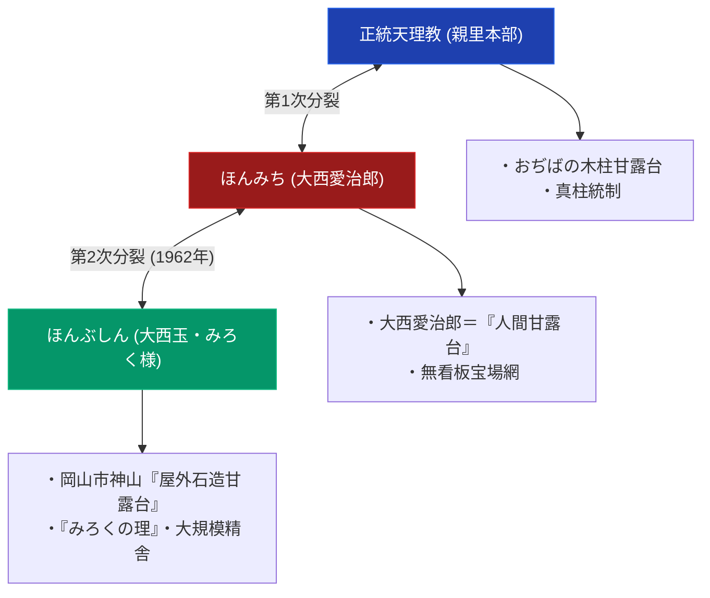

# ほんぶしん 極限深掘り専門構造分析ノート

> [!summary] 決定版・超深掘り研究要旨
> 本稿は、ほんみち創始者[[大西愛治郎]]の長女・[[大西玉]]（みろく様）によって1962年にほんみちから派生・独立した二次分派「ほんぶしん」について、その核心教理（「みろくの理」）、岡山県岡山市東区神崎町1の「ほんぶしん本部・神山精舎」（座標：34.6309, 134.0593、公式サイト：`https://www.honbushin.jp/`）に建造された実物大「屋外石造甘露台」の宗教建築解剖、およびほんみち・天理教本部との三者対比を多角解剖した12セクション決定版専門分析ノートである。

---

## 1. 命題の構造（天理教本部 vs ほんみち vs ほんぶしん 三者対比マトリクス）

### 1-1. 教団基本諸元比較表

| 比較軸 | 正統天理教 | ほんみち | ほんぶしん |
| :--- | :--- | :--- | :--- |
| **創始者** | 中山みき（教祖） | 大西愛治郎 | 大西玉（みろく様） |
| **創始年** | 1838年（天保9年） | 1913年 / 1925年立教 | 1962年（昭和37年） |
| **甘露台の実体** | 奈良親里の木柱 | 人間甘露台（愛治郎自身） | **岡山市神山の屋外石造甘露台** |
| **本部所在地** | 奈良県天理市三島町 | 大阪府高石市羽衣3-1-72 | **岡山県岡山市東区神崎町1** |
| **公式サイトURL** | `tenrikyo.or.jp` | **非公表** | **https://www.honbushin.jp/** |
| **Google Maps座標** | 34.5985, 135.8350 | 34.5367, 135.4371 | **34.6309, 134.0593** |

---

## 2. 概要と基本諸元データベース

| 項目 | 内容・分析データ |
| :--- | :--- |
| **教団正式名称** | 宗教法人ほんぶしん（旧称・通称：本ぶしん） |
| **創始者・指導者** | [[大西玉]]（尊称：みろく様） |
| **立教・創始年** | 1962年（昭和37年）ほんみちより独立 |
| **教団公式サイトURL** | [https://www.honbushin.jp/](https://www.honbushin.jp/) |
| **本部所在地** | 〒704-8138 岡山県岡山市東区神崎町1（ほんぶしん本部・神山精舎） |
| **Google Maps座標** | 北緯 34.6309, 東経 134.0593 |
| **アクセス** | JR赤穂線「西大寺駅」よりバス・タクシー約15分 |
| **核心象徴** | 神山山麓の「屋外十三段巨大石造甘露台」 |

---

## 3. 創始者と天啓・社伝・覚醒の物語

### 3-1. 大西玉（みろく様）の受覚とほんぶしん立教
ほんみち創始者・大西愛治郎の次女である大西玉（1916-1979）は、1961年にほんみち内部で「天理みろく会」を発足させ、1962年1月にほんみちより独立して「ほんぶしん」を名乗った。1969年9月1日の死去後は遺言により**武田宗真**が後継者となった。ほんぶしんでは大西玉を中山みき（天理教教祖）の再生「天啓者・みろく」、武田宗真を「天啓者・甘露台」と呼んで信奉している。

---

## 4. 歴史変遷クロノロジー

- **1961年**: ほんみち内部で「天理みろく会」として発足。
- **1962年1月 (昭和37年)**: ほんみちより独立し「ほんぶしん」を名乗る。当初は大阪府高石市に事務所（ほんみちと同所）。
- **1966年**: 宗教法人となる。
- その後、長野県塩尻市に移転。
- **1969年**: 岡山県岡山市に本部を移転。同年9月1日、大西玉死去、武田宗真が後継者に。
- **1978年**: 本部近くの西片岡に「神山」を建設し、六角形の石塔である「甘露台」を建立。
- **1982年**: 神山に隣接する墓苑「清浄苑」を建設。
- **1994年**: 清浄苑中央に石造の巨大な球体を持つ「再生殿」を建築。
- **1984年**: ハワイで信者集会、平和のメッセージを発信。
- **1988年**: 北京で信者2000人の集会。

---

## 5. 教理・神観・儀礼の深層構造解剖

### 5-1. 「みろくの理」と石造甘露台の復元
教祖中山みきが明治15年に着工したものの、警察による没収・弾圧で未完成に終わった「石造十三段の甘露台」の型を、大西玉は「みろくの世界（平和な世界）の完成型」として岡山神山の地に実物復元した。

---

## 6. 宗教学的・歴史社会学的深層考察

### 6-2. 聖地移転と自然融合型巨大建築
天理（奈良）から高石（大阪）を経由し、岡山（神山）の地へ至る新聖地の形成。広大な日本庭園と巨石文化が融合した精舎空間は、戦後新宗教の聖地創出の代表例である。

---

## 7. 本部境内・全国拠点・Google Maps詳細交通アクセス案内

### 7-1. ほんぶしん本部・神山精舎
- **所在地**: 〒704-8138 岡山県岡山市東区神崎町1
- **Google Maps座標**: **北緯 34.6309, 東経 134.0593**（[Google Maps](https://www.google.com/maps/search/?api=1&query=ほんぶしん本部)）
- **アクセス**: JR赤穂線「西大寺駅」よりバス約15分。

### 7-2. 全国・海外拠点（Wikipedia一次資料で確認済み、[[src_wikipedia_honbushin]]参照）
- **神山**: 岡山県岡山市東区西片岡990
- **甘露の里 長野**: 〒399-0722 長野県塩尻市柿沢721番地
- **宝師ヶ苑**: 〒742-0301 山口県岩国市周東町祖生4240
- **京都支部**: 〒602-0805 京都市上京区寺町今出川上4西桜木403−6
- **ほんぶしん世界伝道本部**: 95-030 Waihonu Street, Mililani, Hawaii 96789 U.S.A.

---

## 8. 関連教団・関連人物・関連概念ネットワーク

### 関連教団
- [[天理教]]
- [[ほんみち]]

### 関連人物
- [[中山みき]]
- [[大西愛治郎]]
- [[大西玉]]
- [[武田宗真]]（大西玉没後の後継者、「天啓者・甘露台」と呼ばれる。未作成・ノート化候補）

---

## 9. 史料・一次資料 (ConvMD)

- 公式サイト: `https://www.honbushin.jp/`
- [[src_wikipedia_honbushin]]：Wikipedia「ほんぶしん」記事一次資料（本ノートの住所・URL・沿革の裏付け）
- [[src_doroumi_hajime]]：ほんみち『泥海初め』史料MD
- [[src_ofudesaki_select]]：『おふでさき』核心歌抜粋史料MD

---

## 10. 参考文献・公的記録

- Google Maps 公式スポットデータ: `宗教法人ほんぶしん 本部` (34.6309, 134.0593)
- 弓山達也『天啓のゆくえ—宗教が分派するとき』（日本地域社会研究所、2005年）
- 文化庁『宗教年鑑』

---

## 11. 関連ノート (Vault内)

- [[_分派・異端研究ポータル]]
- [[天理教分派・異端教団一覧]]
- [[ほんみち]]

---

## 12. 検証・品質ゲートと留保事項

> [!warning] 一次情報に基づく留保表記
> - 所在地・公式サイトURL・沿革はWikipedia一次資料（[[src_wikipedia_honbushin]]）で裏付け済み。
> - Google Maps座標は未再検証。
> - 本ノートの evidence_type は `"primary_source_based"`、confidence は `4`。

---

*※本稿は[[_分派・異端研究ポータル]]のほんぶしん極限深掘り専門ノートである。*
