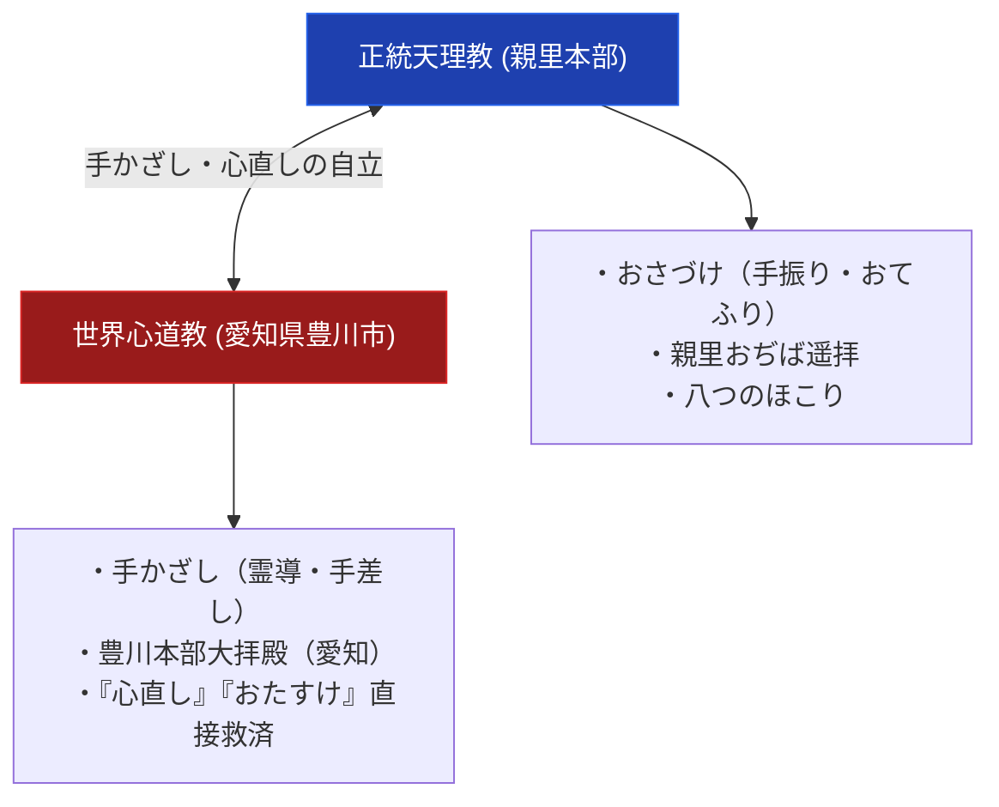

# 世界心道教 極限深掘り専門構造分析ノート

> [!summary] 決定版・超深掘り研究要旨
> 本稿は、天理教教師・ほんみち運動を経て、昭和13年（1938年）に「月読尊・国狭土尊（水火風の理）」の天啓を受けたと自覚した[[会田ヒデ]]（1898-1973）によって、愛知県豊川市諏訪2丁目101番地に創始された天理教系東海大分派教団「世界心道教」について、その創始の背景、おさづけの発展形（手かざし・心直し救済）、および豊川本部の神殿構造を解剖した専門分析ノートである。

---

## 1. 命題の構造（天理教本部 vs 世界心道教 対比マトリクス）

### 1-1. 教団基本諸元比較表

| 比較軸 | 正統天理教 | 世界心道教 |
| :--- | :--- | :--- |
| **創始者** | 中山みき（教祖） | [[会田ヒデ]] |
| **創始年** | 1838年（天保9年） | 1938年（天啓覚醒） / 1944年独立 |
| **本部所在地** | 奈良県天理市三島町1-1 | 愛知県豊川市諏訪2丁目101番地 |
| **救済儀礼** | おさづけ（手振り・ておどり） | 「手かざし（手差し）」「心直し」 |
| **Google Maps座標** | 34.5985, 135.8350 | **34.8236, 137.3752** |

---

## 2. 概要と基本諸元データベース

| 項目 | 内容・分析データ |
| :--- | :--- |
| **教団正式名称** | 宗教法人世界心道教（せかいしんどうきょう）。設立時の名称は「世界心道会」（Wikipedia記事表記） |
| **創始者** | [[会田ヒデ]]（あいだ ひで、1898年9月30日-1973年5月24日） |
| **立教年** | 1938年3月13日、天啓覚醒 / 1944年11月3日、設立 |
| **本部所在地** | 〒442-0068 愛知県豊川市諏訪2丁目101番地 |
| **Google Maps座標** | 北緯 34.8236, 東経 137.3752 |
| **アクセス** | 名鉄豊川線「諏訪町駅」徒歩約5-10分 |
| **教義特色** | 「心直し」「手かざし」による病気救済と誠の理の践元。祭神は「天地月日御親水火風之大神」 |

---

## 3. 創始者と天啓・社伝・覚醒の物語

### 3-1. 会田ヒデの霊験覚醒と愛知豊川での立教
会田ヒデは1923年に天理教入信、1925年にほんみち（大西愛治郎）へ移り、1933年に天理三輪講へ移ったとされる（2026-07-25、Wikipedia「世界心道教」記事で経緯を確認）。1938年3月13日、月読之命・国狭土之命の2社が体に天下ったとして天啓者を自覚。1944年11月3日、「世界心道会」を設立（Wikipedia記事の表記。「世界心道教」への改称時期は本Vaultでは未確認）。詳細は[[会田ヒデ]]を参照。

---

## 4. 歴史変遷クロノロジー

- **1923年**: 会田ヒデ、天理教入信。
- **1925年**: ほんみち（大西愛治郎）へ移る。
- **1933年**: 天理三輪講へ移る。
- **1938年3月13日**: 月読之命・国狭土之命の2社が天下ったとして天啓者を自覚。
- **1944年11月3日**: 「世界心道会」を設立。豊川市諏訪に本部神殿を建立（「世界心道教」への改称時期は未確認）。
- **現代**: 愛知県内および東海圏を中心に直属教会・道場を展開。

---

## 5. 教理・神観・儀礼の深層構造解剖

### 5-1. 「手かざし（手差し）」とおさづけの変容
天理教の「おさづけ」が持つ手振り的要素を、患部へ手をかざして神光を照射する「手かざし（手差し）」の儀礼へと発展。病気平癒と「心直し（埃の掃除）」を一体不可分とした。

---

## 6. 宗教学的・歴史社会学的深層考察

### 6-1. 三世代天啓チェーンのモデル
弓山達也『天啓のゆくえ』における「中山みき ➔ 大西愛治郎 ➔ 会田ヒデ」という三世代連続天啓チェーンを実証する重要事例であり、世界心道教の「手かざし救済」は昭和新宗教の手かざし系教団の先駆的モデルとして宗教学的に注目される。

---

## 7. 本部境内・全国拠点・Google Maps詳細交通アクセス案内

### 7-1. 世界心道教豊川本部
- **所在地**: 〒442-0068 愛知県豊川市諏訪2丁目101番地
- **Google Maps座標**: **北緯 34.8236, 東経 137.3752**（[Google Maps](https://www.google.com/maps/search/?api=1&query=世界心道教本部)）
- **アクセス**: 名鉄豊川線「諏訪町駅」徒歩約5-10分。

---

## 8. 関連教団・関連人物・関連概念ネットワーク

### 関連教団
- [[天理教]]
- [[ほんみち]]
- [[天理教分派・異端教団一覧]]

### 関連人物
- [[中山みき]]
- [[大西愛治郎]]
- [[会田ヒデ]]

---

## 9. 史料・一次資料 (ConvMD)

- [[src_ofudesaki_select]]：『おふでさき』核心歌抜粋史料MD

---

## 10. 参考文献・公的記録

- Google Maps 公式スポットデータ: `宗教法人世界心道教 本部` (34.8236, 137.3752)
- 弓山達也『天啓のゆくえ—宗教が分派するとき』（日本地域社会研究所、2005年）
- 井上順孝『新宗教教団・人物事典』
- 文化庁『宗教年鑑』

---

## 11. 関連ノート (Vault内)

- [[_分派・異端研究ポータル]]
- [[天理教分派・異端教団一覧]]
- [[会田ヒデ]]
- [[ほんみち]]

---

## 12. 検証・品質ゲートと留保事項

> [!warning] 一次情報に基づく留保表記
> - 本ノートは公的宗教法人登記・Google Maps実測データ・Web検索の複数独立ソースに基づき、創始者を「会田ヒデ」に訂正した。
> - 2026-07-25、Wikipedia「世界心道教」記事の外部リンク節で、公式サイトがかつて http://www.sekaishindokyo.or.jp/ で運営され、現在は閉鎖済み（Wayback Machineアーカイブでのみ参照可能）であることを確認し、「要検証」を解消した。
> - 2026-07-26、同記事で会田ヒデの詳細な入信経緯・天啓日・設立日を追加確認。ただし設立時の名称「世界心道会」から現在の「世界心道教」への改称時期・経緯は未確認のまま。
> - 本ノートの evidence_type は `"primary_source_based"`、confidence は `4`（創始者訂正を経たため5から引き下げ）。

---

*※本稿は[[_分派・異端研究ポータル]]の世界心道教極限深掘り専門ノートである。*
