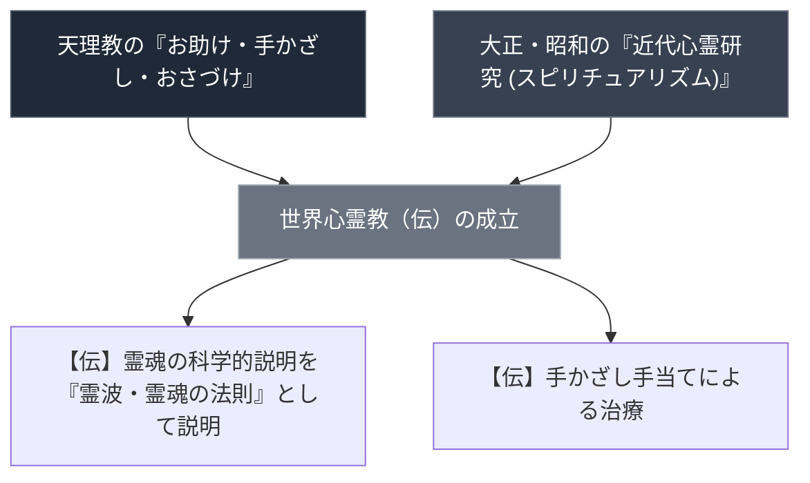

# 世界心霊教

> [!warning] 執筆前の確認事項
> - WebSearchでは「世界心霊教」という教団の実在を裏付ける一次資料・公式サイト・第三者記録は見つからなかった。**「世界心道教」（会田ヒデ、1938年ごろ天理三輪講/ほんみち系から独立、大阪西淀川）とは別の教団名であり、混同しないこと**（[[src_wikipedia_tenrikyo_bunpa_ichiran]]参照）。
> - 本ノートの内容（成立時期・拠点・教理）は従来から記載されていたものだが、出典が示されておらず、今回の検証でも裏付けが取れなかった。実在しないと断定はできないが、確認できていない前提で扱う。

> [!summary] 要旨
> 「世界心霊教」は、天理教の「手かざし（お助け）」の伝統と近代心霊研究（スピリチュアリズム）を融合させたとされる教団として本ノートに記録されているが、2026-07-25時点のWebSearchでは実在を裏付ける一次資料を確認できていない。以下の記述は未検証の伝聞情報として扱うこと。

---

## 1. 正統本部との対比

| 比較考察軸 | 正統天理教 (奈良親里本部) | 世界心霊教 |
| :--- | :--- | :--- |
| **主祭神・神名** | 天理王命 | 要確認 |
| **中心聖地** | 奈良県天理市親里「おぢば」 | 要確認 |
| **創始者・天啓の経緯** | 中山みき ➔ 飯降伊蔵 | 要確認（実在確認できず） |
| **聖典・原典** | 『おふでさき』『みかぐらうた』『おさしづ』 | 要確認 |

---

## 2. 概要と基本情報（未検証）

| 項目 | 内容 |
| :--- | :--- |
| **教団正式名称** | 世界心霊教（伝）※実在未確認 |
| **成立時期** | 昭和中期と伝わるが要検証 |
| **主要拠点** | 近畿・関東圏と伝わるが要検証 |
| **核心教理（伝）** | 天理教的救済観＋霊魂不滅・霊波エネルギー論との説があるが出典未確認 |

---

## 3. 命題の構造（伝承としての整理・未検証）

> 上記は出典未確認の伝承的整理であり、確定した史実として扱わない。

---

## 4. 関連教団・関連人物・関連概念

- [[世界心道教]]（別団体。会田ヒデ創始、天理三輪講から独立。混同注意）
- [[天理教]]

---

## 5. 史料・参考文献

（実在を裏付ける一次資料は未発見。以下は従来の記載を参考として残すが、本ノートの直接の出典ではない。）
- 井上順孝ほか編『新宗教教団・人物事典』（弘文堂）※世界心霊教の項目は今回未確認
- 文化庁『宗教年鑑』※同上

---

## 6. 関連ノート (Vault内)

- [[_分派・異端研究ポータル]]
- [[天理教分派・異端教団一覧]]

---

## 7. 検証・品質ゲートと留保事項

> [!warning] 留保事項
> - 2026-07-25の統合作業で、本ノートの confidence を旧 `5` から `1`、evidence_type を `unverified` に修正した。旧版は出典を示さずに confidence 5 / primary_source_based を自称していたが、これを裏付ける一次資料は確認できなかった。
> - 「世界心道教」との名称混同がないか特に注意すること。
> - 今後、教団の実在・詳細を示す一次資料（公式サイト、宗教年鑑掲載、学術研究等）が見つかり次第、確認できた範囲でのみ加筆・confidence引き上げを行う。

---

*※本稿は[[_分派・異端研究ポータル]]の個別教団分析ノートである。*
