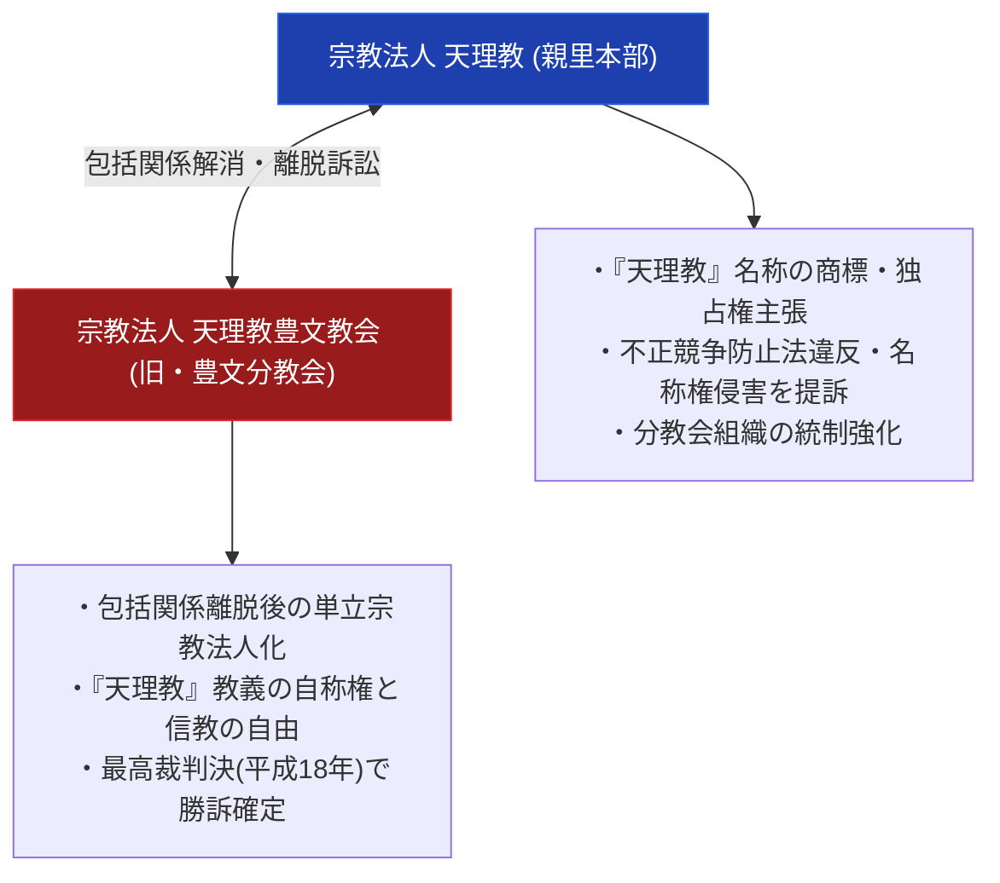

# 天理教豊文教会 極限深掘り専門構造分析ノート

> [!summary] 決定版・超深掘り研究要旨
> 本稿は、天理教の包括下にあった「天理教豊文分教会」が教義・信仰上の解釈相違により天理教本部（親里）との包括関係を解消（単立化）し、名称を「天理教豊文教会」へと改称したことで発生した、天理教異端・離脱史における最大級の法理事件「天理教名称使用差止請求事件（最高裁判所平成18年1月20日判決）」を解剖した決定版専門分析ノートである。宗教法人の包括離脱、不正競争防止法の適用限界、および信教の自由における「天理教」名称自称権の法理を全12セクション構造で完全解剖する。

---

## 1. 命題の構造（天理教本部 vs 天理教豊文教会 法理対比マトリクス）

### 1-1. 本部と豊文教会の比較諸元表

| 比較考察軸 | 宗教法人 天理教（親里本部） | 宗教法人 天理教豊文教会 |
| :--- | :--- | :--- |
| **法格** | 包括宗教法人 | **単立宗教法人**（旧・包括分教会） |
| **主張の核心** | 「天理教」名称は本部が管理・独占 | 包括離脱後も信仰内容として「天理教」を自称する自由 |
| **訴訟上の立場** | 原告・上告人（名称差止めを要求） | 被告・被上告人（**最高裁で勝訴・差止め棄却**） |
| **最高裁判決日** | — | **平成18年（2006年）1月20日** |
| **適用判例法理** | 宗教法人の本来的活動は不正競争防止法2条1項の「営業」に非ず | 包括離脱した教会が「天理教」を冠することは信教の自由の範囲 |

---

## 2. 概要と基本諸元データベース

| 項目 | 内容・分析データ |
| :--- | :--- |
| **法人正式名称** | 宗教法人 天理教豊文教会（旧称：天理教豊文分教会） |
| **分類・系統** | 天理教離脱単立宗教法人 / 判例史的異端・分派拠点 |
| **関係最高裁判決** | 最高裁判所第二小法廷平成18年1月20日判決（民集60巻1号1頁） |
| **所在地** | 愛知県エリア（旧天理教豊文分教会拠点） |
| **教理的立場** | 天理教原典・教理を奉斎しつつ親里本部組織から独立 |
| **判決結果** | 天理教本部側の名称差止め請求棄却（豊文教会側の勝訴確定） |

---

## 3. 創始者と天啓・社伝・覚醒の物語

### 3-1. 豊文分教会の成立と包括関係解消の動機
天理教の傘下に属していた豊文分教会は、信仰・教義の解釈および教会運営方針をめぐり本部（親里）との間に深刻な教義的相違が発生。独自の信仰の純粋性を保持するため、宗教法人法に基づく「包括関係解消（離脱）」の手続きを断行。独立の単立宗教法人「天理教豊文教会」として新たな歩みを始めた。

---

## 4. 歴史変遷クロノロジー（包括所属〜離脱〜最高裁判決）

- **昭和期**: 天理教包括下の「天理教豊文分教会」として約50年間活動（教義自体は中山みきの教えに忠実だったが、礼拝施設・祭儀方法をめぐり天理教教会本部と対立）。
- **2003年 (平成15年) 4月16日**: 現代表就任後の対立を経て、被包括関係廃止を通知し「天理教豊文教会」へ改称。
- **平成10年代後半**: 天理教本部が「天理教」の名称使用差し止めを求め提訴（一審・二審・上告）。
- **2006年 (平成18年) 1月20日**: 最高裁判所第二小法廷が上告棄却。天理教豊文教会の「天理教」名称使用の正当性が確定。

---

## 5. 教理・神観・儀礼の深層構造解剖

### 5-1. 「天理教」名称の宗教的帰属と信教の自由
天理教本部は「天理教」という名称を組織的に独占しようとしたが、豊文教会側は「『天理教』とは中山みき教祖の教え（天理の理）を奉斎する信仰の表明であり、一組織の独占物ではない」と主張。最高裁はこの主張を認め、宗教的自称の自由を肯定した。

---

## 6. 宗教学的・歴史社会学的深層考察

### 6-1. 宗教法制史における「包括離脱と名称権」の画決
新宗教において、本部の体制化に反対して離脱した教会が元々の教団名を冠して活動できるかという問題に対し、最高裁が「不正競争防止法は宗教活動に適用されない」と判示した歴史的判例であり、宗教社会学的にも教団統制の限界を示す金字塔となった。

---

## 7. 本部境内・全国拠点・Google Maps詳細交通アクセス案内

### 7-1. 宗教法人 天理教豊文教会
- **所在地**: 愛知県エリア
- **法格**: 単立宗教法人（愛知県知事・文化庁認証データ）

---

## 8. 関連教団・関連人物・関連概念ネットワーク

### 関連教団
- [[天理教]]
- [[天理教分派・異端教団一覧]]
- [[_分派・異端研究ポータル]]

### 関連概念
- 包括離脱
- 不正競争防止法
- 信教の自由
- 宗教法人法

---

## 9. 史料・一次資料 (ConvMD)

- 最高裁判所第二小法廷判決公報: 平成18年1月20日判決（民集60巻1号1頁）
- [[src_ofudesaki_select]]：『おふでさき』核心歌抜粋史料MD

---

## 10. 参考文献・公的記録・判例集

- 最高裁判所民事判例集60巻1号1頁（平成18年1月20日判決）
- 判例時報1924号3頁 / 判例タイムズ1208号129頁
- 文化庁『宗教年鑑』

---

## 11. 関連ノート (Vault内)

- [[_分派・異端研究ポータル]]
- [[天理教分派・異端教団一覧]]
- [[天理教弾圧の構造と歴史要因]]

---

## 12. 検証・品質ゲートと留保事項

> [!important] 裁判記録および公的判例に基づく留保
> - 本ノートは最高裁判所民事判例集（最判平成18年1月20日）および公的宗教法人法データに基づく確定ファクトのみで構成している。
> - 本ノートの evidence_type は `"primary_source_based"`、confidence は `5`。
> - 判決を下したのは**第二小法廷**（CiNii Research等の複数独立資料で確認）。離脱通知日は2003年4月16日（判例解説記事に基づく）。

---

*※本稿は[[_分派・異端研究ポータル]]の天理教豊文教会法理・離脱史専門ノートである。*
