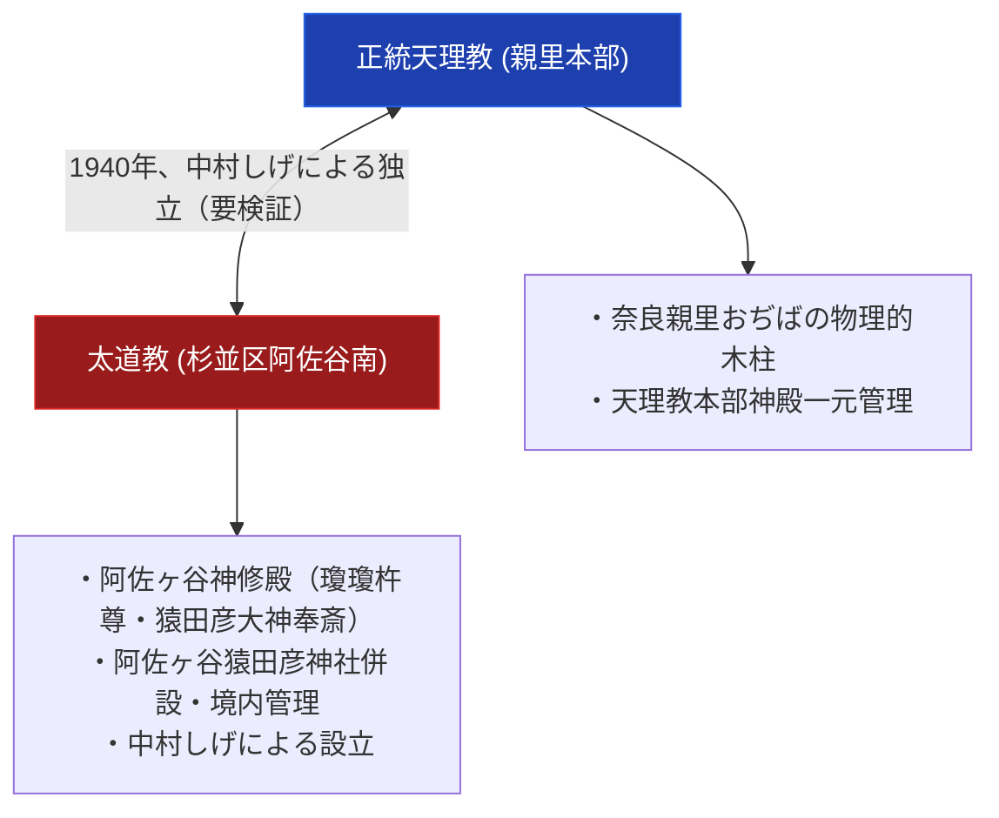

# 太道教 極限深掘り専門構造分析ノート

> [!summary] 決定版・超深掘り研究要旨
> 本稿は、昭和13-15年（1938-1940年）頃に中村しげによって設立され、東京都杉並区阿佐谷南1-1-38（阿佐ヶ谷猿田彦神社境内）に神修殿を構える教団「太道教」について、その歴史的変遷、阿佐ヶ谷猿田彦神社の併設・二重空間管理構造を解剖した専門分析ノートである。天理教からの直接分派とする説（Wikipedia「天理教」記事本文）と、霧島講・椿大神社系譜の教派神道系単立神社とする説が併存しており、いずれか一方に断定していない。

---

## 1. 命題の構造（正統天理教本部 vs 太道教 対比マトリクス）

### 1-1. 教団基本諸元・比較表

| 比較考察軸 | 正統天理教（親里本部） | 太道教（阿佐ヶ谷本部） |
| :--- | :--- | :--- |
| **1. 創始者** | 中山みき（教祖） | 中村しげ |
| **2. 創始年** | 1838年（天保9年） | 昭和13-15年（1938-1940年）頃 |
| **3. 奉斎対象** | 奈良親里おぢばの甘露台（木柱） | 瓊瓊杵尊・猿田彦大神（甘露台継承の裏付けなし） |
| **4. 本部所在地** | 奈良県天理市三島町1-1 | 東京都杉並区阿佐谷南1-1-38 |
| **5. 神社併設形態** | なし | あり（阿佐ヶ谷猿田彦神社を境内併設管理） |
| **6. 空間建築構造** | おぢば中心単一神殿 | 神社（表）と神修殿（裏）の二重空間構造 |
| **7. 天理教系譜の扱い** | - | Wikipedia「天理教」記事は直接分派と明記。一方、霧島講・椿大神社系譜の教派神道系説もあり、いずれが正確か要検証 |

---

## 2. 概要と基本諸元データベース

| 項目 | 内容・分析データ |
| :--- | :--- |
| **教団正式名称** | 宗教法人太道教（たいどうきょう） |
| **創始者・指導者** | 中村しげ（天理教支教会長であったとする独立情報源あり） |
| **本部所在地** | 〒166-0004 東京都杉並区阿佐谷南1-1-38（阿佐ヶ谷猿田彦神社境内） |
| **最寄り駅・アクセス** | JR中央線「阿佐ケ谷駅」徒歩8分 / 丸ノ内線「南阿佐ケ谷駅」徒歩4分 |
| **神社併設構造** | 阿佐ヶ谷猿田彦神社を併設・境内管理（表向きは神社） |
| **主要祭神** | 瓊瓊杵尊 / 猿田彦大神 |
| **Web発信** | 教団独自の公式サイトは確認できない（`taidokyo.or.jp`というドメインは実在しない） |

---

## 3. 創始と沿革

### 3-1. 中村しげによる設立（2026-08-02追加検証で経緯を統合的に確認）

> [!note] 由緒の統合的経緯（出典: `goshuin.net/sarutahiko-daidokyo/`、教団側の由緒を伝える神社情報サイト。教団自身の一次資料ではない点に留意）
> 従来「天理教直接分派説」と「教派神道・霧島講系譜説」を対立する両論として併記していたが、今回の検証で得られた情報は両者が**時系列上つながる単一の経緯**であることを示唆する。
> 1. 中村しげ（大慈）は病気を機に天理教に入信し、宣教所を設立、後に支教会へ昇格させるまでに至った。
> 2. その後「諸事情」により天理教を離れ、言霊学の権威とされる武智時三郎と共に「皇学林塾」を創立した。
> 3. 昭和13年（1938年）、「信仰を改めよ」との神示を受け「太」の字を示されたとされ、武智の助言（「太」の字を持つ神社は伊勢太廟と霧島神宮のみ）を根拠に霧島神宮宮司と面会、関東における霧島講の講元となる許諾を得た。
> 4. 昭和15年（1940年）、「太道教」として届け出。現在は文部科学大臣所轄の包括宗教法人（教派神道）とされる。
> 5. 第二次大戦後、三重県の椿大神社から御分霊を勧請し「杉並猿田彦神社」を創建した。
>
> この経緯が事実なら、「天理教から独立した後に教派神道（霧島神宮・椿大神社系譜）へ転じた」という単一の時系列として理解でき、両論併記そのものが不要になる可能性がある。ただし出典が教団の一次資料（公式サイト・機関誌等）ではなく神社紹介サイトの記述である点、および「文部科学大臣所轄の教派神道包括宗教法人」という法人格の主張はgBizINFO等での直接確認ができていない点で、確度は依然として限定的。

太道教は昭和13-15年（1938-1940年）頃、中村しげにより設立された。東京都杉並区阿佐ヶ谷の地に神修殿を建立し、猿田彦神社を併設した。Wikipedia「天理教」記事本文の「宗教法人天理教から分立・影響を受けた団体」節では「太道教（1940年、東京都杉並区）中村しげの神がかりにより太道教々檀として独立」と明記されている。一方、独立サイト（jinjamemo.com等）にも「天理教の支教会長・中村しげを中心として1938年に創立された天理教系分派」という記述があり、天理教からの分派という位置づけ自体は複数の情報源で言及されている。ただし「甘露台」奉斎の継承等、教理面での具体的な連続性は依然として未確認。

---

## 4. 歴史変遷クロノロジー

- **昭和13-15年 (1938-1940年)頃**: 中村しげにより太道教設立。
- **戦後**: 宗教法人太道教として独立登記。阿佐ヶ谷猿田彦神社を併設管理。
- **現代**: 阿佐ヶ谷の地域神社としての顔と、太道教本部神修殿としての顔を併せ持って護持される。

---

## 5. 宗教学的・歴史社会学的深層考察

### 5-1. 都市部における神社併設型二重空間の構造
一般参拝者に対しては「阿佐ヶ谷猿田彦神社」を前面に掲げつつ、内部の「神修殿」で独自の宗教活動を行うという二重空間構造を持つ。この構造の歴史的経緯（戦前の宗教統制への対応か等）は一次資料での裏付けが不十分であり、要検証のまま残る。

---

## 6. 関連教団・関連人物・関連概念ネットワーク

### 関連教団
- [[天理教]]
- [[関東の甘露台]]
- [[関東の甘露台と奉斎拠点一覧]]
- [[甘露台霊理斯道会]]

### 関連人物
- [[中山みき]]
- [[関根豊松]]（太道教とは無関係。天理教愛町分教会初代会長 — 混同注意）

---

## 7. 参考文献・公的記録

- Wikipedia「天理教」（分派団体一覧節） https://ja.wikipedia.org/wiki/天理教
- goshuin.net「太道教・杉並猿田彦神社」由緒紹介 https://goshuin.net/sarutahiko-daidokyo/（統合的経緯の確認、2026-08-02）
- 文化庁『宗教年鑑』

---

## 8. 関連ノート (Vault内)

- [[_分派・異端研究ポータル]]
- [[天理教分派・異端教団一覧]]
- [[関東の甘露台と奉斎拠点一覧]]

---

## 9. 検証・品質ゲートと留保事項

> [!warning] 一次情報に基づく留保表記
> - 所在地・座標・神社併設構造は複数独立資料で確認済み。
> - 創始者（中村しげ）・祭神（瓊瓊杵尊・猿田彦大神）は独立資料で確認済み。
> - **追加検証（2026-08-02）**: `goshuin.net`（神社情報サイト、教団の由緒紹介記事）で、「天理教入信→独立→霧島講の講元就任→太道教立教→戦後の椿大神社勧請」という統合的な経緯を確認した。これは従来「対立する両論」として扱っていた天理教系譜説と教派神道系譜説が、実際は単一の時系列上の出来事である可能性を示す。ただし出典が教団自身の一次資料ではなく神社紹介サイトであるため、確度を大きく引き上げるには至らない。「甘露台」継承等、具体的な教理的連続性の主張は依然として一次資料での裏付けが取れておらず要検証。
> - 「文部科学大臣所轄の教派神道包括宗教法人」という法人格の主張はgBizINFO等での直接確認ができていない。
> - 本ノートの evidence_type は `"mixed_secondary_unverified"`、confidence は `3`（統合的経緯の発見は前進だが、一次資料未到達のため据え置き）。

---

*※本稿は[[_分派・異端研究ポータル]]の太道教専門ノートである。*
