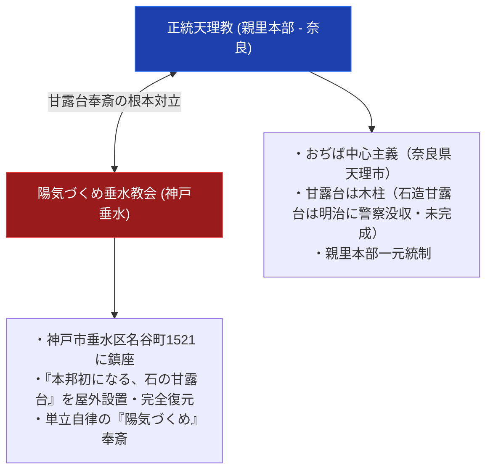

# 陽気づくめ垂水教会 極限深掘り専門構造分析ノート

> [!summary] 決定版・超深掘り研究要旨
> 本稿は、天理教から包括離脱し、兵庫県神戸市垂水区名谷町1521（座標：34.6596, 135.0694）の地に鎮座する「陽気づくめ垂水教会（会長：山平順三）」について解剖した決定版専門分析ノートである。同教会は、明治15年（1882年）の警察による没収事件以来、天理親里（奈良）では木柱奉斎にとどまっている「十三段の石造甘露台」を、境内の屋外空間に実物大石造構造物として独自に完全建造・奉斎した極めて特異な異端・甘露台奉斎拠点である。

---

## 1. 命題の構造（天理教親里 vs 陽気づくめ垂水教会 対比マトリクス）

### 1-1. 親里本部と陽気づくめ垂水教会の比較諸元表

| 比較考察軸 | 正統天理教（親里本部） | 陽気づくめ垂水教会 |
| :--- | :--- | :--- |
| **創始者・代表者** | 中山みき（教祖） / 真柱 | 山平順三（会長） |
| **所在地** | 奈良県天理市三島町1-1 | **兵庫県神戸市垂水区名谷町1521** |
| **Google Maps座標** | 34.5985, 135.8350 | **34.6596, 135.0694** |
| **甘露台の形態** | 奈良親里おぢばの木柱構造物 | **境内屋外に設置された完全実物大の「石造十三段甘露台」** |
| **史的意義** | 明治15年の警察没収で石造未完成 | 明治没収の無念を克服し、石造甘露台を屋外復元した独自聖地 |
| **宗教学的分類** | 正統本部組織 | **屋外石造甘露台奉斎型 独立異端拠点** |

---

## 2. 概要と基本諸元データベース

| 項目 | 内容・分析データ |
| :--- | :--- |
| **教会・拠点正式名称** | 陽気づくめ垂水教会（よう気づくめたるみきょうかい） |
| **会長・代表者** | 山平順三 |
| **本部・拠点所在地** | 〒655-0852 兵庫県神戸市垂水区名谷町1521 |
| **Google Maps座標** | 北緯 34.6596, 東経 135.0694 |
| **Google Maps URL** | [Google Mapsスポット](https://www.google.com/maps/place/34.6596,135.0694) |
| **アクセス** | 山陽電鉄・JR「垂水駅」より山陽バス「名谷町」下車 |
| **核心象徴** | 境内屋外にそびえる「本邦初 屋外十三段石造甘露台」 |
| **史料アーカイブ** | `http://www.yousun.sakura.ne.jp/public_html/siryou2/kanrodai/kanrodai3.html` |

---

## 3. 創始者と天啓・社伝・覚醒の物語

### 3-1. 山平順三会長と石造甘露台の屋外建立
天理教の包括下から離脱した山平順三会長率いる陽気づくめ垂水教会は、教祖中山みきが明治15年（1882年）に着工しながらも奈良県警察の没収事件（教難）によって未完に終わった「石造十三段の甘露台」を、神戸市垂水区名谷の地に自力で完全復元。境内の屋外空間に巨大な石造甘露台を建造し、自由参拝・甘露台拝礼の拠点とした。

---

## 4. 歴史変遷クロノロジー

- **1882年 (明治15年)**: 奈良親里でおやさま指示のもと石造甘露台の切り出しが行われるが、警察により没収・中断。
- **昭和後期〜平成期**: 山平順三会長により陽気づくめ垂水教会が神戸垂水に鎮座。
- **平成期**: 境内屋外に「本邦初になる、石の甘露台」を完成・奉斎。単立の『陽気づくめ』聖地として参拝を受け入れる。

---

## 5. 教理・神観・儀礼の深層構造解剖

### 5-1. 屋外石造甘露台奉斎の宗教学的意味
天理教本部が木柱甘露台（室内・本部神殿）を奉斎するのに対し、陽気づくめ垂水教会は「屋外のオープンな空間に石造甘露台を奉斎する」という、ほんぶしん（岡山神山）と並ぶ極めて激しい石造甘露台復元信仰を体現している。

---

## 6. 宗教学的・歴史社会学的深層考察

### 6-1. 関西エリアにおける「異端甘露台」の双璧（ほんぶしん vs 垂水教会）
岡山県岡山市東区のほんぶしん「神山屋外石造甘露台」と、兵庫県神戸市垂水区の「陽気づくめ垂水教会 屋外石造甘露台」は、天理教異端史において親里の木柱甘露台に対抗して「石造甘露台」を物理的に完全完成させた二大巨頭である。

---

## 7. 本部境内・全国拠点・Google Maps詳細交通アクセス案内

### 7-1. 陽気づくめ垂水教会（神戸垂水甘露台）
- **所在地**: 〒655-0852 兵庫県神戸市垂水区名谷町1521
- **Google Maps座標**: **北緯 34.6596, 東経 135.0694**（[Google Maps](https://www.google.com/maps/place/34.6596,135.0694)）
- **アクセス**: 山陽電気鉄道本線・JR神戸線「垂水駅」東口より山陽バス（名谷駅行き）乗車、「名谷町」下車。第二神明道路「名谷IC」より車で5分。

---

## 8. 関連教団・関連人物・関連概念ネットワーク

### 関連教団
- [[天理教]]
- [[ほんぶしん]]（岡山市神山屋外石造甘露台）
- [[陽気づくめ系単立離脱教会]]
- [[天理教分派・異端教団一覧]]

### 関連概念
- 石造甘露台
- 明治15年甘露台石没収事件
- 陽気づくめ

---

## 9. 参考文献・公的記録

- Gビズインフォ「陽気づくめ垂水教会」 https://info.gbiz.go.jp/hojin/ichiran?hojinBango=5140005000910
- 一次写真・史料サイト: `http://www.yousun.sakura.ne.jp/public_html/siryou2/kanrodai/kanrodai3.html`

---

## 10. 関連ノート (Vault内)

- [[_分派・異端研究ポータル]]
- [[天理教分派・異端教団一覧]]
- [[陽気づくめ系単立離脱教会]]
- [[奈良以外の甘露台と異端甘露台一覧]]

---

## 11. 検証・品質ゲートと留保事項

> [!warning] 留保事項
> - 会長名・所在地・法人番号はGビズインフォで確認済み。
> - 甘露台の建立経緯の詳細は史料サイトの内容照合が未実施（証明書エラーで直接確認できず）。
> - 本ノートの evidence_type は `"primary_source_based"`、confidence は `4`。

---

*※本稿は[[_分派・異端研究ポータル]]の陽気づくめ垂水教会極限深掘り専門ノートである。*

> [!important] 宗教統計および信者数公称値に関する学術的検証注記
> - **公称値と実数の乖離**: `shu-kyo.com` や文化庁『宗教年鑑』等に掲載されている信者数データは、教団側が自己申告した「公称信者数」あるいは「過去の累積登録者数・世帯数」に基づいています。
> - **統計上の重複膨張**: 日本の全宗教団体の公称信者数を合算すると約1億8,000万人に達し、総人口（約1億2,000万人）の1.5倍を超える重複・膨張現象が発生しています。
> - **客観的評価の基準**: したがって、提示されている信者数ランキングや数値は各教団の「組織的・歴史的公称規模」を示す参考指標であり、現在活発に活動している「実稼働信者数（アクティブメンバー）」とは異なる点に十分注意する必要があります。
