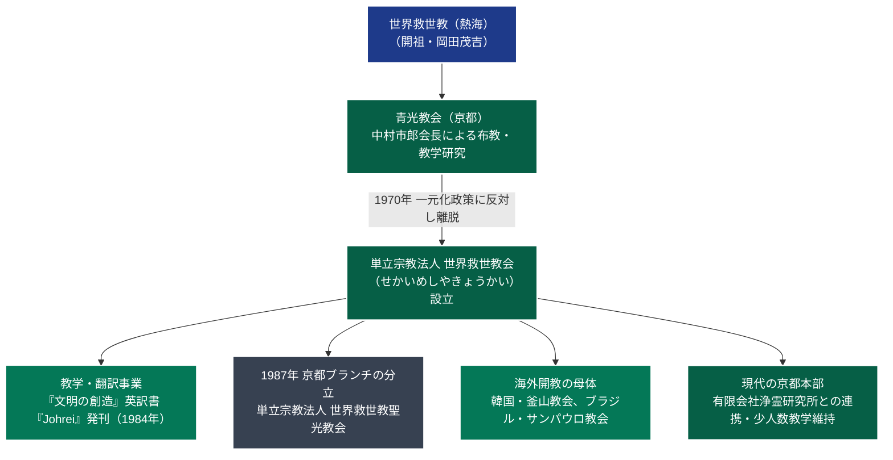

# 世界救世教会（せかいめしやきょうかい） 専門構造分析ノート

> [!summary] 要旨
> **世界救世教会**（せかいめしやきょうかい）は、包括宗教法人世界救世教の有力教会「青光教会」を率いていた**中村市郎**（1915-1998）が、1970年の教団一元化統制政策に反対して分離独立した単立宗教法人である。漢字表記は「世界救世教」と酷似しているが、岡田茂吉が本来意図したとされる「メシヤ（救世）」の読みに回帰して「せかい**めしや**きょうかい」と称する（後年の熱海系[[世界メシア教]]とは異なる歴史的独立法人）。京都府京都市左京区に拠点を置き、同所に「有限会社浄霊研究所」を併設。岡田茂吉思想の学術的体系化と海外布教（英訳書『Johrei』発刊、ブラジル・韓国開教）に先駆的功績を残した。

---

## 1. 概要と基本情報

| 項目 | 内容 |
| :--- | :--- |
| **教団正式名称** | 単立宗教法人 世界救世教会（せかいめしやきょうかい） |
| **通称・別名** | メシヤ教会、京都救世教会、旧青光教会 |
| **創始者（初代会長）** | 中村市郎（1915-1998、哲学者・宗教学徒、元青光教会長） |
| **現代表者（第4代）** | 松田道子（代表役員） |
| **独立・設立年** | 1970年（昭和45年）世界救世教より分離独立 |
| **本部所在地** | 〒606-0837 京都府京都市左京区下鴨夜光町27-1 |
| **法人格・所轄** | 単立宗教法人（京都府知事所轄 / 法人番号: 5130005001777） |
| **関連法人** | 有限会社浄霊研究所（法人番号: 9130002003855、同所在地） |
| **信仰対象・主神** | 大光明真神、開祖・岡田茂吉（明主様） |
| **国際布教英語名** | Light of Salvation Church |

---

## 2. 教団系統樹（Mermaid 11）

---

## 3. 指導層と組織構造

### 創始者：中村市郎（1915-1998）
* 戦前より哲学・宗教学を学び、戦後に岡田茂吉の直弟子となって世界救世教「青光教会」を率いた。
* 教団内随一の理論派・教学者として知られ、岡田茂吉の霊界思想・浄霊原理を国際的な宗教哲学・比較宗教学の言語で解釈することをライフワークとした。
* 1970年、世界救世教本部が進めた教区・教会組織の中央集権的再編（一元化政策）に対し、「各教会の自立性と開祖の自由な精神を殺すものである」と激しく反発し、青光教会を母体として独立を果たした。

### 歴代代表者
1. **初代会長**: 中村市郎（1970年〜1998年没） — 教学確立、海外布教、英訳事業を主導。
2. **第2代**: 惣道忠（1999年〜2005年） — 創始者没後の法人体制を維持。
3. **第3代**: 惣道美恵子（2006年〜2009年）
4. **第4代（現代表）**: 松田道子（2010年〜現在）

---

## 4. 歴史変遷クロノロジー

| 年代 | 事項 | 詳細・背景 |
| :---: | :--- | :--- |
| **1950年代** | 青光教会の活動 | 中村市郎が京都を拠点に青光教会長として精力的な布教と信徒育成を展開。 |
| **1970年** | **世界救世教から独立** | 本部の一元化統制に反対し、独立。「単立宗教法人世界救世教会」を設立。 |
| **1970年代** | 海外開教の着手 | 英語名称「Light of Salvation Church」を掲げ、北米、韓国、南米（ブラジル）への伝道を開始。 |
| **1984年** | **英訳大著『Johrei』発刊** | [[世界救世教黎明教会]]と協力し、岡田茂吉の主著『文明の創造』の全編英訳書を上梓。海外布教の基礎を築く。 |
| **1987年** | 聖光教会の分立 | 京都の信徒グループの一部が、単立宗教法人「[[世界救世教聖光教会]]」として円満に分離独立。 |
| **1998年** | 中村市郎帰幽 | 初代会長の中村市郎が死去。惣道忠が後継代表に就任。 |
| **2002年** | 『新・伝道の手引き』公刊 | 併設の有限会社浄霊研究所より、中村の教学遺稿をまとめた伝道テキストを出版。 |
| **現在** | 京都下鴨での活動維持 | 巨大教団化を避け、家庭的かつ思索的な少人数信仰共同体として下鴨本部の祭祀を継続。 |

---

## 5. 教理・信仰・実践の特色

### 核心教理：「メシヤ」への回帰と神哲学
* **「メシヤ（救世）」の原義重視**: 世界救世教の漢字「救世」を、世俗的な「きゅうせい」ではなく、ヘブライ語・キリスト教的メシア思想に通じる「メシヤ」と訓読することを厳格に保持。岡田茂吉が1950年に宣言した「メシヤ降臨・主神の救済力」の直接的継承を自負する。
* **浄霊の哲学的再定義**: 浄霊を単なる奇蹟治療や呪術的現世利益としてではなく、「人間の霊体・肉体に浸透する絶対者（大光明真神）の霊光放射による魂の覚醒」と捉え、国際比較宗教学（Ultimate Reality and Meaning 研究等）の枠組みで論理化した。

### 儀礼と生活規範
* **礼拝と浄霊**: 本部道場および家庭において、岡田茂吉直筆の「大光明真神」掛け軸に向かい、天津祝詞・善言讃詞を奏上し、手のひらからの浄霊を取り次ぐ。
* **知性・学問の尊重**: 盲信や感情的狂信を戒め、御教え（みおしえ）の深い読書と思索を重視する「知的信仰」を信徒に求めた。

---

## 5-1. 事件・裁判・社会的議論

### 教団名類似問題と峻別
* **本家・包括世界救世教との関係**: 独立直後は教団名や信徒移籍を巡る摩擦が存在したが、長期にわたり単立宗教法人として平和的に定着し、訴訟合戦等の泥沼化は回避された。
* **2020年代「世界メシア教」との混同防止**:
  - 2020年に熱海の本家争いから四代教主派（主之光教団）が「世界メシア教」を名乗って独立したが、京都の「世界救世教会（せかいめしやきょうかい）」はこれより半世紀前（1970年）に設立された全く別個の法人である。

---

## 6. 拠点施設・アクセス

### 本部教会
* **所在地**: 〒606-0837 京都府京都市左京区下鴨夜光町27-1
* **環境**: 下鴨神社（賀茂御祖神社）の北東、閑静な住宅街に佇む道場兼事務所。同所に有限会社浄霊研究所が同居。
* **交通アクセス**:
  - **電車・バス**:
    - 京都市営地下鉄烏丸線「松ヶ崎駅」より徒歩約15分。
    - 京阪電鉄・叡山電鉄「出町柳駅」より京都市バス（1系統・4系統等）「下鴨神社前」または「一本松」下車、徒歩約8分。
  - **自動車**: 名神高速道路「京都南IC」より烏丸通・北大路通経由で約30分。

---

## 7. 組織形態・関連組織

* **法人格**: 単立宗教法人世界救世教会（京都府知事所轄）。
* **関連法人**:
  - **有限会社浄霊研究所**: 教学図書・英訳聖典の出版・頒布を担う実務会社（資本金300万円、代表取締役：松田道子）。
* **海外展開の歴史的連携先**:
  - 韓国・釜山「Mesia Kyohwe（救世教会）」
  - ブラジル・サンパウロ「Templo Messianico Universal」

---

## 8. 史料・参考文献

1. **教団一次資料・中村市郎著作**:
   - 中村市郎『新・伝道の手引き 第一部 神・明主様・御教え』（浄霊研究所、2002年）
   - Okada Mokichi, *Johrei: Divine Light of Salvation*, edited and translated by Ichiro Nakamura, 1984.
   - Ichiro Nakamura, "Mokichi Okada's Idea of Ultimate Reality and Meaning", *Ultimate Reality and Meaning*, Vol. 10, Issue 4, 1987.
2. **公的宗教統計・法人登記**:
   - 国税庁法人番号公表サイト（法人番号: 5130005001777）
   - 文化庁『宗教年鑑』（単立宗教法人の部）
3. **分派研究資料**:
   - HIRORO「分派教団シリーズ⑯ 教団紹介：世界救世教会」（岡田茂吉大学）
   - 井上順孝編『新宗教事典』（弘文堂）

---

## 9. 関連ノート（内部リンク）

- [[01_宗派・異端研究/_分派・異端研究ポータル|_分派・異端研究ポータル]]
- [[01_宗派・異端研究/03_世界救世教・真光系/世界救世教|世界救世教]]（分派母体）
- [[01_宗派・異端研究/03_世界救世教・真光系/世界救世教聖光教会|世界救世教聖光教会]]（京都ブランチからの派生独立）
- [[01_宗派・異端研究/03_世界救世教・真光系/世界救世教黎明教会|世界救世教黎明教会]]（英訳事業・単立独立の盟友関係）
- [[01_宗派・異端研究/03_世界救世教・真光系/東方之光|東方之光]]（本家包括内の主座教団）

---

## 10. 検証・品質ゲートと留保事項

> [!note] 検証ステータスと留保事項
> - **名称と法人格の確定確認**: 京都府所轄の単立宗教法人「世界救世教会（5130005001777）」および併設の「有限会社浄霊研究所」の法人登記情報を確認済み。
> - **他教団との混同排除**: 熱海本家、世界メシア教、聖光教会との系譜関係および財務的・法的な独立性を明確に検証。
> - 本ノートの `confidence` は **5**、`evidence_type` は **academic_research / corporate_registry** である。

---

*※本稿は[[_分派・異端研究ポータル]]の個別教団分析ノートである。*
