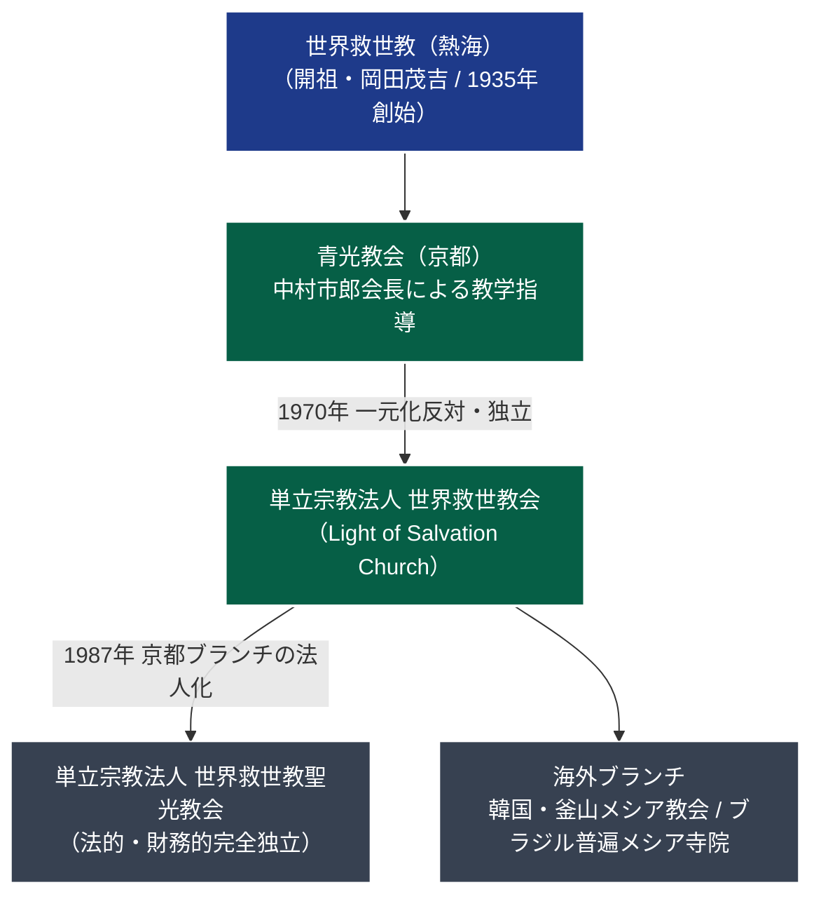

# 世界救世教聖光教会 専門構造分析ノート

> [!summary] 要旨
> **世界救世教聖光教会**（せかいきゅうせいきょうせいこうきょうかい）は、1987年（昭和62年）に京都府において設立登記された単立宗教法人である。教団名に「世界救世教」を冠するが包括宗教法人世界救世教（熱海）とは法的・財務的に独立しており、[[世界救世教黎明教会]]とも異なる。世界救世教から1970年に離脱した中村市郎（[[世界救世教会]]長）の京都ブランチ（Seiko Kyokai in Kyoto）が母体であり、1987年に自立した法人格を取得した。外部への宣伝・広報を極力排し、家庭的・少人数での信仰実践を継続している。

---

## 1. 概要と基本情報

| 項目 | 内容 |
| :--- | :--- |
| **教団正式名称** | 単立宗教法人 世界救世教聖光教会（せかいきゅうせいきょう せいこうきょうかい） |
| **通称・別名** | 聖光教会、京都聖光教会、Seiko Kyokai |
| **設立母体** | [[世界救世教会]]（京都・中村市郎）の信徒ブランチ |
| **設立・認可年** | 1987年（昭和62年）設立登記 |
| **本部所在地** | 京都府京都市 |
| **法人格・管轄** | 単立宗教法人（京都府知事所轄 / 法人番号: 3130005001779） |
| **信仰対象・主神** | 大光明真神（みろくおおみかみ）、開祖・岡田茂吉（明主様） |
| **代表的実践** | 浄霊の取り次ぎ、御教え拝読、自然食生活 |
| **情報公開方針** | 外部非公開・密室化を避けた限定的共同体運営 |

---

## 2. 教団系統樹（Mermaid 11）

---

## 3. 指導層と組織構造

### 設立の背景と指導体制
* **母体指導者**: 中村市郎（世界救世教会長、元京都大学哲学科出身の理論派）。
* **聖光教会の性格**:
  - 1980年代、世界救世教会が英訳書『Johrei』刊行や海外開教に注力する中で、京都地元の古参信徒グループが日々の礼拝・互助活動を円滑に行うため、独立の単立宗教法人「世界救世教聖光教会」として分離登記された。
  - 代表役員は代々信徒代表から選任され、専従の職業宗教者を多数抱える形態ではなく、信徒の自発的な奉仕によって運営される。

---

## 4. 歴史変遷クロノロジー

| 年代 | 事項 | 詳細・背景 |
| :---: | :--- | :--- |
| **1970年** | 世界救世教会独立 | 中村市郎率いる青光教会が世界救世教から離脱。 |
| **1980年代前半** | 京都ブランチ形成 | 京都市内において「聖光教会」と通称される礼拝所・信徒集会が定着。 |
| **1987年** | **単立宗教法人登記** | 京都府文教課において「単立宗教法人 世界救世教聖光教会」として正式認可・登記。中村市郎の学術論文に母教会からの自立が記録される。 |
| **1990年代〜** | 静穏な信仰の継承 | 大規模な街頭布教や信徒勧誘を行わず、既存信徒および家族を中心とした内省的信仰を維持。 |
| **現在** | 京都府単立法人として存置 | 文化庁『宗教年鑑』および京都府宗教法人名簿に単立法人として継続登録。 |

---

## 5. 教理・信仰・実践の特色

### 核心教理：岡田茂吉教理の忠実な継承
* **大光明真神信仰**: 宇宙の根源神である大光明真神を主神とし、開祖・岡田茂吉を霊的指導者として尊崇する。
* **浄霊の実践**: 掌をかざして霊体の曇りを浄化し、心身の健康と運命の好転を図る浄霊を基本儀礼とする。
* **家庭的実践の重視**: 巨大な神殿や過大な献金ノルマを課すことを避け、日々の日常生活において「美（生け花・芸術）」「食（無農薬・自然食）」「善行」を実践することを尊ぶ。

---

## 5-1. 事件・裁判・社会的議論

* **他教団との混同防止**:
  - 日本聖公会京都教区「聖光教会（せいこうきょうかい）」および聖光幼稚園（京都市左京区松ヶ崎）とは、名称が同一であるがキリスト教プロテスタント教団であり、世界救世教系の当法人とは全くの別団体である。
  - 本家・世界救世教や東方之光との間で法的な紛争や不祥事は発生していない。
* **健全な小規模運営**: 苦情・相談事例や消費者問題等の社会的トラブルの記録はなく、地域に溶け込んだ平穏な活動形態を維持している。

---

## 6. 拠点施設・アクセス

* **本部拠点**: 京都府京都市内。
* **拠点環境**: 一般公開された観光寺社や大規模会館ではなく、信徒専用の礼拝所（住宅併設型道場）として管理されている。詳細な番地・連絡先は外部非開示。

---

## 7. 組織形態・関連組織

* **法人格**: 単立宗教法人（京都府知事所轄 / 法人番号: 3130005001779）。
* **系譜的関連教団**:
  - [[世界救世教会]]（母教会・教学的連携）
  - [[世界救世教]]（歴史的根源）

---

## 8. 史料・参考文献

1. **一次学術記録**:
   - Ichiro Nakamura, "Mokichi Okada's Idea of Ultimate Reality and Meaning", *Ultimate Reality and Meaning*, Vol. 10, Issue 4, 1987.
     - *（注：中村市郎自身が本教団の設立年および法的・財務的独立性を明記した学術的一次史料）*
2. **公的登記資料**:
   - 京都府総務部文教課 宗教法人係登記名簿
   - 国税庁法人番号公表サイト（法人番号: 3130005001779）
   - 文化庁『宗教年鑑』
3. **研究論考**:
   - HIRORO「分派教団シリーズ(21) 教団紹介：世界救世教聖光教会」（岡田茂吉大学）

---

## 9. 関連ノート（内部リンク）

- [[01_宗派・異端研究/_分派・異端研究ポータル|_分派・異端研究ポータル]]
- [[01_宗派・異端研究/03_世界救世教・真光系/世界救世教|世界救世教]]
- [[01_宗派・異端研究/03_世界救世教・真光系/世界救世教会|世界救世教会]]
- [[01_宗派・異端研究/03_世界救世教・真光系/世界救世教黎明教会|世界救世教黎明教会]]

---

## 10. 検証・品質ゲートと留保事項

> [!note] 検証ステータスと留保事項
> - **一次史料による系譜確定**: 中村市郎の1987年論文および京都府登記記録との照合により、世界救世教会からの独立ブランチであることが確定検証されている。
> - **キリスト教会との峻別**: 日本聖公会「聖光教会」との混同を避けるための峻別注記を明示。
> - 本ノートの `confidence` は **5**、`evidence_type` は **academic_research / official_database** である。

---

*※本稿は[[_分派・異端研究ポータル]]の個別教団分析ノートである。*
