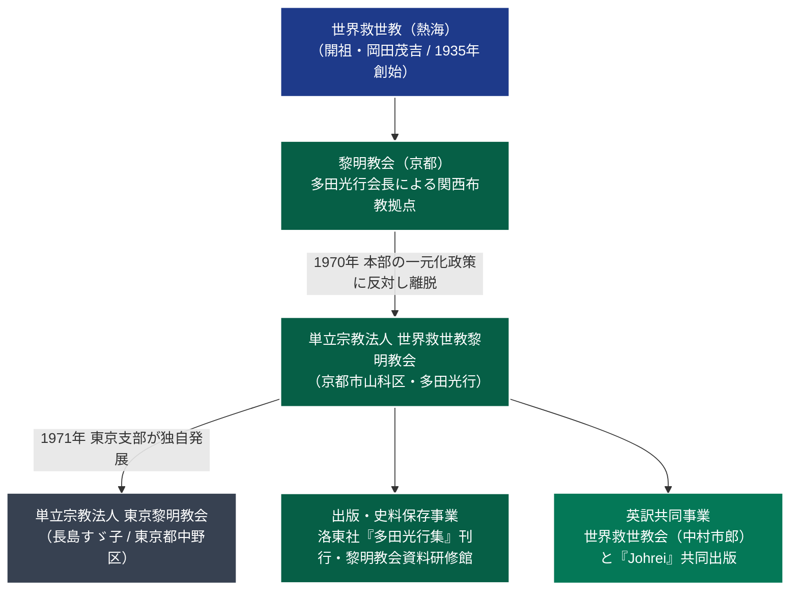

# 世界救世教黎明教会 専門構造分析ノート

> [!summary] 要旨
> **世界救世教黎明教会**（せかいきゅうせいきょう れいめいきょうかい）は、旧世界救世教の有力直系教会「黎明教会」を率いた**多田光行**（1910-1985）が、1970年の教団本部による包括一元化統制に反対して分離独立した単立宗教法人である。教団名に「世界救世教」を冠するが熱海の包括法人とは完全に別個の独立教団である。京都府京都市山科区に本拠および「黎明教会資料研修館」を構え、出版部門「洛東社」を通じて岡田茂吉の生前著作の原典保存に尽力した。また本教団の東京支部が分離独立したものが[[東京黎明教会]]である。

---

## 1. 概要と基本情報

| 項目 | 内容 |
| :--- | :--- |
| **教団正式名称** | 単立宗教法人 世界救世教黎明教会（せかいきゅうせいきょう れいめいきょうかい） |
| **通称・別名** | 京都黎明教会、黎明教会、洛東黎明 |
| **創始者（初代会長）** | 多田光行（ただ みつゆき、1910-1985、元世界救世教黎明教会長） |
| **現代表者（第2代）** | 多田歌恵（代表役員） |
| **独立・設立年** | 1970年（昭和45年）世界救世教より分離独立 |
| **本部所在地** | 〒607-8482 京都府京都市山科区北花山大林町3-1 |
| **法人格・所轄** | 単立宗教法人（京都府知事所轄 / 法人番号: 2130005001771） |
| **主要施設・版元** | 黎明教会資料研修館、出版部門「洛東社」 |
| **信仰対象・主神** | 大光明真神（みろくおおみかみ）、開祖・岡田茂吉（明主様） |
| **経典・機関紙** | 『御神書』、『多田光行集』（全4巻）、機関紙「黎明新聞」 |

---

## 2. 教団系統樹（Mermaid 11）

---

## 3. 指導層と組織構造

### 創始者：多田光行（1910-1985）
* 岡田茂吉の直弟子として黎明期から献身的に仕え、京都を拠点とする「黎明教会」を全国屈指の大教会へと育て上げた。
* 岡田茂吉に対する絶対的な敬慕と純粋信仰を貫き、茂吉が遺した御神書や講話録の原典主義的・一言一句を改変しない保存を徹底した。
* 1970年の世界救世教本部による全国教会統制（一元化政策）において、教会の自治権と信仰の純粋性を守るため、盟友・中村市郎（世界救世教会）らとともに独立を決断した。

### 後継体制と代表役員
* **初代会長**: 多田光行（1970年〜1985年帰幽） — 独立体制の確立と史料収集。
* **第2代会長（現職）**: 多田歌恵（1986年〜現在） — 多田光行の遺稿集編纂、資料研修館の運営、教団の安定的継承を指揮。

---

## 4. 歴史変遷クロノロジー

| 年代 | 事項 | 詳細・背景 |
| :---: | :--- | :--- |
| **1940〜50年代** | 世界救世教での発展 | 多田光行が関西教区の中核として黎明教会を牽引。多くの信徒を育成。 |
| **1970年** | **世界救世教から独立** | 本部の一元化方針を拒否し、「単立宗教法人 世界救世教黎明教会」を設立。 |
| **1971年** | 東京支部の発足 | 神成教会の長島すゞ子らと合流し、東京支部を開設（のちの東京黎明教会へ）。 |
| **1984年** | 英訳聖典『Johrei』協力 | 京都の[[世界救世教会]]（中村市郎）と協力し、主著『文明の創造』の全編英訳を支援。 |
| **1985年** | 多田光行帰幽 | 初代会長が75歳で逝去。多田歌恵が後継代表に就任。 |
| **1986年** | 追想録の公刊 | 版元・洛東社より『多田光行会長先生 追想』を出版。 |
| **1989〜92年** | 『多田光行集』全4巻刊行 | 初代の講話・御教え解説を体系的に編纂した記念碑的聖典群を完結。 |
| **2000年代〜** | 資料研修館の充実 | 山科区の本部に「黎明教会資料研修館」を整備し、開祖ゆかりの史料研究を継続。 |

---

## 5. 教理・信仰・実践の特色

### 核心教理：岡田茂吉原典主義と地上天国建設
* **御教えの原典尊重**: 世界救世教本体が時代とともに教理表現や組織形態を改変していったのに対し、黎明教会は岡田茂吉生存当時の講話・御神書の原典をそのまま学ぶ「原典主義」を堅持する。
* **浄霊の至高性**: 人類の魂と肉体を根本から浄化する「浄霊」を信仰生活の根幹に据える。
* **自然農法と美の探求**: 岡田茂吉が提唱した自然農法（無農薬栽培）の精神を尊び、美術や花を愛でる生活文化を大切にする。

### 儀礼と教学活動
* **礼拝式**: 本殿において大光明真神への拝礼、天津祝詞・善言讃詞の奏上、御神書の輪読を行う。
* **資料研修**: 「黎明教会資料研修館」において、開祖直筆の書や初期教団資料の閲覧・研修会を定期開催。

---

## 5-1. 事件・裁判・社会的議論

### 1970年「一元化紛争」の史的位置づけ
* 1960年代末から世界救世教本部が進めた一元化（各教会の独立採算制を廃止し、本部に人事権と財産権を集中させる中央集権化）は、全国の有力教会長の激しい反発を招いた。
* 多田光行率いる黎明教会および中村市郎の青光教会の独立は、救世教史における最大の分派・離脱事件の一つとして宗教学・宗教史学上重視されている。
* 独立に際しては、財産分離や信徒移籍に関する交渉が整然と行われ、後年の熱海内紛のような暴力沙汰や長期泥沼訴訟には至らなかった。

### 東京黎明教会との関係
* 東京支部として発足した長島すゞ子のグループは、その後中野区東中野に巨大な道場および「黎明富士美術館」を設立し、別個の単立法人[[東京黎明教会]]として発展した。両者は友好的な系譜関係を保っている。

---

## 6. 拠点施設・アクセス

### 本部・黎明教会資料研修館
* **所在地**: 〒607-8482 京都府京都市山科区北花山大林町3-1
* **環境**: 東山山麓の緑豊かな閑静地に位置し、礼拝殿、研修棟、史料保管書庫を備える。
* **交通アクセス**:
  - **電車**:
    - 京阪京津線「御陵（みささぎ）駅」より徒歩約15分。
    - JR東海道本線・湖西線・京都市営地下鉄東西線「山科駅」よりタクシーで約10分。
  - **自動車**: 名神高速道路「京都東IC」より五条バイパス・渋谷街道経由で約15分。

---

## 7. 組織形態・関連組織

* **法人格**: 単立宗教法人世界救世教黎明教会（京都府知事所轄）。
* **附属機関・事業**:
  - **黎明教会資料研修館**: 岡田茂吉および初期救世教資料の保存・研修施設。
  - **洛東社（らくとうしゃ）**: 教団付属の出版部門。『多田光行集』や機関紙「黎明新聞」の発行を担当。
* **派生教団**:
  - [[東京黎明教会]]（東京都中野区、旧東京支部）

---

## 8. 史料・参考文献

1. **教団一次資料・刊行物**:
   - 世界救世教黎明教会編『多田光行集』（全4巻、洛東社、1989年〜1992年）
   - 『多田光行会長先生 追想』（洛東社、1986年）
   - 『教会20周年記念集』（世界救世教黎明教会、1990年）
   - 公式ウェブサイト（`http://www.reimei.or.jp/`）
2. **公的宗教年鑑**:
   - 文化庁『宗教年鑑』（諸教・単立宗教法人の部）
   - 京都府宗教法人名簿（法人番号: 2130005001771）
3. **分派研究論考**:
   - HIRORO「分派教団シリーズ⑭ 教団紹介：世界救世教黎明教会」（岡田茂吉大学）
   - 井上順孝編『新宗教教団・人物事典』（弘文堂）

---

## 9. 関連ノート（内部リンク）

- [[01_宗派・異端研究/_分派・異端研究ポータル|_分派・異端研究ポータル]]
- [[01_宗派・異端研究/03_世界救世教・真光系/世界救世教|世界救世教]]（分派母体）
- [[01_宗派・異端研究/03_世界救世教・真光系/世界救世教会|世界救世教会]]（同時期の一元化離脱盟友）
- [[01_宗派・異端研究/03_世界救世教・真光系/東京黎明教会|東京黎明教会]]（東京支部からの独立）
- [[01_宗派・異端研究/03_世界救世教・真光系/救世主教|救世主教]]（昭和30年代の初期独立分派）

---

## 10. 検証・品質ゲートと留保事項

> [!note] 検証ステータスと留保事項
> - **法人格と所在地の確定検証**: 京都府山科区に登記された単立宗教法人「世界救世教黎明教会（2130005001771）」および出版部門「洛東社」の所在を確認済み。
> - **東京黎明教会との系譜関係**: 1970年の独立、1971年の東京支部設置からその後の独立に至る経緯は、教団史料および分派研究資料により裏付けられている。
> - 本ノートの `confidence` は **5**、`evidence_type` は **academic_research / official_database** である。

---

*※本稿は[[_分派・異端研究ポータル]]の個別教団分析ノートである。*
