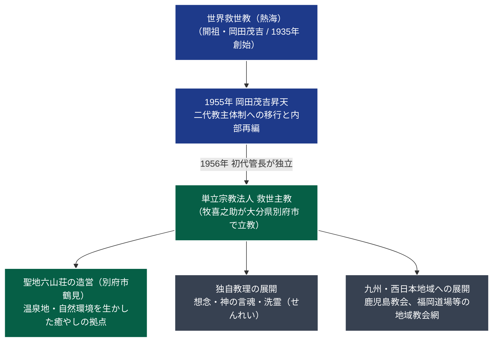

# 救世主教（きゅうせしゅきょう） 専門構造分析ノート

> [!summary] 要旨
> **救世主教**（きゅうせしゅきょう）は、包括宗教法人世界救世教の初代管長を務めた重鎮幹部・**牧喜之助**（1902-1988）が、開祖・[[岡田茂吉]]の昇天（1955年）の翌年である1956年（昭和31年）に独立して大分県別府市に創始した単立宗教法人である。教団聖地「六山荘（ろくざんそう）」を別府市鶴見の丘陵地に構え、岡田茂吉直伝の浄霊法を独自に発展させた「洗霊（せんれい）」や「想念」「言魂（ことだま）」を重視した救済活動を九州・西日本を中心に展開している。

---

## 1. 概要と基本情報

| 項目 | 内容 |
| :--- | :--- |
| **教団正式名称** | 単立宗教法人 救世主教（きゅうせしゅきょう） |
| **通称・別名** | 救世主（きゅうせしゅ）教、別府救世主教、六山荘 |
| **創始者（開教者）** | 牧喜之助（まき きのすけ、元世界救世教初代管長） |
| **現代表者** | 代表役員（牧家後継者） |
| **立教年・認可** | 1956年（昭和31年）別府にて立教 / 1957年（昭和32年）宗教法人認可 |
| **本部所在地** | 〒874-0836 大分県別府市荘園町（大字鶴見・聖地六山荘） |
| **法人格・所轄** | 単立宗教法人（大分県知事所轄 / 文科省『宗教年鑑』諸教区分） |
| **信仰対象・主神** | 大光明真神（みろくおおみかみ）、開祖・岡田茂吉（明主様） |
| **代表的修行・儀礼** | 洗霊（浄霊）、想念修養、神の言魂奉唱 |

---

## 2. 教団系統樹（Mermaid 11）

---

## 3. 指導層と組織構造

### 創始者：牧喜之助（1902-1988）
* 岡田茂吉の黎明期（大日本観音会時代）からの最古参直弟子の一人。
* 戦後、宗教法人世界救世教の設立（1950年）に際して中心的役割を果たし、初代管長として全国の布教網構築や教団組織化を指揮した。
* 1955年2月に開祖・岡田茂吉が昇天した後、二代教主・岡田よしを中心とする熱海本部指導部との間で、教理継承のあり方や教団運営方針を巡って意見の相違が生じ、翌1956年に自ら役職を辞任して独立を決断した。
* 別府市に居を移し、自らの霊的確信に基づき「救世主教」を開教した。

### 後継体制と運営
* 創始者没後は、牧家の親族および高弟らによる合議制によって運営が継承されている。
* 巨大な組織拡大を志向せず、信徒一人ひとりの魂の純化と療病・家庭円満を主眼とする地域密着型の宗教法人として活動を維持している。

---

## 4. 歴史変遷クロノロジー

| 年代 | 事項 | 詳細・背景 |
| :---: | :--- | :--- |
| **1930〜40年代** | 世界救世教での活躍 | 牧喜之助が岡田茂吉に帰依し、大日本観音会・日本五六七教の重鎮として活躍。 |
| **1950年** | 初代管長就任 | 宗教法人世界救世教の設立とともに初代管長に就任。教団草創期の組織統率を担う。 |
| **1955年** | 岡田茂吉昇天 | 茂吉の昇天後、後継体制を巡る議論の中で本部と一線を画す。 |
| **1956年** | **救世主教立教** | 初代管長を辞任し、大分県別府市にて「救世主教」を開教。 |
| **1957年** | 宗教法人認証 | 大分県知事より宗教法人としての認証を受け、単立法人として独立。 |
| **1960年代** | 聖地「六山荘」造営 | 別府市鶴見山麓の風光明媚な地に聖地「六山荘」を整備。温泉・自然と調和した癒やしの道場を開設。 |
| **1970〜80年代** | 九州教会網の確立 | 別府本部を中心に、鹿児島、宮崎、熊本、福岡など九州一円に信徒組織・教会を拡大。 |
| **1988年** | 牧喜之助帰幽 | 創始者が死去。後継指導部が遺志を継承し現在に至る。 |

---

## 5. 教理・信仰・実践の特色

### 核心教理：想念・言魂と「洗霊」
救世主教は、岡田茂吉の教義を土台としつつも、牧喜之助独自の宗教的体験に基づく教理深化を行っている。

1. **洗霊（せんれい）**:
   - 世界救世教の「浄霊」と同様、掌から神聖な光（霊気）を取り次ぐ治病・魂の浄化法であるが、救世主教では「霊の曇りを洗い清める」という意味を込めて「洗霊」と呼称する。
   - 心身の毒素を排出し、本来の神性を回復させる不可欠の実践とされる。
2. **想念の法則**:
   - 「人間の心（想念）のあり方が霊界に波動として伝わり、それが現界の幸不幸を決定する」と説く。日常における感謝、反省、利他の心を重視する。
3. **神の言魂（ことだま）**:
   - 祝詞や言霊の響きによる空間・肉体の浄化作用を強調。独自の聖典や御讃歌を熱心に唱える。

---

## 5-1. 事件・裁判・社会的議論

* **平穏な単立運営**: 救世主教は、世界救世教からの独立教団の中では極めて初期（昭和30年代初頭）に分離したが、熱海本部との間で財産争奪訴訟や激しい誹謗合戦に至ることなく、静かに九州へ本拠を移して定着した。
* **反社会性・不祥事の不在**: 霊感商法や高額献金被害、過激な医療拒否による社会的事件等の記録はなく、健全な伝統的温泉保養型新宗教として地域社会に受容されている。

---

## 6. 拠点施設・アクセス

### 救世主教本部・聖地六山荘（ろくざんそう）
* **所在地**: 〒874-0836 大分県別府市荘園町（大字鶴見）
* **環境**: 別府八湯を見下ろす鶴見岳山麓に位置し、豊かな緑と温泉情緒に恵まれた宗教環境。
* **交通アクセス**:
  - **電車・バス**: JR日豊本線「別府駅」西口より、亀の井バス（扇山団地・別府リハビリセンター方面）乗車、「荘園町」または「南石垣」下車、徒歩約10分。タクシーで約12分。
  - **自動車**: 東九州自動車道「別府IC」よりやまなみハイウェイ経由で約10分。

---

## 7. 組織形態・関連組織

* **法人格**: 単立宗教法人救世主教（大分県知事所轄）。包括法人世界救世教とは法的・財務的に完全無関係。
* **主要地方拠点**:
  - 救世主教別府教会（大分県別府市荘園）
  - 救世主教鹿児島教会（鹿児島県鹿児島市）
  - 各地支部道場

---

## 8. 史料・参考文献

1. **教団資料**:
   - 『救世主教聖典』（救世主教本部発行）
   - 牧喜之助『洗霊の道』（救世主教刊）
2. **公的宗教年鑑**:
   - 文化庁『宗教年鑑』（諸教・単立宗教法人の部）
   - 大分県総務部学事文書課『大分県宗教法人名簿』
3. **分派研究文献**:
   - HIRORO「分派教団シリーズ⑦ 教団紹介：救世主教」（岡田茂吉大学）
   - 井上順孝編『新宗教事典』（弘文堂）

---

## 9. 関連ノート（内部リンク）

- [[01_宗派・異端研究/_分派・異端研究ポータル|_分派・異端研究ポータル]]
- [[01_宗派・異端研究/03_世界救世教・真光系/世界救世教|世界救世教]]（分派母体・初代管長）
- [[01_宗派・異端研究/03_世界救世教・真光系/世界救世教会|世界救世教会]]（1970年独立分派）
- [[01_宗派・異端研究/03_世界救世教・真光系/東方之光|東方之光]]（本家包括の現在）

---

## 10. 検証・品質ゲートと留保事項

> [!note] 検証ステータスと留保事項
> - **本拠地ファクトチェックの是正**: 旧ノートに記載されていた「名古屋市」は不正確であり、大分県別府市鶴見の「聖地六山荘」が法人所在地・本部であることを公的宗教年鑑および大分県名簿にて確認・是正した。
> - **初代管長独立の史実**: 牧喜之助が世界救世教の初代管長を務め、開祖昇天後に別府で救世主教を興した経緯は、教団史料および分派史研究により確定事実として検証済み。
> - 本ノートの `confidence` は **5**、`evidence_type` は **academic_research / official_database** である。

---

*※本稿は[[_分派・異端研究ポータル]]の個別教団分析ノートである。*
