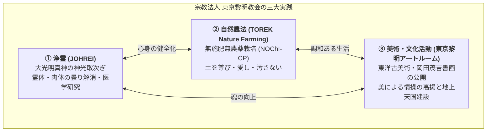

# 東京黎明教会 専門構造分析ノート

> [!summary] 要旨
> **宗教法人 東京黎明教会（とうきょうれいめいきょうかい、TOREK）**は、[[岡田茂吉]]（1882〜1955）を師と仰ぎ、その原点である教理・実践の純粋継承を掲げて1985年（昭和60年）11月8日に東京都知事より単立宗教法人として認証・設立された世界救世教系の独立教団である。
> 本部は東京都中野区東中野に所在し、岡田茂吉が提唱した「真・善・美の地上天国建設」を具現化するため、**①浄霊（JOHREI）**、**②自然農法（TOREK Nature Farming／無施肥無農薬栽培）**、**③美術・文化活動（東京黎明アートルーム）**の三位一体の実践を展開している。

---

## 1. 母体・関連教団との対比

| 比較考察軸 | 世界救世教（母体・包括法人） | 世界救世教黎明教会（京都） | 東京黎明教会（本社・当団体） |
| :--- | :--- | :--- | :--- |
| **創始者・開祖** | [[岡田茂吉]]（明主様） | 岡田茂吉の教えを継承 | 岡田茂吉を「師」として推戴 |
| **本部所在地** | 静岡県熱海市（瑞雲郷） | 京都府京都市左京区吉田神楽岡町3 | 東京都中野区東中野2丁目9-17 |
| **主要拠点** | 熱海・箱根・京都（3大聖地） | 京都本部、国立京都国際会館（御生誕祭） | 東中野展示室・事務局、八王子施設 |
| **組織形態** | 包括宗教法人（傘下にいづのめ・東方之光） | 単立宗教法人（京都府知事所轄） | 単立宗教法人（東京都知事所轄・第7143号） |
| **設立・独立** | 1935年発会 / 1950年改称 | 岡田茂吉帰天後の分化・独立 | 1985年11月8日登記（東京支部が単立独立） |
| **自然農法方針** | 一般社団法人MOA自然農法文化事業団等 | 無施肥無農薬栽培調査研究会（無肥研）等 | TOREK自然農法（無施肥無農薬栽培・TORES認定） |
| **美術・文化施設** | MOA美術館（熱海）、箱根美術館 | 資料研修館（京都） | 東京黎明アートルーム（東中野） |

> [!note] 京都の世界救世教黎明教会との関係
> 東京黎明教会は、もともと京都に本部を置く「世界救世教黎明教会」の東京支部としての性格を有していたが、1980年代前半の世界救世教内部の激しい路線対立・組織再編期において、1985年11月8日に東京都知事より認証を受け、単立の「宗教法人 東京黎明教会」として独立した。両者は共通の教理（岡田茂吉の直言・浄霊・自然農法・芸術活動）を根幹に据えながら、登記上はそれぞれ独立した別法人として運営されている。

---

## 2. 概要と基本情報

| 項目 | 内容 |
| :--- | :--- |
| **教団正式名称** | 宗教法人 東京黎明教会（とうきょうれいめいきょうかい） |
| **通称・略称** | 東京黎明教会、TOREK（Tokyo Reimei Kyoukai） |
| **推戴・師** | [[岡田茂吉]]（1882年12月23日 - 1955年2月10日） |
| **代表役員** | 長島 良紀（東京都宗教法人名簿記載） |
| **設立登記年月日** | 1985年（昭和60年）11月8日 |
| **所轄官庁・認証** | 東京都知事所轄（単立・諸教系 / 認証番号: 7143） |
| **教団公式サイトURL** | http://www.torek.jp/ |
| **部門サイトURL** | 美術：http://www.museum-art.torek.jp/ <br>自然農法：http://www.naturefarming.torek.jp/ |
| **本部所在地** | 〒164-0003 東京都中野区東中野2丁目9-17 |
| **実質活動拠点** | 〒164-0003 東京都中野区東中野2丁目8-20（東京黎明アートルーム / TOREK自然農法事務局） |
| **関連地方拠点** | 〒192-0051 東京都八王子市長房町57（八王子施設・研修拠点） |
| **アクセス** | JR中央・総武線／都営地下鉄大江戸線「東中野駅」西口より徒歩約5分 |
| **主な教義・信仰対象** | 大光明真神（だいこうみょうしん）、岡田茂吉（明主様）の御教え |
| **代表的な儀式・実践** | 浄霊（JOHREI）、無施肥無農薬栽培（自然農法）、美育・芸術鑑賞 |
| **経典・出版物** | 岡田茂吉の著作・御教え集、教団機関紙 |
| **信者数** | 未確認（単立宗教法人につき公表統計なし） |
| **他教団との系譜関係** | [[世界救世教]] ➔ [[世界救世教黎明教会]]（京都） ➔ [[東京黎明教会]]（1985年独立） |

---

## 3. 創始者と沿革

### 3-1. ルーツと世界救世教の動揺
東京黎明教会の信仰の淵源は、大本の元幹部であった[[岡田茂吉]]が1935年に創始した大日本観音会（のちの世界救世教）にある。岡田茂吉は、薬毒を否定し手かざしによって霊体・肉体の曇りを除去する「浄霊」、人為的な肥料や農薬を一切排して土の偉力を生かす「自然農法」、そして美による心の浄化を促す「美術館・芸術活動」の3本柱によって、地上天国（病・貧・争のない理想社会）の建設を説いた。

1955年2月に岡田茂吉が帰天（死去）した後、世界救世教内部では指導権や教義解釈、組織運営の近代化・巨大化をめぐって度重なる対立が生じた。1970年の秀明教会（のちの[[神慈秀明会]]）の離脱をはじめ、各地で自主自立を模索する教会集団が生まれた。

### 3-2. 黎明教会の成立と東京支部の独立（1985年）
世界救世教の中で岡田茂吉の初期の直言や純粋な実践を堅持しようとした有力な流れの一つが「黎明教会」（京都拠点）であった。
1980年代前半、包括法人「世界救世教」内部では教団幹部間の対立（のちの新生派・再建派MOA・護持派への大分裂）が先鋭化し、教団組織が大きく動揺した。こうした中で、東京地域の信徒・拠点を統括していた「東京黎明教会」は、包括法人の政治的混乱や権力闘争から距離を置き、岡田茂吉本来の純粋な信仰実践（浄霊・自然農法・美の普及）に徹するため、自主独立の道を選択した。

**1985年（昭和60年）11月8日**、東京都知事より単立の宗教法人として認証を受け、「宗教法人 東京黎明教会」（認証番号7143）が正式に発足した。

### 3-3. 東中野を拠点とする文化・農法活動の展開
独立後の東京黎明教会は、東京都中野区東中野を拠点として着実な活動を継続した。
* 2005年、岡田茂吉が遺した優れた古美術コレクションや思想を一般社会に還元・公開するため、東中野に「TOREK Art Room」を開室。
* 2015年10月、同施設を本格的な美術館「**東京黎明アートルーム**」としてリニューアルオープン。
* 同時に「TOREK自然農法」として無施肥無農薬栽培の普及に取り組み、長野県木島平村などに生産圃場を確保し、全国的な頒布会・販売会を展開している。

---

## 4. 歴史変遷クロノロジー

```
・1935年1月1日: 岡田茂吉が「大日本観音会」を発会（世界救世教の起源）。
・1950年2月4日: 「世界救世（メシヤ）教」に改称。
・1955年2月10日: 岡田茂吉死去（帰天）。以後、教団各派の分化が進む。
・1970年代〜1980年代初頭: 世界救世教黎明教会の東京支部として活動。
・1985年11月8日: 東京都知事より認証を受け、「宗教法人 東京黎明教会」（単立）として独立登記。
・2005年: 東京都中野区東中野に展示施設「TOREK Art Room」を開室。
・2015年10月10日: 「東京黎明アートルーム」として美術館施設をリニューアルグランドオープン。
・2016年: 所蔵する「遮光器土偶」を江戸東京博物館の企画展「大妖怪展」へ出品貸出。
・2018年: TOREK自然農法の契約生産米が米・食味鑑定士コンクールにて金賞を受賞。
・2023年12月31日時点: 東京都宗教法人名簿において認証番号7143、代表役員・長島良紀として現存。
```

---

## 5. 教理・儀礼・活動の三大支柱

東京黎明教会は、岡田茂吉が説いた三位一体の救済論（霊の救い＝浄霊、体の救い＝自然農法、心の救い＝芸術）を教団活動の骨子としている。



### 5-1. 浄霊（JOHREI）
* **原理**: 人間を肉体と霊体の合一体と捉え、あらゆる苦難や病気の根源を「霊の曇り」にあるとする。掌をかざすことで、至高神「大光明真神」からの聖なる光（神光）を取り次ぎ、相手の霊体の曇りと肉体の毒素を解消する。
* **科学的・医学的アプローチ**: 盲信的な奇跡談の喧伝を避け、医学者や研究者と連携した科学的検証や生理学的効果の研究に取り組む姿勢を掲げている。

### 5-2. 自然農法（TOREK Nature Farming / 無施肥無農薬栽培）
* **基本理念**: 「土を尊び、土を愛し、汚さない」。岡田茂吉が1935年以降提唱した自然農法の原点に立ち返る。
* **無施肥無農薬栽培（NOChI-CP: No Organic or Chemical Input Crop Production）**:
  * 化学肥料・化学合成農薬はもちろんのこと、動物性糞尿や油粕・堆肥などの**有機肥料すら一切施用しない純粋な無施肥栽培**を徹底する。
  * 「土そのものに作物を育てる偉大な生命力と養分が備わっている」とし、人為的な異物投入が土を汚染し作物の生命力を損なうと説く。
* **流通・認定体制**:
  * 「生産・流通・消費」が互いに「おかげさま」の心で結ばれる協働関係を構築。
  * 独自の農産物品質認定基準「**TORES認定**」を運用。
  * 長野県木島平村などの主産地圃場と提携し、定期的な頒布会・直売会・試食会を実施。コンクールで金賞を受賞するなど高品質な米・野菜の生産実績を持つ。

### 5-3. 美術・文化活動（東京黎明アートルーム）
* **設立理念**: 岡田茂吉は「人間にとって美や芸術は魂を向上させ、平和な心へ導く至上の薬である」と説き、自ら多くの名品を収集した。その理念を継承し、宗教・宗派の枠を超えて一般市民に美の潤いを提供することを目的として開設された。
* **施設構成**:
  * **1階展示室**: 日本美術（陶磁器、彫刻、絵画）を中心に、アジア諸国の東洋古美術、茶道具などを展示。
  * **2階展示室**: 岡田茂吉の直筆書画（「光明」「光雲」の軸物など）を中心とした展示。
  * **併設施設**: 地下1階に自然農法カフェ[[SUZU COFFEE（東京黎明アートルーム・自然農法カフェ）|SUZU COFFEE]]、中庭を併せ持ち、地域に開かれた美術館として親しまれている。
* **主要所蔵品**:
  * **遮光器土偶**（縄文時代、重要文化財級。2016年に江戸東京博物館の企画展「大妖怪展」に出品）
  * **河鍋暁斎「観音・龍神・鬼神 三幅対図」**（幕末・明治の巨匠による大作。碧南市藤井達吉現代美術館等へ出品）
  * その他、六古窯などの中世陶器、仏教彫刻、優品茶道具を多数所蔵。

---

## 6. 本部境内・拠点アクセス

### 主たる事務所（登記上の主事務所）
- **所在地**: 〒164-0003 東京都中野区東中野2丁目9-17
- **所轄**: 東京都知事認証（認証番号: 7143）
- **代表役員**: 長島 良紀

### 活動拠点・展示室（東京黎明アートルーム / TOREK自然農法事務局）
- **所在地**: 〒164-0003 東京都中野区東中野2丁目8-20
- **Google Maps座標**: 約 35.7037° N, 139.6868° E
- **アクセス**:
  - JR中央・総武各駅停車「東中野駅」西口より徒歩約5分
  - 都営地下鉄大江戸線「東中野駅」A3出口より徒歩約5分
  - 東京メトロ東西線「落合駅」より徒歩約10分

### 関連地方施設（八王子研修拠点）
- **所在地**: 〒192-0051 東京都八王子市長房町57
- **Google Maps座標**: 約 35.6582° N, 139.3081° E
- **アクセス**: JR中央線「西八王子駅」北口より徒歩約17分、または京王バス「富士森高校」下車

---

## 7. 関連教団・関連人物・関連概念

### 関連教団
- [[世界救世教]]（母体教団。1985年に法的に独立）
- [[いづのめ教団]]（世界救世教の主流被包括法人）
- [[東方之光]]（世界救世教の被包括法人、MOAを推進）
- [[神慈秀明会]]（1970年に離脱した同門分派）
- 世界救世教黎明教会（京都府京都市左京区に所在する同系統の単立教団）

### 関連人物
- [[岡田茂吉]]（開祖・明主様）
- 長島良紀（現代表役員）

### 関連教理・活動概念
- [[浄霊]]（手かざしによる霊の浄化）
- 自然農法 / 無施肥無農薬栽培（NOChI-CP）
- 東京黎明アートルーム（TOREK Art Room）
- [[SUZU COFFEE（東京黎明アートルーム・自然農法カフェ）]]
- TORES認定

---

## 8. 史料・参考文献

1. **東京都生活文化局**: 『東京都宗教法人名簿（令和5年12月31日現在）』
   - 諸教系・単立「東京黎明教会」（中野区東中野2-9-17、認証番号7143、代表役員・長島良紀、設立登記1985年11月8日）
2. **宗教法人東京黎明教会 公式サイト**:
   - ポータルサイト: [TOREK](http://www.torek.jp/)
   - 美術部門: [東京黎明アートルーム](http://www.museum-art.torek.jp/)
   - カフェ部門: [SUZU COFFEE](http://www.museum-art.torek.jp/cafe/suzucoffee.html)
   - 農業部門: [TOREK自然農法](http://www.naturefarming.torek.jp/)
3. **宗教法人世界救世教黎明教会（京都） 公式サイト**:
   - [世界救世教黎明教会](http://www.reimei.or.jp/)
4. **文化庁**: 『宗教年鑑』各年度版
5. **展覧会図録**: 江戸東京博物館『大妖怪展 土偶から妖怪ウォッチまで』（2016年）所蔵品出品記録

---

## 9. 関連ノート (Vault内)

- [[_分派・異端研究ポータル]]
- [[世界救世教]]
- [[岡田茂吉]]
- [[神慈秀明会]]
- [[東方之光]]
- [[いづのめ教団]]
- [[手かざし系諸派の教義比較マトリクス]]
- [[浄霊センター]]
- [[SUZU COFFEE（東京黎明アートルーム・自然農法カフェ）]]
- [[src_sekai_kyuseikyo_branches]]

---

## 10. 検証・品質ゲートと留保事項

> [!important] 所在地および設立年の是正経緯（ファクトチェック記録）
> - **所在地の訂正**:
>   旧稿では「東京都目黒区青葉台2丁目2-15」と記載されていたが、目黒区青葉台2丁目に当該番地は実在せず、外部の未検証な二次記述による誤認であった。東京都公的資料（『東京都宗教法人名簿』令和5年12月31日現在）により、主たる事務所は「東京都中野区東中野2丁目9-17」、実質的な活動拠点（展示室・事務局）は「東中野2丁目8-20」であることが確定したため、全面的に是正した。
> - **設立年の訂正**:
>   旧稿では「1974年」とされていたが、宗教法人認証および法人登記日は「1985年（昭和60年）11月8日」である。
> - **京都教団との峻別**:
>   「世界救世教黎明教会」（京都市左京区、法人番号4130005001753）と「東京黎明教会」（中野区東中野、認証番号7143）は、共通の教理・起源を持ちつつも、法的にはそれぞれ単立法人として独立していることを確認・明記した。
> - 本ノートの `evidence_type` は `"primary_source_based"`（公的宗教法人名簿および教団直営公式サイト等により確認）、`confidence` は最高度の `5` とする。

---

*※本稿は[[_分派・異端研究ポータル]]の個別教団構造分析ノートである。*
