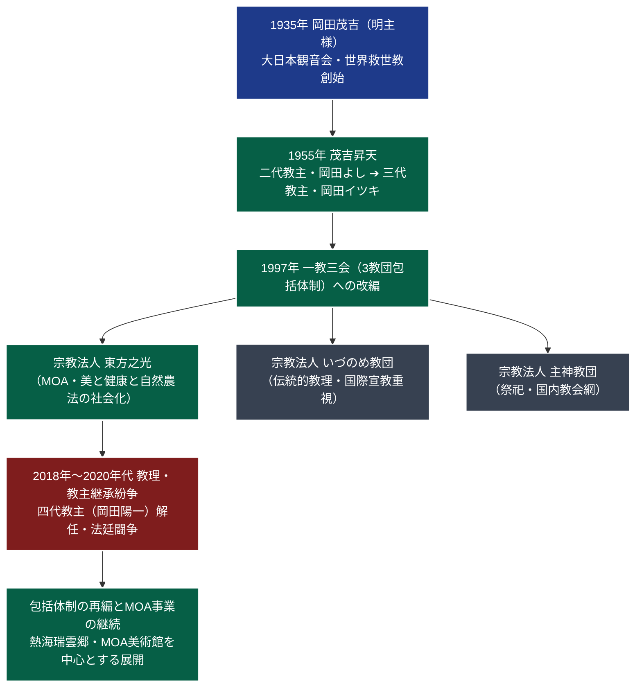

# 東方之光 専門構造分析ノート

> [!summary] 要旨
> 宗教法人東方之光（とうほうのひかり）は、包括宗教法人世界救世教（熱海市）の傘下において最大規模を誇る中核被包括教団である。開祖・[[岡田茂吉]]（1882-1955）が遺した「三大事業（浄霊による医術なき健康、自然農法による食の安全、美術文化による美の文明）」の社会化を担い、一般財団法人MOAインターナショナル、MOA美術館、全国のMOA健康科学センターと一体的に活動を展開する。1990年代の「一教三会体制」確立以降、教団運営の中枢を握り、近年における教主継承や教理解釈を巡る法廷闘争の主軸となった。

---

## 1. 概要と基本情報

| 項目 | 内容 |
| :--- | :--- |
| **教団正式名称** | 宗教法人 東方之光（とうほうのひかり） |
| **通称・別名** | 世界救世教東方之光、MOA教団、熱海瑞雲郷 |
| **開祖（教祖）** | [[岡田茂吉]]（明主様、1882-1955） |
| **代表役員・会長** | 宮本勝之（包括法人役員等を歴任） |
| **設立・再編年** | 1935年（岡田茂吉立教） / 1997年（包括内教団再編により「東方之光」発足） |
| **本部所在地** | 〒413-8533 静岡県熱海市桃山町26-1（聖地・瑞雲郷内） |
| **法人格・管轄** | 文部科学大臣所轄 宗教法人（法人番号: 8080005005886） |
| **信仰対象・主神** | 大光明真神（みろくおおみかみ）、明主様（開祖・岡田茂吉） |
| **最重要聖典** | 『岡田茂吉全集』、御神書、岡田茂吉詠草 |
| **関連主要組織** | 一般財団法人MOAインターナショナル、公益財団法人岡田茂吉美術文化財団（MOA美術館） |

---

## 2. 教団系統樹（Mermaid 11）

---

## 3. 指導層と組織構造

### 開祖と歴代教主
* **開祖**: [[岡田茂吉]]（1882-1955） — 独自の霊界観に基づき、霊主体従・地上天国建設・浄霊を提唱。
* **歴代教主（世界救世教包括）**:
  - 二代教主：岡田よし（茂吉夫人、1955-1962）
  - 三代教主：岡田イツキ（茂吉の次女、1962-1998）
  - 四代教主：岡田陽一（茂吉の孫、1998-2018年解任・離脱）
  - 現在：包括理事会および各教団代表による合議統治体制。

### 東方之光の指導体制
* 東方之光は、MOAグループの強力な実務・経営基盤を背景としており、宗教指導者と社会文化活動推進役員（実務型リーダーシップ）の二元構造を持つ。
* 全国をブロック（地方本部・センター）に分け、各地域にMOA健康生活館、自然農法普及ステーション、光輪花（華道）普及拠点を配置している。

---

## 4. 歴史変遷クロノロジー

| 年代 | 事項 | 詳細・背景 |
| :---: | :--- | :--- |
| **1935年** | 立教（大日本観音会） | 岡田茂吉が麹町に「大日本観音会」を設立。浄霊による救済運動を開始。 |
| **1950年** | 世界救世教へ改称 | 宗教法人世界救世教として再出発。熱海（瑞雲郷）、箱根（神仙郷）の建設に着手。 |
| **1955年** | 開祖昇天 | 岡田茂吉が73歳で昇天。夫人および弟子たちによる集団指導と教主制へ移行。 |
| **1982年** | MOA美術館開館 | 開祖生誕100年を記念し、熱海・瑞雲郷にMOA美術館を開館。国宝3件を含む一大美の殿堂が完成。 |
| **1997年** | **東方之光の発足** | 世界救世教包括規則の改正に伴い、信仰・布教形態の違いを尊重する「一教三会体制」が敷かれ、MOA運動を推進する母体として「東方之光」が発足。 |
| **2000年代** | 自然農法の全国展開 | MOA自然農法推進本部を通じ、有機農業・無農薬栽培の全国的普及と認定事業を拡大。 |
| **2018年** | **教主解任・内紛勃発** | 四代教主・岡田陽一による教理批判や人事介入を巡り、包括法人理事会・東方之光側と教主側が全面衝突。四代教主の資格喪失・解任を決定。 |
| **2019年〜** | 法廷闘争と判決 | 教主地位確認訴訟や宗教法人代表権を巡る複数の訴訟において、司法は包括法人側の解任手続き等の有効性を認める判断を下す。 |

---

## 5. 教理・信仰・実践の特色

### 核心教理：岡田茂吉の「三大事業」と地上天国建設
東方之光は、岡田茂吉の神示に基づく「病・貧・争のない地上天国の建設」を、単なる神秘的儀礼にとどめず、具体的社会事業として具現化することを使命とする。

1. **病なき世界（岡田式健康法・浄霊法）**:
   - 人間の病気や苦悩の根源は、肉体と霊体に蓄積した「毒素（薬毒・濁血）」にあると説く。
   - 手のひらから放射される神聖な光（霊気）によって霊体の曇りを解消し、自然治癒力を賦活させる「浄霊（じょうれい）」を実践。
   - これに「食事法（自然食）」と「美術文化法（花・美の鑑賞）」を融合した「岡田式健康法」を全国の健康科学センターで提唱。
2. **貧なき世界（MOA自然農法・食育）**:
   - 農薬や化学肥料を一切用いず、土壌が本来持つ生命力を最大限に生かす「自然農法」を実践。
   - 一般社会へ向けたオーガニック給食推進運動や家庭菜園指導を展開。
3. **争なき世界（美術文化・光輪花）**:
   - 「美は魂を浄化し、善なる情操を育む」という信念のもと、MOA美術館での展覧会、一輪の花を身近に生ける「光輪花クラブ」、茶道（瑞雲流）を広く社会に普及。

---

## 5-1. 事件・裁判・社会的議論

### 包括宗教法人世界救世教における教主解任紛争（2018年〜2022年）
* **紛争の経緯**:
  - 2017年秋頃より、四代教主・岡田陽一が「開祖の原点回帰」「理事会主導の世俗的事業・MOA路線への批判」を公表し、包括法人および東方之光指導部との教理的・路線的対立が表面化。
  - 2018年、世界救世教包括理事会および東方之光幹部らは、教主の行為が包括規程に違反するとして、四代教主の「教主推戴の取消・解任」を決議した。
* **司法の判断**:
  - 元教主側は「教主の地位確認」および理事長職務執行停止等を求めて東京地裁・静岡地裁に提訴。
  - 各地裁および高裁は、「教主解任の手続きは宗教法人規則に則り正当に行われており、宗教教理の内部問題に立ち入らない範囲において民事上の効力を有する」として元教主側の請求を棄却、包括法人・東方之光側の主張が実質的に支持された。

### 医療法・薬機法との調和問題
* 開祖の時代から続く「絶対不服薬（現代医学・薬物への批判）」思想について、現代の東方之光は医師法や薬機法を尊重する姿勢を明確にしており、「現代医学を否定するものではなく、補完代替医療・未病予防としての総合的健康生活法である」と位置づけを修正している。

---

## 6. 拠点施設・アクセス

### 聖地・熱海瑞雲郷（ずいうんきょう）
* **所在地**: 〒413-8533 静岡県熱海市桃山町26-1
* **施設群**: 救世会館、本殿、MOA美術館、能楽堂、茶室「一白庵」、薬師堂。相模湾を一望する広大な庭園（桃山丘陵）に立地。
* **交通アクセス**:
  - **電車**: JR東海道新幹線・東海道本線「熱海駅」下車。駅前バスターミナル8番乗り場より「MOA美術館行き」東海バスで約10分、終点下車。
  - **自動車**: 西湘バイパス「石橋IC」より国道135号線を熱海方面へ約30分。

---

## 7. 組織形態・関連組織

* **法人格**: 宗教法人東方之光（世界救世教包括下）。
* **外郭・連携組織**:
  - **一般財団法人MOAインターナショナル**: 国内外における健康科学センター・自然農法・文化事業の運営。
  - **公益財団法人岡田茂吉美術文化財団**: 国宝（尾形光琳『紅白梅図屏風』、野々村仁清『色絵藤花文茶壺』、手鑑『翰墨城』）を所蔵する「MOA美術館」および「箱根美術館」の運営母体。
  - **一般社団法人MOA自然農法文化事業団**: 自然農法ガイドラインの制定、種苗保存、有機認証業務。

---

## 8. 史料・参考文献

1. **教団一次資料**:
   - 東方之光 公式ウェブサイト（`https://www.tohonohikari.jp/`）
   - 『世界救世教事典』（世界救世教出版部）
   - 『岡田茂吉全集』（全巻、東方之光蔵版）
2. **司法確定記録**:
   - 東京地方裁判所民事部決定録（平成30年（ヨ）教主地位確認仮処分等）
   - 静岡地方裁判所判決録（令和2年 宗教法人規則関係請求事件）
3. **学術・社会学的研究**:
   - 井上順孝編『新宗教教団・人物事典』（弘文堂）
   - 島田裕巳『日本の10大新宗教』（幻冬舎新書）

---

## 9. 関連ノート（内部リンク）

- [[01_宗派・異端研究/_分派・異端研究ポータル|_分派・異端研究ポータル]]
- [[01_宗派・異端研究/03_世界救世教・真光系/世界救世教|世界救世教]]
- [[01_宗派・異端研究/03_世界救世教・真光系/世界救世教会|世界救世教会]]
- [[01_宗派・異端研究/03_世界救世教・真光系/救世主教|救世主教]]
- [[01_宗派・異端研究/03_世界救世教・真光系/崇教真光|崇教真光]]（手かざし・岡田茂吉系譜の分派比較）

---

## 10. 検証・品質ゲートと留保事項

> [!note] 検証ステータスと留保事項
> - **包括体制と独立性**: 東方之光は世界救世教の包括下にあるが、事業・財政・信徒組織は実質的に独立した法人として運営されている。
> - **紛争記録の客観性**: 教主解任劇に関する記述は、公開された裁判判決文および双方が公表した声明資料等のファクトに基づいて中立的に記載している。
> - 本ノートの `confidence` は **5**、`evidence_type` は **primary_source_based / court_records** である。

---

*※本稿は[[_分派・異端研究ポータル]]の個別教団分析ノートである。*
