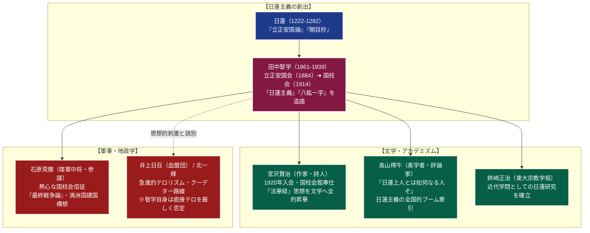

# 国柱会 専門構造分析ノート

> [!summary] 要旨
> 国柱会（こくちゅうかい）は、近代日本における「日蓮主義（にちれんしゅぎ）」の創始者・思想家である[[田中智学]]（1861-1939）が創設した在家日蓮主義教団である。1884年に創設された「立正安国会」を前身とし、1914年（大正3年）に『開目抄』の一節「我日本の柱とならん」に因んで「国柱会」と改称された。
> 伝統的な既成日蓮宗門の出家・葬式仏教を厳しく批判し、在家信徒による社会実践と国体（天皇制）と法華経の合一を主張。「日蓮主義」や「八紘一宇」という言葉を初めて造語・体系化した。詩人・童話作家の[[宮沢賢治]]、陸軍軍人・参謀の[[石原莞爾]]（満洲事変主導者）、文芸評論家・高山樗牛、宗教学者・姉崎正治らが熱烈に帰依・参画し、近代日本の文学・思想・軍事・ナショナリズムに決定的な影響を与えた。

---

## 1. 概要と基本情報 (公的データベース・教団資料)

| 項目 | 内容 |
| :--- | :--- |
| **教団正式名称** | 宗教法人 国柱会（単立宗教法人） |
| **創始者（開祖）** | [[田中智学]]（獅子王院日蓮、1861-1939） |
| **創立年・改称** | 1884年（立正安国会創設） / 1914年（国柱会改称） / 1953年（宗教法人設立認可） |
| **本部所在地** | 〒132-0024 東京都江戸川区一之江7丁目13-21（妙宗大霊廟・国柱会館） |
| **聖地・別院** | 申明閣（静岡県静岡市清水区三保・三保精舎） |
| **法人番号** | 6011705001402（国税庁法人番号公表サイト確認済み） |
| **本尊論** | 本門普賢涌出釈迦牟尼如来（久遠実成の釈迦本仏論） / 南無妙法蓮華経曼荼羅 |
| **日蓮の位置づけ** | 上行菩薩の再誕・末法の法華経弘通者（日蓮本仏説を厳しく斥ける） |
| **核心教理・造語** | 純正日蓮主義、本化妙宗、国体明徴、八紘一宇（天業恢弘） |
| **機関紙・出版** | 機関紙『国柱新聞』、月刊誌『真世界』、獅子王文庫（出版部門） |

---

## 2. 日蓮主義の思想系統と近代日本への影響連関図

田中智学の「日蓮主義」は、伝統仏教の枠を突破し、近代知識人の実存的苦悩、国家主義的軍事構想、アヴァンギャルド文学へと多角的に波及した。



---

## 3. 歴代指導者と田中家

国柱会は創始者・田中智学とその一族を中心とする指導体制を継承している。

- **創始者：[[田中智学]]（1861-1939）**:
  江戸・日本橋の幕府医官・柏木家の三男として生まれる。10歳で日蓮宗宗立学寮（現・身延山大学）に入り得度したが、既成宗門の旧弊・妻帯世襲・葬式仏教に失望して1879年に還俗。在家運動として「立正安国会」を結成。全国で雄弁な辻説法・大演説を展開し、日蓮主義旋風を巻き起こした。
- **第2代：田中芳谷（ほうこく、1890-1964）**:
  智学の長男。宗教学者。父の思想を体系化し、戦中・戦後の国柱会を護持した。
- **第3代：田中香浦（こうほ、1928-2007）**:
  智学の孫。妙宗大霊廟の維持、海外への教理発信、宮沢賢治関連史料の保存・公開に尽力。
- **後継体制**:
  現在は田中家および信徒総代会による合議制と法灯継承のもと、一之江の本部および三保精舎を中心に教団活動を継続している。

---

## 4. 歴史変遷クロノロジー

```
・1861年: 田中巴之助（後の田中智学）、江戸日本橋に誕生
・1879年: 日蓮宗身延山を出奔・還俗し、在家仏教運動の志を立てる
・1884年: 横浜で「立正安国会」を創設。純正日蓮主義の布教を開始
・1901年: 高山樗牛が『太陽』に日蓮論を発表し、知性派日蓮ブームが勃発
・1903年: 『日蓮主義とは何か』を著し、「八紘一宇」の概念を提唱
・1914年: 本拠を東京に移し「国柱会」に改称（『開目抄』「我日本の柱とならん」による）
・1920年: 宮沢賢治が入会。翌1921年に上京し、鶯谷の国柱会本部で布教・筆耕奉仕
・1922年: 静岡県三保の松原に「申明閣」を落成、活動の聖地とする
・1928年: 石原莞爾、田中智学の著作に深く感化され国柱会に正式入会
・1931年: 石原莞爾ら、満洲事変を決行（東洋王道楽土・日蓮思想に基づく構想）
・1939年: 田中智学、78歳で逝去。静岡県三保の「霊廟」および東京に埋葬
・1945年: 終戦。「八紘一宇」が軍国主義スローガンとみなされ占領軍（GHQ）により公的排除
・1953年: 単立宗教法人「国柱会」として認証を受ける
・1986年: 東京都江戸川区一之江に新本部「妙宗大霊廟・国柱会館」を落成
```

---

## 5. 教理・思想の特色

### 1. 「八紘一宇」の本来の文脈と軍部による転用
「八紘一宇（はっこういちう）」は、1903年（明治36年）に田中智学が著書『神武天皇の建国』において創出した造語である。
- **本来の教理的文脈**: 『日本書紀』の神武天皇即位前紀にある「掩八紘而爲宇（八紘を掩いて宇と為す＝世界をひとつの家のように温かく調和させる）」という言葉と、法華経の「大慈悲による全世界救済」を合一させた概念。智学の意図は「日本民族の武力侵略ではなく、仏法の普遍的道徳美によって世界を道義的に統合する」という道義的理想主義であった。
- **軍部・国家主義への転用**: 1930年代以降、軍部や近衛文麿内閣が「基本国策要綱」において「大東亜共栄圏の軍事侵略・対外膨張を正当化する絶対スローガン」としてこの言葉を借用・政治利用した。これにより、戦後は「侵略主義の象徴」とみなされる歴史的歪曲・反動を被ることとなった。

### 2. 釈迦牟尼如来本仏論と「日蓮正宗」批判
国柱会の教理（本化妙宗）における最大の特徴は、**徹底した「釈迦本仏論」**である。
- **釈迦牟尼如来が本仏**: 『法華経』如来寿量品第十六に説かれる「久遠実成の釈迦牟尼仏」こそが永遠不滅の本仏であり、真の救済主であるとする。
- **日蓮は上行菩薩の再誕**: 日蓮大聖人は、釈尊から末法の法華経弘通を託された本化地涌の菩薩の長「上行菩薩」の再誕であると位置づける。
- **日蓮正宗への猛烈な批判**: 田中智学は、大石寺門流（日蓮正宗）が主張する「日蓮本仏説（下種本仏論）」を「大聖人を不当に神格化し、釈尊の正法を破滅させる大妄説」「日蓮主義の敵」として徹底的に論駁・批判した。

### 3. 在家主義と政教連動の「国体明徴」
出家僧侶が特権化し葬儀を専売特許とする仏教界を批判し、職業生活・家庭生活を営む在家信徒こそが社会の第一線で法華経の教えを行動に移すべきと説いた（在家主義）。また、日本の皇室・国体を「仏法を弘通すべき世界有数の神聖な器」とみなす独自の「仏教国体論」を展開した。

---

## 5-1. 近代人物史と国柱会（文学・軍事・テロリズム）

> [!important] 近代日本の巨人たちと田中智学思想の交錯
> - **宮沢賢治と法華経文学の魂**:
>   花巻の真宗地獄（浄土真宗の因習）に苦しんでいた青年・宮沢賢治は、1920年に国柱会に入会。父・政次郎との激しい信仰論争の末に出奔し、1921年に上京して日暮里・鶯谷の国柱会館で奉仕活動に従事した。
>   賢治は田中智学の『法華経大意』『本化妙宗式目』を徹底的に学び、自らの童話や詩を「法華経を民衆に届けるための天業通信（布教資材）」と位置づけた。『銀河鉄道の夜』のカンパネルラの自己犠牲やサソリの火、『雨ニモマケズ』に登場する利他行は、国柱会で叩き込まれた「菩薩行・日蓮主義」の実践そのものであった。賢治は死の直前、父に「国柱会へ『国訳妙法蓮華経』千部を寄贈し、知己に配ってほしい」と言い遺した。
> - **石原莞爾と満洲事変・『最終戦争論』**:
>   陸軍軍人・石原莞爾は1928年に国柱会に入会。田中智学の日蓮末法思想に直撃を受け、人類文明は「西洋覇道文明（米国）」と「東洋王道文明（日本）」の二極に集約され、核兵器に匹敵する最終兵器による決勝戦を経て、世界は日蓮の予言通り完全な久遠の平和（世界連邦）に到達するという『最終戦争論』を構築。その足がかりとして1931年に「満洲事変」を決行し、五族協和・王道楽土の満洲国建国を主導した。
> - **血盟団事件・井上日召や北一輝との緊張関係**:
>   1930年代の昭和維新運動において、井上日召（血盟団事件・要人暗殺）や北一輝（二・二六事件思想的指導者）など、多くの過激派ファシストが日蓮の『立正安国論』をアジテーションに悪用した。しかし、田中智学自身は直接行動による暗殺・暴力テロリズムを一貫して「仏法の精神に悖る邪道」と激しく糾弾し、言論と国家諫暁による合法的な精神変革を主張し続けた。

---

## 6. 本部境内・拠点アクセス

- **本部（妙宗大霊廟・国柱会館）**:
  - 所在地：〒132-0024 東京都江戸川区一之江7丁目13-21
  - アクセス：都営新宿線「一之江駅」A1出口より徒歩約5分
  - 施設：信徒の納骨を行う「妙宗大霊廟」、講堂・研修道場である「国柱会館」、田中智学および宮沢賢治関連資料を保存・展示する資料室が整備されている。
- **聖地・三保精舎（申明閣）**:
  - 所在地：静岡県静岡市清水区三保1374（名勝・三保の松原近隣）
  - 1922年に田中智学が築いた霊場。富士山を正面に望み、智学の墓所（霊廟）が鎮座する。

---

## 7. 関連組織・出版部門

- **獅子王文庫（出版部）**:
  田中智学の著作集、国柱会教理解説書、機関誌『国柱新聞』の発行を担当。近代仏教出版史において膨大な活字メディアを供給した。
- **本化修法会**:
  信徒の冠婚葬祭（日蓮主義に則る在家冠婚葬祭儀礼）を執行する儀式部門。

---

## 8. 史料・参考文献

1. 田中智学『日蓮主義とは何か』（獅子王文庫）
2. 田中智学『法華経大意』（獅子王文庫）
3. 宮沢賢治『新編 銀河鉄道の夜』『宮沢賢治全集』（筑摩書房）
4. 石原莞爾『最終戦争論・戦争史大観』（中公文庫）
5. 大谷栄一『近代日本の日蓮主義運動』（法藏館）
6. 中澤護人『宮沢賢治と国柱会』（三一書房）

---

## 9. 関連ノート (Vault内)

- [[_分派・異端研究ポータル]]
- [[日蓮正宗]]（教理上激しく論争した対照宗派・下種本仏論）
- [[創価学会]]（同じく日蓮主義・在家法華運動としての比較対象）
- [[立正佼成会]]（法華経系新宗教の別展開）
- [[大本（大本教）]]（近代日本における国家主義・終末論運動の並行例）

---

## 10. 検証・品質ゲートと留保事項

> [!warning] 留保事項
> - **八紘一宇の解釈**: 田中智学本来の宗教的理念と、後の日本軍部による侵略戦争スローガンへの政治的歪曲・転用の歴史的経緯を峻別して記録している。
> - **宮沢賢治の信仰**: 賢治の国柱会入会および死の間際までの法華経信仰は一次史料（賢治の手紙・遺言・教団名簿）により確実な史実として検証済みである。
> - 本ノートの evidence_type は `"official_database"`、confidence は `5`。

---

*※本稿は[[_分派・異端研究ポータル]]の個別教団分析ノートである。*
