# 日蓮正宗 専門構造分析ノート

> [!summary] 要旨
> 日蓮正宗（にちれんしょうしゅう）は、日蓮の高弟（六老僧の随一）である[[日興]]（1246-1333）が1290年（正応3年）に富士山麓に建立した「多宝富士大日蓮華山大石寺（たいせきじ）」を総本山とする仏教宗派である。日蓮門下において勝劣派に属し、日蓮を末法適時の下種本仏（久遠元初の自受用報身如来）と仰ぐ独自の「下種本仏論」を展開する。
> 大石寺に安置される「本門戒壇の大御本尊」を根本の信仰対象とし、歴代法主への「唯授一人の血脈相承」を教団統治と信仰の絶対的権威とする。戦後、信徒組織であった[[創価学会]]の折伏大行進により数百万世帯規模へ爆発的信徒拡大を遂げたが、後に教義・戒壇論・宗門統治を巡り深刻に対立。1974年に妙信講（現・[[顕正会]]）、1980年代に[[正信会]]、1991年に創価学会を相次いで破門・絶縁した。現在は公認信徒組織「法華講連合会」を中心に活動している。

---

## 1. 概要と基本情報 (宗派公認・文化庁データ)

| 項目 | 内容 |
| :--- | :--- |
| **宗派正式名称** | 宗教法人 日蓮正宗（包括宗教法人） |
| **総本山・宗務院** | 多宝富士大日蓮華山大石寺（静岡県富士宮市上条2057） |
| **宗祖・開山・現法主** | 宗祖：[[日蓮]]大聖人 / 開山：第2祖 [[日興]]上人 / 現法主：第68世 日如上人 |
| **創立・公認** | 1290年（大石寺創建） / 1900年（富士派独立） / 1912年（日蓮正宗改称） |
| **末寺数・信徒数** | 国内外約700ヶ寺 / 公称信徒数約70万人 |
| **法人番号** | 7080105004245（国税庁法人番号公表サイト確認済み） |
| **根本本尊** | 本門戒壇の大御本尊（弘安2年10月12日造立・大石寺奉安堂安置） |
| **三宝論** | 仏宝：日蓮大聖人 / 法宝：本門戒壇の大御本尊 / 僧宝：第2祖日興上人 |
| **日蓮系諸派との対比** | 勝劣派（法華経迹門より本門が優れる） / 釈迦本仏論を排し下種本仏論を主張 |
| **主要儀礼・実践** | 丑寅勤行、御開扉（戒壇大御本尊内拝）、添書登山、唱題（南無妙法蓮華経） |

---

## 2. 富士門流・日蓮正宗の分派系統樹

大石寺門流（日蓮正宗）は、身延山を離山した日興の正統後継を自負し、近現代において巨大な在家信徒運動を生み出したが、戒壇論や法主権威をめぐり激しい内部抗争と破門の歴史をたどった。

```mermaid
flowchart TD
    classDef root fill:#1e3a8a,stroke:#ffffff,stroke-width:2px,color:#ffffff;
    classDef main fill:#1e40af,stroke:#ffffff,stroke-width:2px,color:#ffffff;
    classDef expelled fill:#991b1b,stroke:#ffffff,stroke-width:2px,color:#ffffff;
    classDef lay fill:#065f46,stroke:#ffffff,stroke-width:1px,color:#ffffff;

    subgraph 門祖開山期["【門流草創】"]
        A["宗祖：日蓮（1222-1282）<br>末法下種本仏"]:::root
        A --> B["第2祖：白蓮阿闍梨 日興（1246-1333）<br>身延離山（1289）➔ 富士大石寺創建（1290）"]:::root
        B --> C["第3祖：新田卿阿闍梨 日目（1260-1333）<br>唯授一人の血脈相承"]:::root
    end

    subgraph 近現代の宗門発展["【大石寺門流・包括法人】"]
        C --> D["日蓮正宗（1912年改称・総本山大石寺）<br>歴代法主（第66世日達 ➔ 第67世日顕 ➔ 第68世日如）"]:::main
    end

    subgraph 派生信徒組織と破門史["【在家団体・破門派生】"]
        D --> E["創価学会（1930年設立・旧法華講員）<br>1970年代教義対立 ➔ 1991年破門・絶縁"]:::expelled
        D --> F["妙信講（現・顕正会）<br>正本堂の戒壇解釈（国立戒壇論）を巡り ➔ 1974年破門"]:::expelled
        D --> G["正信会（若手僧侶有志）<br>創価学会批判・第67世日顕の法主資格攻撃 ➔ 1980年代破門"]:::expelled
        D --> H["法華講連合会（公認信徒組織）<br>大石寺直属の正統信徒講社"]:::lay
    end
```



---

## 3. 歴代法主（大石寺座主）の血脈相承体系

日蓮正宗では、日蓮から日興、日興から日目へと伝えられた「一器の水を一器に移すごとく」純粋に伝えられるとする「唯授一人の血脈相承」を教団の存立基盤とする。

### 1. 三宝と歴代重要法主
- **宗祖：[[日蓮]]（1222-1282）**:
  仏宝。末法の衆生を直ちに成仏へ導く久遠元初の自受用報身如来。
- **第2祖：[[日興]]（1246-1333）**:
  僧宝。日蓮の直弟子。波木井実長（南部実長）の神社参詣等の謗法を諌め、身延山を離山して南条時光の寄進により大石寺を創建。
- **第3祖：日目（1260-1333）**:
  日興より大石寺を相承。生涯にわたり国家諫暁（朝廷・幕府への奏状提出）を重ね、天奏途上の美濃垂井で遷化。
- **第9世：日有（1402-1482）**:
  室町時代の大石寺中興の祖。大石寺の堂宇を整備し、富士門流の教理・化儀を大成。
- **第26世：日寛（1665-1726）**:
  江戸時代の教学中興の祖。『六巻抄』を著し、日蓮正宗の教理（五重三段、三種三段、下種本仏論）を学問的に体系化。
- **第66世：日達（1902-1979）**:
  戦後復興と創価学会の折伏拡大期を指導。正本堂を建立したが、末期には妙信講や正信会との内部紛争に直面。
- **第67世：日顕（1922-2019）**:
  1979年登座。創価学会の独善的路線を批判し、1991年に創価学会を破門。正本堂を解体して奉安堂を建立した。
- **第68世：日如（1945- ）**:
  現法主。2005年登座。法華講の結集と大石寺の護持・伝道活動を統率。

---

## 4. 歴史変遷クロノロジー

```
・1282年: 日蓮、武蔵国池上で遷化。六老僧を定める
・1289年: 日興、身延山久遠寺の地頭・波木井実長の謗法を諌めるも容れられず身延離山
・1290年: 南条時光の寄進を受け、富士山麓上野郷に大石寺を創建
・1900年: 日蓮宗管長統理から独立し、「日蓮宗富士派」を公認設立
・1912年: 富士派から「日蓮正宗」へ宗派改称
・1930年: 牧口常三郎・戸田城聖により「創価教育学会」設立、大石寺信徒講となる
・1943年: 軍部による神札受敬要請を拒否。牧口・戸田ら幹部が治安維持法違反で検挙
・1952年: 包括宗教法人「日蓮正宗」認証。創価学会の折伏大行進が本格化
・1972年: 総本山大石寺に「正本堂」落成（創価学会信徒の寄附金数百億円で建立）
・1974年: 正本堂の戒壇解釈（国立戒壇の否定）を巡り妙信講（現・顕正会）を破門
・1980年代: 創価学会の教義逸脱を批判した若手僧侶ら約200名（正信会）を破門
・1991年: 創価学会に対し「破門通告書」を送付、関係を完全断絶
・1998年: 正本堂を解体・更地化（創価学会との決別と信仰の純化）
・2002年: 本門戒壇の大御本尊を恒久安置する「奉安堂」落成
```

---

## 5. 教理・儀礼の特色

### 1. 下種本仏論（日蓮大聖人＝本仏）
日蓮宗（身延門下）をはじめとする他の日蓮系諸派が「釈迦牟尼仏を本仏とし、日蓮を上行菩薩の再誕（菩薩）」とみなす（釈迦本仏論）のに対し、日蓮正宗では以下のように根本教理を規定する：
- **末法下種本仏**: 釈迦仏法が力を失った末法の時代において、全人類を根本から成仏させる仏は日蓮大聖人（久遠元初の自受用報身如来）であるとする。釈迦は過去の「熟脱の仏」にすぎないと位置づける。

### 2. 本門戒壇の大御本尊（弘安2年の板曼荼羅）
日蓮が弘安2年（1279年）10月12日、熱原法難を契機に出世の本懐（生涯の究極目的）として顕したとされる楠（くすのき）の板曼荼羅本尊。日蓮正宗では、この「戒壇の大御本尊」のみが全人類の帰依すべき唯一絶対の根源本尊であり、他のすべての本尊はここから書写・分出された枝葉であると位置づける。

### 3. 三宝論と血脈相承
- **仏宝**: 日蓮大聖人
- **法宝**: 本門戒壇の大御本尊（南無妙法蓮華経）
- **僧宝**: 第2祖 日興上人（および代々の血脈付嘱を受けた歴代法主）
歴代法主は「日蓮・日興の法脈を正しく受け継ぐ唯一の存在」とされ、法主の指南・決定は絶対的な宗教的権威を持つ。

### 4. 儀礼と実践
- **丑寅勤行（うしとらごんぎょう）**: 大石寺客殿において、丑の刻から寅の刻（深夜午前2時30分〜）にかけて歴代法主が自ら大衆を率いて世界平和と広宣流布を祈念する秘儀。
- **御開扉（ごかいひ）と登山参詣**: 信徒が大石寺に赴き、奉安堂に安置される戒壇の大御本尊を直接拝観（内拝）する信仰の極致。日蓮正宗の信徒は所属寺院の住職による「添書」を得て登山することが義務づけられている。

---

## 5-1. 事件・宗門紛争史（破門問題の深層）

> [!danger] 宗門と在家信徒団体との確執・破門の歴史
> - **正本堂建立と顕正会（妙信講）破門（1974年）**:
>   1972年に完成した大石寺「正本堂」を巡り、創価学会と宗門執行部が「実質的な事の戒壇である」と位置づけたことに対し、妙信講（浅井甚兵衛・昭衛父子）が「富士山天生原に国費で建立される国立戒壇こそが日蓮の遺命である」と猛烈に抗議。大石寺へのデモ・乱入事件に発展し、宗門は1974年に妙信講を講中解散処分（破門）とした。
> - **正信会問題（1979〜1980年代）**:
>   創価学会の教義逸脱・本尊偽造疑惑を批判した宗門の若手僧侶有志（約200名）が「正信会」を結成。しかし、第67世日顕法主の指導方針にも公然と反逆し、法主の登座資格（血脈相承の有無）を怪文書等で攻撃したため、宗門は僧階剥奪・擯斥（破門）処分を下した。正信会僧侶らは全国の末寺約100ヶ寺に居座り、寺院明け渡しを巡る長期の民事訴訟が全国で争われた。
> - **創価学会との宗門問題と1991年破門**:
>   1990年、池田大作名誉会長の第35回本部幹部会スピーチ（宗門批判とされる内容）を契機に両者の対立が決定打となった。宗門執行部は1991年11月、創価学会に対して「破門通告書」を送達。創価学会員による大石寺登山参詣を禁止した。創価学会側は日顕個人への猛烈なスキャンダル報道（シアトル事件、芸者写真事件など）で応戦したが、裁判所により創価学会側の主張は虚偽・名誉毀損と認定された。宗門は1998年、創価学会が建立した「正本堂」を解体・撤去し、2002年に伝統様式の「奉安堂」を新築して関係を完全に清算した。

---

## 6. 本部境内・拠点アクセス（大石寺境内構造）

- **所在地**: 〒418-0312 静岡県富士宮市上条2057（多宝富士大日蓮華山大石寺）
- **アクセス**:
  - JR身延線「富士宮駅」より路線バス（富士急静岡バス）「大石寺」行き約20分
  - JR東海道新幹線「新富士駅」より直行バス・タクシー約40分
  - 新東名高速「新富士IC」より西富士道路経由約20分
- **主要境内伽藍（敷地面積約200万平方メートル）**:
  - **三門（重要文化財）**: 1717年建立。徳川家宣の寄進による朱塗りの山門。
  - **御影堂（重要文化財）**: 1632年建立、2013年大改修落成。宗祖・日蓮の等身大御影を安置。
  - **客殿**: 1998年再建。丑寅勤行が毎日深夜に執り行われる大広間。本尊は日蓮正宗独特の「立正安国論大曼荼羅」。
  - **奉安堂（ほうあんどう）**: 2002年落成。最大5,000名収容。耐震・免震構造を備え、根本本尊「本門戒壇の大御本尊」を厳重に格護・安置する大殿堂。
  - **五重塔（重要文化財）**: 1749年、徳川第8代将軍吉宗の寄進により建立。
  - **大化城・宿坊群**: 全国の法華講員が登山参詣時に宿泊・精進潔斎するための多数の宿坊（坊）が境内に建ち並ぶ。

---

## 7. 関連組織・外郭団体

- **法華講連合会（公認信徒組織）**:
  日蓮正宗の全国信徒組織。創価学会破門後、宗門直属の正統信徒団体として再編・強化された。全国の各寺院単位に「法華講支部」が結成されている。
- **大日蓮出版**:
  宗務院内に置かれ、宗派機関誌『大日蓮』、教学図書、『平成校訂 日蓮大聖人御書』などの編纂・刊行を行う。
- **学校法人日蓮正宗学園（富士学林）**:
  宗門僧侶の育成・教学研究を担う専門宗学教育機関。

---

## 8. 史料・参考文献

1. 日蓮正宗宗務院 編『日蓮正宗要義』（大日蓮出版）
2. 日蓮正宗宗務院 編『平成校訂 日蓮大聖人御書』（大日蓮出版）
3. 日寛『六巻抄』（大日蓮出版）
4. 高木豊『日蓮とその門流』（弘文堂）
5. 文化庁『宗教年鑑』

---

## 9. 関連ノート (Vault内)

- [[_分派・異端研究ポータル]]
- [[創価学会]]（元信徒団体・1991年破門派生）
- [[顕正会]]（元信徒講社・1974年破門派生）
- [[正信会]]（1980年代破門僧侶グループ）
- [[国柱会]]（近代在家日蓮主義・釈迦本仏論の対照教団）
- [[信濃町の飲食文化と池田大作（創価学会・風説の検証）]]

---

## 10. 検証・品質ゲートと留保事項

> [!warning] 留保事項
> - **宗門問題の記述方針**: 創価学会・顕正会・正信会との教義・運営をめぐる対立・破門の経緯は、裁判所の確定判決および宗派・各団体の一次資料に基づき客観的に記録している。
> - **信徒数推計**: 包括宗教法人公認の寺院数および法華講連合会公称数値を基準としている。
> - 本ノートの evidence_type は `"official_database"`、confidence は `5`。

---

*※本稿は[[_分派・異端研究ポータル]]の個別教団分析ノートである。*
