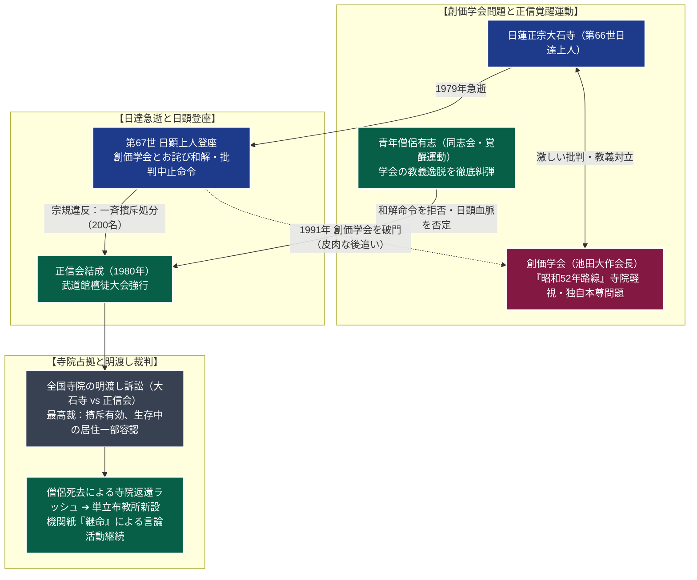

# 正信会 専門構造分析ノート

> [!summary] 要旨
> 正信会（しょうしんかい、正式名称：日蓮正宗正信会僧侶協議会）は、1970年代末から1980年にかけて、[[日蓮正宗]]宗務院による[[創価学会]]の教義逸脱に対する宥和政策を激しく糾弾し、宗門から擯斥（ひんせき＝僧籍剥奪・永久追放）処分を受けた青年僧侶約200名によって結成された日蓮系宗派集団である。
> 日蓮正宗古来の富士門流正統教理（下種本仏論・曼荼羅本尊）の清純を奉じる一方、第66世日達上人の急逝に伴い登座した第67世法主・阿部日顕の法主継承（唯授一人の血脈相承）を「詐称・無効」と主張した。処分後、全国百数十ヶ寺の末寺住職であった僧侶らが自坊に居座り、大石寺宗門との間で前代未聞の泥沼「寺院明渡し訴訟」を全国で展開。最高裁判決を経て僧侶の高齢化・逝去に伴い多くの寺院が大石寺へ返還されたが、現在も単立寺院・布教所を拠点に機関紙『継命』を発行し、大石寺および創価学会の双方を厳しく批判する活動を継続している。

---

## 1. 概要と基本情報 (公的史料・教理文献)

| 項目 | 内容 |
| :--- | :--- |
| **団体正式名称** | 正信会（日蓮正宗正信会僧侶協議会） |
| **創始・結成指導者** | 正信覚醒運動僧侶有志（久保川法教、丸岡文勝、山口法興ら青年僧侶約200名） |
| **結成年月・擯斥** | 1980年（昭和55年）7月結成 / 同年8月〜翌1981年宗門より一斉擯斥 |
| **本部事務局拠点** | 〒101-0054 東京都千代田区神田錦町1丁目14-13（株式会社継命社内） |
| **法的地位** | 正信会自体は任意団体 / 所属寺院は各自治体認可の単立宗教法人 |
| **信仰対象・本尊** | 戒壇の大御本尊、歴代法主書写の曼荼羅本尊（日顕上人書写本尊は否定） |
| **基本教理・立場** | 日蓮本仏論、日興門流富士正統、創価学会徹底批判、日顕法主血脈否定 |
| **機関情報発信** | 機関紙『継命』（月2回刊、株式会社継命社） |
| **勢力規模** | 僧侶数十名、全国寺院・布教所約100余ヶ所、檀信徒数万人 |

---

## 2. 日蓮正宗・創価学会問題からの分裂系統樹

創価学会の教義逸脱をめぐる「昭和52年路線」に端を発し、宗務院の宥和姿勢と法主継承問題を機に宗門史上最大の分派抗争へと発展した。



---

## 3. 指導層と組織構造

### 1. 青年僧侶による集団指導体制
正信会は単一の教祖を持たず、日蓮正宗の学僧・末寺住職であった青年僧侶たちの同志的連帯によって結成された。
- **中核指導者**:
  久保川法教（法運寺住職）、丸岡文勝（浄林寺住職）、山口法興（法蔵寺住職）、佐々木秀明ら、宗門内の名門寺院住職や宗学研鑽を積んだ若手エリート僧侶が多数を占めた。
- **正信会僧侶協議会**:
  処分を受けた僧侶らによる自治協議会組織。寺院の運営、教理の統一、対外裁判対策を指揮する。

### 2. 「血脈相承偽作論」という教理的爆弾
正信会を決定づけたのは、日顕上人の法主就任正統性を正面から否定した点である。
- **日達急逝の密室性**: 1979年7月22日、第66世日達上人が急逝した際、日顕側は「前年4月15日に内附（極秘の相承）を受けた」と発表。
- **正信会の主張**: 正信会は「そのような相承の事実は一切存在せず、日顕による血脈詐称・乗っ取りである」と断定。歴代法主の権威を至高とする富士門流において、「現法主の血脈否定」という自己矛盾を孕みつつ、日達上人以前の正統信仰へ立ち返ることを標榜した。

---

## 4. 歴史変遷クロノロジー

```
・1977年（昭和52年）: 創価学会による寺院軽視、池田大作本仏論、学会独自の本尊模刻等が表面化（昭和52年路線問題）
・1978年: 日蓮正宗の若手僧侶らが「同志会」を結成し、学会の教義逸脱を各地で激しく糾弾
・1979年7月: 第66世日達上人が静岡県富士宮市で急逝。阿部日顕が第67世法主を継承
・1979年11月: 創価学会本部幹部会で学会側が反省・謝罪。日顕上人は学会批判の全面停止を宗内に命じる
・1980年7月: 青年僧侶有志が宗務院の制止を無視し、日本武道館で「第5回全国檀徒大会」を強行開催（学会批判を激化）
・1980年8月〜1981年: 宗務院、命令に違反した僧侶約200名を順次「擯斥（ひんせき）」処分に処す
・1981年: 処分を受けた僧侶らが「正信会」を結成。全国の自坊にそのまま居座り、占有を継続
・1982年以降: 日蓮正宗宗務院、全国の擯斥僧侶に対し「寺院明渡し請求訴訟」を一斉提起
・1991年: 日蓮正宗が創価学会を破門（学会による日顕批判激化に伴う「宗創戦争」勃発）
・1990年代〜2000年代: 各地で最高裁判決。擯斥処分は有効とされ、僧侶逝去に伴い大石寺への寺院明渡しが確定
・2010年代以降: 擯斥僧侶の多くが他界。全国百数十ヶ寺の係争寺院の大半が大石寺に返還され、正信会は単立会館へ移転
```

---

## 5. 教理・信仰・主張の特色

### 1. 富士門流正統教理（日蓮本仏論）の堅持
教義の根幹は日蓮正宗と完全に同一である：
- **下種本仏論**: 釈迦牟尼仏を過去の仏（脱益）とし、末法の民衆を救う真の仏（下種本仏）は日蓮大聖人であると説く。
- **本尊観**: 日蓮大聖人が図顕された本門戒壇の大御本尊を信仰の根本とし、南無妙法蓮華経の題目を唱える。
- **創価学会批判**: 創価学会を「広宣流布の外護団体から逸脱し、池田大作を神格化して仏法を破壊した魔の集団」と痛烈に批判する。

### 2. 「法主絶対論」の否定と本尊下付のジレンマ
日蓮正宗の伝統において、「大石寺法主唯授一人の血脈」こそが御本尊の書写・下付の唯一の権能とされる。しかし、正信会は日顕法主を「偽法主」と断じたため、以下の深刻な宗学的ジレンマに直面した：
- **新しい御本尊の下付不能**: 新規の信徒が入信しても、正信会の僧侶自身が本尊を書写する権能を持たない（それを自ら行えば日蓮正宗の教義自体を崩壊させる）。
- **古曼荼羅の活用**: 苦肉の策として、第66世日達上人以前の歴代正統法主が遺した古曼荼羅を写真製版・授与するなどの特異な運用を行っている。

---

## 5-1. 寺院明渡し訴訟と教団の法的・現実的結末（徹底客観記録）

> [!important] 全国の末寺をめぐる前代未聞の民事訴訟抗争
> - **全国百数十ヶ寺に及ぶ「寺院明渡し訴訟」**:
>   擯斥された僧侶らは、「自分たちこそが正統な日蓮正宗の信仰を守っており、寺院財産は日顕偽宗務院のものではない」として、全国の寺院（本堂・庫裏・境内地）にそのまま居住し布教を継続した。これに対し大石寺宗務院は全国の地方裁判所に寺院明渡しを求めて提訴した。
> - **最高裁判所の司法判断（宗教自治と財産権）**:
>   裁判所は「教義の正邪や血脈相承の有無は信仰上の問題であり、司法審査の対象外」とした上で、**「宗教法人日蓮正宗の宗規に基づく擯斥処分は手続き上適法・有効であり、寺院不動産の所有権は日蓮正宗にある」**と判断した。
>   ただし、一部の訴訟においては「僧侶が長年住職として形成してきた居住権・生存配慮」から、僧侶生存中の強制立ち退きを猶予する和解・判決が下されるケースもあった。
> - **僧侶の高齢化と寺院返還ラッシュ**:
>   1980年代の結成から30〜40年が経過し、処分を受けた僧侶らの高齢化・他界が相次いだ。最高裁判決の確定および住職死去に伴い、全国の寺院は大石寺宗門へと次々に強制執行・明け渡し返還された。
>   立ち退きとなった僧侶の遺弟や残存信徒は、民家やビルの一室を買い取り「○○布教所」「新寺院」を設立して法統を維持している。

---

## 6. 拠点施設・地域分布

- **正信会事務局（株式会社継命社）**:
  - 所在地：〒101-0054 東京都千代田区神田錦町1丁目14-13 継命ビル
  - アクセス：都営新宿線「小川町駅」・東京メトロ丸ノ内線「淡路町駅」徒歩約5分
  - 役割：全国の正信会寺院・信徒を統括する情報センター。機関紙『継命』の編集・印刷・発送業務を行う。
- **地方の単立正信会寺院・興風布教所**:
  北海道から九州まで、返還を免れた一部の寺院や、新たに信徒有志の寄進で建立された独立寺院・会館（約100余ヶ所）が存在する。

---

## 7. 組織形態・機関出版

- **株式会社継命社**:
  正信会の事実上の言論機関。機関紙『継命（けいめい）』（月2回刊）を発行。日蓮正宗宗務院の動向、創価学会の裁判や内紛、富士門流の宗学論文を詳細に報道している。
- **興風談所（こうふうだんしょ）**:
  正信会系の有志学僧らによって設立された日蓮・富士門流の古文書・文献研究機関。大石寺所蔵の古記録や日蓮直筆遺文の校訂・翻刻など、学術的に極めて高度な研究成果を刊行している。

---

## 8. 史料・参考文献

1. 日蓮正宗正信会僧侶協議会編『正信覚醒運動の歩み』
2. 株式会社継命社『継命』縮刷版
3. 最高裁判所判決文（日蓮正宗寺院明渡し請求訴訟各判決集）
4. 金原明彦『日蓮正宗正信会問題の真実』
5. [[src_nichiren_shoshu_kokuchukai]]（Vault内史料記録）

---

## 9. 関連ノート (Vault内)

- [[_分派・異端研究ポータル]]
- [[日蓮正宗]]（母体宗派・大石寺）
- [[創価学会]]（正信会が命懸けで批判した対立教団）
- [[富士大石寺顕正会]]（学会批判を理由に1974年に日蓮正宗から破門された先行分派）
- [[国柱会]]（近代日蓮主義の系譜）

---

## 10. 検証・品質ゲートと留保事項

> [!warning] 留保事項
> - **教義論争の中立性**: 正信会側が主張する「日顕血脈偽作論」および日蓮正宗宗務院が主張する「日顕上人正統登座論」は、いずれも信教の領域に属する教義論争であり、本稿では両者の主張と裁判所の法的判断を客観的に併記している。
> - 本ノートの evidence_type は `"primary_source_based"`、confidence は `5`。

---

*※本稿は[[_分派・異端研究ポータル]]の個別教団分析ノートである。*
