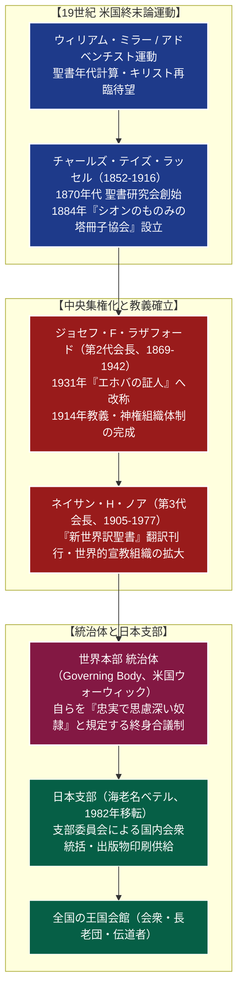

# エホバの証人 専門構造分析ノート

> [!summary] 要旨
> エホバの証人（英語：Jehovah's Witnesses、法人名：ものみの塔聖書冊子協会）は、1870年代に米国ペンシルベニア州で[[チャールズ・テイズ・ラッセル]]（1852-1916）らによって始められた聖書研究者運動を起源とするキリスト教系新宗教である。1931年に第2代会長ジョセフ・ラザフォードのもとで現在の名称を採用した。
> 伝統的キリスト教の「三位一体」教義を完全に否定し、神の固有の名「エホバ（ヤハウェ）」のみを全能の神と仰ぐ。1914年に天でキリストの王国が誕生して人類は「終わりの日」に入ったとし、間近に迫るハルマゲドン（世界最終戦争）を経て地上に楽園が建設されると説く。輸血の拒否、兵役や武道・格闘技の拒否、国旗敬礼・投票等の世俗的政治不関与、戸別訪問伝道、徹底した組織統制（排斥・断絶者への「忌避」）を教理的義務とし、国内外で輸血拒否訴訟や児童への鞭打ち体罰（宗教2世虐待問題）として激しい社会的論争の対象となっている。

---

## 1. 概要と基本情報 (公的データベース・教団公式資料)

| 項目 | 内容 |
| :--- | :--- |
| **教団正式名称** | 宗教法人 ものみの塔聖書冊子協会（通称：エホバの証人 / JW） |
| **創始者・第2代** | 創始者：[[チャールズ・テイズ・ラッセル]] / 第2代：ジョセフ・F・ラザフォード |
| **最高指導機関** | 統治体（Governing Body、米国ニューヨーク州ウォーウィックの世界本部に在勤） |
| **創立年・認証** | 1870年代（創始） / 1884年（法人認可） / 1953年（日本宗教法人認可） |
| **本部所在地** | 日本支部：〒243-0496 神奈川県海老名市中新田4丁目7-1（海老名ベテル） |
| **法人番号** | 1021005005872（国税庁法人番号公表サイト確認済み） |
| **教典・翻訳** | 『新世界訳聖書』（教団独自翻訳・ヘブライ語・ギリシャ語原典直訳を標榜） |
| **信仰対象・神観** | 唯一全能の神エホバ（ヤハウェ）。イエス・キリストは神の長子（被造物・大天使ミカエルと同一視） |
| **教団の特徴的実践** | 家々を巡る戸別訪問伝道、王国会館での週2回の集会、大会（地区大会） |
| **信徒規模** | 日本国内伝道者約21万人 / 全世界伝道者約870万人（約240の国と地域） |

---

## 2. 聖書研究者運動から世界的神権組織への発展系統樹

19世紀米国のアドベンチスト運動（再臨待望運動）を源流とし、ラッセルの出版運動からラザフォードによる中央集権的「神権組織」の確立を経て、世界的合議制「統治体」へと至った。



---

## 3. 指導体制と「統治体（Governing Body）」の神権統治

エホバの証人は、一人の教祖や法主による個人独裁ではなく、少数の幹部による絶対的合議制「統治体」によって世界全体が一元支配されている。

### 1. 統治体の権威構造
- **「忠実で思慮深い奴隷」**: マタイによる福音書24章45節に登場する記述を自らに適用し、地上のエホバの民に「時に応じて霊的食物を与える唯一の神の通信回路」と主張する。
- **絶対的服従**: 統治体の決定、出版物（『ものみの塔』）、および指示（手紙）は「神の御心」そのものとみなされ、これに疑問を呈したり反論することは「エホバへの反逆」と解釈される。

### 2. 歴史的指導者
- **初代：[[チャールズ・テイズ・ラッセル]]（1852-1916）**: ペンシルベニアの商人出身。ピラミッド年代学等を用いて1914年のキリスト再臨・世の終わりを計算した。
- **第2代：ジョセフ・F・ラザフォード（1869-1942）**: 弁護士出身。教団の組織化・中央集権化を断行。反対派を排除し「エホバの証人」と改称。戸別伝道を義務化。
- **第3代：ネイサン・H・ノア（1905-1977）**: 宣教者養成のためのギレアデ学校を創設し、独自翻訳『新世界訳聖書』を出版。
- **フレデリック・W・フランズ（第4代、1893-1992）**: 1975年に人類史6000年が終了しハルマゲドンが来るとする解釈を推進し、不発後に大きな動揺を招いた。
- **現代**: 1970年代以降、会長権限を縮小し、「統治体」による集団指導体制へ完全移行。現在は世界本部（ニューヨーク州ウォーウィック）に常駐する十数名の統治体成員によって運営される。

---

## 4. 歴史変遷クロノロジー

```
・1870年代: 米国ペンシルベニア州でC・T・ラッセルらが聖書研究グループを結成
・1884年: 「シオンのものみの塔冊子協会」として正式に法人化
・1911年: 日本に初めて聖書研究者が来日し、伝道活動を開始
・1914年: ラッセルが予言した年。教団は「天においてキリストの王国が誕生した」と再解釈
・1926年: 明石順三が米国より帰国し、日本支部「灯台社」を銀座に設立
・1931年: 第2代会長ラザフォードにより、正式名称を「エホバの証人」に改称
・1939年: 日本軍部により灯台社が治安維持法・不敬罪で弾圧。明石順三ら幹部が全員検挙・投獄
・1949年: 戦後、米国からギレアデ卒の宣教師が来日し、日本での布教活動が再開
・1953年: 宗教法人「ものみの塔聖書冊子協会」の認証を受ける
・1972年: 指導体制を一人の会長制から「統治体」合議制へと改組
・1975年: 1975年秋ハルマゲドン説が不発。世界中で多数の失望者・脱会者が発生
・1982年: 日本支部を東京都港区三田から神奈川県海老名市（海老名ベテル）へ移転
・1985年: 川崎市で小6男児が交通事故に遭い、両親が輸血を拒否して死亡（大ちゃん事件）
・2000年: 最高裁判所、信者に対する無断輸血訴訟で「輸血拒否の自己決定権は人格権」と認める判決
・2022年: 安倍元首相銃撃事件を契機に、宗教2世問題（鞭打ち体罰、学歴制限、忌避）が社会問題化
・2023年: 厚生労働省が「宗教の信仰等に関係する児童虐待等への対応に関するQ&A」を策定・公表
```

---

## 5. 教理・信仰・生活規律の特色

### 1. 伝統的キリスト教神学との決定的対立
- **三位一体の否定**: 父（エホバ）、子（イエス）、聖霊が同位一体であるとする教会教義を「異教起源の偽り」と断じる。エホバのみが唯一全能の神であり、イエスは神によって最初に創造された「子（被造物）」、聖霊は人格を持たない「神の活動する力」と解釈する。
- **苦しみの杭（十字架の否定）**: イエスは二本の木が交差した十字架ではなく、一本の「杭（ステュロス）」に掛けられて処刑されたとし、十字架を偶像崇拝として一切用いない。
- **霊魂不滅・地獄の否定**: 人間が死ぬと魂も消滅し、完全に「無・眠り」の状態になると説く。悪人が永遠に火で焼かれる「地獄」の存在を否定し、神の愛に反すると主張する。

### 2. 終末論と地上楽園
- **1914年説**: 聖書の年代記（ダニエル書等の「七つの時」＝2520年計算）に基づき、紀元前607年のエルサレム陥落から2520年後の「1914年」にキリストが天で王座に就き、サタンが地に投げ落とされ「終わりの日」が始まったと主張する。
- **14万4千人と大群衆**: 黙示録に基づき、天に行きキリストと共に支配する者は歴史上「14万4千人（油注がれた者）」に限られ、その他の一般信徒（大群衆）は、ハルマゲドンで地上の悪人が滅亡した後に浄化された「地上の楽園」で永遠の命を享受すると信じる。

### 3. 「世からの分離」と厳格な禁忌事項
信徒は現在の人間社会全体が「サタンの支配下にある」とみなすため、世俗との同化を厳しく戒める。
- **政治的中立**: 投票、公職就任、選挙活動、国旗への敬礼、国歌斉唱を一切行わない。
- **兵役・武道の拒否**: 武器を取ること、他者と争うことを禁じるため、兵役を拒否（良心的兵役拒否）。学校教育現場でも柔道、剣道などの武道実技の受講を拒否する。
- **世俗の祝祭の禁止**: 誕生日、クリスマス、正月、ハロウィン、バレンタインデー等は「異教の偶像崇拝起源」として一切祝わない。
- **高等教育の制限**: かつてより大学進学を「世のサタンの精神を植え付け、宣教の時間を奪う危険な道」として忌避する傾向が強い。

---

## 5-1. 事件・法的問題・社会問題（徹底客観記録）

> [!danger] 輸血拒否、児童虐待（鞭）、家族分断（忌避）をめぐる重大な法的論争
> - **輸血拒否問題と最高裁判決（2000年）**:
>   使徒言行録15章29節「血を避けること」などの字義通り解釈に基づき、信徒は全血輸血および主要4分画（赤血球・白血球・血小板・血漿）の輸血を固く拒否する。
>   1992年に肝臓腫瘍の摘出手術を受けた女性信者に対し、医師側が「輸血拒否方針を了解した」と見せかけつつ実際には手術中に輸血を行った事件について、最高裁判所第二小法廷（2000年2月29日）は、**「患者が宗教上の信念から輸血を受けることはできないという明確な意思を有している場合、その意思決定権は人格権の一内容として尊重されなければならず、医師が説明を怠って輸血したことは人格権侵害にあたる」**と判示し、病院側の不法行為責任（損害賠償義務）を認めた。
>   一方で、未成年者の医療においては、親の輸血拒否が児童の生命を脅かす場合、病院が児童相談所へ通告し「親権停止措置（児童福祉法第33条の7）」を得て輸血を実施する医療ガイドライン（宗教的輸血拒否に関する合同委員会合意）が確立されている。
> - **児童への鞭（むち）体罰と「宗教2世」問題**:
>   箴言23章13節「懲らしめを控えてはならない。杖で打っても、彼は死なない」などの聖書解釈と教団公式出版物の指導に基づき、教団内では長年にわたり、乳幼児期からの家庭や集会中での「鞭打ち（ベルト、ビニールホース、プラスチックものさし等による臀部への打擲）」が日常的なしつけとして強制・推奨されてきた。
>   2022年の安倍元首相銃撃事件以降、多数の元信者（宗教2世）が深刻な身体的・精神的トラウマを告発。厚生労働省は2022年12月、**「教義を理由として児童を鞭で打つことや、地獄・滅びを予告して恐怖心を植え付けることは、児童虐待防止法上の身体的虐待・心理的虐待に該当する」**とする公的指針（Q&A）を全国の自治体・児童相談所に通達した。
> - **「忌避（排斥・断絶）」による家族の分断**:
>   教義に疑問を呈したり、教団の道徳規約に違反して悔い改めないとみなされた信者は「排斥」され、自ら信仰を放棄した者は「断絶」となる。信徒は排斥・断絶された者に対し、挨拶を交わすことや会話をすることすら禁じられる（忌避制度）。これにより、親と子、兄弟姉妹が完全に断絶され、孤立した脱会者が精神的危機に追い込まれる事態が頻発し、国際的にも人権侵害としての批判が高まっている。

---

## 6. 本部境内・拠点アクセス

- **日本支部（海老名ベテル）**:
  - 所在地：〒243-0496 神奈川県海老名市中新田4丁目7-1
  - アクセス：小田急小田原線・相鉄本線・JR相模線「海老名駅」西口より徒歩約20分、またはタクシー約5分 / 圏央道「海老名IC」より約5分
  - 施設実態：広大な敷地に居住棟、事務棟、東洋最大級の最新オフセット輪転機を備えた巨大印刷工場を完備。独身の専任奉仕者（ベテル家族）数百名が共同生活を営み、日本およびアジア太平洋地域向けの出版物印刷・発送、翻訳業務を行っている。
- **世界本部（Warwick Headquarters）**:
  - 所在地：米国ニューヨーク州オレンジ郡ウォーウィック（2016年ブルックリンより移転）
  - 統治体が常駐し、全世界の教義方針・出版事業・法務・財務を一元統率する。
- **王国会館（Kingdom Hall）**:
  - 全国の市区町村に数千箇所存在する信徒の集会施設。信徒有志の無償労働（急速建設）によって統一規格で建設され、内部に祭壇・十字架・絵画等は一切なく、演壇と座席のみの機能的構造を持つ。

---

## 7. 組織形態・出版メディア

- **宗教法人 ものみの塔聖書冊子協会（Watch Tower Bible and Tract Society）**:
  教団の法的・財務的実体。出版物の印刷・発行、不動産の保有を担う。
- **公式出版・デジタルメディア**:
  - 『新世界訳聖書』：100以上の言語に翻訳され、無償配布。
  - 雑誌『ものみの塔』『目ざめよ！』：世界で最も印刷部数の多い定期刊行物（月刊数千万部）。
  - 公式サイト「JW.ORG」：1,000以上の言語に対応する世界最多言語Webサイト。

---

## 8. 史料・参考文献

1. ものみの塔聖書冊子協会『神の王国を告げしらせる エホバの証人』（教団公認史）
2. レイモンド・フランズ『良心の危機―「エホバの証人」統治体元成員の証言』（せせらぎ出版）
3. 最高裁判所第二小法廷判決 平成12年2月29日（民集54巻2号582頁・輸血拒否訴訟判決）
4. 厚生労働省「宗教の信仰等に関係する児童虐待等への対応に関するQ&A」（2022年12月公表）
5. エホバの証人問題対策弁護団 公開資料および実態調査報告書（2023年）

---

## 9. 関連ノート (Vault内)

- [[_分派・異端研究ポータル]]
- [[末日聖徒イエス・キリスト教会]]（米国発祥のキリスト教系新宗教・比較対照）
- [[セブンスデー・アドベンチスト教会]]（共通のアドベンチスト源流を持つ宗派）
- [[世界平和統一家庭連合]]（宗教2世被害・解散議論の比較対照）

---

## 10. 検証・品質ゲートと留保事項

> [!warning] 留保事項
> - **輸血拒否・児童虐待問題の客観性**: 本稿の記述は最高裁判所の確定判決文、厚生労働省の公式通達、および弁護団の公開資料に基づき、法的・社会的事実のみを客観的に記録している。
> - **信徒数統計**: 「伝道者数（毎月野外宣教報告を提出した実働信徒数）」を基準としており、一般的な宗教団体の自己申告型公称信徒数よりも実勢に近い数値である。
> - 本ノートの evidence_type は `"official_database"`、confidence は `5`。

---

*※本稿は[[_分派・異端研究ポータル]]の個別教団分析ノートである。*
