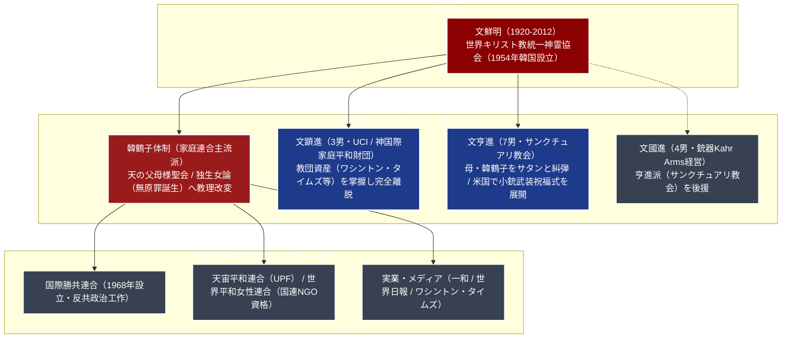

# 世界平和統一家庭連合 専門構造分析ノート

> [!summary] 要旨
> 世界平和統一家庭連合（旧称：世界キリスト教統一神霊協会、略称：統一教会・統一協会）は、1954年に大韓民国で文鮮明（1920-2012）によって創立されたキリスト教系異端新宗教。1959年に日本へ伝道が開始され、1964年に宗教法人認証を受けた。文鮮明と妻の韓鶴子を「真の父母（再臨主）」と仰ぎ、独自の聖典『原理講論』に基づく血統転換教義（合同結婚式）を中核とする。
> 1980年代より先祖の因縁を煽る「霊感商法」や法外な高額献金で深刻な社会問題・民事訴訟敗訴を頻発させた。2012年の文鮮明死後は後継争いから実子らの分派離脱（サンクチュアリ教会等）が相次ぎ教団が分裂。2022年の安倍晋三元首相銃撃事件を契機に、政界（特に自民党）との長年にわたる癒着構造や多額の資金流出が白日の下に晒され、2023年10月に文部科学省が宗教法人法第81条に基づき東京地方裁判所へ「宗教法人解散命令」を請求し、解散審理が継続している。

---

## 1. 概要と基本情報 (文化庁・RIRC学術データ)

| 項目 | 内容 |
| :--- | :--- |
| **教団正式名称** | 宗教法人 世界平和統一家庭連合（旧：世界キリスト教統一神霊協会） |
| **通称・旧称** | 統一教会、統一協会、家庭連合、天の父母様聖会 |
| **創始者・現指導者** | 創始者：文鮮明（2012年死去） / 現総裁：韓鶴子（真の母・独生女） |
| **創立・改称** | 1954年（韓国創立） / 1964年（日本法人登記） / 2015年（現名称認証） |
| **本部所在地** | 〒150-0046 東京都渋谷区松濤1丁目1-2（日本本部） / 韓国本部：京畿道加平郡（天正宮） |
| **法人格・分類** | 包括宗教法人（解散命令請求係属中） / 韓国系キリスト教異端 |
| **法人番号** | 6011005000441（国税庁法人番号公表サイト確認済み） |
| **教義体系・聖典** | 『原理講論』, 『天聖経』, 『真の父母経』, 『平和経』 |
| **主要儀礼・実践** | 合同結婚式（祝福結婚）、聖酒式、三日行事、万物復帰、総生畜献納 |
| **主要関連団体** | 国際勝共連合、UPF（天宙平和連合）、世界平和女性連合、世界日報、一和 |

---

## 2. 分派系統樹と「真の家庭」の分裂構造

文鮮明の生前より後継候補と目された実子（子女）らと、文鮮明死去後に全権を掌握した母・韓鶴子との間で激しい教理改変・財産権を巡る対立が勃発し、複数の分派に分裂している。



---

## 3. 歴代指導者と「真の家庭（真の父母）」の権力構造

教団では文鮮明と韓鶴子夫妻を「真の父母」と呼び、その家庭（子女）を「真の家庭」として無原罪の神聖な血統と位置づけてきたが、実態は深刻な家庭崩壊と骨肉の後継闘争を呈した。

### 1. 主要指導者
- **文鮮明（ムン・ソンミョン、1920-2012）**:
  教祖・再臨主。16歳のイースターの朝にイエス・キリストが現れ「神の救済摂理の未完の使命を託された」と主張。血統復帰論・反共思想を武器に世界的な巨大宗教複合体を築いた。
- **韓鶴子（ハン・ハクチャ、1943- ）**:
  現総裁。1960年に17歳で40歳の文鮮明と結婚（小羊の婚姻）。文鮮明死後は「自分は生まれながらにして無原罪の独生女（トクセンニョ）であり、文鮮明は原罪を持って生まれたが自分が救った」とする大幅な教理改変を行い、子女らを追放して独裁権力を確立。

### 2. 子女（真の子女）の離脱と分派
- **文孝進（長男、1962-2008）**:
  かつての後継候補。薬物・アルコール依存症や家庭内暴力（DV）が元妻・洪蘭淑（ホン・ナンスク）の告発手記『わが父 文鮮明の正体』で暴露され失脚。2008年に心臓麻痺で急逝。
- **文顕進（3男、1969- ）**:
  UCI（統一教会国際財団）会長。コロンビア大学・ハーバード・ビジネス・スクール卒。文鮮明の意向に反して教団資産（ワシントン・タイムズ、汝矣島開発利権等）を自己の管理下に置き離脱。「神国際家庭平和財団（FPA）」を設立し、家庭連合との間で巨額の泥沼民事訴訟を展開。
- **文亨進（7男、1979- ）**:
  2008年に文鮮明より公式後継者（世界会長）に指名されたが、文鮮明死去後に母・韓鶴子と対立して解任・追放。米国ペンシルベニア州で「世界平和統一聖殿（サンクチュアリ教会）」を旗揚げ。母・韓鶴子を「堕落したエバ」「サタンの淫婦」と痛烈に批判し、AR-15自動小銃を帯びて祝福式を行う過激な終末論を展開。

---

## 4. 歴史変遷クロノロジー

```
・1954年: 韓国ソウルで文鮮明が「世界キリスト教統一神霊協会」を創立
・1958年: 西川勝（崔奉春）が日本へ密入国、布教を開始
・1964年: 東京都より「宗教法人 世界キリスト教統一神霊協会」の認証を受ける
・1968年: 笹川良一、岸信介らの協力を得て反共政治団体「国際勝共連合」を設立
・1975年: 韓国・汝矣島で「救国世界大会」開催、日本から巨額の資金・信徒を動員
・1980年代: 日本国内で壺・印鑑・多宝塔などを売りつける「霊感商法」が社会問題化
・1987年: 全国霊感商法対策弁護士連絡会（被害弁護団）が結成される
・1992年: ソウルで3万組合同結婚式。有名芸能人（桜田淳子、山崎浩子）の参加で大騒動
・1997年: 教団名変更を文部省に申請するも、実態変更なしとして受理されず
・2012年: 教祖・文鮮明が92歳で死去。韓鶴子への権力集中と子女らの離脱
・2015年: 文化庁（下村博文文科相）により「世界平和統一家庭連合」への改称が認可
・2022年7月: 安倍晋三元首相銃撃事件発生。教団の高額献金被害と政界工作が世界的話題に
・2022年12月: 国会で「法人等による寄附の不当な勧誘の防止等に関する法律」（被害者救済法）成立
・2023年10月: 文部科学省が宗教法人法第81条に基づき、東京地方裁判所に「解散命令」を請求
・2024年3月: 東京地裁、宗教法人法に基づく質問権行使への回答拒否に対し過料決定（最高裁で確定）
```

---

## 5. 教理・儀礼の特色

### 1. 『原理講論』の二元論的救済観
正典『原理講論』は「創造原理」「堕落論」「復帰原理」の3部から成る。
- **創造原理**: 神は「性相（内面・男性性）」と「形状（外面・女性性）」の二性性相の中和的実体であり、神・夫・妻・子が四位基台を完成させることが創造目的であったと説く。
- **堕落論（性的堕落説）**: 人類の始祖エバが蛇（天使長ルーシェル）と不倫の性的関係を結んだこと（霊的堕落）、およびエバが未熟なアダムと関係を結んだこと（肉的堕落）により、人類はサタンの血統を受け継ぐ存在へと転落したと解釈する。
- **復帰原理（蕩減復帰）**: 失われた本来の立場を回復するためには、それに見合う代償や苦難を払わなければならない（蕩減＝イン）。これにより、先祖の罪を清算するための過重な献金や無償労働（万物復帰・伝道活動）が信徒に義務づけられる論理的根拠となっている。

### 2. 血統転換と合同結婚式（国際合同祝福結婚式）
キリスト教のイエスは霊的救済しか達成できず十字架で殺害されたとし、文鮮明夫妻が「再臨主」「真の父母」として肉的・霊的な完全救済を果たすと説く。
- **聖酒式**: 文鮮明・韓鶴子の聖別された血統を受け継ぐとされる特殊なワイン（聖酒）を飲み、サタンの血統から神の血統へと転換する儀式。
- **祝福結婚**: 文鮮明（現在は韓鶴子）が写真等で指名した見知らぬ教徒同士（日韓、日米等の国際結婚多数）が合同で結婚式を挙げる。
- **三日行事**: 結婚後、初夜から3日間にわたり教団の厳格な規定（体位や順序が細かく定められた性告儀式）に従って夫婦生活を行い、原罪なき子どもを産むための聖別儀礼。

### 3. 日本＝「エバ国家（罪深い侵略国）」論と資金収奪
教団の摂理観において、韓国は「アダム国家（父・主人の国）」であり、日本は韓国を植民地支配した「エバ国家（母・サタン側についた罪深い国）」と位置づけられる。
エバ国家である日本は、アダム国家である韓国に財物を捧げて尽くすこと（蕩減）が至上命題とされ、教団の世界全体の資金の7〜8割以上が日本信徒からの霊感商法・献金によって賄われていた構造的要因となっている。

---

## 5-1. 事件・不祥事・法的規制（解散命令請求）

> [!danger] 霊感商法・政界工作・安倍元首相銃撃事件と宗教法人解散命令
> - **霊感商法と最高裁における使用者責任認定**:
>   1980年代より、信徒が身分を隠して姓名判断やアンケートで接近し、「先祖が地獄で苦しんでいる」「このままでは家族に不幸が起きる」と恐怖心を植え付け、朝鮮人参濃縮液、印鑑、大理石壺、多宝塔等を数百万〜数千万円で売りつけた。被害弁護団に寄せられた相談被害額は1,200億円超（推計数千億円）。民事裁判で教団の使用者責任を認める判決が多数確定した。
> - **2022年7月 安倍晋三元首相銃撃事件**:
>   奈良市で演説中の安倍晋三元首相が山上徹也容疑者に手製銃で射殺された。山上容疑者は母親が統一教会に1億円を超える献金を行って破産し家庭が崩壊、教団を日本に引き入れ親密な関係を続けていた安倍元首相を標的としたと供述。事件を機に、自民党議員をはじめとする多数の国会議員・地方議員との「政策協定（推薦確認書）」「選挙ボランティア派遣」「イベント出席」などの深刻な癒着が次々と判明した。
> - **文部科学省による「解散命令請求」（2023年10月）**:
>   文部科学省は宗教法人法第78条の2に基づく「質問権」を7回行使した後、同法第81条1項1号（法令に違反して、著しく公共の福祉を害すると明らかに認められる行為）に該当するとして、東京地裁へ宗教法人解散命令を請求。オウム真理教、明覚寺に続く史上3例目の請求事案であり、**民法上の不法行為責任（民事判決の積み重ね）を根拠とする初めての解散請求**として司法判断が注目されている。

---

## 6. 本部境内・聖地・拠点アクセス

- **日本本部（松濤本部）**:
  - 所在地：〒150-0046 東京都渋谷区松濤1丁目1-2
  - アクセス：JR・私鉄各線「渋谷駅」ハチ公口より徒歩約15分、京王井の頭線「神泉駅」より徒歩約7分
  - 高級住宅街・松濤の一角に所在し、日本の活動統括・礼拝施設として機能。
- **世界本部・韓国聖地（清平聖地）**:
  - 所在地：大韓民国京畿道加平郡雪岳面宋山里
  - 中核施設：「天正宮博物館」（大統領府を模した宮殿建築、文鮮明の墓所）、天宙清平修錬苑、HJ天宙天寶修錬苑。世界中から信徒が集まり、先祖解怨式や霊的除霊修練が行われる。

---

## 7. 関連組織・外郭企業・メディア・学校網

教団は宗教本体のほか、政治、メディア、学術、実業に至る強大なコングロマリット（統一グループ）を形成している。

### 1. 政治・イデオロギー組織
- **国際勝共連合（IFVOC）**: 1968年創設の反共右翼政治団体。日米韓で保守政客と結託。
- **天宙平和連合（UPF）**: 国連NGO資格（総合協議資格）を利用し、元国家首脳らを招聘する国際平和組織。
- **世界平和女性連合（WFWP）**: 韓鶴子が主宰する女性運動団体。
- **世界平和青年学生連合（YSP）** / **原理研究会（CARP）**: 大学キャンパス等での偽装勧誘窓口。

### 2. メディア・出版企業
- **株式会社世界日報社**: 日本の日刊保守紙『世界日報』、月刊誌『ビューポイント』発行。
- **ワシントン・タイムズ（The Washington Times）**: 米国首都の保守系日刊紙（UCI系との係争あり）。
- **セゲイルボ（世界日報・韓国）**: 韓国の日刊全国紙。
- **株式会社光言社**: 教団書籍・機関紙『世界家庭』発行元。

### 3. 商業・産業複合体（統一財閥・関連企業）
- **株式会社一和（ILHWA）**: 韓国の大手健康食品・製薬メーカー。高麗人参製品や炭酸飲料「メッコール（McCOL）」の製造販売。
- **株式会社ハッピーワールド**: かつて霊感商法の輸入総代理店を務めた日本の教団直系中核商社。
- **株式会社世一観光**: 信徒の韓国清平聖地参拝ツアーや合同結婚式渡航を専門に扱う旅行代理店。
- **龍平リゾート（ヨンピョン・リゾート）**: 韓国江原道の巨大スキーリゾート（平昌五輪会場）。

### 4. 教育・医療機関
- **鮮文大学校（韓国・牙山市）**: 教団系私立総合大学。
- **清心国際中・高等学校（韓国）**: 全寮制進学校。
- **HJマグノリア国際病院（旧・清心国際病院）**: 清平聖地に併設された総合病院。

---

## 8. 史料・参考文献

1. 全国霊感商法対策弁護士連絡会 編『統一教会 広がる被害 その実態と対策』（緑風出版）
2. 山口広・滝本太郎・紀藤正樹『Q&A 宗教トラブル110番』（民事法研究会）
3. 櫻井義秀・中西尋子『統一教会―日本宣教の戦略と実態』（北海道大学出版会）
4. 洪蘭淑（ホン・ナンスク）『わが父 文鮮明の正体』（文藝春秋）
5. 文化庁 宗教法人解散命令請求に関する公表資料（2023年10月）
6. 宗教法人審議会 質問権行使記録および東京地裁過料決定理由書（2024年）

---

## 9. 関連ノート (Vault内)

- [[_分派・異端研究ポータル]]
- [[摂理（キリスト教福音宣教会・JMS）]]（統一教会から派生した韓国系異端）
- 全能神教会（東アジア系終末論的異端カルトの比較）
- [[オウム真理教]]（破壊的カルトおよび解散命令請求の先例）
- [[創価学会]]（政教関係および巨大在家信徒組織の比較対照）

---

## 10. 検証・品質ゲートと留保事項

> [!warning] 留保事項
> - **解散命令審理の司法状況**: 本稿記載の解散命令請求は文部科学省による東京地方裁判所への請求段階であり、確定判決（決定）ではない。教団側は審理において全面的に争う姿勢を示している。
> - **信徒数・実勢の峻別**: 公称信徒数約60万人は過去の累積入会者や名簿上のものであり、現役の実効信徒数は数万人規模と推定される。
> - 本ノートの evidence_type は `"academic_database"`、confidence は `5`。

---

*※本稿は[[_分派・異端研究ポータル]]の個別教団分析ノートである。*
