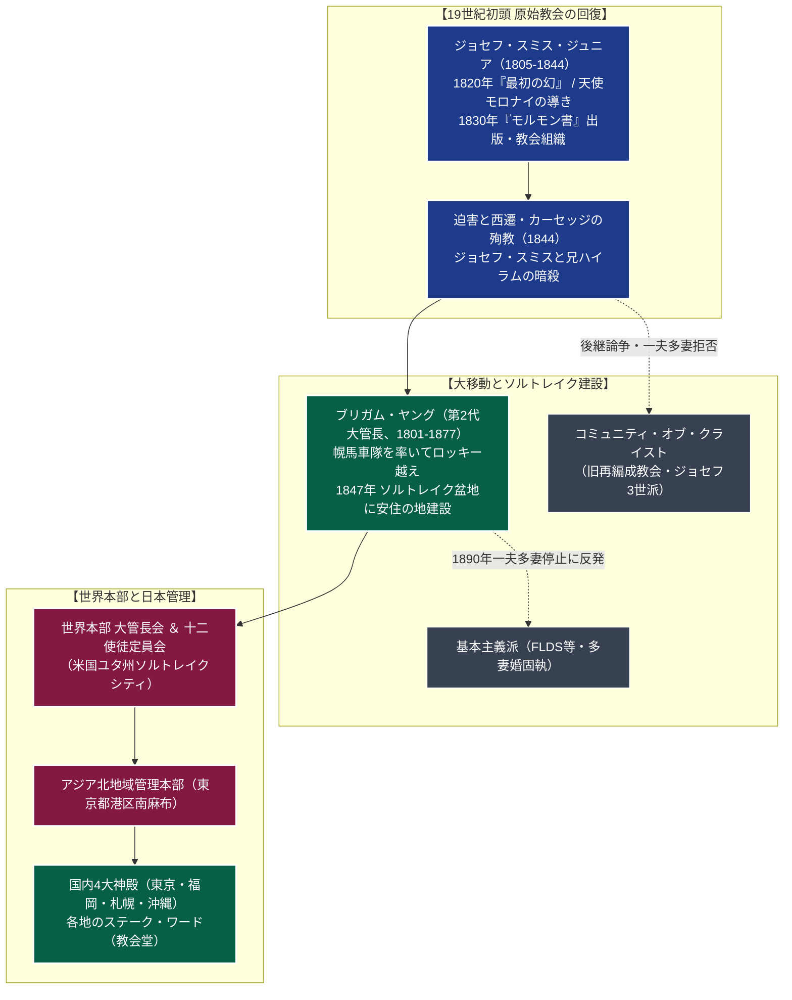

# 末日聖徒イエス・キリスト教会 専門構造分析ノート

> [!summary] 要旨
> 末日聖徒イエス・キリスト教会（英語：The Church of Jesus Christ of Latter-day Saints、通称：モルモン教 / LDS）は、1830年に米国ニューヨーク州でジョセフ・スミス・ジュニア（1805-1844）によって創始されたキリスト教系新宗教である。初代教会の使徒たちの死後、地上から真の教会権能（神権）が失われた（大背教）とし、神とキリストの啓示によってイエスの真の教会が地上に「回復」されたと主張する。
> 旧約・新約聖書に加え、古代アメリカ大陸の預言者の記録とされる『モルモン書』など4大聖典を奉じる。信徒は「知恵の言葉」と呼ばれる飲食規約（酒、タバコ、茶、コーヒーの全面禁止）を遵守し、若年信徒による自費での専任宣教活動（2年間の伝道奉仕）、神殿における死者のための身代わり儀式や家族の永遠の結び固め（シーリング）を中核的教義とする。米国ユタ州ソルトレイクシティに世界本部を置き、全世界に約1,700万人の信徒を有する世界規模の教団である。

---

## 1. 概要と基本情報 (公的データベース・教団公式資料)

| 項目 | 内容 |
| :--- | :--- |
| **教団正式名称** | 宗教法人 末日聖徒イエス・キリスト教会（通称：モルモン教 / LDS） |
| **創始者（初代大管長）** | ジョセフ・スミス・ジュニア（1805-1844、預言者） |
| **現大管長（第17代）** | ラッセル・M・ネルソン（1924-、元心臓外科医） |
| **世界本部所在地** | 米国ユタ州ソルトレイクシティ（テンプルスクエア） |
| **日本管理本部** | 〒106-0047 東京都港区南麻布5丁目8-10（アジア北地域管理本部・東京神殿至近） |
| **法人番号** | 8010405001340（国税庁法人番号公表サイト確認済み） |
| **教典（4大聖典）** | 『聖書』, 『モルモン書』, 『教義と聖約』, 『高価な真珠』 |
| **信仰対象・神観** | 父なる神、御子イエス・キリスト、聖霊（三位一体を否定し、別個の実体とする） |
| **生活規律** | 知恵の言葉（酒・茶・珈琲・煙草禁止）、純潔の律法、什一献金（収入の10%） |
| **信徒規模** | 日本国内約13万人 / 全世界約1,725万人（世界160以上の国と地域） |

---

## 2. 回復思想と世界展開・組織系統樹

初代教会から大背教を経て、ジョセフ・スミスによる「神権の回復」、ソルトレイクへの大移住、世界的な伝道網と神殿ネットワークの構築に至る。



---

## 3. 指導者体制と「神権（Priesthood）」組織

末日聖徒イエス・キリスト教会は、「大管長（預言者）」を頂点とする厳格なヒエラルキーと、信徒男性全員に開放された「神権制」によって支えられている。

### 1. 最高指導機関
- **大管長会（First Presidency）**:
  教会の最高権威。大管長1名（「地上における神の唯一の預言者・啓示者」）と、2名の顧問によって構成される。大管長が死去した場合、十二使徒定員会の中で最も在任期間の長い使徒（定員会会長）が次代大管長に昇格・就任する絶対的年功序列継承制を採る。
- **十二使徒定員会（Quorum of the Twelve Apostles）**:
  世界各地での宣教と教会運営を指導する終身制の使徒団。
- **七十人定員会（Quorums of the Seventy）**:
  世界各地域を管理・統括する役員団。

### 2. 男性信徒と「神権」階梯
職業聖職者（給与を得る牧師・神父）を置かず、一般信徒の無給奉仕によって地域教会が運営される。適格な男性信徒は年齢に応じて以下の神権を授与される：
- **アロン神権（小神権）**: 11歳以上の少年から授与。バプテスマの執行、聖餐（パンと水）の準備・配給、教会の物質的援助を行う。
- **メルキゼデク神権（大神権）**: 18歳以上の成人男性に授与。病人の祝福、聖霊の賜物の授与、神殿儀式の執行、指導者（ビショップ・ステーク会長）への就任資格を持つ。

---

## 4. 歴史変遷クロノロジー

```
・1820年: 米国ニューヨーク州パルマイラで、14歳のジョセフ・スミスが森の祈りの中で神とイエスを見る（「最初の幻」）
・1827年: 天使モロナイの指示により、クモラの丘から金版（Golden Plates）を発掘し翻訳を開始
・1830年: 『モルモン書』を出版。ニューヨーク州フェイエットで信徒6名により教会を設立
・1830-40年代: 激しい宗教的迫害を受け、オハイオ州、ミズーリ州、イリノイ州ノーブーへと移転
・1844年: イリノイ州カーセッジ刑務所にて、暴徒の襲撃を受けジョセフ・スミスと兄ハイラムが射殺される（殉教）
・1847年: ブリガム・ヤング率いる先駆者団がロッキー山脈を越え、ソルトレイク盆地に到達（「ここが目的地である」）
・1890年: 連邦政府の強い圧力と啓示を受け、第4代ウッドラフ大管長が「公式宣言第1号」で一夫多妻制の停止を宣言
・1896年: ユタが米国第45番目の州として連邦に昇格
・1901年: 日本伝道開始。十二使徒ヘバー・J・グラント率いる宣教師団が横浜に上陸
・1924年: 米国の排日移民法制定などによる世論悪化を受け、日本伝道を一時休止
・1948年: 第二次世界大戦後、GHQ統治下の日本で宣教活動が公式に再開
・1953年: 宗教法人「末日聖徒イエス・キリスト教会」の認証を受ける
・1978年: スペンサー・W・キンボール大管長、「公式宣言第2号」により人種を問わず全男性への神権授与（黒人神権解禁）を発表
・1980年: 東京都港区南麻布に、アジア初となる「東京神殿」を奉献
・2000年: 福岡神殿を奉献 / 2016年: 札幌神殿を奉献 / 2023年: 沖縄神殿を奉献
```

---

## 5. 教理・儀礼・生活規律の特色

### 1. 4大標準聖典
伝統的キリスト教が聖書のみを唯一正典とするのに対し、以下の4つを等しく神の言葉（標準聖典）とする：
- **『聖書』**: 旧約聖書および新約聖書（誤訳のない限り神の言葉とみなす）。
- **『モルモン書』**: 紀元前600年頃にエルサレムを脱出し古代アメリカ大陸に渡った預言者一族（ニーファイ人、レーマン人）の記録。復活後のイエス・キリストがアメリカ大陸に出現して教えを説いたとされる。
- **『教義と聖約』**: 近代の預言者（ジョセフ・スミス以降）に与えられた現代の啓示集。
- **『高価な真珠』**: モーセ書、アブラハム書、マタイによる福音書補訂、ジョセフ・スミスの歴史など。

### 2. 特異な神観と「永遠の進歩」
- **三位一体の否定**: 父なる神（肉体を持つ実体）、御子イエス・キリスト（肉体を持つ実体）、聖霊（肉体を持たない霊の実体）は、目的において一致しているが、完全に別個の3つの存在であると説く。
- **神格化（Deification）**: 人間は前世において神の霊の子供として存在し、地上での現世試験を経て、死後復活し、神の戒めを守り抜けば「神のような存在（共同の相続人）」へと永遠に進歩できると教える（「現在の人はかつての神であり、現在の神は未来の人である」）。

### 3. 「知恵の言葉（Word of Wisdom）」による厳格な健康法規
1833年の啓示に基づく健康律法。信徒は以下の摂取を厳格に禁止されている：
- **アルコール飲料全般**（酒、ビール、ワイン）
- **タバコ・喫煙全般**
- **熱い飲み物（Hot Drinks）**: チャノキ（Camellia sinensis）から作られるすべての茶（緑茶、紅茶、ウーロン茶、ほうじ茶等）および**コーヒー**。
- **違法薬物・有害物質**（※麦茶、ハーブティー、果汁、牛乳、およびカフェイン含有炭酸飲料は近年容認）。

### 4. 神殿（テンプル）と「ガーメント」
日曜日に礼拝や集会を行う一般的な「教会堂（礼拝堂/ワード）」は誰でも自由に立ち入れるが、「神殿（Temple）」は厳格に区別される。
- **神殿推薦状（Temple Recommend）**: 神殿に入館するためには、ビショップおよびステーク会長との個別面接を受け、什一献金の完納、知恵の言葉の遵守、純潔の律法、教会指導者への支持が認定された推薦状（有効期間2年）が必須となる。
- **神殿儀式**: 洗礼を受けていない先祖のために行う「死者のための身代わりバプテスマ」、永遠の知識を授かる「エンダウメント」、夫婦と子供の絆が永遠に続くよう結ぶ「結び固め（シーリング）」が執行される。
- **聖なる下着「ガーメント」**: 神殿儀式を受けた信徒は、皮膚の上に直接、白い専用の下着（ガーメント）を昼夜着用し、神との神聖な契約の象徴として世俗の誘惑から身を守る盾とする。

### 5. 若者の専任宣教活動（ミッション）
教会の最も目立つ特徴。適格な青年男子は18歳から2年間、女子は19歳から18ヶ月間、**すべての費用を自己負担（自費または家族・会衆の援助）**して世界各地へ派遣される。
黒いスーツにネームタグ（「エルダー（長老）○○」「シスター○○」）を着用し、二人一組で自転車や徒歩により、街頭伝道、戸別訪問、無償の英会話教室などを提供しながら布教に従事する。

---

## 5-1. 歴史的論争と社会的問題（徹底客観記録）

> [!warning] 多妻結婚の歴史、モルモン書の歴史性、巨額資産運用
> - **一夫多妻制（複婚）の歴史と分派問題**:
>   初期教会において、ジョセフ・スミスやブリガム・ヤングらは「旧約聖書の族長たちに倣う天国での多妻結婚」を実践した。これが米国内で激しい道徳的反発と迫害を招き、1857年の「ユタ戦争（連邦軍のソルトレイク派遣）」や連邦議会による反複婚法の制定へと発展。1890年にウィルフォード・ウッドラフ大管長が「公式宣言第1号」を出し、一夫多妻制の完全停止を宣言した。
>   しかし、この停止宣言を「神の永遠の律法に対する裏切り」として拒絶した一派が離脱し、「基本主義末日聖徒教会（FLDS）」等の過激派を形成。FLDS指導者ウォーレン・ジェフスが未成年少女への強制重婚・性的虐待で終身刑判決を受けるなど、本家教会と分離した原理派による問題が報じられている（※本家教会は現在、多妻婚を行う者を即時破門する厳格な規律を保持）。
> - **モルモン書の歴史性と考古学的論争**:
>   『モルモン書』に記された古代アメリカ大陸の大規模なヘブライ系文明（金属器、馬、鉄剣、大車輪等の使用）について、主流派の考古学・人類学・遺伝学（ネイティブ・アメリカンのDNA解析等）からは積極的な確証が得られておらず、正統派学者との間で教理的・学術的な論争が継続している。
> - **巨額資産運用とSEC制裁金（2023年）**:
>   教会は信徒からの什一献金（年収の10%）を長年蓄積・運用し、傘下の投資運用会社「エンサイン・ピーク・アドバイザーズ」を通じて1,000億ドル（約14兆〜15兆円）規模に達する巨大な投資ポートフォリオを形成していた。2023年2月、米国証券取引委員会（SEC）は、教会側が資産規模を隠蔽するために複数のダミー会社を設立し虚偽の開示書類を提出していたとして、教会と運用会社に対し計500万ドルの制裁金を科した（教会は制裁金納付に同意し手続を是正）。

---

## 6. 本部境内・拠点アクセス

- **日本管理本部（アジア北地域管理本部・日本第一地区）**:
  - 所在地：〒106-0047 東京都港区南麻布5丁目8-10
  - アクセス：東京メトロ日比谷線「広尾駅」1番出口より徒歩約3分（有栖川宮記念公園隣接）
  - 施設：地域オフィス、管理棟、集会所を併設。
- **東京神殿（Tokyo Temple）**:
  - 所在地：東京都港区南麻布5丁目8-8（アジア北地域本部隣接）
  - 1980年奉献（アジア初）。2022年に大規模耐震・美装改修工事を終え再奉献。白亜の現代的尖塔の上に黄金の天使モロナイ像が輝く壮麗な建築。
- **国内の他の神殿**:
  - 福岡神殿（福岡市中央区平尾浄水町、2000年奉献）
  - 札幌神殿（札幌市厚別区大谷地西、2016年奉献）
  - 沖縄神殿（沖縄県沖縄市松本、2023年奉献）
- **世界本部（Salt Lake City Temple Square）**:
  - 米国ユタ州ソルトレイクシティの中心部にソルトレイク神殿、大礼拝堂（タバナクル）、2万人収容のカンファレンスセンターが鎮座する。

---

## 7. 関連組織・教育文化機関

- **ブリガム・ヤング大学（BYU）**:
  ユタ州プロボ（メインキャンパス）、ハワイ、アイダホに所在する米国最大の私立宗教大学。厳格な規律（オナーコード：酒・タバコ・婚前交渉禁止）のもと、高い学水準とビジネス教育で知られる。
- **ファミリーサーチ（FamilySearch）**:
  教団が運営する世界最大級の家系図・系図記録データベース。先祖の救済（身代わり儀式）を目的として世界中の戸籍・公的記録・マイクロフィルムを収集・デジタル化し、宗教を問わず一般に完全無償公開している。
- **タバナクル合唱団（The Tabernacle Choir at Temple Square）**:
  世界的に著名なグラミー賞受賞合唱団。米国大統領就任式での演奏など、高い芸術性で知られる。

---

## 8. 史料・参考文献

1. 末日聖徒イエス・キリスト教会『モルモン書』『教義と聖約』『高価な真珠』（公式聖典）
2. 末日聖徒イエス・キリスト教会『聖徒たち―末日におけるイエス・キリスト教会の物語』（第1巻〜第3巻・公式通史）
3. リチャード・L・ブッシュマン『預言者ジョセフ・スミス―ラフ・ストーン・ローリング』（学術伝記）
4. 米国証券取引委員会（SEC）「エンサイン・ピーク・アドバイザーズおよび末日聖徒イエス・キリスト教会に対する行政処分決定書」（2023年2月）
5. 文化庁『宗教年鑑』

---

## 9. 関連ノート (Vault内)

- [[_分派・異端研究ポータル]]
- [[エホバの証人]]（19世紀米国発祥・終末論運動の比較対照）
- [[世界平和統一家庭連合]]（合同結婚式・家族主義新宗教の比較対照）
- [[セブンスデー・アドベンチスト教会]]（健康規律・禁欲主義の比較対照）

---

## 10. 検証・品質ゲートと留保事項

> [!warning] 留保事項
> - **呼称について**: 教会は2018年以降、ラッセル・M・ネルソン大管長の方針により、略称「モルモン教」ではなく正式名称「末日聖徒イエス・キリスト教会」を使用するよう世界的に強く求めている。本稿では検索性・認知度を考慮し通称を併記している。
> - **複婚派との峻別**: 現在の末日聖徒イエス・キリスト教会は一夫多妻制を完全否定しており、FLDS等の多妻婚原理主義グループとは一切の組織的・法的関係を有していない。
> - 本ノートの evidence_type は `"official_database"`、confidence は `5`。

---

*※本稿は[[_分派・異端研究ポータル]]の個別教団分析ノートである。*
