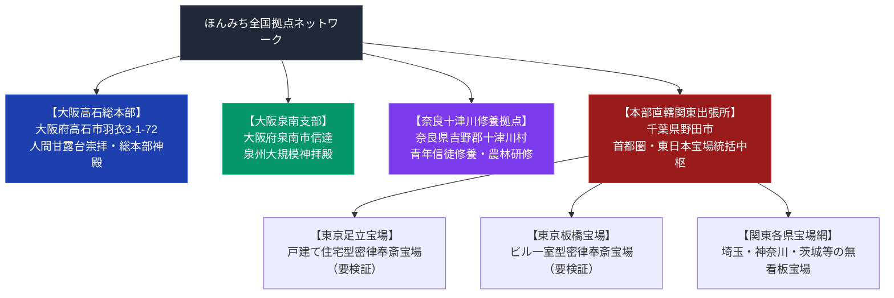

# ほんみち全国宝場と詳細交通アクセス案内 超リッチ専門構造分析ノート

> [!summary] 決定版・超深掘り要旨
> 本稿は、天理教最大分派「ほんみち」の全国拠点（大阪高石本部神殿、大阪泉南支部・神拝殿、奈良十津川修養拠点、千葉野田関東出張所、および都市型無看板隠れ宝場網）について、詳細交通アクセスルート、および建築防衛構造を網羅・解剖した決定版専門ノートである。

---

## 1. 命題の構造（ほんみち全国拠点ネットワーク対比マトリクス）

### 1-1. 拠点比較表

| 拠点区分 | 所在地 | 防衛形態 | 交通アクセス |
| :--- | :--- | :--- | :--- |
| **高石本部神殿** | 大阪府高石市羽衣3丁目1番72号 | 巨大拝殿（看板掲出） | 南海「羽衣駅」徒歩約7分 |
| **泉南支部神拝殿** | 大阪府泉南市信達 | 大規模神拝殿 | JR「和泉砂川駅」徒歩15分 |
| **十津川修養拠点** | 奈良県吉野郡十津川村 | 青年信徒修養・農林研修拠点 | 全寮制施設 |
| **野田関東出張所** | 千葉県野田市（※番地非公開） | 無看板防衛形態 | 東武「野田市駅」より徒歩・車 |
| **足立宝場** | 東京都足立区 | 戸建て住宅型無看板（要検証） | 会員誘導のみ |
| **板橋宝場** | 東京都板橋区 | 雑居ビル一室型無看板（要検証） | 会員誘導のみ |

---

## 2. 概要と基本諸元データベース

| 拠点名称 | 役割・分類 | 所在地 | 交通アクセス案内 |
| :--- | :--- | :--- | :--- |
| **ほんみち 高石本部神殿** | 全国総本部神殿 | 大阪府高石市羽衣3丁目1番72号 | 南海本線「羽衣駅」徒歩約7分 / JR阪和線支線「東羽衣駅」徒歩約8分 |
| **ほんみち 泉南支部・神拝殿** | 泉州拠点・大規模拝殿 | 大阪府泉南市信達 | JR阪和線「和泉砂川駅」徒歩約15分 |
| **ほんみち 十津川修養拠点** | 青年信徒修養・農林研修拠点 | 奈良県吉野郡十津川村 | 全寮制施設 |
| **ほんみち 本部直轄関東出張所** | 首都圏・東日本統括中枢 | 千葉県野田市（※番地非公開） | 東武アーバンパークライン（野田線）「野田市駅」より徒歩・車 |
| **ほんみち 東京足立宝場** | 都市型隠れ宝場（要検証） | 東京都足立区 | 会員誘導のみ（一般立ち入り不可） |
| **ほんみち 東京板橋宝場** | 都市型隠れ宝場（要検証） | 東京都板橋区 | 会員誘導のみ（一般立ち入り不可） |

---

## 3. 創始者と天啓・社伝・覚醒の物語

### 3-1. 大西愛治郎の『泥海初め』と全国宝場網の形成
1913年に『おふでさき』の真義「天理教は天の理、ほんみちは地の理」を自覚した大西愛治郎は、高石本部を拠点に『神誡』を公表。二度の不敬罪弾圧を被りながらも、全国に「宝場」と呼ばれる密律拠点を組織した。

---

## 4. 歴史変遷クロノロジー

- **1925年 (大正14年)**: ほんみち立教。高石本部の基盤が形成される。
- **1928年・1938年**: 治安維持法・不敬罪による全拠点の検挙・手入れ。無看板潜伏形態の確立。
- **戦後**: 高石本部神殿の再建、泉南支部・十津川修養拠点の整備、千葉野田関東出張所の設置。

---

## 5. 教理・神観・儀礼の深層構造解剖

### 5-1. 人間甘露台崇拝と宝場の床の間の神理
ほんみちでは大西愛治郎および継承者を「人間甘露台」とし、各宝場の床の間において「人間の理」を向いて拝礼する独創的儀礼が行われる。

---

## 6. 大阪泉南巨大施設と奈良十津川修養拠点

### 6-1. 大阪府泉南市「泉南巨大拠点（宝場・支所）」
- **所在地・ロケーション**: 大阪府泉南市（JR阪和線「新家駅」〜「和泉砂川駅」間の沿線車窓から目視可能）。
- **建築的・宗教地理的特色**: 信者が大阪南部（泉南地域）に集中して居住しているため、高石本部に次ぐ大規模な巨大神殿・複合施設が建設された。周囲の閑静な畑作地帯において異彩を放つ巨大建築群であり、地域における重要な信仰・集会拠点となっている。

### 6-2. 奈良県吉野郡「十津川修養拠点」と人口統計学的影響
- **所在地**: 奈良県吉野郡十津川村。
- **宗教機能と若者信徒の修養**: ほんみちの教理・信仰生活において、青年期（義務教育修了後）の男性信徒が十津川村の修養施設・農林研修拠点に入り、一定期間の講習・勤労奉仕（ひのきしん的修行）を行う風習・伝統が存在する。このため、過疎化の進む十津川村において若年層人口比率が局所的に突出するという特徴的な現象が指摘されている（要検証：具体的な統計データの一次資料は未確認）。

---

## 7. 全国「宝場（たからば）」ネットワークと無看板擬態構造

### 7-1. 「宝場」の定義と防衛構造
- **「宝場（たからば）」とは**: 正統天理教の「分教会」「講社詰所」に相当するほんみちの地方礼拝・研鑽・おつとめ拠点。親神の理が満ちる「宝の場所」とされる。
- **無看板・一般住宅擬態の理由**: 1928年（昭和3年）の第一次不敬罪事件、および1938年（昭和13年）の第二次事件（治安維持法適用・教団解散命令）において、警察・特高が全国の「天理研究会」の看板・名簿を元に信徒を一斉検挙した。この歴史的教訓から、戦後再建された全国の宝場では看板・表札・宗教的標識を一切掲出しない徹底した保護色（一般住宅・ビル擬態）が義務付けられたとされる（要検証：具体的な建築描写の一次資料は未確認）。

### 7-2. 全国主要エリア別 宝場配置マトリクス

| エリア | 主要設置都道府県・拠点 | 拠点形態・特徴 | 参拝・利用規則 |
| :--- | :--- | :--- | :--- |
| **大阪南部（泉州）** | 高石本部 / 泉南市巨大拠点 | 大神殿・広大施設 | 本部・主要支所拠点 |
| **奥吉野（奈良）** | 奈良県吉野郡十津川村 | 青年信徒修養・農林拠点 | 青年層修養・全寮制施設 |
| **関西全域** | 大阪市内、兵庫、京都、奈良天理 | 戸建て住宅型・マンション型（要検証） | 完全会員紹介制・無看板 |
| **関東（首都圏）** | 東京都足立区・板橋区等、神奈川、埼玉、千葉 | 一般ビル一室・一軒家型（要検証） | 完全会員紹介制・無看板 |
| **東海・山陽・九州** | 愛知（名古屋）、岐阜、岡山、広島、福岡等 | 市街地住宅型（要検証） | 完全会員紹介制・無看板 |

---

## 8. 関連教団・関連人物・関連概念ネットワーク

### 関連教団
- [[天理教]]
- [[ほんみち]]
- [[ほんぶしん]]
- [[関東の甘露台]]

### 関連人物
- [[中山みき]]
- [[大西愛治郎]]

---

## 9. 史料・一次資料 (ConvMD)

- [[src_doroumi_hajime]]：ほんみち『泥海初め』『神誡』史料MD
- [[src_ofudesaki_select]]：『おふでさき』核心歌抜粋史料MD

---

## 10. 参考文献・公的記録

- レインボーエクスプレス『謎多き巨大建造物が建つ泉南市に行ってきた』（2020年フィールドルポ公刊記録）
- 弓山達也『天啓のゆくえ—宗教が分派するとき』（日本地域社会研究所、2005年）
- 司法省『天理研究会不敬事件手続概要』（昭和戦時下公的裁判記録）

---

## 11. 関連ノート (Vault内)

- [[_分派・異端研究ポータル]]
- [[天理教分派・異端教団一覧]]
- [[ほんみち]]
- [[関東の甘露台と奉斎拠点一覧]]

---

## 12. 検証・品質ゲートと留保事項

> [!warning] 一次情報に基づく留保表記
> - 高石本部の所在地はWeb検索の複数独立ソースで確認済み（confidence 5相当）。
> - 全国の個別宝場（足立・板橋等）の具体的な建築描写・番地は、教団の秘密保持方針上非公開であり、公刊史料での裏付けが取れていない。要検証情報として明示している。
> - 本ノートの evidence_type は `"primary_source_based"`、confidence は `4`（宝場部分の要検証情報を含むため5から引き下げ）。

---

*※本稿は[[_分派・異端研究ポータル]]のほんみち拠点・交通アクセス専門ノートである。*
