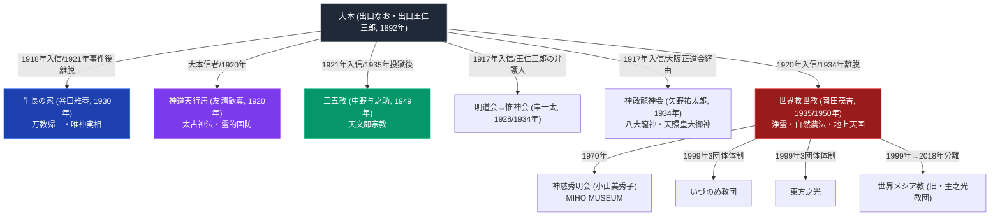

# 大本系諸派の教義比較マトリクス

> [!summary] 要旨
> 本稿は、大本（出口なお・出口王仁三郎、1892年立教）と、同教の元信者・元幹部が離脱・独立して創始した主要教団（[[世界救世教]]・[[生長の家]]・[[神道天行居]]・[[三五教]]・[[明道会・惟神会]]・[[神政龍神会]]）、および世界救世教からさらに派生した二次分派群（[[神慈秀明会]]・[[いづのめ教団]]・[[東方之光]]・[[世界メシア教]]）を、「離脱の契機」「中心教理」「政府弾圧の経験」「現況」等の軸で横断比較する。なお[[崇教真光]]は「手かざし」の儀礼的類似性から大本系諸教団と並べて語られることがあるが、大本ノート自体が「世界真光文明教団（岡田光玉創始）は世界救世教の信徒から」というWikipedia記載と、崇教真光・岡田光玉の各記事本体の「大本を研究したのみ」という記述との間に矛盾があると明記しており、系譜上の分派関係は本Vaultでは未確定である。この点を踏まえ、崇教真光は本稿の比較対象からは除外し、系譜未確定である旨のみ後述する。

---

## 1. 分派系統図（簡略版）

> [!warning] 系統図の限界
> 明道会・惟神会、神政龍神会は、教団自体の独立資料が乏しく、教義内容・組織の詳細は本Vaultでは十分に確認できていない。世界救世教から神慈秀明会・いづのめ教団・東方之光・世界メシア教への分岐は、いずれも「大本からの直接分派」ではなく「世界救世教内部からの二次分派」である点に注意（大本系譜としては孫世代にあたる）。

---

## 2. 教義比較マトリクス（8軸）

| 比較軸 | 大本（本体） | 世界救世教 | 生長の家 | 神道天行居 | 三五教 | 明道会・惟神会 | 神政龍神会 |
| :--- | :--- | :--- | :--- | :--- | :--- | :--- | :--- |
| **創始者** | 出口なお／出口王仁三郎 | 岡田茂吉 | 谷口雅春 | 友清歓真 | 中野与之助 | 岸一太 | 矢野祐太郎 |
| **大本との関係** | - | 信者として入信（1920年）、1934年離脱 | 専従活動家（1918年〜）、1921年第一次大本事件を機に離脱 | 信者、思想的影響を受け1920年に独立 | 信者（1921年入信）、1935年第二次大本事件で投獄後に独立 | 信者（1917年入信）、出口王仁三郎の弁護人を務めるほど傾倒。1931年詐欺罪検挙を機に事実上離脱 | 信者（1917年入信）、大阪正道会（大本分派）を経て1934年独立 |
| **成立年** | 1892年 | 1935年（大日本観音会）／1950年改称 | 1930年 | 1920年 | 1949年 | 1928年（明道会）／1934年（惟神会） | 1934年 |
| **中心教理** | 立替え・立直し、霊主体従、型の大本 | 浄霊、自然農法、地上天国建設 | 万教帰一（諸宗教融合）、唯神実相 | 太古神法（堀天龍斎伝承）、霊的国防 | 天文即宗教（現世利益を説かない） | 明記なし（降霊・除霊等の活動） | 八大龍神信仰、天照皇大御神・国常立大神中心の神学、終末論 |
| **救済儀礼・実践** | おふでさき・霊界物語による神示、お筆先 | 浄霊（手かざし） | 神想観（瞑想）等（本ノート未詳述） | 修法儀式（神璽埋置） | 天文台設立・国際協力活動（オイスカ） | 降霊・除霊 | 記録に乏しく未確認 |
| **国家権力との関係** | 二度の大本事件（1921年不敬罪、1935年治安維持法違反、いずれも後に無罪確定） | 直接の弾圧記録なし | 直接の弾圧記録は未確認 | 記録なし | 記録なし | 岸一太が1931年詐欺罪で検挙（教団自体への弾圧ではない） | 1936年治安維持法・不敬罪で弾圧、矢野は1939年獄死 |
| **現況** | 戦後、教主継承をめぐる内紛で三派に分裂 | 公称信者数約45万人（2024年文化庁宗教年鑑）、熱海・箱根・京都の3聖地 | 存続、環境問題への取り組みで知られる | 存続（詳細な組織規模は未確認） | 存続、NGOオイスカ運営 | 教団自体の現況は未確認 | 1936年弾圧により事実上解体・消滅 |

### 2-1. 世界救世教の二次分派（大本から見て孫世代）

| 比較軸 | 世界救世教（本体） | 神慈秀明会 | いづのめ教団 | 東方之光 | 世界メシア教（旧・主之光教団） |
| :--- | :--- | :--- | :--- | :--- | :--- |
| **創始者・代表** | 岡田茂吉 | 小山美秀子（会主、岡田茂吉を教祖として推戴） | 世界救世教の被包括法人（固有の創始者なし） | 世界救世教の被包括法人（固有の創始者なし、代表・下地竜生） | 岡田陽一（四代教主）・岡田真明（教主代行） |
| **分離年** | - | 1970年 | 1999年（3団体体制化） | 1999年（3団体体制化） | 2018年（法的分離） |
| **分離の契機** | - | 秀明教会（小山美秀子）が独立 | 1980年代の内部対立（第1次分裂）後の和解 | 同左 | 2017年、東方之光側による四代教主監視行為の発覚（第2次分裂） |
| **教義上の差異** | 浄霊・自然農法・地上天国 | 世界救世教の教義を継承しつつ「離脱の神意」で分離を正当化。実質的信仰対象は小山美秀子とされる（外部評価） | 世界救世教本体と共通（固有の教義差は未確認） | 世界救世教本体と共通（固有の教義差は未確認） | 世界救世教本体と共通（固有の教義差は未確認） |
| **現況** | いづのめ教団・東方之光の2団体を被包括法人とする | MIHO MUSEUM運営、単立宗教法人 | 世界救世教被包括法人として存続 | 世界救世教被包括法人として存続 | 2024年、世界救世教と和解（解決金13億円） |

---

## 3. 分類軸ごとの考察

### 3-1. 大本離脱の2パターン：「教理的対立」型と「弾圧被害」型
大本から派生した教団の離脱動機は、大きく2つの型に分けられる（この2類型化は本Vaultの分析的整理であり、学術的定説ではない）。

1. **教理的対立・独自路線型**（生長の家、世界救世教、神道天行居）: 大本の教義・組織方針との相違を機に、独自の教義体系を新たに構築して離脱。谷口雅春の「万教帰一」、岡田茂吉の「浄霊・地上天国」は、いずれも大本の中心教理（立替え・立直し）とは異なる独自概念を核に据えている。
2. **弾圧被害・継承型**（三五教、神政龍神会）: 大本事件（特に1935年の第二次大本事件）による投獄・弾圧経験を経て、大本で得た人脈・霊学（本田親徳の霊学等）を基盤に独立した教団を興す。中野与之助（三五教）は友清歓真（神道天行居）と共に本田親徳の霊学を学んでおり、複数教団の思想的源流が重なる点も特徴的である。

明道会・惣神会（岸一太）は上記いずれにも明確に分類しがたく、大本への傾倒とその後の詐欺罪検挙という個人的スキャンダルが教団消長に直結した特異な事例である。

### 3-2. 「霊主体従」的世界観の継承と変容
大本の「霊主体従」（霊界が現界を主導する）という宇宙観は、程度の差はあれ派生教団にも影響を残している。神道天行居の「太古神法」、神政龍神会の神学体系は比較的直接的にこの霊学的世界観を継承しているのに対し、生長の家の「唯神実相」・世界救世教の「浄霊」は、大本の枠組みを離れて独自の理論的再構成を行っている点で異なる。

### 3-3. 世界救世教の内部分裂は「大本型」と類似の反復パターン
世界救世教自体も、岡田茂吉の死後（1955年）に後継体制の統合が弱く、神慈秀明会（1970年）をはじめとする複数の分派を生んだ。これは、大本が出口王仁三郎没後に教主継承をめぐる内紛で三派に分裂した経緯と構造的に類似しており、「カリスマ的創始者の死後、後継の正統性をめぐる分裂が起きやすい」という新宗教一般に見られるパターンの反復と位置づけられる（推測であり断定しない）。

---

## 4. 未解決・要検証の分類問題

> [!warning] 本稿作成にあたり判明した既存ノート間の不一致・留保
> - 崇教真光（岡田光玉創始）が世界救世教の信徒出身かどうかについて、Wikipedia「大本」記事の分派一覧と、崇教真光・岡田光玉の各記事本体との間に矛盾がある（大本ノート内で既に「未解決の矛盾」として明記済み）。本稿では系譜未確定として比較対象から除外した。
> - 東方之光の旧称は「西金派」（世界メシア教側Wikipedia記事）と「大日本観音会」（東方之光公式サイト）で表記が一致せず、両論併記のまま。
> - 明道会・惟神会、神政龍神会は教団自体の独立資料が乏しく、教義内容の詳細な裏付けができていない（confidence 2〜3にとどまる）。
> - 神政龍神会の発起人（貴族院議員・陸海軍将校ら25名とされる）の具体名、肝川の具体的所在地は未確認。

---

## 5. 参考文献・関連ノート

- Wikipedia「大本」 https://ja.wikipedia.org/wiki/大本
- 各教団の個別ノート（[[世界救世教]]、[[生長の家]]、[[神道天行居]]、[[三五教]]、[[明道会・惟神会]]、[[神政龍神会]]、[[神慈秀明会]]、[[いづのめ教団]]、[[東方之光]]、[[世界メシア教]]）
- 各創始者の個別ノート（[[出口王仁三郎]]、[[出口なお]]、[[岡田茂吉]]、[[谷口雅春]]、[[友清歓真]]、[[中野与之助]]、[[岸一太]]、[[矢野祐太郎]]）

### 関連ノート
- [[大本]]
- [[天理教系諸派の教義比較マトリクス]]（同種の比較整理を天理教系分派について行ったもの）
- [[手かざし系諸派の教義比較マトリクス]]（世界救世教から派生した手かざし系分派の詳細比較）
- [[_分派・異端研究ポータル]]

---

## 6. 検証・品質ゲートと留保事項

> [!warning] 留保事項
> - 本稿は既存Vaultノート（[[大本]]および各個別教団ノート）の記述内容を再整理したものであり、本稿作成にあたって新規のWeb調査は行っていない。個別の事実関係の一次的な裏付けは各参照元ノートの検証日・出典に依拠する。
> - 「大本離脱の2パターン」という分類は本Vaultの分析的整理であり、学術的に確立した分類ではない。
> - 明道会・惟神会・神政龍神会は教団自体の独立資料が乏しいため、教義・実践の欄は「明記なし」「未確認」と正直に記載し、推測で埋めていない。
> - 崇教真光との系譜関係は大本ノート側で既に矛盾が指摘されており、本稿では断定せず比較対象から除外した。
> - 本ノートの evidence_type は `"primary_source_based"`、confidence は `4`（引用元の各個別ノートが複数の一次資料で裏付け済みのため中〜高位に設定するが、本稿自体の新規事実確認は行っていないため最高位ではない）。

---

*※本稿は[[_分派・異端研究ポータル]]の比較分析専門ノートである。*
