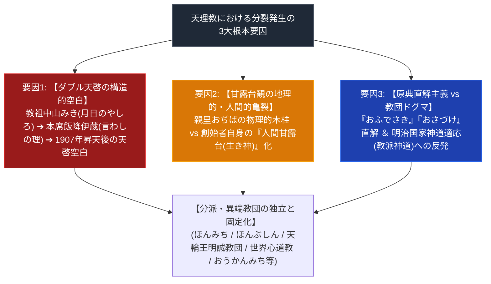

# 天理教の分裂の系譜 超リッチ専門構造分析ノート

> [!summary] 要旨と研究的評価
> 本稿は、1838年の立教以来、天理教においてなぜ多数の分派・異端教団（ほんみち、ほんぶしん、天輪王明誠教団、太道教、世界心道教、天理三輪講、おうかんみち等）が発生・独立したのか、その根本メカニズム（3大構造要因：ダブル天啓の構造的空白、甘露台観の亀裂、原典直解主義）を多角解剖した決定版史論ノートである。

---

## 1. 命題の構造（天理教における分裂発生の3大構造要因）

### 1-1. 時代史別・主要分派生成マトリクス

| 時代・時期 | 代表的教団・講社 | 主な分裂・独立の背景とメカニズム |
| :--- | :--- | :--- |
| **明治期** | **[[天輪王明誠教団]]** (1881年創立) | 中山みき直授の講名。1888年に明治政府の弾圧回避のため教派神道「神習教」傘下入り、戦後単立独立。 |
| **大正〜昭和初期** | **[[ほんみち]]** (1925年独立) **[[天理三輪講]]** (1933年独立) **[[おうかんみち]]** (1937年独立) | 本席昇天後のダブル天啓不在。大西愛治郎の「人間甘露台」宣言と昭和の不敬罪弾圧事件。ほんみちからの連続的スピンオフ。 |
| **昭和戦中〜戦後** | **[[太道教]]** (1940年) **[[世界心道教]]** (1944年) **[[ほんぶしん]]** (1962年) | 天理教教師・ほんみちを経たカリスマ伝道者（会田ヒデ、大西玉）による独自天啓の獲得と分立。 |
| **平成〜現代** | **[[天理教豊文教会]]** (2006年最高判確定) **[[八島英雄]]** (1986年罷免) | 自律的運営を巡る包括・被包括法人の対立。最高裁第二小法廷判決で「天理教」自称権認可。 |

---

## 2. 3大構造要因の宗教学的解剖

### 2-1. 要因1：ダブル天啓が生んだ「第三のやしろ（天啓者）」待望論
- **二段階天啓モデル**: 天理教は「教祖・中山みき（月日のやしろ）」の神がかりから始まり、教祖潜伏（1887年）後は「本席・飯降伊蔵（言わしの理）」を通じて神託（おさづけ）が下される二段階構造を持っていた。
- **1907年（明治40年）の構造的空白**: 本席・飯降伊蔵の昇天後、教会本部（第一代真柱・中山正善体制へ）は「天啓の完結」を宣言。しかし、信者層のなかには「三軒三棟の理」に基づき「第三の天啓者」を待望する心理が根強く残り、大西愛治郎（ほんみち）や会田ヒデ（世界心道教）らのカリスマが受容される土譲となった（弓山達也『天啓のゆくえ』）。

### 2-2. 要因2：甘露台観の亀裂（物理的木柱 vs 人間甘露台）
- **本部**: 奈良県天理市「親里おぢば」中央に据えられた物理的な木柱（甘露台）を絶対的な宇宙の中心として奉斎。
- **分派**: 神意を受けた創始者自身（大西愛治郎、大西玉等）を「人間甘露台（生き神）」とし、あるいは屋外に独自の石造甘露台（ほんぶしん、陽気づくめ垂水教会）を復元・奉斎した。

### 2-3. 要因3：原典直解主義 vs 明治国家適応への反発
- **教義の変容**: 明治政府の取締回避のため、正統本部は教派神道「天理教本道」として神道体系（十二神将や神道用語の導入）に適応。
- **原典復帰運動**: これに対し、教祖自筆の聖典『おふでさき』や『みかぐらうた』の原典そのままの直解に回帰しようとする純粋主義運動（ほんみち、ほんぶしん等）が分裂の推進力となった。

---

## 3. 参考文献・関連ノート

1. 弓山達也『天啓のゆくえ—宗教が分派するとき』（日本地域社会研究所、2005年）
2. 井上順孝 ほか編『新宗教教団・人物事典』（弘文堂、1996年）
3. 島薗進『新宗教の展開』（岩波書店）

### 関連ノート
- [[天理教分派・異端教団一覧]]
- [[天理教系諸派の教義比較マトリクス]]
- [[天理教]]
- [[ほんみち]]
- [[ほんぶしん]]
- [[天輪王明誠教団]]
- [[世界心道教]]
- [[太道教]]
- [[おうかんみち]]

---

*※本稿は[[_分派・異端研究ポータル]]の史論・系譜専門分析ノートである。*
