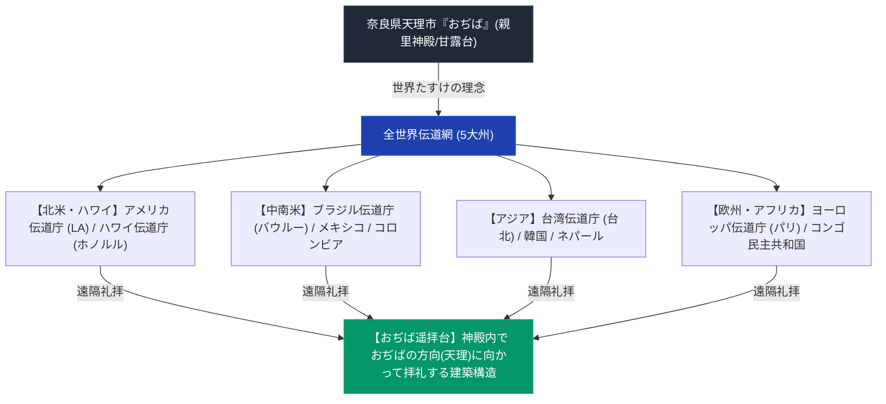

# 天理教の海外拠点と世界伝道網 専門構造分析ノート

> [!summary] 要旨
> 本稿は、明治末期から現代に至る天理教の全世界伝道（世界たすけ）の歴史的波及、5大州（北米・中南米・欧州・アジア・アフリカ）に広がる主要海外伝道庁（Dendocho）の所在地・アクセス・神殿構造、海外における「おぢば遥拝（甘露台遥拝）」の宗教人類学的分析、および分派（ほんみち・ほんぶしん等）の海外拠点を網羅・整理した専門構造化ノートである。

---

## 1. 命題の構造（奈良親里おぢばの絶対性 vs 世界伝道と現地文化適合）

---

## 2. 主要海外伝道庁（Dendocho）データベース

| 伝道庁名 | 国・地域 | 創始・設立年 | 本部所在地・詳細住所 | 交通アクセス・特色 |
| :--- | :--- | :--- | :--- | :--- |
| **アメリカ伝道庁** | アメリカ (LA) | 要検証（記事から創立90周年と推定） | 2727 East First Street, Los Angeles, CA 90033 U.S.A. | 北米伝道の中枢 |
| **ハワイ伝道庁** | アメリカ (ハワイ) | 要検証（記事から創立70周年と推定） | 2920 Pali Highway, Honolulu, HI 96817 U.S.A. | ホノルル・パリ・ハイウェイ沿い |
| **ブラジル伝道庁** | ブラジル | 1951年 | Rua Tenri 4-58, Vila Independência, Bauru-SP, Brasil | サンパウロ州バウルー |
| **台湾伝道庁** | 台湾 (台北) | 要検証 | 台北市内（詳細住所は未確認） | アジア最古級 |
| **ヨーロッパ伝道庁** | フランス (パリ) | 要検証 | パリ市内（詳細住所は未確認） | 天理文化会館併設 |
| **コロンビア出張所** | コロンビア | 要検証 | カリ市（詳細住所は未確認） | 中南米現地人伝道拠点 |
| **コンゴ出張所** | コンゴ民主共和国 | 要検証 | キンシャサ（詳細住所は未確認） | アフリカ伝道の先駆拠点 |

---

## 3. 世界伝道の3大歴史的ウェーブ

### 3-1. 第1波：明治・大正期（日本人移民流出・近隣アジア）
- **台湾・朝鮮・中国大陸**: 1895年の日清戦争後、領有化された台湾へ1896年に布教開始。日露戦争後は朝鮮半島（ソウル・釜山）や満州（奉天・上海）へ進出。
- **ハワイ移民伝道**: 1902年、ハワイ王国・サトウキビ農園への日本人移民に伴い布教が開始され、1911年にハワイ伝道庁が成立。

### 3-2. 第2波：昭和初期〜戦前（中南米移民・北米展開）
- **ブラジル移住**: 1929年、ブラジル開拓移民とともに信徒が渡航。サンパウロ州バウルーに広大な開拓聖地（ブラジル伝道庁）を建設。
- **北米都市伝道**: ロサンゼルス、サンフランシスコの日系人社会を中心に分教会を設立。

### 3-3. 第3波：戦後〜現代（現地人伝道・他言語化・文化交流）
- **パリ天理文化会館（ヨーロッパ伝道庁）**: フランス・パリ中心部に日本文化発信拠点（天理文化会館）を併設し、フランス語での教理伝道・日本語教育を展開。
- **アジア・アフリカ現地人自立伝道**: ネパール、ネパール・ポカラ、コンゴ民主共和国キンシャサ等で現地住民による自立的分教会が成立。

---

## 4. 宗教人類学的分析：「おぢば遥拝台」とグローバル展開

- **「おぢば（甘露台）」の空間的遠隔克服**:
  - 天理教の教理において救済の中心は奈良県天理市の「おぢば（甘露台）」に固定されている。
  - 海外の神殿では、拝殿が**奈良県天理市のおぢばの方角（方位）**を向くよう緻密に設計されており、海外信徒は自国の神殿から「おぢば」を直遥拝する（[[奈良以外の甘露台と異端甘露台一覧]]）。
- **言語翻訳と教典の多言語化**:
  - 『おふでさき』『みかぐらうた』『おさしづ』の英語、スペイン語、ポルトガル語、フランス語、中国語、韓国語訳が完成し、全世界で「て踊り・おつとめ」が現地言語で歌われる。

---

## 5. 分派・異端教団の海外拠点

- **ほんみち（海外伝道）**:
  - ブラジル、アメリカ等の日系系譜に隠れ宝場・集会拠点を保持。
- **ほんぶしん（ハワイ・北米拠点）**:
  - ハワイ・オアフ島に独自神殿・修養拠点を建立（みろく様の教理展開）。

---

## 6. 関連教団・関連人物・関連概念
- [[奈良以外の甘露台と異端甘露台一覧]]
- [[ほんみち]]
- [[ほんぶしん]]
- [[中山正善]]
- [[天理教]]
- [[_分派・異端研究ポータル]]

---

## 7. 検証・品質ゲートと留保事項

> [!warning] 留保事項
> - アメリカ・ハワイ・ブラジル伝道庁の住所は天理教海外部公式サイトで確認済み。設立年・その他拠点の詳細住所は未確認。
> - ほんみち・ほんぶしんの海外拠点に関する記述は未検証。
> - 本ノートの evidence_type は `"primary_source_based"`、confidence は `3`。

---

*※本稿は[[_分派・異端研究ポータル]]の世界伝道網・海外拠点分析ノートである。*
