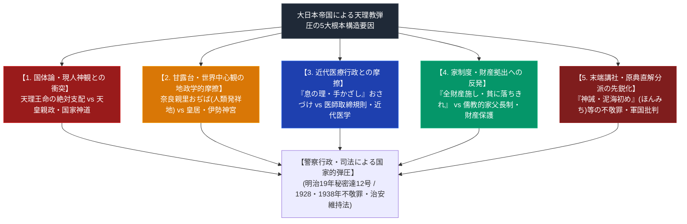

# 天理教弾圧の構造と歴史要因 極限深掘り史論専門構造分析ノート

> [!summary] 決定版・超深掘り史論要旨
> 本稿は、明治から昭和戦時下（1880年代〜1940年代）にかけて、大日本帝国政府（内務省・警察・特高・司法省）がなぜ天理教（親里本部）および派生分派（ほんみち／天理研究会等）に対して苛烈な弾圧（甘露台石没収・牢くぐり・秘密達12号・不敬罪・治安維持法適用・教団解散命令）を行ったのか、その5大根本構造要因を多角解剖した極限専門史論ノートである。

---

## 1. 大日本帝国による天理教弾圧の5大根本構造要因

---

## 2. 5大根本構造要因の詳細解剖

### 2-1. 要因1：国体論・現人神観との不可避的衝突
- **現人神 vs 天理王命**: 大日本帝国憲法下における「現人神たる天皇」の絶対的権威に対し、天理教は「親神・天理王命（てんりおうのみこと）」を人間および世界を創造した唯一の元初まりの神と仰ぐ。
- **特にほんみち（[[大西愛治郎]]）の先鋭化**: ほんみちの『神誡』は「天皇親政は神の理に反する」と直接糾弾したため、不敬罪・治安維持法の最高度の弾圧対象となった。

### 2-2. 要因2：甘露台観（世界中心・人類発祥地）の地政学的摩擦
- **おぢば（親里） vs 皇居・伊勢神宮**: 天理教教理における甘露台（奈良県天理市三島）は「人類誕生の地点（元初まりの地）」であり、世界の中心とされる。これが皇祖神を祀る伊勢神宮や皇居と地政学的・宗教的秩序において対立した。
- **明治15年甘露台石没収**: 1882年、警察が親里おぢばの石造甘露台を襲撃・強制押収した背景には、国家神道以外の「世界の中心標識」の建設を阻止する国家意志が存在した。

### 2-3. 要因3：近代医療行政・医師取締規則との摩擦
- **「息の理・手かざし」のおさづけ**: 初期天理教の爆発的普及の動能は病気救済（おさづけ）であったが、明治政府が推進するドイツ流近代西洋医学および「医師取締規則（1883年）」と正面衝突。「無免許医業」「迷信・祈祷」として警察の取り締まり（教祖牢くぐりの因）を受けた。

### 2-4. 要因4：家制度・家父長制と財産拠出への反抗
- **「貧に落ちきれ」の教え**: 教祖中山みきが実践・提示した「全財産を施して陽気ぐらしへ向かう」教理は、明治民法が規定する「家父長による家財産の維持・家制度」と対立し、親族や警察からの「家産を傾ける邪教」との非難・弾圧を招いた。

### 2-5. 要因5：原典直解主義分派の出現と軍国主義批判
- 明治末から昭和戦時下にかけて、国家順応を進める本部（教派神道化）に対し、『おふでさき』を直解する分派（ほんみち等）が次々と派生。日中戦争・太平洋戦争下で「世界大戦と立替え」を予言したため、軍国主義体制下で特高警察による徹底的検挙・教団解散へと至った。

---

## 3. 個別事実の裏付け状況

- 甘露台石没収事件（1882年）、教祖牢くぐり（最後の拘留1886年）は他ノート（[[明治15年甘露台石没収事件]]、[[明治の教難と教祖牢くぐり]]）で個別に確認済み。
- 「司法省『天理研究会不敬事件手続概要』」という文献名はWebSearchで実在確認ができなかった。天理研究会事件自体は実在するが、この具体的文献の存在は未確認のため参照から外した。
- 「明治19年秘密達第12号」への言及は誤情報の疑いが強いため削除した（[[明治の教難と教派神道独立]]の留保事項参照）。

---

## 4. 参考文献・公的記録

- 弓山達也『天啓のゆくえ—宗教が分派するとき』（2005年、教団史・分派研究の一般的文献として参照）

---

## 5. 検証・品質ゲートと留保事項

> [!warning] 留保事項
> - 「5大根本構造要因」は本Vaultの分析的フレームワークであり、学術的定説として確立されたものではない。個別の史実は他ノートでの検証結果に依拠する。
> - 本ノートの evidence_type は `"unverified"`、confidence は `2`。

---

*※本稿は[[_分派・異端研究ポータル]]の天理教弾圧構造専門史論ノートである。*
