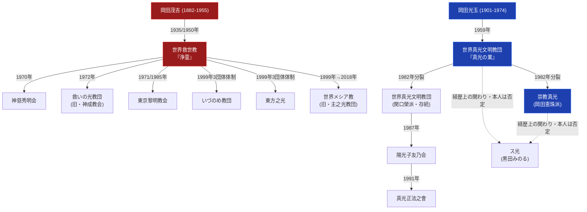

# 手かざし系諸派の教義比較マトリクス

> [!summary] 要旨
> 本稿は、「手かざし」（手をかざして対象者の霊的浄化を図る儀礼）を中心的救済実践とする新宗教群を横断比較する。本Vaultで確認できる限り、手かざし系新宗教には独立した2大源流がある。**第一に[[岡田茂吉]]（1882-1955）が創始した[[世界救世教]]系統**（「浄霊」の語を用いる）、**第二に[[岡田光玉]]（1901-1974）が創始した[[世界真光文明教団]]（後の[[崇教真光]]）系統**（「真光の業」の語を用いる）である。両者は創始者の姓が偶然共通する（岡田）ものの、系譜上の由来は独立しており、[[崇教真光]]ノートは「世界救世教からの分派」というWikipedia上の分類が誤りである可能性を既に指摘している。本稿はこの2系統を区別した上で、それぞれの内部分派を比較する。

---

## 1. 手かざし系新宗教の2大源流と分派系統図

> [!warning] 2大源流の独立性について
> 岡田光玉は大本・天理教・金光教・世界救世教などを「研究した」とWikipedia「岡田光玉」記事にあるのみで、世界救世教の元幹部・信徒であったという記述は同記事では確認できていない（[[岡田光玉]]ノートで既に訂正済み）。「世界真光文明教団は世界救世教の信徒から」という記述は[[大本]]ノート内でも「未解決の矛盾」として指摘されている。したがって世界救世教系統と真光系統は、儀礼名称の類似（浄霊／真光の業、いずれも手かざし）はあるが、**教団の系譜としては別源流**として扱う。

---

## 2. 世界救世教系統 教義比較マトリクス

| 比較軸 | 世界救世教（本体） | 神慈秀明会 | 救いの光教団 | 東京黎明教会 | いづのめ教団 | 東方之光 | 世界メシア教 |
| :--- | :--- | :--- | :--- | :--- | :--- | :--- | :--- |
| **創始者・設立者** | 岡田茂吉 | 小山美秀子（会主） | 長島すゞ子（1972年、当初「神成教会」） | 長島すゞ子（1971年支部開始、1985年独立） | 固有の創始者なし（被包括法人） | 固有の創始者なし（被包括法人、代表・下地竜生） | 岡田陽一（四代教主）・岡田真明 |
| **分離年** | - | 1970年 | 1972年8月1日 | 1985年11月8日（支部活動は1971年〜） | 1999年（3団体体制化） | 1999年（3団体体制化） | 2018年1月30日 |
| **分離の契機** | - | 秀明教会が独立 | 神成教会として独立、1974年改称 | 世界救世教黎明教会の東京支部として開始、後に独立 | 1980年代の内部対立（第1次分裂）後の和解 | 同左 | 2017年の四代教主監視行為発覚（第2次分裂） |
| **儀礼名称** | 浄霊 | 浄霊 | 浄霊 | じょうれい（浄霊） | 浄霊 | 浄霊 | 浄霊 |
| **教義上の独自性** | 浄霊・自然農法・芸術・地上天国建設 | 「離脱の神意」で分離を正当化。実質的信仰対象は小山美秀子とされる（外部評価） | 「浄霊」「自然農法」「芸術」の3つの救い（本体を継承） | 「じょうれい」「無施肥無農薬栽培」「東京黎明アートルーム」（本体を継承しつつ独自の美術活動を展開） | 本体と共通（固有の教義差は未確認） | 本体と共通（固有の教義差は未確認） | 本体と共通（固有の教義差は未確認） |
| **現況** | 公称信者数約45万人（2024年）。いづのめ教団・東方之光を被包括法人とする | MIHO MUSEUM運営、単立宗教法人 | 東京本部・須玉総本部の2拠点、「光臨殿 岡田茂吉博覧館」運営 | 東京都中野区、2代目・長島良紀が代表 | 静岡県熱海市、世界救世教被包括法人 | 静岡県熱海市、世界救世教被包括法人 | 2024年、世界救世教と和解（解決金13億円） |

---

## 3. 真光系統 教義比較マトリクス

| 比較軸 | 世界真光文明教団 | 崇教真光 | 陽光子友乃会 | 真光正法之會 | ス光 |
| :--- | :--- | :--- | :--- | :--- | :--- |
| **創始者・分派者** | 岡田光玉（本名・岡田良一）。1982年分裂後は関口榮派が継承 | 岡田光玉。1982年分裂後は岡田恵珠派が形成 | 田中清英（元・世界真光文明教団崇教局長） | 中野鷹照（元・陽光子友乃会所属） | 黒田みのる（少女漫画家・心霊劇画家） |
| **成立・分派年** | 1959年（神示降下）／1963年宗教法人登記 | 1982年（世界真光文明教団からの分裂） | 1987年 | 1991年 | 1980年「光輪」として立教（1984年・2013年に改称） |
| **儀礼名称** | 真光の業 | 真光の業（本体を継承と推定、詳細未確認） | 手かざし（「神理正法」） | 手かざし（「元還り」） | 「炎の業」（両手を用いる手かざし） |
| **教義上の独自性** | 「火の洗礼」による世界的大変動と「地上天国文明」建設を予言 | 本体の教義を継承（1982年分裂の教義上の争点は本Vaultでは未確認） | 「神理正法」「地上天国建設」。母体との教義上の大きな差異はないとされる | 「神の子として、本来の人のあるべき姿への元還り」、人格・品格・霊格の向上を強調 | 現界・幽界・霊界・神霊界・神界という独自の霊的階層論、「詫びの行」の日常的実践 |
| **現況・系譜認識** | 静岡県伊豆市冷川、現教え主・関口勝利（三代） | 独立した宗教法人として存続（本部所在地は本Vaultでは未確認） | 茨城県つくば市、現代表・沼田明里 | 埼玉県東松山市、現代表・平澤秀周 | 東京都八王子市。創始者は真光系統との現在の関係を否定しているとされる |

---

## 4. 分類軸ごとの考察

### 4-1. 「浄霊」と「真光の業」の呼称差は系譜の違いを反映する
両系統とも「手をかざして対象者の霊的な曇り・穢れを浄化する」という基本構造は共通するが、用語（浄霊／真光の業）が体系的に異なり、各教団は自派の系譜に応じてどちらかの呼称を一貫して用いている。これは単なる言い換えではなく、独立した2つの創始者・啓示体験に由来する別個の教義体系であることを示す指標として機能している。

### 4-2. 世界救世教系統：「地理的独立」型の分派パターン
世界救世教系統の分派（神慈秀明会・救いの光教団・東京黎明教会等）は、いずれも教義上の大きな差異を主張せず、「岡田茂吉の教えを継承する」という立場を保ちながら、運営組織として独立するパターンが目立つ。神慈秀明会の「離脱の神意」のように独自の正当化教義を持つ例もあるが、浄霊・自然農法という核心実践自体は本体からほぼそのまま継承されている。

### 4-3. 真光系統：「連鎖的分派」型のパターン
真光系統は、世界真光文明教団→崇教真光（1982年分裂）→陽光子友乃会（1987年、世界真光文明教団から）→真光正法之會（1991年、陽光子友乃会から）という多段階の連鎖的分派を特徴とする。各段階の分派も教義上の大きな差異を主張せず「母体との差異はないとされる」という記述が複数の個別ノートで共通して見られ、教義対立よりも組織運営・後継をめぐる分裂が主因である可能性が高い（推測であり断定しない）。ス光は経歴上の関わりを持ちながらも本人が関係を否定しているとされ、この連鎖の外側に位置する周辺事例と言える。

### 4-4. 後継問題が分裂を駆動する共通パターン
両系統とも、創始者の死去（岡田茂吉1955年、岡田光玉1974年）後に後継をめぐる分裂が発生している点で共通する。世界救世教は死去直後の混乱期と1962-1972年の再統合破綻を経て複数の分派を生み、世界真光文明教団も1974年の岡田光玉死去後、1982年に関口榮派・岡田恵珠派へ分裂した。これは[[大本系諸派の教義比較マトリクス]]で指摘した「カリスマ的創始者の死後、後継の正統性をめぐる分裂が起きやすい」という新宗教一般のパターンと共通する。

---

## 5. 未解決・要検証の分類問題

> [!warning] 本稿作成にあたり判明した既存ノート間の不一致・留保
> - 世界救世教系統と真光系統の関係（「世界真光文明教団は世界救世教の信徒から」というWikipedia記載）は[[大本]]ノート・[[岡田光玉]]ノートいずれでも裏付けが取れず、本稿では独立した2系統として扱った。
> - 崇教真光の本部所在地・詳細な教義（1982年分裂後の独自性）は本Vaultでは未確認。
> - ス光の創始者・黒田みのると真光系統との関係は「本人が否定」とされるのみで、詳細な経緯（いつ・どのような形で否定したか）は未確認。
> - 東京黎明教会の本部所在地の番地表記が資料間で不一致（公式サイトと東京都宗教法人名簿）であり未解決。

---

## 6. 参考文献・関連ノート

- 各教団の個別ノート（[[世界救世教]]、[[神慈秀明会]]、[[救いの光教団]]、[[東京黎明教会]]、[[いづのめ教団]]、[[東方之光]]、[[世界メシア教]]、[[世界真光文明教団]]、[[崇教真光]]、[[陽光子友乃会]]、[[真光正法之會]]、[[ス光]]）
- 各創始者の個別ノート（[[岡田茂吉]]、[[岡田光玉]]）

### 関連ノート
- [[大本系諸派の教義比較マトリクス]]（同種の比較整理を大本系分派について行ったもの。世界救世教は大本の元幹部・岡田茂吉が創始した点で両ノートに関連）
- [[天理教系諸派の教義比較マトリクス]]（同種の比較整理を天理教系分派について行ったもの）
- [[大本]]
- [[_分派・異端研究ポータル]]

---

## 7. 検証・品質ゲートと留保事項

> [!warning] 留保事項
> - 本稿は既存Vaultノート（各個別教団・人物ノート）の記述内容を再整理したものであり、本稿作成にあたって新規のWeb調査は行っていない。個別の事実関係の一次的な裏付けは各参照元ノートの検証日・出典に依拠する。
> - 「浄霊」系統と「真光の業」系統を独立した2源流として扱う整理は、既存ノートの記述（岡田光玉ノートでの訂正、大本ノートでの矛盾指摘）に基づく合理的な整理だが、本Vaultの分析的判断であり、学術的に確立した定説ではない。
> - 崇教真光の詳細な教義・本部所在地、世界メシア教・いづのめ教団・東方之光の固有の教義差は未確認のまま「本体と共通」「未確認」と正直に記載し、推測で埋めていない。
> - 本ノートの evidence_type は `"primary_source_based"`、confidence は `4`（引用元の各個別ノートが複数の一次資料で裏付け済みのため中〜高位に設定するが、本稿自体の新規事実確認は行っていないため最高位ではない）。

---

*※本稿は[[_分派・異端研究ポータル]]の比較分析専門ノートである。*
