# 日本近代新宗教におけるキリスト教習合の系譜 専門史論ノート

> [!summary] 要旨
> 近代日本における外来宗教（西洋一神教＝キリスト教）の受容・変容・習合（シンクレティズム）の構造を体系的に比較・分析する。
> 明治維新以降の日本において、キリスト教は「近代化・欧米文明の知的規範」として受容される一方、「国家神道・皇室祭祀・イエ制度（祖先崇拝）」との間で激しい摩擦を生み出した。これに対し、日本発の近代新宗教・思想運動は、キリスト教の「唯一神観」「救世主（メシア）思想」「贖罪論」「ロゴス（実相）」「アガペー（愛）」といった核心的教理を取り込み、日本固有の神道・民間霊術・先祖供養・現世利益的実践と結合させることで、独自の救済システムを構築した。
> 本稿では、**道会（松村介石）**、**日本聖道教団（岩﨑照皇）**、**生長の家（谷口雅春）**、**世界救世教（岡田茂吉）**、**天心聖教（島田晴一）**の5教団を軸に、**大本（出口王仁三郎）**や**GLA（高橋信次）**を交え、キリスト教習合の「5大類型」を構造的に解剖・比較する。

---

## 1. 問題の所在と歴史的背景

近代日本の宗教史において、キリスト教の受容は常に二重の力学（アンビバレンス）の下に置かれていた。
1. **知的・文明的憧憬**: 西洋の科学技術・近代倫理・社会福祉の基盤としての一神教的超越性、普遍性、人格主義への傾倒。
2. **土着精神・共同体規範との断絶**: 伝統的な「敬神崇祖（神社参拝と先祖供養）」「皇室祭祀」「現世肯定（病気治し・現世利益）」を「偶像崇拝・異教」として断罪する西洋教条主義（ドグマ）への反発と違和感。

この相克に対し、正統派教会（カトリックやプロテスタント主流派）は教条の純潔性を保とうとしたが、民衆新宗教や自立的思想家たちは、**「キリスト教の強み（普遍的一神論・メシア救済・愛）を抽出し、日本列島の霊性（神道・霊術・先祖供養・母性的抱擁）と再接合・換骨奪胎する」**というダイナミックな習合（シンクレティズム）を実践した。

---

## 2. キリスト教習合の5大類型

近代新宗教におけるキリスト教の取り込み方は、その神学的前提と救済論によって以下の5つの類型に大別される。

```
【日本近代新宗教におけるキリスト教習合の5大類型】
┌────────────────────────────────────────────────────────┐
│ ① 倫理・修養統合型（道会 / 松村介石）                  │
│    キリスト教の天父を東洋の「天道」とし、儒教・神道と人格修養で融合 │
├────────────────────────────────────────────────────────┤
│ ② 母神・聖母合一型（日本聖道教団 / 岩﨑照皇）          │
│    伊邪那美大神 ＝ 聖母マリアと完全同一視（12/24マリア祭・ピラミッド） │
├────────────────────────────────────────────────────────┤
│ ③ 形而上学・ロゴス統合型（生長の家 / 谷口雅春）        │
│    米ニューソート神学（神の子・罪悪無）を導入し「万教帰一」として等置 │
├────────────────────────────────────────────────────────┤
│ ④ メシア・終末論的超克型（世界救世教 / 岡田茂吉）      │
│    「主（ス）の神＝エホバ」とし、キリスト再臨・夜から昼への転換を主張 │
├────────────────────────────────────────────────────────┤
│ ⑤ 父母相補・二重構造型（天心聖教 / 島田晴一）          │
│    「キリスト教＝父、自教＝母」の婚姻的統合、外形（教会）と内実（祝詞） │
└────────────────────────────────────────────────────────┘
```

### ① 倫理・修養統合型：道会（松村介石）
* **出自と問題意識**: 新島襄から受洗した松村介石（1859〜1939）は、日本組合基督教会（本郷教会等）の有力牧師であったが、西洋伝道会社（アメリカン・ボード）による教条支配（原罪論、永遠の地獄の教え、排他的独善）に深く苦悩した。「日本人の美徳（誠・仁・敬神崇祖）を破壊するキリスト教は真の宗教ではない」とし、1907年（明治40年）に独立して「道会」を創設。
* **神学構造**:
  - キリスト教の「天父（神）」を東洋思想の「天」「上帝」「天道」と合一視。
  - 儒教の誠・修養、仏教の慈悲、神道の敬神崇祖を「天道の具現」として全肯定。
  - イエス・キリストを「神の独り子」という教条的ドグマから解放し、「天道の極致を体現した最高の人格者」と捉える。
  - 洗礼、聖餐式、信条告白を全廃し、生活における誠の道の実践へと純化させた。

### ② 母神・聖母合一型：日本聖道教団（岩﨑照皇）
* **出自と問題意識**: 香川県出身の霊能者・歌人である岩﨑照皇（1909〜1989）が、宮崎県西臼杵郡高千穂町の「八大龍王水神」の神示を経て1964年に創始。
* **神学構造**:
  - 日本神話の国生み母神である**「伊邪那美大神（イザナミノオオカミ）」と、イエスの母「聖母マリア」を完全に同一神格**として合一視。
  - 創始者自身を「伊邪那美大神の分御魂」と位置づけ、毎年12月24日（クリスマスイブ）に本宮（埼玉県さいたま市緑区）において神道祭祀形式による「マリア祭」を執行。
  - さらに黄金のピラミッド「聖魂殿」（五重塔と神仏32体を安置）を建立し、宇宙波動と生体エネルギー増幅装置「彌勒光神（エレパ）」を結びつけるなど、神道・仏教・キリスト教（マリア信仰）・ニューエイジが重層的に混淆した「全宗教エネルギー同一論」を展開。

### ③ 形而上学・ロゴス統合型：生長の家（谷口雅春）
* **出自と問題意識**: 早稲田大学英文科出身で大本編集部に所属していた谷口雅春（1893〜1985）が、長女の病気や自身の精神的危機を経て、1930年に「人間・神の子」「唯神実相」の霊感を得て月刊誌『生長の家』を創刊。
* **神学構造**:
  - 米国発のクリスチャン・サイエンス（メリー・ベーカー・エディ）やニューソート運動（エマ・カーティス・ホプキンス、フィニアス・クインビー等）の形而上学神学を翻訳・体系化。
  - 新約聖書『ヨハネによる福音書』の「初めに言葉（ロゴス）があった」を中核に据え、**「神の創られた実相世界は完全円満であり、物質・悪・罪・病気は心念の迷いが生み出した仮相（現象）にすぎず、本来実在しない」**と主張。
  - イエスの十字架贖罪を「人間が本来罪のない神の子（キリスト・仏性）であることの開示」と再定義し、古事記の天照大御神・生命の根源、仏教の般若心経の「空」と完全に同一視する「万教帰一」の形而上学を完成させた。

### ④ メシア・終末論的超克型：世界救世教（岡田茂吉）
* **出自と問題意識**: 大本の有力幹部（専修教導・東京支部長）であった岡田茂吉（1882〜1955）が、1935年に大日本観音会を創立、戦後に世界救世教へと発展。
* **神学構造**:
  - 最高神「主（ス）の神」をユダヤ・キリスト教の唯一神ヤハウェ（エホバ・エロヒム）と同定し、神道の天之御中主神とも同一視。
  - **救済史の発展的超克（終末論の大転換）**: これまでの人類史は霊界が月・水・陰に支配されていた「夜の時代」であり、イエスの十字架や仏陀の教えは夜の時代の過渡的救済にすぎなかったと説く。岡田の腹中に宿った「光の玉」によって1931年より霊界が太陽・火・陽に支配される「昼の時代」へと大転換を遂げたと主張。
  - マタイ福音書（「いなずまが東から出て西にひらめくように、人の子の来臨もそのようである」）を根拠に、**「キリストの真の再臨・メシア降臨は東洋（日本）から成就する」**と宣言。「浄霊」「自然農法」「美（美術館）」による三位一体の地上天国建設を推進した。

### ⑤ 父母相補・二重構造型：天心聖教（島田晴一）
* **出自と問題意識**: 埼玉県加須市出身の島田晴一（1896〜1985）が、兄・平吉への神顕現（1892年）と自身の誕生予言、先物相場神示を経て、1951年に「身命を賭して宗教改革・世界人類救済」の神命を受けて開教。
* **神学構造**:
  - **父母の婚姻メタファー**: 戦時中の神託**「キリスト教を父とし、汝の宗教を母として世界を救え」**に基づき、西洋の一神教・超越的理法（父）と、日本の神道・母性的現世救済・先祖供養（母）を対等な夫婦の相補的パートナーシップとして規定。
  - **根源神の同定**: 主祭神「天心大霊神」は**「かつてイエス・キリストを人類に遣わされた神様御自身」**であり、モーセやイエスの時代を超越した現代における至高の啓示（三界統治）であると位置づける。
  - **外形と内実の制度的分離**: 全国の拠点を「教会」「礼拝堂」「本部聖堂」と呼び近代チャペル風建築を採用するが、礼拝施設内部で執行される実践は「祝詞奏上」「おふだ拝受」「御霊台帳による先祖供養」「悪因縁除滅」「発散の行」という、完全な日本の土着神道・民間霊術的救済そのものである。

---

## 3. 総合比較マトリクス表（7教団の横断比較）

日本の近現代においてキリスト教と深く切り結んだ代表的7教団・運動の比較を以下に示す。

| 教団・運動名 | 創始者 / 指導者 | 主祭神・信仰対象 | イエス・キリストの解釈 | キリスト教の役割定義 | 受容したキリスト教概念 | 結合した日本的・東洋的要素 | 外形・建築形態 |
| :--- | :--- | :--- | :--- | :--- | :--- | :--- | :--- |
| **道会** | 松村介石 (1859-1939) | 天（天父・上帝・天道） | 道の極致を体現した最高の人格者 | 日本の精神的伝統と統合されるべき愛の宗教 | 人格主義、アガペー（愛）、天父観 | 儒教（誠・陽明学）、神道（敬神崇祖・神社参拝）、仏教（慈悲） | 近代講堂（会堂・修養道場、十字架・祭壇なし） |
| **[[日本聖道教団]]** | 岩﨑照皇 (1909-1989) | 八大龍王水神 ＋ 各人の守護神 ＋ 伊邪那美大神 | 聖母マリアの子（救済の使者） | 母性エネルギー（マリア）の源泉 | 聖母マリア信仰、普遍的愛、クリスマスイブ | 神道（高千穂龍神・国生み神話）、仏教（五重塔・観音・般若心経）、生体エネルギー | 和風神殿 ＋ 金色ピラミッド「聖魂殿」 ＋ 庭園「聖の森」 |
| **[[生長の家]]** | 谷口雅春 (1893-1985) | 実相（唯一真体・天照大御神等と同一） | 神の子（本来完全な実相）の先駆者 | ニューソート神学の霊的基盤（万教帰一の構成要素） | ヨハネ福音書のロゴス、神の子、贖罪の霊的再解釈 | 神道（古事記・天照大御神）、仏教（唯識・般若心経の空）、皇国思想 | 近代オフィス・道場・神社風霊宮（総本山龍宮住吉本宮） |
| **[[世界救世教]]** | 岡田茂吉 (1882-1955) | 主（ス）の神（エホバ・天之御中主神） | 夜の時代の過渡的救い主（未完成の贖罪） | 昼の時代（日本発のメシア）によって超克されるべき前駆 | エホバ神観、メシア降臨、終末論（最後の審判・東方の光） | 神道（祓い・言霊・鎮魂）、観音信仰、自然農法、美術工芸（美） | 近代美的大神殿・美術館・庭園（熱海・箱根・京都の地上天国模型） |
| **[[天心聖教]]** | 島田晴一 (1896-1985) | 天心大霊神（天地一切をつかさどる至高神） | かつて天心大霊神が人類に遣わした使者 | **「父」としての存在**（自教の「母」と婚姻的に結合） | イエス派遣論、西暦救済史（誕生後2000年）、教会組織論 | 神道（祝詞・神札）、霊術（御神水・病気治し）、民間信仰（御霊台帳・悪因縁除滅） | **本部聖堂・教会・礼拝堂**（竹中工務店設計等の近代チャペル風建築） |
| **[[大本]]** | 出口なお / 出口王仁三郎 | 国常立尊 / 豊雲野尊 | スサノオ（救世主）の贖罪受難と霊的一体 | 世界宗教連合（人類愛善）の一翼 | 救世主（メシア）思想、贖罪的受難、万国同根論 | 古神道、出口王仁三郎の言霊学・霊界物語、エスペラント運動 | 宮殿風神殿（綾部・亀岡）、神仏習合的祭壇 |
| **[[GLA]]** | 高橋信次 (1927-1976) | エル・ランティ（ヤハウェ・エホバの本体） | 九次元救世主霊（イエス系列の高級霊） | 仏教の「法」と対を成す「愛」の源泉 | 三位一体論の霊界再解釈、ミカエル天使論、アガペーの愛 | 原始仏教（正法・八正道・反省・禅定）、転生輪廻論、ニューエイジ霊道論 | 近代ホール・総合研修会館（無神像・近代音響映像システム） |

---

## 4. 天心聖教の「父母の婚姻メタファー」が持つ宗教学的特異性

上記マトリクス表を精査すると、天心聖教のキリスト教習合アプローチは、日本近代宗教史において**他に類例を見ない独自の解法**を採用していることが判明する。

### ① 「同一化」「等置」「超克」のいずれとも異なる「婚姻的相補論」
- **日本聖道教団**の解法は**「神格の同一化（融合）」**である（伊邪那美＝マリア）。
- **生長の家**の解法は**「形而上学的等置（抽象的一体化）」**である（ロゴス＝実相＝天照大御神＝仏性）。
- **世界救世教**の解法は**「救済史的超克（上位置換）」**である（夜のキリスト ➔ 昼の明主）。
- これらに対し、**天心聖教**の解法は**「父母の婚姻的相補論」**である。
  - 神託は「キリスト教になりなさい」とも「キリスト教を否定しなさい」とも言わず、**「キリスト教を父とし、汝の宗教を母とせよ」**と命じる。
  - 父性的一神教の普遍性・規範性・ロゴス（キリスト教）と、母性的な現世肯定・情愛・包摂・霊肉救済（自教の日本的土壌）を、上下関係ではなく**「対等な夫婦のパートナーシップ」**として結びつけた。

### ② 器（キリスト教的近代性）と魂（神道的霊術）の完全な制度的分離
- 天心聖教は、全国の信徒が集う拠点を「教会」「礼拝堂」「聖堂」と呼び、外形的には完全にキリスト教会堂の意匠（近代性・普遍的記号）を採用した。
- しかし、その内実で信徒が行う実践は、神社神道に連なる「お祝詞奏上」「おふだ拝受」であり、民間信仰に根ざす「御霊台帳（先祖供養）」「悪因縁除滅」「発散の行」である。
- キリスト教の「外観（普遍的モダニティ）」を纏うことによって新宗教特有の土俗性・排他性を中和しつつ、内部では民衆が最も切実に求める「病気・貧乏・家庭不和・先祖供養」という土着の救済力を最大限に発揮させるという、**極めて洗練された二重構造システム**を実現している。

---

## 5. 構造概念図（Mermaidダイアグラム）

```mermaid
flowchart TD
    subgraph 外来宗教 ["【西洋一神教（キリスト教）の衝撃】"]
        K1["唯一神ヤハウェ / 天父"]
        K2["イエス・キリストの贖罪と愛"]
        K3["ロゴス（言葉）と近代倫理"]
        K4["救世主（メシア）再臨・終末論"]
    end

    subgraph 日本土着霊性 ["【日本列島の伝統的霊性】"]
        J1["神道（八百万の神・祝詞・祓い）"]
        J2["母性的一体感（国生み・大地母神）"]
        J3["祖先崇拝（御霊供養・イエ規範）"]
        J4["現世利益（病気平癒・民間霊術）"]
    end

    subgraph 習合の5大類型 ["【近代新宗教の5大習合アプローチ】"]
        direction TB
        T1["① 倫理・修養統合型<br/><div style='font-size:11px; color:#ffffff;'>【道会】天父＝天道、儒教・神道と生活修養で融合</div>"]
        T2["② 母神・聖母合一型<br/><div style='font-size:11px; color:#ffffff;'>【日本聖道教団】伊邪那美＝マリア同一視、ピラミッド・エネルギー</div>"]
        T3["③ 形而上学・ロゴス統合型<br/><div style='font-size:11px; color:#ffffff;'>【生長の家】ヨハネ福音書・ニューソート受容、唯神実相・万教帰一</div>"]
        T4["④ メシア・終末論的超克型<br/><div style='font-size:11px; color:#ffffff;'>【世界救世教】主の神＝エホバ、夜から昼への転換・東方の光</div>"]
        T5["⑤ 父母相補・二重構造型<br/><div style='font-size:11px; color:#ffffff;'>【天心聖教】キリスト教＝父 × 自教＝母の婚姻、外形（教会）と内実（祝詞）</div>"]
    end

    K1 & K3 --> T1
    K2 & J2 --> T2
    K2 & K3 & J1 --> T3
    K1 & K4 & J4 --> T4
    K1 & K2 & J1 & J3 & J4 --> T5

    style 外来宗教 fill:#1e3a8a,stroke:#3b82f6,color:#ffffff
    style 日本土着霊性 fill:#065f46,stroke:#10b981,color:#ffffff
    style 習合の5大類型 fill:#0f172a,stroke:#475569,color:#ffffff
    style T1 fill:#374151,stroke:#6b7280,color:#ffffff
    style T2 fill:#831843,stroke:#db2777,color:#ffffff
    style T3 fill:#1e1b4b,stroke:#6366f1,color:#ffffff
    style T4 fill:#701a75,stroke:#c026d3,color:#ffffff
    style T5 fill:#4c1d95,stroke:#8b5cf6,color:#ffffff
```



---

## 6. 参考文献・典拠アーカイブ

1. **各教団原典・一次史料**:
   * 松村介石『基督教道』道会事務所、1910年
   * 松村介石『信仰五十年』警醒社書店、1926年
   * 岩﨑照皇『マリア様お言葉集』如月書房
   * 岩﨑照皇『ひらいてむすんで 第一巻』如月書房、1998年
   * 谷口雅春『生命の實相』全40巻、日本教文社
   * 岡田茂吉『天国の福音』世界救世教いづのめ教団
   * 岡田茂吉『文明の創造』世界救世教
   * 天心聖教本部聖堂『安心して暮らせる幸せを』教団公式入門冊子、2021年
   * 天心聖教教本『由来』一巻、310頁
2. **宗教学・学術研究文献**:
   * 井上順孝『近代日本の宗教者たち』大明堂
   * 井上順孝編『新宗教事典』弘文堂
   * 島薗進『ポストモダンの新宗教』東京堂出版
   * 島薗進『救いと徳―新宗教の生成化成』弘文堂
   * 國學院大學デジタルミュージアム『神道事典』（執筆: 磯岡哲也「天心聖教」）
   * 文化庁『宗教年鑑 令和3年版』

---

## 7. 関連ノート (Vault内)

- [[天心聖教]] — 父母相補・二重構造型の代表事例
- [[日本聖道教団]] — 母神・聖母合一型（伊邪那美＝マリア）の代表事例
- [[世界救世教]] — メシア・終末論的超克型（主の神＝エホバ）の代表事例
- [[生長の家]] — 形而上学・ロゴス統合型（ニューソート・万教帰一）の代表事例
- [[大本]] — スサノオ贖罪主型・エスペラント運動の源流
- [[大本系諸派の教義比較マトリクス]]
- [[手かざし系諸派の教義比較マトリクス]]
- [[_分派・異端研究ポータル]]
