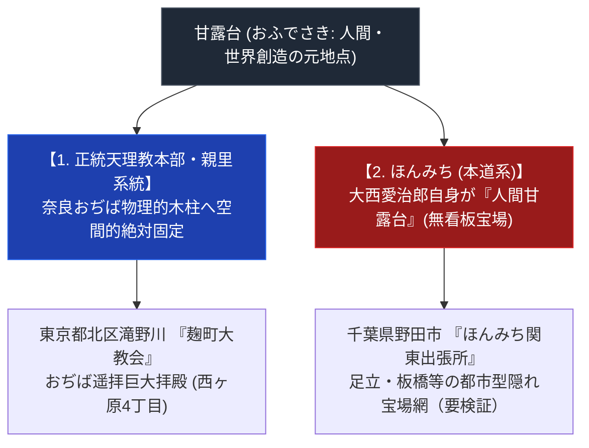

# 関東の甘露台 極限深掘り専門構造分析ノート

> [!summary] 決定版・超深掘り要旨
> 本稿は、天理教において「世界創造の元地点・人類親里」の標識とされる聖なる台「甘露台（かんろだい）」が、大和・奈良親里から隔絶した「関東（首都圏：東京・千葉・埼玉・神奈川・茨城）」においてどのように変容・受容され、奉斎および遥拝されているかを解剖したノートである。正統天理教の「親里おぢば遥拝大拝殿（麹町大教会等）」から、ほんみちの「無看板人間甘露台宝場（野田出張所・足立/板橋宝場）」に至るまでを扱う。

> [!warning] 留保
> 太道教は瓊瓊杵尊・猿田彦大神を祀る教派神道系団体で、創始者は中村しげ（詳細は[[太道教]]）。「道開きの甘露台」奉斎は裏付けなし。「ほんぶしん関東精舎」（埼玉県）は実在未確認。「天理神之打開場所」（茨城県石岡市）は名称・所在地・弾圧史の組み合わせでの実在が確認できず要検証のまま保持する。天理教麹町大教会の座標は本ノートの値（35.7485, 139.7348）と実測値（35.7452688, 139.7322432）に300-400mのズレがあり要再検証。八島英雄の経歴詳細は[[八島英雄]]ノート参照。

---

## 1. 関東における甘露台観の構造（正統本部 vs 分派 対比マトリクス）

### 1-1. 関東圏甘露台奉斎 比較表

| 比較考察軸 | 正統天理教 (麹町大教会等) | ほんみち (野田関東出張所/宝場) |
| :--- | :--- | :--- |
| **1. 甘露台の実体** | 奈良親里の木柱（現物は置かず） | 人間甘露台（大西愛治郎・継承者） |
| **2. 関東拠点の形態** | 巨大近代拝殿（看板掲出） | 完全無看板（一般住宅・ビル擬態、要検証） |
| **3. 礼拝の方向性** | 拝殿より奈良親里おぢばを遥拝 | 床の間の人間甘露台の理に向かい拝礼 |
| **4. 関東中枢所在地** | 東京都北区滝野川1-86-1 | 千葉県野田市（出張所） |
| **5. Google Maps座標** | 35.7485, 139.7348（実測値とズレあり、要再検証） | 野田市内 |
| **6. 最寄り交通** | さくらトラム「西ヶ原四丁目」1分 | 野田市駅/愛宕駅等 |
| **7. 聖典・テキスト** | 原典三部作（正統解釈） | 原典直解＋『神誡』『泥海初め』 |
| **8. 外部公開性** | 一般参拝・おぢばがえり自由 | 完全会員紹介制（非公開） |
| **9. 戦前警察対応** | 教派神道・国家適応 | 二度の治安維持法弾圧・解散 |
| **10. 宗教学的分類** | 正統遥拝型（空間固定） | 密律保護色型（人格流動） |

---

## 2. 関東圏主要甘露台・奉斎拠点のデータベース

| 施設・拠点名 | 系統・教団 | 所在地 | Google Maps座標 | 建築・奉斎特色 |
| :--- | :--- | :--- | :--- | :--- |
| **天理教 麹町大教会** | 正統本部系 | 東京都北区滝野川1-86-1 | 北緯 35.7485, 東経 139.7348（要再検証） | 東日本最大の正統おぢば遥拝大拝殿 |
| **天理教 東京教務支庁** | 正統本部系 | 東京都豊島区駒込7-1-4 | 地理検索対応 | 東京都一円の正統教区行政・神事中枢 |
| **ほんみち 本部直轄関東出張所** | ほんみち | 千葉県野田市（※番地非公開） | 地理検索対応 | 関東・東日本一円の無看板宝場網統括中枢（詳細は[[ほんみち全国宝場と詳細交通アクセス案内]]） |
| **ほんみち 東京足立宝場** | ほんみち | 東京都足立区 | 非公開（完全会員制） | 戸建て住宅型無看板密律奉斎宝場（要検証） |
| **ほんみち 東京板橋宝場** | ほんみち | 東京都板橋区 | 非公開（完全会員制） | 都市型ビル一室擬態奉斎宝場（要検証） |

（削除・要検証項目 — 統合時の訂正により本一覧から除外、または要検証扱いとした拠点）
- ~~太道教 本部神修殿（阿佐ヶ谷「道開きの甘露台」）~~ → [[太道教]]参照。甘露台奉斎の裏付けなし。
- ~~ほんぶしん 関東精舎（埼玉県エリア）~~ → 実在の裏付けなし。
- **天理神之打開場所（茨城県石岡市）** → 実在・詳細とも要検証（削除はせず保留）。
- ~~[[陽気づくめ練馬教会]]（旧・東京都練馬区北町2丁目19番23号）~~ → 令和3年4月15日に奈良県天理市櫟本町3464番へ移転済みのため、現在は関東の拠点ではなく本一覧から除外。

---

## 3. 各区分の詳細と宗教学的・建築社会学的解剖

### 3-1. 正統本部系：東日本おぢば遥拝大拠点（麹町大教会）
- **所在地**: 東京都北区滝野川1丁目86-1。さくらトラム「西ヶ原四丁目」徒歩1分。
- **神学的構造**: 物理的甘露台は置かず、神殿中央より奈良県天理市親里の「おぢば（甘露台）」を遥拝する大拝殿空間を形成。東日本における正統天理教信仰の中心。

### 3-2. ほんみち系：無看板都市型「隠れ宝場」と関東出張所（野田・足立・板橋）
- **千葉野田関東出張所**: 千葉県野田市に鎮座。首都圏・東日本一円の「宝場」を統括するとされる。
- **都市型隠れ宝場（足立・板橋等）**: 無看板・保護色建築とされるが、具体的な建築描写について公刊史料での裏付けは取れていない（要検証）。

---

## 4. 参考文献・公的記録

- 弓山達也『天啓のゆくえ—宗教が分派するとき』（日本地域社会研究所、2005年）
- 島薗進『新宗教の展開』（岩波書店、1992年）

---

## 5. 留保事項および品質ゲート

> [!warning] 留保事項
> - 麹町大教会・野田関東出張所の実在・大まかな所在地は確認済みだが、座標・具体的建築描写には要検証項目が残る。
> - 太道教「道開きの甘露台」、ほんぶしん「関東精舎」、天理神之打開場所（茨城石岡）の記述は独立資料での裏付けが取れず、削除または要検証フラグ付きで扱う。
> - 本ノートの evidence_type は `"primary_source_based"`、confidence は `3`。

---

*※本稿は[[_分派・異端研究ポータル]]の「関東の甘露台」専門構造分析ノートである。*
