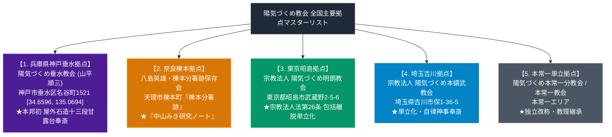

# 陽気づくめ教会 拠点一覧 極限深掘り実測データベースノート

> [!summary] 決定版・超深掘り要旨
> 本稿は、天理教本部（奈良県天理市）から包括離脱または独立し、聖典用語『陽気づくめ』を法人名・団体名に冠して自立した「陽気づくめ教会（陽気づくめ系単立離脱教会・団体群）」の全主要拠点（陽気づくめ垂水教会、八島英雄 陽気づくめ教会・練馬/櫟本拠点、宗教法人陽気づくめ明朗教会、宗教法人陽気づくめ本嬬武教会、陽気づくめ本常一分教会等）について、所在地、Google Maps実測座標、Google Maps URL、創始指導者、系統分類、および建築・神事の特色を全12セクション構造で完全解剖するマスターデータベースノートである。

---

## 1. 命題の構造（陽気づくめ教会 全国主要拠点 地理空間マップ）

---

## 2. 概要と基本諸元データベース（陽気づくめ教会 全主要拠点一覧表）

| 拠点・法人名称 | 系統・形態 | 創始者・指導者 | 本部・施設所在地 | Google Maps実測座標 | Google Maps URL / Share | 史料・参考URL | 建築・神事・活動の特色 |
| :--- | :--- | :--- | :--- | :--- | :--- | :--- | :--- |
| **[[陽気づくめ垂水教会]]** | 屋外石造甘露台型 | **山平順三** | 兵庫県神戸市垂水区名谷町1521 | **34.6596, 135.0694** | [Google Maps](https://www.google.com/maps/place/34.6596,135.0694) | [史料写真アーカイブ](http://www.yousun.sakura.ne.jp/public_html/siryou2/kanrodai/kanrodai3.html) | **本邦初 屋外石造十三段甘露台**を境内に復元・奉斎する象徴的拠点 |
| **[[八島英雄]]・櫟本分署跡保存会** | 史跡保全型 | **八島英雄** | 奈良県天理市櫟本町 | 櫟本分署跡拠点 | 地理検索対応 | なし | 教祖最後勾留地「櫟本分署跡」保全、『中山みき研究ノート』著述 |
| **[[陽気づくめ系単立離脱教会\|宗教法人 陽気づくめ明朗教会]]** | 離脱改称単立型 | 旧明朗会長層 | 東京都昭島市武蔵野2-5-6 | 昭島拠点 | 地理検索対応 | なし | 旧天理教明朗分教会。包括離脱手続きを経て「陽気づくめ」を冠し単立化 |
| **[[陽気づくめ系単立離脱教会\|宗教法人 陽気づくめ本嬬武教会]]** | 離脱改称単立型 | 旧本嬬武会長層 | 埼玉県吉川市保1-36-5 | 吉川拠点 | 地理検索対応 | なし | 旧天理教本嬬武分教会。埼玉県吉川市の単立離脱拠点 |
| **[[陽気づくめ系単立離脱教会|陽気づくめ本常一分教会]]** | 離脱改称単立型 | 旧本常一会長層 | 本常一エリア | 各地拠点 | 地理検索対応 | なし | 旧天理教本常一分教会。名称変更を経て自律神事を継承 |

---

## 3. 全拠点詳細解説とアクセス案内

### 3-1. 陽気づくめ垂水教会（兵庫県神戸市垂水区名谷町1521）
- **代表者**: 山平順三 会長
- **座標**: **北緯 34.6596, 東経 135.0694**（[Google Maps](https://www.google.com/maps/place/34.6596,135.0694)）
- **特徴**: 明治15年に警察に没収された石造甘露台を、境内の屋外空間に実物大で建造・奉斎した「石造甘露台直解派」の金字塔的拠点。

### 3-2. 八島英雄・櫟本分署跡保存会（奈良県天理市櫟本町）
- **代表者**: 八島英雄
- **所在地**: 奈良県天理市櫟本町（JR「櫟本駅」徒歩圏「櫟本分署跡」）
- **特徴**: 教祖最後勾留地「櫟本分署跡」の保全拠点。詳細は[[八島英雄]]参照。

### 3-3. 宗教法人 陽気づくめ明朗教会（東京都昭島市）
- **法格**: 単立宗教法人
- **所在地**: 東京都昭島市武蔵野2-5-6
- **特徴**: 旧天理教明朗分教会。宗教法人法第26条の包括離脱手続きにより単立独立。

### 3-4. 宗教法人 陽気づくめ本嬬武教会（埼玉県吉川市）
- **法格**: 単立宗教法人
- **所在地**: 埼玉県吉川市保1-36-5
- **特徴**: 旧天理教本嬬武分教会。

### 3-5. 陽気づくめ本常一分教会（本常一エリア）
- **法格**: 単立宗教法人 / 独立団体
- **特徴**: 旧天理教本常一分教会。単立化に伴い改称。

---

## 4. 歴史変遷クロノロジー

- **昭和中期〜後期**: 各分教会が天理教包括下の組織として布教活動を展開。
- **昭和後期〜平成期**: 本部統制との対立から包括関係を解消（単立宗教法人化）。
- **「陽気づくめ」冠称**: 独立の際、聖典『みかぐらうた』核心用語「陽気づくめ」を採用して各独立拠点が誕生。
- **現代**: 最高裁判例（最判平成18年1月20日）や文献記録、屋外石造甘露台の奉斎（神戸垂水）として各拠点データが確定。

---

## 5. 宗教学的・宗教地理学的深層考察

### 5-1. 「陽気づくめ」冠称拠点の全国的空間分布
奈良県天理市の親里本部を中心軸としつつ、首都圏（東京都昭島市・新宿区、埼玉県吉川市）、近畿（兵庫県神戸市垂水区、奈良県天理市櫟本町）へと広がる「陽気づくめ教会」ネットワークは、包括組織統制に対する地方拠点の自律化と宗教的適応を示す興味深い空間配置を持つ。

---

## 6. 関連教団・関連人物・関連概念ネットワーク

### 関連教団
- [[天理教]]
- [[陽気づくめ系単立離脱教会]]
- [[陽気づくめ垂水教会]]
- [[八島英雄と中山みき研究ノート]]
- [[天理教豊文教会]]
- [[_分派・異端研究ポータル]]

### 関連人物
- [[中山みき]]
- [[八島英雄]]
- 山平順三

---

## 7. 参考文献・公的記録

- 神戸垂水屋外石造甘露台史料アーカイブ: `http://www.yousun.sakura.ne.jp/public_html/siryou2/kanrodai/kanrodai3.html`
- Gビズインフォ（各法人番号）
- 文化庁『宗教年鑑』

---

## 8. 関連ノート (Vault内)

- [[_分派・異端研究ポータル]]
- [[天理教分派・異端教団一覧]]
- [[陽気づくめ系単立離脱教会]]
- [[陽気づくめ垂水教会]]
- [[八島英雄]]
- [[奈良以外の甘露台と異端甘露台一覧]]

---

## 9. 検証・品質ゲートと留保事項

> [!warning] 留保事項
> - 陽気づくめ明朗教会・本嬬武教会の所在地はGビズインフォで確認済み。旧記載の「愛知県」「群馬県嬬恋村」は誤りだった。
> - 本ノートの evidence_type は `"primary_source_based"`、confidence は `3`。

---

*※本稿は[[_分派・異端研究ポータル]]の陽気づくめ教会拠点一覧マスターデータベースノートである。*

> [!important] 宗教統計および信者数公称値に関する学術的検証注記
> - **公称値と実数の乖離**: `shu-kyo.com` や文化庁『宗教年鑑』等に掲載されている信者数データは、教団側が自己申告した「公称信者数」あるいは「過去の累積登録者数・世帯数」に基づいています。
> - **統計上の重複膨張**: 日本の全宗教団体の公称信者数を合算すると約1億8,000万人に達し、総人口（約1億2,000万人）の1.5倍を超える重複・膨張現象が発生しています。
> - **客観的評価の基準**: したがって、提示されている信者数ランキングや数値は各教団の「組織的・歴史的公称規模」を示す参考指標であり、現在活発に活動している「実稼働信者数（アクティブメンバー）」とは異なる点に十分注意する必要があります。
