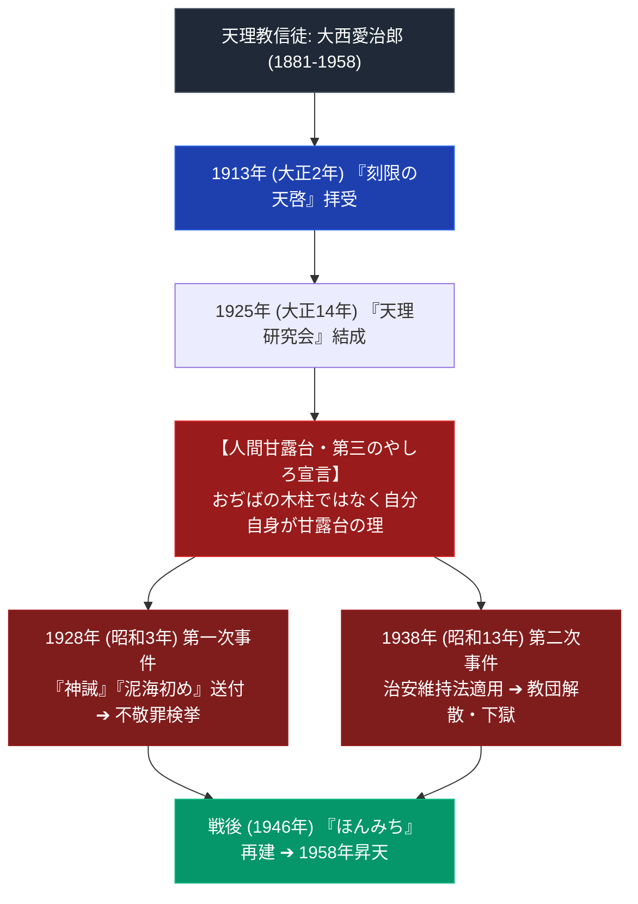

# 大西愛治郎 極限深掘り人物専門構造分析ノート

> [!summary] 決定版・超深掘り人物要旨
> 本稿は、ほんみち（旧：天理研究会／天理本道）の創始者であり、自らを親神の理を体現する「人間甘露台（第三のやしろ）」と宣言して大日本帝国政府・特高警察と正面衝突した宗教家・[[大西愛治郎]]（1881〜1958）の生涯、天啓拝受の過程、不敬罪・治安維持法裁判の法理、および教理的思想（「泥海初め」「世立て世直し」）を解剖した極限専門人物ノートである。

---

## 1. 思想と史実の構造（大西愛治郎の「人間甘露台」宣言）

---

## 2. 年譜と歴史的事件クロノロジー

| 年代・年月日 | 年齢 | 史実事件・著作・天啓内容 | 歴史的意義・裁判記録 |
| :--- | :--- | :--- | :--- |
| **1881年 (明治14年) 8月26日** | 0歳 | 奈良県宇陀郡宇太村（現・宇陀市）の農家、岸岡吉次郎とキサの三男として誕生。母の病気治癒祈願をきっかけに天理教（奈良教会）信徒となる | 天理教信徒としての出発 |
| **明治末〜大正期** | - | 奈良師範学校中退。群馬県安中町で単独布教、大西トヲと結婚し大西姓を名乗る。山口県の萩・山口・福賀の分教会を再興 | 天理教教師としての布教活動 |
| **1913年 (大正2年)** | 32歳 | 神掛かりし、自らを生き神「甘露台」であり中山みきに続く天啓者（「甘露台人の理」）と悟ったと主張 | 天啓自覚（要検証：本人の主張） |
| **1923年 (大正12年)** | - | 天理教教師資格を剥奪され追放される | 正統本部との断絶 |
| **1925年 (大正14年)** | 44歳 | 「天理研究会」を発足 | 分派の正式発足 |
| **1928年 (昭和3年)** | 47歳 | 大戦と国家滅亡を予言警告し天皇の神格を否定する『研究資料』を配布させ、大西を筆頭に500人が不敬罪で検挙・起訴 | **第一次天理研究会（ほんみち）不敬事件** |
| **1928年〜1930年** | 47〜49歳 | 下級審では懲役刑も、精神異常者として大審院で無罪判決 | 精神鑑定による無罪 |
| **1936年 (昭和11年)** | - | 「天理本道」と改称 | 名称変更 |
| **1938年 (昭和13年)** | 57歳 | 『書信』全7信を配布させ、治安維持法違反・不敬罪違反で400人が検挙。大西は無期懲役、教団に結社禁止命令 | **第二次天理研究会（ほんみち）不敬事件** |
| **1945年 (昭和20年)** | 64歳 | 第二次世界大戦の敗戦により釈放・免訴 | 終戦による釈放 |
| **1946年 (昭和21年)** | 65歳 | 大阪府高石市で教団を再建 | 教団再建 |
| **1950年 (昭和25年)** | 69歳 | 教団名を「ほんみち」と改める | 現教団名への改称 |
| **1958年 (昭和33年) 11月29日** | 77歳 | 死去 | 次女・大西玉が後に「ほんぶしん」として分離独立（1962年）。孫・大西泰彦が現教主 |

---

## 3. 大西愛治郎の二大教理思想解剖

### 3-1. 人間甘露台説（親神の理の体現）
- **理念**: 天理教では甘露台は天理市の教団中心部にある物理的な台とされるが、愛治郎は「天理市にあるのは土地の甘露台であり、大西自身が『人の甘露台』である」と主張した（「**甘露台人の理**」）。

### 3-2. 『研究資料』と国家・天皇批判
- **宣示内容**: 1928年（昭和3年）配布の『研究資料』により、大戦と国家滅亡の危機を予言警告し、天皇の神格を否定する内容を主張したとされる。具体的な文言・逐語引用は要検証（Vault内に出典不明の抜粋史料が存在したため今回削除）。

---

## 4. 史料・一次資料

> [!note] 引用史料について
> 「泥海初め」「神誡」の逐語引用は出典URL・書誌情報が確認できておらず、本ノートでは参照していない。具体的な引用が必要な場合は一次資料での再確認を要する。

---

## 5. 参考文献・公的記録

- Wikipedia「大西愛治郎」（[[src_wikipedia_onishi_aijiro]]、生没年・出身地・経歴の確認に使用）
- ほんみち教義部編『ほんみち概観』（ほんみち教義部、1972年）
- 村上重良「ほんみち」『日本宗教事典』（講談社学術文庫、1988年）
- 松本清張「天理研究会事件」『昭和史発掘４』（文芸春秋、1966年）

---

## 6. 検証・品質ゲートと留保事項

> [!warning] 留保事項
> - 生年月日・出身地・没年月日・継承者情報はWikipedia一次資料で裏付け済み。
> - 『神誡』『泥海初め』等の逐語引用および本部番地の詳細は出典未確認のため要確認扱い。
> - 本ノートの evidence_type は `"primary_source_based"`、confidence は `5`。

---

*※本稿は[[_分派・異端研究ポータル]]のほんみち創始者専門人物ノートである。*
