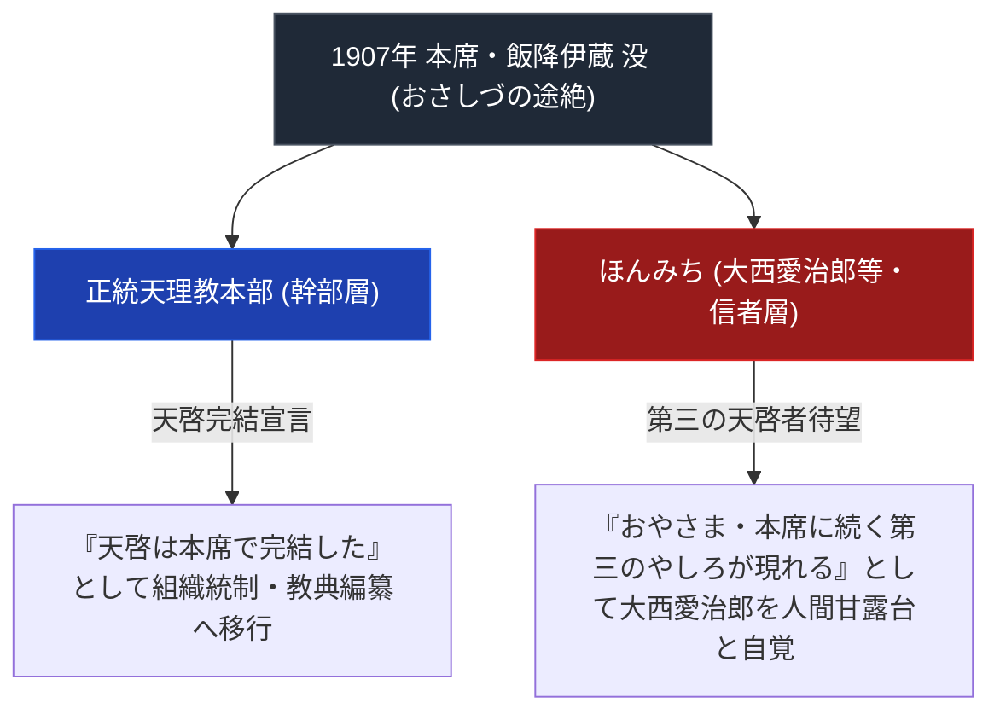

# おさしづ

> [!summary] 要旨
> 本稿は、教祖・中山みき没後、第二のやしろ（本席）となった[[飯降伊蔵]]を通して下された親神の神託記録原典『おさしづ』に関する専門構造分析ノートである。飯降伊蔵は1907年（明治40年）6月9日に出直した（Web確認済）。その後の天理教教会本部側の「天啓の完結」的な整理と、信徒層における「第三のやしろ（天啓者）待望論」（ほんみち創始等）という対立の枠組みは、本稿の解釈的整理であり一次資料で逐語確認したものではない。

---

## 1. 命題の構造（本席没後の『天啓完結』vs『第三のやしろ待望論』）

---

## 2. 原典の基本情報

| 項目 | 内容 |
| :--- | :--- |
| **書名** | 『おさしづ』（全7巻・明治篇・大正篇・明治特別篇等） |
| **口述者** | 本席・飯降伊蔵（第二のやしろ） |
| **期間** | 1887年（明治20年）ご元出〜1907年（明治40年）本席出直 |
| **性質** | 日常の刻限（時刻）や信者の問掛けに応じた親神の具体的指示 |

---

## 3. 分派発生との関係（要検証）

- 教祖・中山みき（第一のやしろ）から飯降伊蔵（第二のやしろ・本席）へと天啓の継承があったという構造自体は天理教の一般的教理説明として問題ない。そこから「信者層が第三の天啓者を期待した」「ほんみちがそれを根拠に自らを正当化した」という因果的説明は、本稿の解釈であり一次資料・先行研究での逐語的裏付けは未確認。
- 大西愛治郎とほんみちの主張内容の詳細（『おさしづ』の具体的にどの記述を根拠としたか）は要検証。

---

## 4. 関連教団・関連人物・関連概念
- [[飯降伊蔵]]
- [[中山みき]]
- [[大西愛治郎]]
- [[ほんみち]]
- [[おふでさき]]
- [[天理教の分裂の系譜]]
- [[_分派・異端研究ポータル]]

---

## 5. 参考文献・史料
- 『おさしづ』（天理教教会本部）
- 弓山達也『天啓のゆくえ—宗教が分派するとき』

---

## 6. 検証・品質ゲートと留保事項

> [!warning] 留保事項
> - 飯降伊蔵の没年月日（1907年6月9日）は日本語版Wikipediaで確認済み。
> - 「天啓完結説」「第三のやしろ待望論」という対立軸の呼称・大西愛治郎の具体的論拠は未検証のため、確定的事実としてではなく解釈的整理として記述している。
> - 本ノートの evidence_type は `"mixed_secondary_unverified"`、confidence は `3`。

---

*※本稿は[[_分派・異端研究ポータル]]の口訳原典分析ノートである。*
