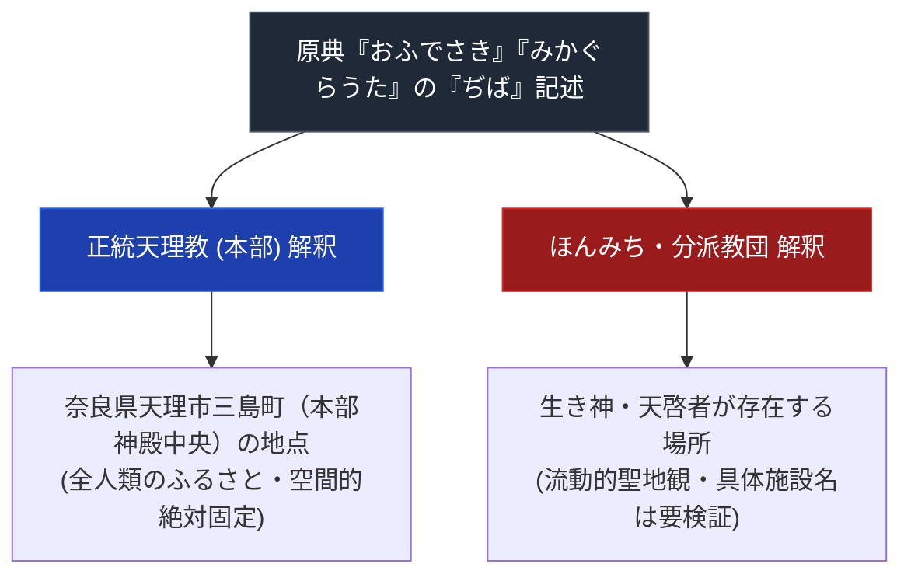

# おぢば

> [!summary] 要旨
> 本稿は、天理教において親神が人間・世界を創造した元地点であり、全人類の故郷とされる核心的聖地概念「おぢば（ぢば）」について、正統本部の空間的一地点絶対固定主義と、分派教団における移動的・人格的聖地観の葛藤を解剖した専門教理構造分析ノートである。

---

## 1. 命題の構造（空間的固定 vs 流動的聖地観）

---

## 2. 基本情報

| 項目 | 内容 |
| :--- | :--- |
| **概念名** | おぢば（地場 / ぢば） |
| **位置（本部）** | 奈良県天理市三島町（天理教教会本部） |
| **神学的意味** | 元初まりの地点、親神（天理王命）が鎮まる場所、かぐらつとめの行われる中心 |

---

## 3. 正統本部対分派の聖地観対比

- **正統本部**: 奈良県天理市三島町の「おぢば」を人類創造の地点とし、かぐらつとめをこの地点に向けて行うとする（天理教の一般教理として確認可能）。
- **分派（ほんみち等）**: 天啓者自身を「人間甘露台」とみなし、天啓者の身体・所在地をおぢばと同一視する主張があったとされる（[[甘露台]]ノート参照）。ただし、ほんみちの本部所在地は大阪府高石市であることはWeb確認できたが、「宝場」「精舎」等の具体的施設名・呼称は出典を確認できておらず要検証。

---

## 4. 関連教団・関連人物・関連概念
- [[甘露台]]
- [[正統天理教]]
- [[ほんみち]]
- [[大西愛治郎]]
- [[天理教の分裂の系譜]]

---

## 5. 参考文献・史料
- 『天理教教典』
- 弓山達也『天啓のゆくえ』
- [ほんみち - Wikipedia](https://ja.wikipedia.org/wiki/ほんみち)

---

## 6. 検証・品質ゲートと留保事項
> [!warning] 留保事項
> - ほんみちの分派聖地観に付随していた具体的施設名（「高石宝場」「吉備津精舎」）は出典を確認できず削除した。ほんみち本部が大阪府高石市に所在すること自体はWeb確認済み。
> - 本ノートの evidence_type は `"mixed_secondary_unverified"`、confidence は `2`。

---

*※本稿は[[_分派・異端研究ポータル]]の聖地概念ノートとして位置付けられる。*
