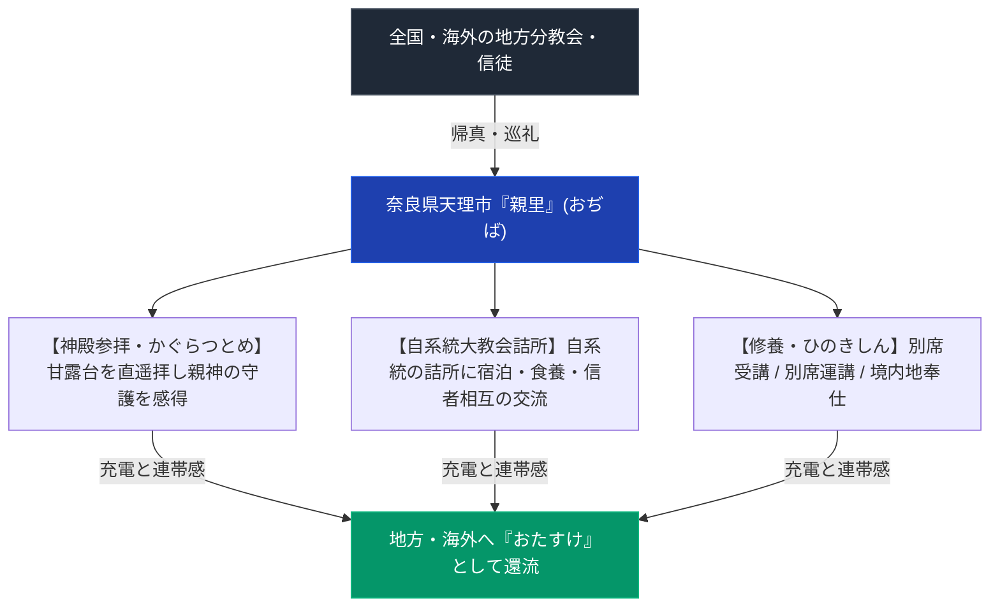

# おぢばがえりと親里詰所建築群 専門構造分析ノート

> [!summary] 要旨
> 本稿は、全世界の信徒が人類発祥の故郷「おぢば」へ還る巡礼儀礼「おぢばがえり（帰真）」の心理・社会的メカニズムと、親里（奈良県天理市）の広大な敷地に網の目のように建ち並ぶ全国各系統「大教会詰所（つめしょ）群」の建築社会学を解剖した専門ノートである。

---

## 1. 命題の構造（おぢばがえりの空間的・社会的循環）

| 項目 | 分析内容 |
| :--- | :--- |
| **帰真の意義** | 単なる「旅行」ではなく、魂の故郷・生みの親の元へ帰る「実家への帰省」観 |
| **詰所（つめしょ）の機能** | 全国の系譜別大教会が親里に保持する自前の宿泊・生活・指導施設（個別の詰所名は要検証） |
| **年間行事** | 1月26日「春季大祭」、4月18日「教祖誕生祭」、10月26日「秋季大祭」（天理教公式サイトで日付確認済）、7-8月「こどもおぢばがえり」 |

---

## 2. 親里詰所建築群の構造と都市社会学

- **詰所ネットワーク**: 親里内には、全国の直属大教会に対応する「詰所」が存在する（系統数「約300」は出典を確認できず要検証）。
- **詰所の機能**:
  1. **宿泊・食事の無償的提供**: 信徒が親里滞在中に安価・無償で宿泊・食餌をとる生活の拠点。
  2. **系統的連帯感の強化**: 地方から集まった同系統の信徒が寝食をともにし、信仰的絆を再確認する場所。
  3. **教育・錬成の場**: 詰所内での朝夕のおつとめ、講話、別席（おさづけ拝受）への送り出し。

---

## 3. 史料・一次資料 (ConvMD)

- [[src_ofudesaki_select]]：『おふでさき』核心歌抜粋史料MD（おぢばの理）
- [[src_osashizu_select]]：『おさしづ』核心刻限のおさしづ史料MD

---

## 4. 関連教団・関連人物・関連概念
- [[宗教都市天理の誕生と神殿建築]]
- [[奈良以外の甘露台と異端甘露台一覧]]
- [[天理教麹町大教会]]
- [[天理教愛町分教会]]
- [[_分派・異端研究ポータル]]

---

## 5. 検証・品質ゲートと留保事項

> [!warning] 留保事項
> - 年間祭典日（1/26・4/18・10/26）は天理教公式サイトでWeb確認済み。
> - 本部所在地の詳細番地・郵便番号、詰所系統数（約300）、個別詰所名の具体的機能配分は出典未確認のため要検証・一部削除した。
> - 本ノートの evidence_type は `"mixed_secondary_unverified"`、confidence は `3`。

---

*※本稿は[[_分派・異端研究ポータル]]の巡礼文化・詰所建築分析ノートである。*
