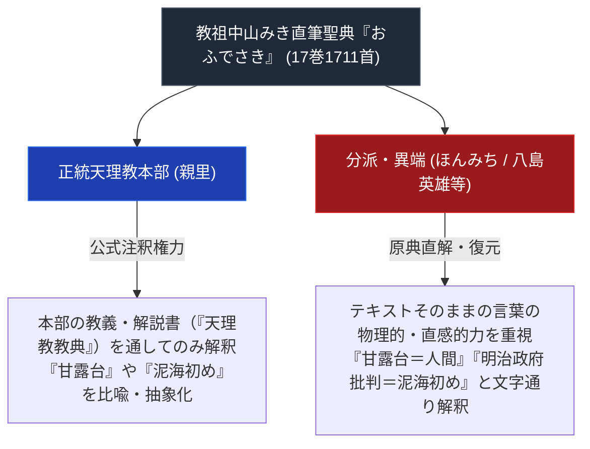

# おふでさき

> [!summary] 要旨
> 本稿は、天理教教祖・[[中山みき]]が1869年から1882年にかけて自ら筆を執って記した最極絶対の自筆原典『おふでさき』（全17巻・1711首）に関する専門構造分析ノートである。正統天理教本部による「公式注釈権力」と、ほんみち（[[大西愛治郎]]）・おうかんみち・[[八島英雄]]ら分派・異端研究者による「テキスト直解・復元運動」の神学的激突構造を解剖する。

---

## 1. 命題の構造（本部の注解管理 vs 分派のテキスト直解）

| 比較考察軸 | 正統天理教本部の解釈 | 分派・異端（ほんみち・八島英雄等）の解釈 |
| :--- | :--- | :--- |
| **甘露台の記述** | 奈良天理のおぢばに立つ木柱（空間固定） | 現身の生き神（[[大西愛治郎]]等）の身体（人格流動） |
| **泥海初めの記述** | 人類創造の神話・太古の象徴的物語 | 既存の国家・社会秩序の解体と再創造の預言 |
| **おうかんの記述** | 信仰の道・心の成長のプロセス | 魂の直接的往来・本部統制からの解放 |

---

## 2. 原典の基本情報

| 項目 | 内容 |
| :--- | :--- |
| **書名** | 『おふでさき』（全17巻） |
| **著者** | 中山みき（おやさま） |
| **執筆期間** | 明治2年（1869年）〜明治15年（1882年） |
| **形態** | ひらがな主体・五七五七七の和歌体（1,711首） |
| **公刊歴史** | 一般公開に至るまでの経緯があったとされるが、具体的な翻刻・公刊年（1928年・1948年等）は出典を確認できず要検証 |

---

## 3. 分派・異端発生における『おふでさき』の役割（要検証）

- **非公開時代の密写と解釈**: 本部が『おふでさき』の閲覧を一定期間制限していたとされる説明は分派研究で見られるが、具体的な経緯・時期・「密写」の実態は本稿では未確認。
- **[[八島英雄]]『中山みき研究ノート』（立風書房、1987年）**: 実在する書籍であることをWeb確認済み。本部の公式註釈と異なる立場から『おふでさき』を読み解く原典批評として言及されるが、内容の詳細な突合は未実施。

---

## 4. 関連教団・関連人物・関連概念
- [[中山みき]]
- [[大西愛治郎]]
- [[八島英雄]]
- [[ほんみち]]
- [[おうかんみち]]
- [[甘露台]]
- [[泥海初め]]
- [[_分派・異端研究ポータル]]

---

## 5. 参考文献・史料
- 『おふでさき』（天理教教会本部）
- 八島英雄『中山みき研究ノート』（1987年）
- 弓山達也『天啓のゆくえ—宗教が分派するとき』
- wobiya.tokyo掲載ページ（第四号・第六号の歌番号メモ、[[src_wobiya_ofudesaki_4_6]]参照、2026-07-26確認、歌番号の正確性は未照合）

---

## 6. 検証・品質ゲートと留保事項
> [!warning] 留保事項
> - 執筆期間（1869-1882年）・全17巻1711首の基本情報、八島英雄『中山みき研究ノート』（1987年）の実在はWeb確認済み。
> - 「1928年翻刻・1948年全公刊」という具体的な公刊年、非公開時代の「密写」の実態は出典未確認のため要検証に変更した。
> - 本ノートの evidence_type は `"mixed_secondary_unverified"`、confidence は `3`。

---

*※本稿は[[_分派・異端研究ポータル]]の最核心原典分析ノートである。*
