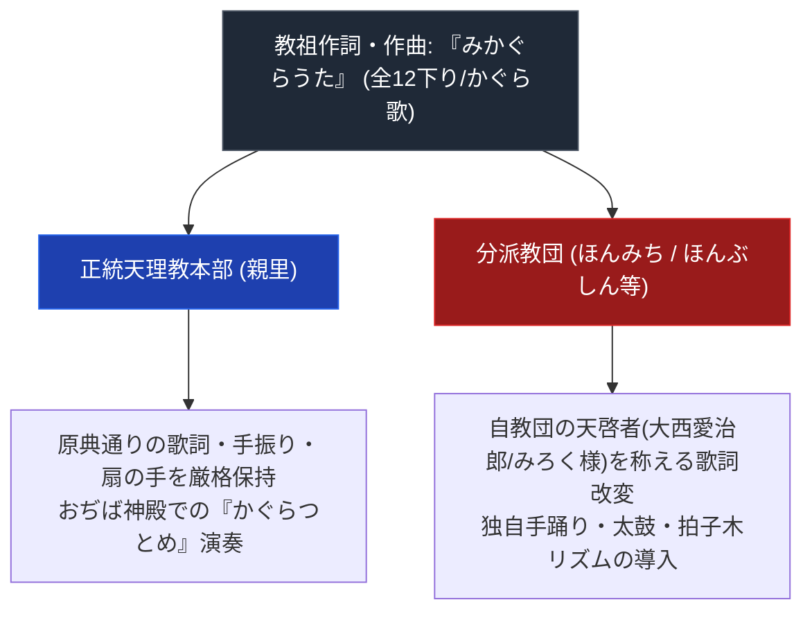

# みかぐらうた 専門構造分析ノート

> [!summary] 要旨
> 本稿は、教祖・[[中山みき]]が1866〜1882年にかけて自ら作詞・作曲し、手踊りの振付を授けた天理教の根本唱歌聖典『みかぐらうた』の構造解剖ノートである。正統本部のおつとめ歌（神楽歌・十二下り）と、ほんみち（[[大西愛治郎]]）やほんぶしん（[[大西玉]]）等の分派で独自改変された「つとめ歌」の比較分析を網羅する。

---

## 1. 命題の構造（正統本部の『みかぐらうた』 vs 分派の独自唱歌改変）

| 項目 | 正統天理教本部 | ほんみち (高石) | ほんぶしん (吉備津) |
| :--- | :--- | :--- | :--- |
| **かぐら歌** | 「あしきをはらふて助けたまへ...」 | 原典を基盤としつつ大西愛治郎の理を追加 | みろく歌・独自のおつとめ歌 |
| **手踊り・楽器** | 鳴物九種（太鼓・鼓・拍子木・三味線・箏・胡弓・笛・ちゃんぽん等） | 本道つとめ用の独自楽器・リズム | 精舎での修養・瞑想つとめ |
| **甘露台の理** | おぢば中央の木柱を中心に踊る | 人間甘露台を中心に捧げるつとめ | 独自神殿でのつとめ（施設名は要検証） |

---

## 2. 基本情報

| 項目 | 内容 |
| :--- | :--- |
| **聖典名** | 『みかぐらうた』 |
| **成立時期** | 1866年（慶応2年）〜1882年（明治15年） |
| **著者・授言者** | [[中山みき]] |
| **構成** | かぐら歌（第一歌〜第三歌）、十二下り（第一下り〜第十二下り） |
| **儀礼の現場** | 奈良県天理市親里神殿 |

---

## 3. 構成と核心歌抜粋

### 3-1. 第一歌（あしきはらいの歌）
> **「あしきをはらふて たすけたまえ 天理王命」**  
> （悪しき心を払い、親神の守護によって世界を救済することを祈願する最核心歌。）

### 3-2. 第三歌（よろづたすけの歌）
> **「あしきをはらふて たすけせかいひろめよ」**  
> **「いちろついたる かんろだい」**

---

## 4. 特徴

- 唱歌を歌いながら手踊りを行う点は天理教のおつとめの基本形式として一般に知られる。
- 旋律・言語的特徴（わらべ歌・雅楽調との関係等）の詳細な音楽学的分析は本稿では未検証。

---

## 5. 史料・一次資料 (ConvMD)

- [[src_ofudesaki_select]]：『おふでさき』核心歌抜粋史料MD
- [[src_osashizu_select]]：『おさしづ』核心刻限のおさしづ史料MD

---

## 6. 関連教団・関連人物・関連概念
- [[おふでさき]]
- [[おさしづ]]
- [[中山みき]]
- [[ほんみち]]
- [[ほんぶしん]]
- [[奈良以外の甘露台と異端甘露台一覧]]
- [[_分派・異端研究ポータル]]

---

*※本稿は[[_分派・異端研究ポータル]]の聖典・おつとめ歌分析ノートである。*
