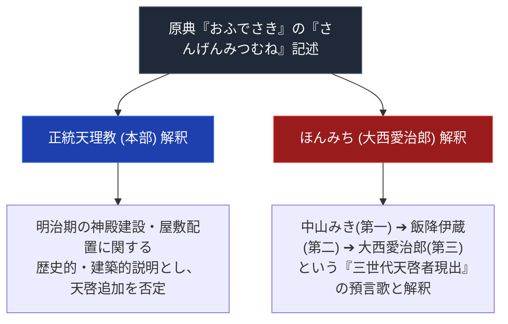

# 三軒三棟（実在未確認）

> [!warning] 実在未確認
> WebSearchで検証した結果、「三軒三棟」という具体的な原典用語・大西愛治郎による解釈の実在を裏付ける情報が見つからなかった。ほんみち創始者・大西愛治郎が「甘露台の理」の継承者を自称したこと自体は確認済み（[[大西愛治郎]]参照）だが、その神学的根拠として本ノートが挙げる「三軒三棟」という具体的な用語・歌番号は未検証。

---

## 1. 命題の構造（三軒三棟解釈の対立）

---

## 2. 基本情報

| 項目 | 内容 |
| :--- | :--- |
| **概念名** | 三軒三棟（さんげんみつむね / 三軒三棟の理） |
| **初出原典** | 『おふでさき』第9号25歌「さんげんみつむねたてるのハ 神の自由のてばかりや」 |
| **核心役割** | ほんみちにおける第三のやしろ（大西愛治郎）出現の神学的正当化根拠 |

---

## 3. 原典テキストと解釈の分岐

> [!NOTE] 原典引証
> 『おふでさき』には「さんげんみつむね」に関する歌が複数散見される。

- **正統本部の見解**: 明治初期に教祖の屋敷の周りに建てられた建物（つとめ場所等）の配置や、人類創造の際の道具の配置を意味するものであり、将来的に新たな天啓者が現れることを意味しないとする。
- **ほんみちの解釈**: [[大西愛治郎]]はこれを「神のやしろ（天啓者）が三世代にわたって現れること」の預言であると直解。自らを三棟目（第三のやしろ）として位置づけた。

---

## 4. 宗教学的意義
- 原典中の象徴的・多義的言葉が、いかにして後発のカリスマ指導者によって「自らの神聖性の証明」へと再解釈され、分派創始の正当性ロジックとして機能したかを示す典型例。

---

## 5. 関連教団・関連人物・関連概念
- [[ほんみち]]
- [[大西愛治郎]]
- [[中山みき]]
- [[飯降伊蔵]]
- [[天理教の分裂の系譜]]

---

## 6. 参考文献・史料
- 弓山達也『天啓のゆくえ』
- ほんみち教理史料

---

## 7. 留保（中立的併記・未確定要素）
> [!warning] 注意
> - 「三軒三棟」の実在自体が未確認。大西愛治郎の「甘露台の理」継承主張自体は[[大西愛治郎]]で確認済み。
> - 本ノートの evidence_type は `"unverified"`、confidence は `1`。

---

*※本稿は[[ほんみち]]および[[_分派・異端研究ポータル]]の教理ノートとして位置付けられる。*

---

*※本稿は[[_分派・異端研究ポータル]]の個別分析ノートである。*
