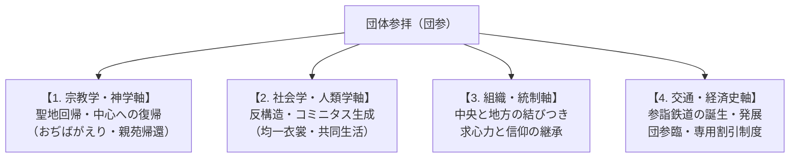

# 団体参拝 専門構造分析ノート（増補改訂版）

> [!summary] 要旨
> **団体参拝**（だんたいさんぱい、略称：**団参**〈だんさん〉）とは、宗教教団や伝統寺社において、講・支部・教会などの信徒組織が集団を形成し、本山・総本山・中心聖地へ参詣する集団的巡礼実践。近世の伊勢講・富士講等の民俗的参詣を歴史的先条とし、明治以降の「参詣鉄道」の発達や昭和のモータリゼーション（貸切バス）と結合して高度に制度化された。宗教学的には、日常の世俗空間から離脱して「中心（聖地）」へと回帰し、集団的連帯（ヴィクター・ターナーの謂う**コミニタス**）と教団組織の求心力を再生成する決定的な信仰装置として機能している。

---

## 1. 多角的な概念分析軸

団体参拝は単なる「移動手段・ツアー」にとどまらず、宗教・社会・交通・経済が複雑に交錯する複合的現象である。



| 分析領域 | 核心的な機能とメカニズム |
| :--- | :--- |
| **宗教学・空間神学** | **聖地中心主義と「帰還」観**: 参拝者を日常の世俗的・地理的周縁から宇宙の中心（聖地）へと引き戻す。天理教の「おぢばがえり」や真如苑の「親苑帰還」のように、「行く」のではなく原初・人類の故郷へ「帰る」神学的意味が付与される。 |
| **社会人類学（V. ターナー理論）** | **コミニタス（Communitas）の生成**: 旅の途上や宿坊・詰所での共同生活において、日常の社会的地位・階層（職業・年齢・経済力）が一時的に解消される（反構造）。同一のハッピ（法被）や白衣の着用を通じ、水平的で平等な強力な集団的連帯感が形成される。 |
| **教団組織論** | **求心力の維持と末端統制**: 全国に拡散した末端組織（教会・講社・支部）から定期的に信徒を集団輸送することで、教団中央の理念や最新の方針（大祭・年祭）をダイレクトに浸透・再充填させる。 |
| **交通史・地域経済史** | **「参詣鉄道」とインフラの相利共生**: 大手私鉄（近鉄・阪急・南海・京阪・一畑電車等）の多くは参詣客輸送を創業基盤（参詣鉄道）として発達した。また国鉄・JRと教団の間で「団参割引（団参券）」や大量の臨時列車（団臨）が運用されてきた。 |

---

## 2. 歴史的展開クロノロジー

### 2-1. 近世（江戸時代）：講運動と集団参詣の原型
* **伊勢講・富士講・大山講・金比羅講**: 地域や職能組合単位で積立金（講金）を出し合い、くじ引き等で選ばれた代参者や集団が聖地を目指した。
* **世俗と聖性の融合**: 参詣旅は信仰実践であると同時に、名所図会や道中記を携えた「物見遊山（観光・娯楽）」の側面を併せ持っていた。

### 2-2. 近代（明治〜昭和戦前）：鉄道網の整備と「参詣鉄道」の誕生
* **私鉄の開拓と聖地結びつき**: 大阪電気軌道（現・近鉄）、阪神、京阪、南海、一畑電車、水間鉄道などが、寺社・聖地参拝（伊勢神宮、生駒聖天、成田山、高野山、出雲大社等）の需要を見込んで路線を拡張。
* **新宗教の台頭と大量輸送**: 天理教や金光教が全国拡大するにつれ、定期列車では対応しきれない大量の参拝者を輸送するため、国鉄・私鉄との交渉により専用臨時列車が運転され始める。

### 2-3. 現代（戦後〜高度経済成長期）：団参列車・臨車（臨臨）の黄金期
* **「天理臨」「金光臨」「大石寺臨（身延臨）」の満花**: 昭和30〜50年代、国鉄（現・JR）の寝台電車（583系）、気動車（キハ181系等）、客車（12系・14系・20系等）を動員し、北海道・東北・九州等から本山へ直行する夜行臨時列車が多数仕立てられた。
* **モータリゼーションと「団参バス」の爆発的増加**: 高速道路網の整備に伴い、地方の教会・支部から本山へ直行する貸切大型観光バス（団参バス）が定着。

### 2-4. 平成〜令和（現代）：インフラ変容とオンライン参拝の台頭
* **国鉄型車両の全廃と団参列車の衰退**: JRの車両老朽化、臨時列車ダイヤ設定の困難化、コスト上昇により、鉄道による団臨は激減。近鉄等一部を除き、参拝手段は貸切バスや自家用車へ移行。
* **信徒の高齢化と個人参拝化**: 長距離の夜行バス・合宿型参拝の負担から、少人数・個人参拝への変化、さらにはコロナ禍以降のYouTubeライブ配信やリモート祈祷等「オンライン参拝」とのハイブリッド化が進む。

---

## 3. 宗教学的解剖：参拝過程における「共同空間」と宗教体験

団体参拝の核心は、移動の「道中」および聖地での「共同宿泊」における宗教的密度の高さにある。

```
[世俗の日常] ──(出発・ハッピ着用)──> [旅・車中（法座・感話・歌）]
                                              │
[日常へ復帰] <──(解散・聖性持ち帰り)── [お詰所・宿坊（共食・作務・夜の語らい）]
```

### 3-1. 車中・移動空間における宗教的高揚
* **車内法座・感話（かんわ）**: バスや列車の車内は、単なる移動時間ではなく「移動する教会」と化す。信徒同士による「お助けの体験談」「体験発表」「お説教の拝聴」が行われ、感情的共感が極限まで高められる。
* **教歌・讃歌の合唱**: 教団特有の歌（天理教の「みかぐらうた」や各種教歌）を車内で合唱し、一体感を補強する。

### 3-2. 「お詰所」「宿坊」における合宿構造
* **天理教の「詰所（つめしょ）」網**: 天理市内には約150の大教会詰所が立ち並び、数万人規模の参拝者を一度に収容・宿泊させる能力を持つ。
* **神人共食（一釜の飯）**: 詰所や宿坊で同じ食事（カレーや大鍋料理等）を全員で分け合って食べる「共食（きょうしょく）」行為が、擬似家族的な連帯感を強固にする。
* **ひのきしん・作務（奉仕活動）**: 参拝中、境内の清掃や給仕、雑務を自発的な奉仕（天理教の「ひのきしん」、仏教系の「作務」）として行うことで、自他の執着を離れる宗教的修行の実践とされる。

---

## 4. 主要教団の団体参拝構造比較マトリクス

| 教団名 | 聖地・本山 | 参拝の名称 | 主な交通手段 | 宿泊・滞在施設 | 特記事項・歴史的背景 |
| :--- | :--- | :--- | :--- | :--- | :--- |
| **[[天理教]]** | 奈良県天理市<br>（親里・おぢば） | **おぢばがえり** | 近鉄特急・直通臨<br>JR「天理臨」<br>おぢばがえりバス | 大教会詰所（約150箇所） | 近鉄「団参券」制度あり。毎月26日・こどもおぢばがえり（7-8月）に最大化。日本最大の団参網。 |
| **[[金光教]]** | 岡山県浅口市<br>（金光本部） | **金光参拝** | JR「金光臨」<br>参拝バス | 信徒会館・宿坊 | かつてJR金光駅には参拝者専用の「団体専用改札（旧・南口臨時改札）」が設置されていた（2020年に常設南口改札に改修）。春秋の大祭に多数参拝。 |
| **[[日蓮正宗]]** | 静岡県富士宮市<br>（大石寺） | **大石寺登山** | 登山バス（貸切）<br>旧・身延線「富士号」 | 宿坊群（大石寺境内） | かつて創価学会員による巨大な列車・バス登山を展開。和合解消後は法華講主導のバス登山中心へ。 |
| **[[創価学会]]** | 東京都新宿区<br>（信濃町・大誓堂） | **本部参拝** | 地区・支部単位の<br>貸切大型バス | ホテル・日帰り | 広宣流布大誓堂参拝、各地の研修道場、富士美術館等への研修バスツアーを展開。 |
| **[[立正佼成会]]** | 東京都杉並区<br>（本部大聖堂） | **本部参拝** | 本部参拝バス<br>（夜行・昼行） | 会会館・研修道場 | 全国の教会から大型バスをチャーター。車内での「法座（み教えの対話）」が特徴。 |
| **[[真如苑]]** | 東京都立川市<br>（応現院・親苑） | **親苑帰還** | 直行参拝バス<br>立川駅シャトルバス | 日帰り・近隣宿泊 | 応現院への大規模集補。立川駅からのバス輸送ラインが高度にシステム化されている。 |
| **[[阿含宗]]** | 京都府京都市山科区<br>（阿含宗本山） | **星まつり参拝** | 全国ツアーバス<br>臨時参拝バス | 日帰り・京都市内宿泊 | 毎年2月の「阿含の星まつり（柴燈護摩）」に合わせ、全国から数百台規模のバスが集結。 |

---

## 5. 近現代交通史と「参詣鉄道」の相互依存関係

### 5-1. 近畿日本鉄道（近鉄）と天理教・伊勢神宮
* **参詣鉄道としての近鉄**: 近鉄の前身である大阪電気軌道（大軌）や参宮急行電鉄（参急）は、生駒聖天、天理教本部、伊勢神宮への参拝客輸送を最大の目的として路線を敷設した。
* **団参券制度**: 近鉄は天理教の団体参拝客に対して専用の割引制度（「天理教団体参拝乗車券」）を発行しており、一般的な旅行商品とは異なる宗教専用の割引体系を現在も維持している。

### 5-2. 国鉄・JRの「教団臨（臨臨）」の技術史
* **専用車両の動員**: かつて国鉄は、多客期に全国から客車や電車をかき集め、「天理臨」「金光臨」「身延臨」に投入した。特に寝台車と座席車を転換できる583系特急形寝台電車や、12系・14系客車は、長距離団参の象徴的車両であった。

---

## 6. 現代における課題と将来展望

1. **団参列車の終焉とバス・自家用車への完全移行**:
   JRの車両老朽化・国鉄型形式の全廃により、鉄道による長距離団臨はほぼ姿を消した。現在は貸切バスおよび自家用車（マイカー）での参拝が主流となっている。
2. **少子高齢化と参拝体力の低下**:
   信徒層の高齢化に伴い、長距離の車中泊や大部屋での合宿型参拝を回避し、日帰りや少人数での快適な参拝を好む傾向が強まっている。
3. **デジタル技術と「リモート参拝」の浸透**:
   COVID-19パンデミック以降、各教団とも大祭や法要のYouTubeライブ配信やZoomによる遠隔参拝を導入。物理的移動を伴う「団体参拝」の必然性が問われる一方で、「生の聖地空間における体験」の希少価値が再評価される二極化が進んでいる。

---

## 7. 関連教団・関連人物・関連概念

### 関連教団
- [[天理教]]
- [[金光教]]
- [[日蓮正宗]]
- [[創価学会]]
- [[立正佼成会]]
- [[パーフェクトリバティー教団]]
- [[真如苑]]
- [[阿含宗]]

### 関連概念
- 巡礼 / コミニタス / 聖地 / 詰所 / おぢばがえり / 団参券 / 参詣鉄道 / 天理臨 / 金光臨 / 合宿 / ひのきしん / 作務

---

## 8. 史料・参考文献

- 弓山達也『現代宗教と交通文化 : 移動する聖地』
- ヴィクター・ターナー（Victor Turner）『儀礼の過程』（シンボル・構造・反構造）
- 近畿日本鉄道『近畿日本鉄道100年史』（2010年）
- 天理教道庁『天理教事典』（天理教道庁）
- 井上順孝『新宗教の解読』（ちくま学芸文庫）

---

## 9. 関連ノート (Vault内)

- [[_分派・異端研究ポータル]]
- [[天理教]]
- [[金光教]]
- [[おぢばがえりと親里詰所建築群]]

---

## 10. 検証・品質ゲートと留保事項

> [!warning] 留保事項
> - 本ノートは特定の宗教団体の参拝形態を肯定・否定するものではなく、宗教学・社会学・交通史の観点から客観的ファクトに基づき分析したものである。
> - 各教団の団体参拝の実施頻度・規模・利用交通機関は、社会状況や感染症対策等によって変動するため、最新の実施状況は各教団・鉄道会社の公式発表を参照のこと。

---

*※本稿は[[_分派・異端研究ポータル]]の概念・交通・信仰実践構造分析ノートである。*
