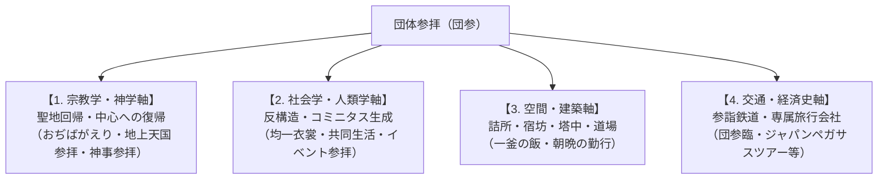

# 団体参拝 専門構造分析ノート（増補改訂第5版）

> [!summary] 要旨
> **団体参拝**（だんたいさんぱい、略称：**団参**〈だんさん〉）とは、宗教教団や伝統寺社において、講・支部・教会などの信徒組織が集団を形成し、本山・総本山・中心聖地へ参詣する集団的巡礼実践。近世の伊勢講・富士講等の民俗的参詣を歴史的先条とし、明治以降の「参詣鉄道」の発達や昭和のモータリゼーション（貸切バス）と結合して高度に制度化された。聖地における**「詰所（つめしょ）」「宿坊（しゅくぼう）」「修養道場」**等の集団宿泊施設、[[世界救世教]]の熱海・瑞雲郷や箱根・神仙郷にみられる**美の聖地への集団参拝**、[[大本]]の**二大聖地（綾部・亀岡）巡拝**、さらには[[ワールドメイト]]における**直営旅行会社（ジャパンペガサスツアー）による専属参拝バスツアー**など、世俗の日常から離脱した信徒が集団的連帯（ヴィクター・ターナーの謂う**コミニタス**）と聖性を再充填するための核心的空間装置として機能している。

---

## 1. 多角的な概念分析軸

団体参拝は単なる「移動手段・ツアー」にとどまらず、宗教・社会・交通・建築・経済が複雑に交錯する複合的現象である。

| 分析領域 | 核心的な機能とメカニズム |
| :--- | :--- |
| **宗教学・空間神学** | **聖地中心主義と「帰還」観**: 参拝者を日常の世俗的・地理的周縁から宇宙の中心（聖地）へと引き戻す。天理教の「おぢばがえり」、真如苑の「親苑帰還」、世界救世教の「地上天国（瑞雲郷・神仙郷）参拝」、ワールドメイトの「皇大神御社・全国神社参拝」のように、原初・人類の故郷へ「帰る」神学的意味が付与される。 |
| **社会人類学（V. ターナー理論）** | **コミニタス（Communitas）の生成**: 旅の途上や宿坊・詰所での共同生活において、日常の社会的地位・階層（職業・年齢・経済力）が一時的に解消される（反構造）。同一のハッピ（法被）や白衣の着用を通じ、水平的で平等な強力な集団的連帯感が形成される。 |
| **建築・都市社会学** | **「詰所」「宿坊」による宗教都市景観**: 聖地周辺に集積する大部屋・大食堂・拝礼場を備えた特有の宿泊施設網。天理市の約150の大教会詰所網や大石寺の塔中（坊）群が独自の都市景観を形成。 |
| **交通史・経済手配軸** | **「参詣鉄道」と直営旅行会社の手配網**: 大手私鉄の参詣路線開拓や、教団直営・関連の旅行会社（ワールドメイトのジャパンペガサスツアー等）による参拝バス手配のインフラ化。 |

---

## 2. 歴史的展開クロノロジー

### 2-1. 近世（江戸時代）：講運動と集団参詣の原型
* **伊勢講・富士講・大山講・金比羅講**: 地域や職能組合単位で積立金（講金）を出し合い、くじ引き等で選ばれた代参者や集団が聖地を目指した。
* **御師（おし・おんし）と講社旅館**: 門前町で参詣客の祈祷・宿泊・案内を一身に担った「御師（師職）」が、現代の宿坊・詰所や旅行代理店のプロトタイプとなった。

### 2-2. 近代（明治〜昭和戦前）：鉄道網の整備と「参詣鉄道」の誕生
* **私鉄の開拓と聖地結びつき**: 大阪電気軌道（現・近鉄）、阪神、京阪、南海、一畑電車などが、寺社・聖地参拝の需要を見込んで路線を拡張。
* **新宗教の台頭と大量輸送**: 天理教、金光教、大本が全国拡大するにつれ、定期列車では対応しきれない大量の参拝者を輸送するため、鉄道会社との交渉により専用臨時列車や参拝船・参拝バスが運転され始める。

### 2-3. 現代（戦後〜高度経済成長期）：団参列車・臨車（臨臨）の黄金期
* **「天理臨」「金光臨」「大石寺臨（身延臨）」の満花**: 昭和30〜50年代、国鉄（現・JR）の寝台電車（583系）や客車を動員し、全国から本山へ直行する夜行臨時列車が多数仕立てられた。
* **モータリゼーションと「団参バス」の爆発的増加**: 高速道路網の整備に伴い、地方の教会・分宣教所から本山へ直行する貸切大型観光バス（団参バス）が定着。

### 2-4. 平成〜令和（現代）：インフラ変容とエンターテインメント型ツアーの台頭
* **国鉄型車両の全廃と団参列車の衰退**: JRの車両老朽化・国鉄型形式の全廃により、鉄道による長距離団臨はほぼ姿を消した。現在は貸切バスおよび自家用車（マイカー）での参拝が主流となっている。
* **教団直営旅行会社による神事ツアー**: ワールドメイトの「ジャパンペガサスツアー」のように、教団親会社・関連の旅行会社が全国の有名神社や総本部・イベント会場へ向けて参拝バスツアーを一括手配する形態が登場。

---

## 3. 主要教団における団体参拝構造と交通インフラ

### 3-1. [[天理教]]（おぢばがえり・親里参拝）
* **特徴**: 日本で最も体系化された団体参拝構造を持つ。「帰る」という表現（おぢばがえり）を用い、親里（天理市）への参拝を信仰の根本に置く。
* **鉄道交通**: 近畿日本鉄道（近鉄）は天理線を中心に毎月26日の月次祭や「こどもおぢばがえり（7月下旬〜8月上旬）」等に合わせて臨時特急や直通列車を大量運行。近鉄には独自の「天理教団体参拝割引（団参券）」が存在する。

### 3-2. [[金光教]]（本部参拝・金光臨）
* **特徴**: 岡山県浅口市金光町の本部神殿への参拝。
* **鉄道交通**: JR山陽本線金光駅への団体専用列車「金光臨」が昭和から平成にかけて多数運行された。金光駅には参拝者専用の「団体専用改札（旧・南口臨時改札、2020年に常設南口に改修）」が設置されていた。

### 3-3. [[大本]]（二大聖地参拝・本部参拝バス）
* **二大聖地**: **京都府綾部市（梅松苑）**：神殿・長生殿を擁する発祥の聖地。**京都府亀岡市（天声山・旧亀山城跡）**：宣教・芸術活動・機構の中心聖地。
* **参拝バス構造**: 全国の分宣教所・地方本部・愛善会等から、2月の「節分大祭」、5月の「みろく大祭」、8月の「瑞恩感謝祭」などの大祭に合わせて大型貸切バス（「本部参拝バス」「大祭参拝バス」）が運行される。

### 3-4. [[ワールドメイト]]（神事参拝・ジャパンペガサスツアー）
* **特徴**: 教祖・深見東州（半田晴久）が代表取締役社長を務める旅行会社**「株式会社ジャパンペガサスツアー（JPT）」**が専属で移動・参拝バスを手配。
* **参拝形態**: 静岡県伊豆の国市の総本部「皇大神御社」参拝のほか、鹿島神宮・香取神宮・伊勢神宮や全国の霊山（阿蘇山・富士山等）への「神事参拝バスツアー」を定期的に運行。コスプレ・ギャグを交えたイベントと神社参拝がセットになった「エンターテインメント型団参」の形態をとる。

### 3-5. [[日蓮正宗]]・旧[[創価学会]]（大石寺登山）
* **特徴**: 静岡県富士宮市の総本山大石寺への「登山（参拝）」。
* **鉄道・バス交通**: かつて創価学会が日蓮正宗の法華講組織であった時代、大規模な「大石寺登山臨時列車（富士号等）」が運行された。現在は法華講主導の「登山バス（貸切バス）」中心へ移行。

### 3-6. [[世界救世教]]系（熱海・瑞雲郷／箱根・神仙郷参拝）
* **創始者と聖地**: [[岡田茂吉]]造営の**熱海・瑞雲郷**（MOA美術館）および**箱根・神仙郷**（箱根美術館）への参拝。美と信仰の融合。
* **交通手段**: 全国の教会・支部から直行する「熱海・箱根参拝バス」や東海道新幹線ラインが確立。[[神慈秀明会]]等も重視。

---

## 4. 主要教団の団体参拝構造比較マトリクス

| 教団名 | 聖地・本山 | 参拝の名称 | 主な交通手段 | 宿泊・滞在施設 | 特記事項・歴史的背景 |
| :--- | :--- | :--- | :--- | :--- | :--- |
| **[[天理教]]** | 奈良県天理市 （親里・おぢば） | **おぢばがえり** | 近鉄特急・直通臨 JR「天理臨」 おぢばがえりバス | **大教会詰所**（約150箇所） | 近鉄「団参券」制度あり。毎月26日・こどもおぢばがえり（7-8月）に最大化。日本最大の詰所網。 |
| **[[金光教]]** | 岡山県浅口市 （金光本部） | **金光参拝** | JR「金光臨」 参拝バス | **信徒会館・宿（宿社）** | かつてJR金光駅には参拝者専用の「団体専用改札（旧・南口臨時改札）」が設置されていた（2020年に常設改修）。 |
| **[[大本]]** | 京都府綾部市（梅松苑） 京都府亀岡市（天声山） | **本部大祭参拝** | 本部大祭参拝バス JR山陰本線（綾部・亀岡） | **みろく会館・参拝宿泊施設** | 綾部（発祥・長生殿）と亀岡（宣教・亀山城跡）の二大聖地を巡る参拝バスラインが確立。 |
| **[[ワールドメイト]]** | 静岡県伊豆の国市（皇大神御社） 全国著名神社・霊山 | **神事参拝 / 大神業** | **ジャパンペガサスツアー** （専属参拝バス） | **伊豆総本部施設・ホテル** | 直営旅行会社（JPT）が移動を一括手配。エンターテインメント型参拝ツアーを展開。 |
| **[[日蓮正宗]]** | 静岡県富士宮市（大石寺） | **大石寺登山** | 登山バス（貸切） 旧・身延線「富士号」 | **塔中（20以上の坊・宿坊）** | かつて創価学会員による巨大な列車・バス登山を展開。和合解消後は法華講主導の坊宿泊中心へ。 |
| **[[世界救世教]]** | 静岡県熱海市（瑞雲郷） 神奈川県箱根町（神仙郷） | **地上天国参拝 / 本部参拝** | 熱海・箱根参拝バス 東海道新幹線 | **救世会館・ホテル・研修施設** | [[岡田茂吉]]造営の熱海・瑞雲郷（MOA美術館）や箱根・神仙郷（箱根美術館）への参拝。美と信仰の融合。 |

---

## 5. 関連教団・関連人物・関連概念

### 関連教団
- [[天理教]]
- [[金光教]]
- [[大本]]
- [[ワールドメイト]]
- [[日蓮正宗]]
- [[創価学会]]
- [[立正佼成会]]
- [[世界救世教]]
- [[神慈秀明会]]
- [[真如苑]]

### 関連人物
- [[岡田茂吉]]
- [[出口王仁三郎]]
- [[深見東州]]

### 関連概念
- 巡礼 / コミニタス / 聖地 / 詰所 / 宿坊 / 塔中 / ジャパンペガサスツアー / 団参券 / 参詣鉄道 / 天理臨 / 金光臨 / ひのきしん / 作務 / 神人共食 / MOA美術館

---

## 6. 史料・参考文献

- 弓山達也『現代宗教と交通文化 : 移動する聖地』
- 近畿日本鉄道『近畿日本鉄道100年史』（2010年）
- 天理教道庁『天理教事典』（天理教道庁）
- 大本本部『大本七十年史』
- ワールドメイト 公式ウェブサイト (https://www.worldmate.or.jp/)
- 株式会社ジャパンペガサスツアー 企業情報

---

*※本稿は[[_分派・異端研究ポータル]]の概念・交通・信仰実践構造分析ノートである。*
