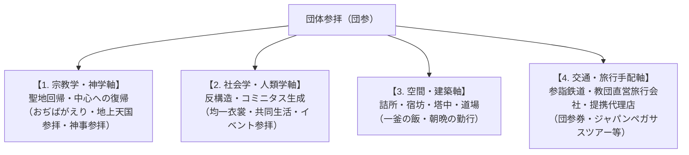

# 団体参拝 専門構造分析ノート（増補改訂第6版）

> [!summary] 要旨
> **団体参拝**（だんたいさんぱい、略称：**団参**〈だんさん〉）とは、宗教教団や伝統寺社において、講・支部・教会などの信徒組織が集団を形成し、本山・総本山・中心聖地へ参詣する集団的巡礼実践。近世の伊勢講・富士講等の民俗的参詣を歴史的先条とし、明治以降の「参詣鉄道」の発達や昭和のモータリゼーション（貸切バス）と結合して高度に制度化された。聖地における**「詰所（つめしょ）」「宿坊（しゅくぼう）」「修養道場」**等の集団宿泊施設、[[世界救世教]]の熱海・瑞雲郷や箱根・神仙郷にみられる**美の聖地への集団参拝**、[[大本]]の**二大聖地（綾部・亀岡）巡拝**、さらには[[ワールドメイト]]における**教祖直営の政府登録第1種旅行会社（ジャパンペガサスツアー）による手配の内製化**など、世俗の日常から離脱した信徒が集団的連帯（ヴィクター・ターナーの謂う**コミニタス**）と聖性を再充填するための核心的空間・交通手配装置として機能している。

---

## 1. 多角的な概念分析軸

団体参拝は単なる「移動手段・ツアー」にとどまらず、宗教・社会・交通・建築・経済・旅行手配インフラが複雑に交錯する複合的現象である。

---

## 2. 宗教教団と旅行手配（旅行会社）の3大構造モデル比較

現代日本の宗教界における団体参拝・巡礼の交通・旅行手配は、大きく以下の3つの構造モデルに分類される。

| モデルタイプ | 概要・手配メカニズム | 代表的な教団・事例 | 特徴と経営・神学的メリット |
| :--- | :--- | :--- | :--- |
| **モデルA: 教祖・関連事業体 直営第1種旅行会社型** | 宗教法人（あるいは教祖・関連親会社）が自ら政府登録（観光庁長官登録）の**第1種旅行業者**を設立・所有し、手配を完全に内製化するモデル。 | **[[ワールドメイト]]** （ジャパンペガサスツアー株式会社：観光庁長官登録第626号、代表：半田晴久/深見東州） | 手配手数料のグループ内循環、大規模バスツアー・海外神業の柔軟手配、国際イベント・海外VIP（元首相等）招聘手配の機動性向上。**日本の新宗教において極めて異例な形態。** |
| **モデルB: 大手旅行会社 専用窓口・特約提携型** | 直営旅行会社は持たず、JTBや日本旅行、近鉄などの大手鉄道・旅行会社と直接提携し、教団専用窓口や専用割引切符を設けるモデル。 | **[[天理教]]**（JTB天理営業所・近鉄「団参券」制度） **[[創価学会]]**（日本旅行等による集団登山列車・研修ツアー手配の歴史） **[[金光教]]**（JR金光駅団体改札・専用割引） | 自前で旅行業リスク・営業保証金を抱えず、大手インフラのダイヤ・輸送力をフル活用できる信頼性。 |
| **モデルC: 巡礼・参拝専門 独立系旅行会社協働型** | 宗教法人とは独立した「寺社参拝専門」「四国お遍路専門」「キリスト教聖地巡礼専門」の旅行会社がツアーを企画・運行するモデル。 | **伝統仏教・霊場会**（琴平バス「四国巡拝センター」、鳳友産業「ホウユウツアーズ」、ビーエス観光等） **カトリック・キリスト教**（教友社、サントラベル、ワールドビュウ等） | 先達・牧師・僧侶の同行解説や、特定の宗派・巡礼地に特化した高度な専門性の提供。 |

---

## 3. 主要教団における団体参拝構造と交通インフラ

### 3-1. [[天理教]]（おぢばがえり・親里参拝）
* **特徴**: 日本で最も体系化された団体参拝構造を持つ。「帰る」という表現（おぢばがえり）を用い、親里（天理市）への参拝を信仰の根本に置く。
* **鉄道・旅行手配**: 近畿日本鉄道（近鉄）は天理線を中心に毎月26日の月次祭や「こどもおぢばがえり（7月下旬〜8月上旬）」等に合わせて臨時特急や直通列車を大量運行。近鉄には独自の「天理教団体参拝割引（団参券）」が存在する。大手旅行会社の**JTB**には「天理営業所」が置かれ、団参手配をサポートしている。

### 3-2. [[金光教]]（本部参拝・金光臨）
* **特徴**: 岡山県浅口市金光町の本部神殿への参拝。
* **鉄道交通**: JR山陽本線金光駅への団体専用列車「金光臨」が昭和から平成にかけて多数運行された。金光駅には参拝者専用の「団体専用改札（旧・南口臨時改札、2020年に常設改修）」が設置されていた。

### 3-3. [[大本]]（二大聖地参拝・本部参拝バス）
* **二大聖地**: **京都府綾部市（梅松苑）**：神殿・長生殿を擁する発祥の聖地。**京都府亀岡市（天声山・旧亀山城跡）**：宣教・芸術活動・機構の中心聖地。
* **参拝バス構造**: 全国の分宣教所・地方本部・愛善会等から、2月の「節分大祭」、5月の「みろく大祭」、8月の「瑞恩感謝祭」などの大祭に合わせて大型貸切バス（「本部参拝バス」「大祭参拝バス」）が運行される。

### 3-4. [[ワールドメイト]]（神事参拝・ジャパンペガサスツアー）
* **特徴**: 教祖・深見東州（半田晴久）が代表取締役社長を務める**「ジャパンペガサスツアー株式会社（観光庁長官登録第1種旅行業者）」**が専属で移動・参拝バス・航空券を手配。
* **参拝形態**: 静岡県伊豆の国市の総本部「皇大神御社」参拝のほか、鹿島神宮・香取神宮・伊勢神宮や全国の霊山（阿蘇山・富士山等）への「神事参拝バスツアー」を定期的に運行。コスプレ・ギャグを交えたイベントと神社参拝がセットになった「エンターテインメント型団参」の形態をとる。

### 3-5. [[日蓮正宗]]・旧[[創価学会]]（大石寺登山）
* **特徴**: 静岡県富士宮市の総本山大石寺への「登山（参拝）」。
* **鉄道・バス交通**: かつて創価学会が日蓮正宗の法華講組織であった時代、大規模な「大石寺登山臨時列車（富士号等）」が運行された。歴史的に**日本旅行（旧・富士輸送観光の吸収）**等が集団輸送を担当した。現在は法華講主導の「登山バス（貸切バス）」中心へ移行。

### 3-6. [[世界救世教]]系（熱海・瑞雲郷／箱根・神仙郷参拝）
* **創始者と聖地**: [[岡田茂吉]]造営の**熱海・瑞雲郷**（MOA美術館）および**箱根・神仙郷**（箱根美術館）への参拝。美と信仰の融合。
* **交通手段**: 全国の教会・支部から直行する「熱海・箱根参拝バス」や東海道新幹線ラインが確立。[[神慈秀明会]]等も重視。

---

## 4. 主要教団の団体参拝構造比較マトリクス

| 教団名 | 聖地・本山 | 参拝の名称 | 主な交通・手配機関 | 宿泊・滞在施設 | 特記事項・歴史的背景 |
| :--- | :--- | :--- | :--- | :--- | :--- |
| **[[天理教]]** | 奈良県天理市（親里・おぢば） | **おぢばがえり** | 近鉄特急・団参券 JTB天理営業所 | **大教会詰所**（約150箇所） | 近鉄「団参券」制度あり。毎月26日・こどもおぢばがえり（7-8月）に最大化。日本最大の詰所網。 |
| **[[金光教]]** | 岡山県浅口市（金光本部） | **金光参拝** | JR「金光臨」 参拝バス | **信徒会館・宿（宿社）** | かつてJR金光駅には参拝者専用の「団体専用改札」が設置されていた。 |
| **[[大本]]** | 京都府綾部市（梅松苑） 京都府亀岡市（天声山） | **本部大祭参拝** | 本部大祭参拝バス JR山陰本線 | **みろく会館・参拝宿泊施設** | 綾部（発祥・長生殿）と亀岡（宣教・亀山城跡）の二大聖地を巡る参拝バスラインが確立。 |
| **[[ワールドメイト]]** | 静岡県伊豆の国市（皇大神御社） 全国著名神社・霊山 | **神事参拝 / 大神業** | **ジャパンペガサスツアー** （第1種旅行業者・直営） | **伊豆総本部施設・ホテル** | 教祖直営の第1種旅行会社（JPT）が移動・宿泊を一括内製手配。エンターテインメント型団参。 |
| **[[日蓮正宗]]** | 静岡県富士宮市（大石寺） | **大石寺登山** | 登山バス（貸切） 旧・身延線「富士号」 | **塔中（20以上の坊・宿坊）** | かつて創価学会員による巨大な列車・バス登山を展開。日本旅行等が輸送を担当した歴史。 |
| **[[世界救世教]]** | 静岡県熱海市（瑞雲郷） 神奈川県箱根町（神仙郷） | **地上天国参拝 / 本部参拝** | 熱海・箱根参拝バス 東海道新幹線 | **救世会館・ホテル・研修施設** | [[岡田茂吉]]造営の熱海・瑞雲郷（MOA美術館）や箱根・神仙郷（箱根美術館）への参拝。美と信仰の融合。 |

---

## 5. 関連教団・関連人物・関連概念

### 関連教団
- [[天理教]]
- [[金光教]]
- [[大本]]
- [[ワールドメイト]]
- [[日蓮正宗]]
- [[創価学会]]
- [[立正佼成会]]
- [[世界救世教]]
- [[神慈秀明会]]
- [[真如苑]]

### 関連人物
- [[岡田茂吉]]
- [[出口王仁三郎]]
- [[深見東州]]

### 関連概念
- 巡礼 / コミニタス / 聖地 / 詰所 / 宿坊 / 塔中 / ジャパンペガサスツアー / JTB天理営業所 / 団参券 / 参詣鉄道 / 天理臨 / 金光臨 / ひのきしん / 作務 / 神人共食 / MOA美術館

---

## 6. 史料・参考文献

- 弓山達也『現代宗教と交通文化 : 移動する聖地』
- 近畿日本鉄道『近畿日本鉄道100年史』（2010年）
- 天理教道庁『天理教事典』（天理教道庁）
- 大本本部『大本七十年史』
- ワールドメイト 公式ウェブサイト (https://www.worldmate.or.jp/)
- ジャパンペガサスツアー株式会社 企業情報 (https://www.jp-tour.com/)

---

*※本稿は[[_分派・異端研究ポータル]]の概念・交通・信仰実践構造分析ノートである。*
