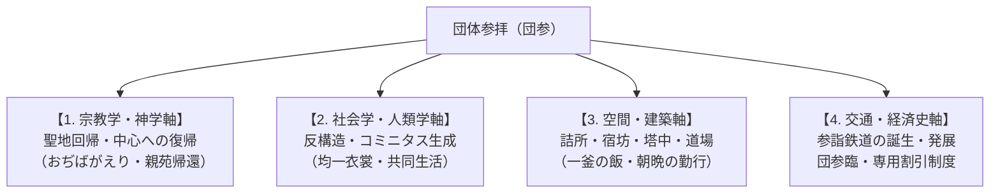

# 団体参拝 専門構造分析ノート（増補改訂第2版）

> [!summary] 要旨
> **団体参拝**（だんたいさんぱい、略称：**団参**〈だんさん〉）とは、宗教教団や伝統寺社において、講・支部・教会などの信徒組織が集団を形成し、本山・総本山・中心聖地へ参詣する集団的巡礼実践。近世の伊勢講・富士講等の民俗的参詣を歴史的先条とし、明治以降の「参詣鉄道」の発達や昭和のモータリゼーション（貸切バス）と結合して高度に制度化された。聖地における**「詰所（つめしょ）」「宿坊（しゅくぼう）」「修養道場」**等の集団宿泊施設は、世俗の日常から離脱した信徒が寝食と奉仕（ひのきしん・作務）を共にし、集団的連帯（ヴィクター・ターナーの謂う**コミニタス**）と聖性を再充填するための核心的空間装置として機能している。

---

## 1. 多角的な概念分析軸

団体参拝は単なる「移動手段・ツアー」にとどまらず、宗教・社会・交通・建築・経済が複雑に交錯する複合的現象である。



| 分析領域 | 核心的な機能とメカニズム |
| :--- | :--- |
| **宗教学・空間神学** | **聖地中心主義と「帰還」観**: 参拝者を日常の世俗的・地理的周縁から宇宙の中心（聖地）へと引き戻す。天理教の「おぢばがえり」や真如苑の「親苑帰還」のように、「行く」のではなく原初・人類の故郷へ「帰る」神学的意味が付与される。 |
| **社会人類学（V. ターナー理論）** | **コミニタス（Communitas）の生成**: 旅の途上や宿坊・詰所での共同生活において、日常の社会的地位・階層（職業・年齢・経済力）が一時的に解消される（反構造）。同一のハッピ（法被）や白衣の着用を通じ、水平的で平等な強力な集団的連帯感が形成される。 |
| **建築・都市社会学** | **「詰所」「宿坊」による宗教都市景観**: 聖地周辺に集積する大部屋・大食堂・拝礼場を備えた特有の宿泊施設網。天理市の約150の大教会詰所網や大石寺の塔中（坊）群が独自の都市景観を形成。 |
| **交通史・地域経済史** | **「参詣鉄道」とインフラの相利共生**: 大手私鉄（近鉄・阪急・南海・京阪・一畑電車等）の多くは参詣客輸送を創業基盤（参詣鉄道）として発達した。また国鉄・JRと教団の間で「団参割引（団参券）」や大量の臨時列車（団臨）が運用されてきた。 |

---

## 2. 歴史的展開クロノロジー

### 2-1. 近世（江戸時代）：講運動と集団参詣の原型
* **伊勢講・富士講・大山講・金比羅講**: 地域や職能組合単位で積立金（講金）を出し合い、くじ引き等で選ばれた代参者や集団が聖地を目指した。
* **御師（おし・おんし）と講社旅館**: 門前町で参詣客の祈祷・宿泊・案内を一身に担った「御師（師職）」が、現代の宿坊・詰所や旅行代理店のプロトタイプとなった。

### 2-2. 近代（明治〜昭和戦前）：鉄道網の整備と「参詣鉄道」の誕生
* **私鉄の開拓と聖地結びつき**: 大阪電気軌道（現・近鉄）、阪神、京阪、南海、一畑電車、水間鉄道などが、寺社・聖地参拝（伊勢神宮、生駒聖天、成田山、高野山、出雲大社等）の需要を見込んで路線を拡張。
* **新宗教の台頭と大量輸送**: 天理教や金光教が全国拡大するにつれ、定期列車では対応しきれない大量の参拝者を輸送するため、国鉄・私鉄との交渉により専用臨時列車が運転され始める。

### 2-3. 現代（戦後〜高度経済成長期）：団参列車・臨車（臨臨）の黄金期
* **「天理臨」「金光臨」「大石寺臨（身延臨）」の満花**: 昭和30〜50年代、国鉄（現・JR）の寝台電車（583系）、気動車（キハ181系等）、客車（12系・14系・20系等）を動員し、北海道・東北・九州等から本山へ直行する夜行臨時列車が多数仕立てられた。
* **モータリゼーションと「団参バス」の爆発的増加**: 高速道路網の整備に伴い、地方の教会・支部から本山へ直行する貸切大型観光バス（団参バス）が定着。

### 2-4. 平成〜令和（現代）：インフラ変容とオンライン参拝の台頭
* **国鉄型車両の全廃と団参列車の衰退**: JRの車両老朽化、臨時列車ダイヤ設定の困難化、コスト上昇により、鉄道による団臨は激減。近鉄等一部を除き、参拝手段は貸切バスや自家用車へ移行。
* **信徒の高齢化と個人参拝化**: 長距離の夜行バス・合宿型参拝の負担から、少人数・個人参拝への変化、さらにはコロナ禍以降のYouTubeライブ配信やリモート祈祷等「オンライン参拝」とのハイブリッド化が進む。

---

## 3. 信徒用宿泊施設・詰所・宿坊の体系的分析

団体参拝の核心は、聖地における「宿泊体験」にある。教団や伝統寺院ごとに、独自の形態・名称を持つ宿泊施設が発達している。

```
[世俗の日常] ──(出発・ハッピ着用)──> [旅・車中（法座・感話・歌）]
                                              │
[日常へ復帰] <──(解散・聖性持ち帰り)── [お詰所・宿坊（一釜の飯・おつとめ・作務）]
```

### 3-1. 施設形態の分類マトリクス

| タイプ | 代表的な名称 | 主な教団・寺社 | 構造・機能の特徴 |
| :--- | :--- | :--- | :--- |
| **タイプA: 系統組織管理型** | **詰所（つめしょ）** | [[天理教]] | 全国の「大教会」（約150箇所）が天理市内に設置。大部屋の畳敷き・大食堂・拝礼場を備え、直属の信徒や修養科生が宿泊・合宿する。 |
| **タイプB: 塔中・子院兼用型** | **宿坊（しゅくぼう）/ 坊** | [[日蓮正宗]]（大石寺）、高野山、身延山久遠寺 | 本山境内の「塔中（子院）」寺院（大石寺には20以上の「坊」が存在）が、普段は僧侶の住居でありつつ、参詣信徒（法華講員等）の宿坊として機能する。 |
| **タイプC: 教団直営・研修型** | **修養道場 / 研修会館 / 依処** | [[立正佼成会]], [[真如苑]], [[パーフェクトリバティー教団]] | 直営の大型研修宿泊施設。法座・錬成会・参拝のための合宿設備（大研修室・大浴場・宿泊室）を完備。 |
| **タイプD: 参拝所・案内所型** | **信徒会館 / 宿・案内所** | [[金光教]] | 金光教本部の周辺に点在する信徒会館や「宿（宿社・案内所）」。本部参拝時の着替え・食事・取次拝受の準備拠点。 |
| **タイプE: 伝統門前・講社型** | **講社旅館 / 御師の館** | 出雲大社教、伊勢講 | かつての「御師（おんし）」の伝統を引き継ぐ講社単位の指定旅館・参拝宿泊所。 |

---

### 3-2. 詰所・宿坊における「宗教体験と文化」

1. **神人共食（一釜の飯・一味同心）**:
   * 天理教の詰所や大石寺の坊での食事は、大鍋で作られた料理（カレーや汁物、精進料理等）を参拝者全員で切り分けて共食する。この「一釜の飯」を食する体験が、血縁を超えた「信仰の家族（きょうだい）」意識を補強する。
2. **朝晩の勤行・おつとめ**:
   * 単なるホテル宿泊と決定的に異なり、大石寺での「丑寅勤行（深夜・早朝の勤行）」や天理教詰所での「朝づとめ・夕づとめ」、高野山宿坊での「朝の勤行・護摩祈祷」など、厳しい時間規律のもとで祈りが捧げられる。
3. **ひのきしん・作務（奉仕活動）**:
   * 滞在期間中、参拝者は詰所や宿坊の清掃、膳下げ、布団敷き、さらには本山境内の清掃を自発的な奉仕（天理教の「ひのきしん」、仏教の「作務」）として行う。
4. **夜間の法座・感話（体験発表）**:
   * 消灯前の時間帯、大部屋において信徒同士が自らの身の上に起きた試練や「おたすけ（救済）」の体験談を語り合い（天理教の「感話」、立正佼成会の「法座」）、信仰の歓喜を共有する。

---

### 3-3. 建築・都市社会学的な影響

* **天理市の「詰所都市景観」**:
  天理市内には、各都道府県や旧国名を冠した巨大な大教会詰所（例: 兵神詰所、敷島詰所、愛町詰所等）が約150立ち並ぶ。これらは昭和初期以降、鉄筋コンクリート造でありながら和風屋根や唐破風、天理教特有の意匠（千鳥破風・破風屋根）を載せた独特の建築様式（天理教建築）で建てられ、日本唯一の「宗教都市」の景観を構成している。
* **大石寺の「塔中（坊）参道景観」**:
  総本山大石寺の参道両脇には「常在坊」「理境坊」「百楽坊」など20以上の塔中寺院が整然と並び、各法華講員がそれぞれの「指定坊」に分散して宿泊・勤行を行う独自の小宇宙を形成している。

---

## 4. 主要教団の団体参拝構造比較マトリクス

| 教団名 | 聖地・本山 | 参拝の名称 | 主な交通手段 | 宿泊・滞在施設 | 特記事項・歴史的背景 |
| :--- | :--- | :--- | :--- | :--- | :--- |
| **[[天理教]]** | 奈良県天理市<br>（親里・おぢば） | **おぢばがえり** | 近鉄特急・直通臨<br>JR「天理臨」<br>おぢばがえりバス | **大教会詰所**（約150箇所） | 近鉄「団参券」制度あり。毎月26日・こどもおぢばがえり（7-8月）に最大化。日本最大の詰所網。 |
| **[[金光教]]** | 岡山県浅口市<br>（金光本部） | **金光参拝** | JR「金光臨」<br>参拝バス | **信徒会館・宿（宿社）** | かつてJR金光駅には参拝者専用の「団体専用改札（旧・南口臨時改札）」が設置されていた（2020年に常設南口改札に改修）。 |
| **[[日蓮正宗]]** | 静岡県富士宮市<br>（大石寺） | **大石寺登山** | 登山バス（貸切）<br>旧・身延線「富士号」 | **塔中（20以上の坊・宿坊）** | かつて創価学会員による巨大な列車・バス登山を展開。和合解消後は法華講主導の坊宿泊中心へ。 |
| **[[創価学会]]** | 東京都新宿区<br>（信濃町・大誓堂） | **本部参拝** | 地区・支部単位の<br>貸切大型バス | **ホテル・日帰り・研修道場** | 広宣流布大誓堂参拝、各地の研修道場、富士美術館等への研修バスツアーを展開。 |
| **[[立正佼成会]]** | 東京都杉並区<br>（本部大聖堂） | **本部参拝** | 本部参拝バス<br>（夜行・昼行） | **長ノ内修養道場・会館** | 全国の教会から大型バスをチャーター。車内および道場での「法座（み教えの対話）」が特徴。 |
| **[[真如苑]]** | 東京都立川市<br>（応現院・親苑） | **親苑帰還** | 直行参拝バス<br>立川駅シャトルバス | **真如研修会館・日帰り** | 応現院への大規模集補。立川駅からのバス輸送ラインが高度にシステム化されている。 |
| **[[阿含宗]]** | 京都府京都市山科区<br>（阿含宗本山） | **星まつり参拝** | 全国ツアーバス<br>臨時参拝バス | **山科本山施設・京都市内** | 毎年2月の「阿含の星まつり（柴燈護摩）」に合わせ、全国から数百台規模のバスが集結。 |

---

## 5. 近現代交通史と「参詣鉄道」の相互依存関係

### 5-1. 近畿日本鉄道（近鉄）と天理教・伊勢神宮
* **参詣鉄道としての近鉄**: 近鉄の前身である大阪電気軌道（大軌）や参宮急行電鉄（参急）は、生駒聖天、天理教本部、伊勢神宮への参拝客輸送を最大の目的として路線を敷設した。
* **団参券制度**: 近鉄は天理教の団体参拝客に対して専用の割引制度（「天理教団体参拝乗車券」）を発行しており、一般的な旅行商品とは異なる宗教専用の割引体系を現在も維持している。

### 5-2. 国鉄・JRの「教団臨（臨臨）」の技術史
* **専用車両の動員**: かつて国鉄は、多客期に全国から客車や電車をかき集め、「天理臨」「金光臨」「身延臨」に投入した。特に寝台車と座席車を転換できる583系特急形寝台電車や、12系・14系客車は、長距離団参の象徴的車両であった。

---

## 6. 現代における課題と将来展望

1. **団参列車の終焉とバス・自家用車への完全移行**:
   JRの車両老朽化・国鉄型形式の全廃により、鉄道による長距離団臨はほぼ姿を消した。現在は貸切バスおよび自家用車（マイカー）での参拝が主流となっている。
2. **少子高齢化と参拝体力の低下**:
   信徒層の高齢化に伴い、長距離の車中泊や大部屋での合宿型参拝を回避し、日帰りや少人数での快適な参拝を好む傾向が強まっている。
3. **デジタル技術と「リモート参拝」の浸透**:
   COVID-19パンデミック以降、各教団とも大祭や法要のYouTubeライブ配信やZoomによる遠隔参拝を導入。物理的移動を伴う「団体参拝」の必然性が問われる一方で、「生の聖地空間における体験」の希少価値が再評価される二極化が進んでいる。

---

## 7. 関連教団・関連人物・関連概念

### 関連教団
- [[天理教]]
- [[金光教]]
- [[日蓮正宗]]
- [[創価学会]]
- [[立正佼成会]]
- [[パーフェクトリバティー教団]]
- [[真如苑]]
- [[阿含宗]]

### 関連概念
- 巡礼 / コミニタス / 聖地 / 詰所 / 宿坊 / 塔中 / 御師 / おぢばがえり / 団参券 / 参詣鉄道 / 天理臨 / 金光臨 / 合宿 / ひのきしん / 作務 / 法座 / 神人共食

---

## 8. 史料・参考文献

- 弓山達也『現代宗教と交通文化 : 移動する聖地』
- ヴィクター・ターナー（Victor Turner）『儀礼の過程』（シンボル・構造・反構造）
- 近畿日本鉄道『近畿日本鉄道100年史』（2010年）
- 天理教道庁『天理教事典』（天理教道庁）
- 井上順孝『新宗教の解読』（ちくま学芸文庫）
- 日蓮正宗総本山大石寺『大石寺案内』

---

## 9. 関連ノート (Vault内)

- [[_分派・異端研究ポータル]]
- [[天理教]]
- [[金光教]]
- [[おぢばがえりと親里詰所建築群]]

---

## 10. 検証・品質ゲートと留保事項

> [!warning] 留保事項
> - 本ノートは特定の宗教団体の参拝形態を肯定・否定するものではなく、宗教学・社会学・建築学・交通史の観点から客観的ファクトに基づき分析したものである。
> - 詰所や宿坊は原則として各教団・寺社の所属信徒（法華講員や天理教信者等）の参拝・修養のための施設であり、一般観光客の宿泊施設（ホテル・商業旅館）とは利用規約・手続きが異なる。

---

*※本稿は[[_分派・異端研究ポータル]]の概念・交通・信仰実践構造分析ノートである。*
