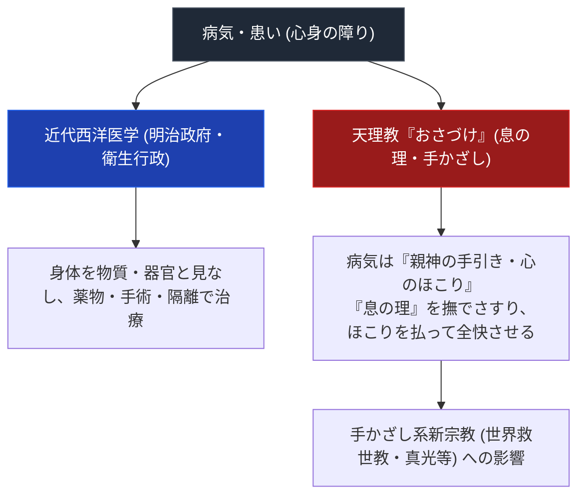

# 天理教のおたすけ・おさづけと近代病気救済史 専門構造分析ノート

> [!summary] 要旨
> 本稿は、天理教の核心救済儀礼「おさづけ（息の理・手かざし・心直し）」の構造、明治〜昭和期における近代西洋医学・衛生行政との激突（「淫祀邪教」視）、および世界救世教や真光などの「手かざし系新宗教」への史的影響を解剖した専門ノートである。

---

## 1. 命題の構造（近代西洋医学 vs 天理教の「心直し・おさづけ」救済）

| 比較軸 | 近代西洋医学 | 天理教のおさづけ | 手かざし系新宗教 (救世教/真光) |
| :--- | :--- | :--- | :--- |
| **病因論** | 細菌・ウイルス・器官不全 | 心のほこり（八つのほこり）・神の手引き | 霊の曇り・憑依・毒素 |
| **治病手段** | 投薬・注射・手術 | 「おさづけの理」を撫でさすり伝授・祈祷 | 手かざし・浄霊・お清め |
| **資格・伝授** | 医師免許（国家資格） | 別席（9回受講）を経て「おさづけ」拝受 | 講習会受講・おみたま着用 |

---

## 2. 「おさづけ」の儀礼構造と「息の理」

- **拝受要件**: 奈良親里で「別席（べっせき）」を9回受講した信者が、真柱から「おさづけの理」を拝受する。
- **儀礼動作**: 患者に対し、神名を唱えながら身体を撫でさすり、「息の理」を吹きかける。
- **教理的根拠**: 病気は神の罰ではなく、人間が「親神の守護」を忘れて心に「ほこり」を溜めたことに対する親心の「手引き（メッセージ）」とされる。

---

## 3. 近代日本医療史との衝突と手かざし系宗教への展開

- **明治政府の弾圧**: 「薬物不使用・手かざし・祈祷で病気を治すと称する行為」への警察取締りがあった（[[明治の教難と教祖牢くぐり]]・[[明治の教難と教派神道独立]]参照。取締り根拠の具体的な布告名・年号は未確認）。
- **後続宗教への流出**: 天理教の「手かざし・撫でさすり救済」の成功は、大本、世界救世教（岡田茂吉）、崇教真光（岡田光玉）など、近代日本の「手かざし系新宗教」の源流の一つとされる（要検証）。

---

## 5. 関連教団・関連人物・関連概念
- [[おふでさき]]
- [[明治の教難と教祖牢くぐり]]
- [[陽気ぐらしと天理教の社会福祉・医療]]
- [[_分派・異端研究ポータル]]

---

## 6. 検証・品質ゲートと留保事項

> [!warning] 留保事項
> - 別席9回・おさづけ拝受の流れは天理教公式サイトで確認済み。
> - 明治期の取締り根拠となった具体的な布告名・年号は未確認。
> - 本ノートの evidence_type は `"mixed"`、confidence は `3`。

---

*※本稿は[[_分派・異端研究ポータル]]の病気救済・宗教人類学分析ノートである。*
