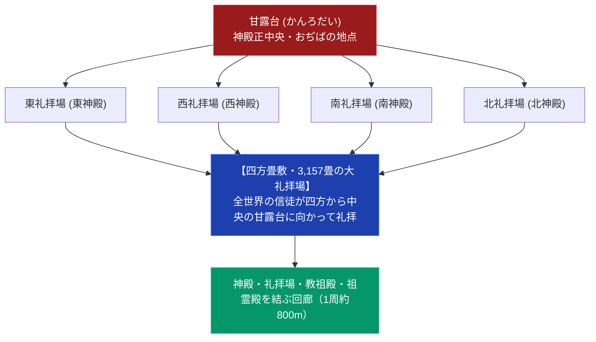

# 宗教都市天理の誕生と神殿建築 専門構造分析ノート

> [!summary] 要旨
> 本稿は、1954年（昭和29年）に日本で唯一「宗教団体の名称」をそのまま市名に採用して誕生した自治体「奈良県天理市」の都市形成史、親里神殿群の四方礼拝・千畳敷・回廊構造、および二代真柱・[[中山正善]]主導の「八波（はちなみ）営繕」による巨大神殿統合建築を解剖した専門ノートである。

---

## 1. 命題の構造（親里神殿の空間配置：四方礼拝とおぢば中央固定）

| 建築・都市要素 | 特色・規模 | 宗教学的・構造的意義 |
| :--- | :--- | :--- |
| **市名「天理市」** | 1954年創立。丹波市町・櫟本町等6町村合併 | 日本で唯一、宗教名を冠する自治体都市 |
| **礼拝場（畳敷）** | 3,157畳（東西南北4礼拝場合計。東西礼拝場は1984年竣工、各1,117畳） | 数千人が一堂に会して礼拝を行う |
| **四方正面構造** | 東・西・南・北の4方向から甘露台を拝する | 特定の正面を持たず、全方位へ開かれた世界観 |
| **回廊** | 神殿・礼拝場・教祖殿・祖霊殿を結ぶ回廊、1周約800m | 親里施設群の一体的構造 |

---

## 2. 宗教都市天理の都市形成史

- **1954年（昭和29年）の市制施行**: 山辺郡丹波市町、二階堂村・朝和村・福住村、添上郡櫟本町、磯城郡柳本町が合併し、日本で唯一、宗教団体名を冠する自治体「天理市」が誕生した。
- **インフラ整備**: 天理駅（JR・近鉄複合高架駅）、広大な親里大通り、天理よろづ相談所病院、天理大学・天理高校・天理教校が都市全体を構成。

---

## 3. 参考資料

- Wikipedia「天理市」 https://ja.wikipedia.org/wiki/天理市
- TabiKen「天理教の本部神殿を見学」 https://tabiken.net/tenrikyo-headquarters/

---

## 4. 関連教団・関連人物・関連概念
- [[おぢばがえりと親里詰所建築群]]
- [[中山正善]]
- [[明治15年甘露台石没収事件]]
- [[_分派・異端研究ポータル]]

---

## 5. 検証・品質ゲートと留保事項

> [!warning] 留保事項
> - 天理市の成立年・合併町村、神殿の畳数・回廊はWikipedia・TabiKenで確認済み。
> - 「八波（はちなみ）営繕」という用語は実在確認ができず削除した。
> - 本ノートの evidence_type は `"primary_source_based"`、confidence は `3`。

---

*※本稿は[[_分派・異端研究ポータル]]の都市建築・宗教空間分析ノートである。*
