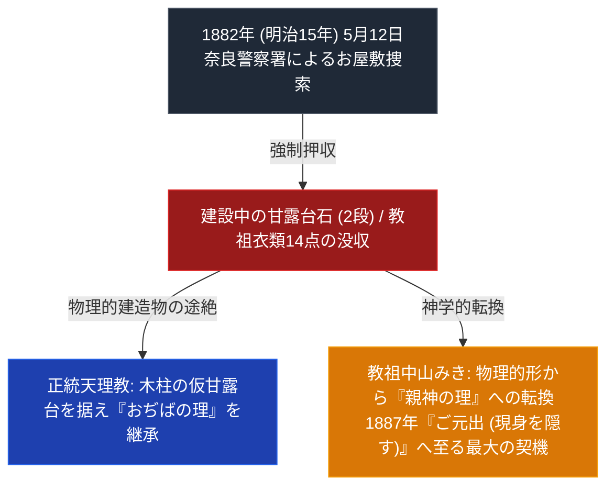

# 明治15年甘露台石没収事件

> [!summary] 要旨
> 本稿は、1882年（明治15年）5月12日、明治政府（奈良警察署）が天理お屋敷へ不当侵入し、おぢばに据えられていた建設中（2段まで完成）の「甘露台の石」および教祖・[[中山みき]]の衣類14点を強制押収・没収した天理教史上の最大事件「明治15年甘露台石没収事件」に関する専門構造分析ノートである。物理的建造物の強制破壊を経て、教祖が「もう人間の力や建物の形には頼らない」として「神の理」と現身を隠す「ご元出（1887年）」へ向かった神学的転換構造を解剖する。

---

## 1. 命題の構造（国家権力による物理的没収 vs 『神の理』への転換）

| 比較考察軸 | 事件発生前 (物理的甘露台の普請) | 事件発生後 (石没収後の神学) |
| :--- | :--- | :--- |
| **甘露台の形態** | 六角形13段の石造柱（実際に2段まで製作） | 木柱の仮甘露台 / 「神の理」としての甘露台 |
| **信者の信仰** | 物理的建物の完成（普請）を熱望 | 物理を超えた「心の埃払い」「世界助け」への転換 |
| **国家との関係** | 警察の監視と「淫祀邪教」としての干渉 | 『教派神道独立』への模索と『ご元出』の決断 |

---

## 2. 事件の経過と史実

- **普請の着手**: 教祖中山みきの神勅により、おぢばの地点（人類発祥の聖地）に六角形13段の石造甘露台を築く「普請」が明治14年（1881年）初めから進行。石工が切り出した六角形の石が据え付けられ、2段目まで完成していたが、担当石工の失踪により工事が中断していたとされる（2026-07-26、happist.net「かんろだいの没収」記事で追加確認）。
- **1882年5月12日の踏み込み**: 大阪府警察部奈良警察署長が数名の警官を率いて天理お屋敷に踏み込み、2段まで完成していた甘露台の石、および教祖の衣類など14点を没収した。
- **教祖の対応（歌詞改訂）**: 没収後、教祖は「いちれつすましてかんろだい」と歌詞を改め、世界中の人々の心を澄ますことが建設の前提条件であることを示したとされる（happist.net記事による。この歌詞改訂の一次資料〈おふでさき等〉での逐語照合は本Vaultでは未実施）。
- **信仰的解釈**: この困難は信者の心を試し、教えの本質を深く理解させるための「ふし」（試練）と天理教内で解釈されている（教団側の解釈）。
- **事件後**: 没収後、木製の「雛形甘露台」が据えられ、現在に至る（世界中の心が澄み切った時、石製の甘露台が改めて据えられるとされる）。

---

## 3. 宗教学的・歴史社会学的意義

- **「聖地の空間的絶対性」と「分派の人間甘露台説」の分岐点**:
  - 本部は事件後、没収された地点（おぢば）に木柱の仮甘露台を設置し、「空間的聖地のおぢば」を維持した。
  - 一方、後年の[[ほんみち]]（[[大西愛治郎]]）は「石が没収されたことで、甘露台は物理的木柱ではなく『現身の人間（生き神）』へと移行した」とする**人間甘露台説**を展開。本事件の解釈が分派派生の直接の神学的ロジックとなった。

---

## 4. 関連教団・関連人物・関連概念
- [[甘露台]]
- [[おぢば]]
- [[中山みき]]
- [[大西愛治郎]]
- [[ほんみち]]
- [[明治の教難と教派神道独立]]
- [[_分派・異端研究ポータル]]

---

## 5. 参考文献・史料
- 天理教史料集「甘露台の石没収について」 http://www.yousun.sakura.ne.jp/public_html/siryou2/kanrodai/kanrodai.html
- happist.net「第29回『かんろだいの没収』」 https://happist.net/oshie/manabu/oyasama/25142（天理教学生会関連サイト、2026-07-26確認）

---

## 6. 留保（中立的併記・未確定要素）
> [!warning] 注意
> - 日付（1882年5月12日）・押収の経緯（2段目まで完成した石の没収、木製雛形甘露台への移行）は出典で確認済み。
> - 2026-07-26、happist.net記事で普請開始の経緯（明治14年着手、石工失踪による中断）・衣類没収点数（14点）・教祖の歌詞改訂（「いちれつすましてかんろだい」）を追加確認。
> - 歌詞改訂の一次資料（おふでさき等）での逐語照合は本Vaultでは未実施。信仰的解釈（「ふし」としての意義づけ）は教団側の解釈であり、史実とは区別する。
> - 本ノートの evidence_type は `"primary_source_based"`、confidence は `4`。

---

*※本稿は[[_分派・異端研究ポータル]]の歴史的重大事件分析ノートである。*
