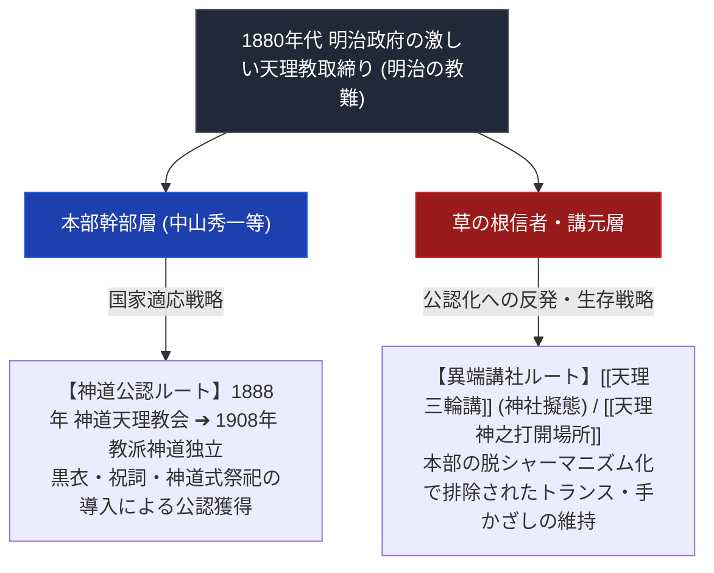

# 明治の教難と教派神道独立

> [!summary] 要旨
> 本稿は、明治政府による「類俗教・淫祀邪教」としての激しい天理教弾圧（明治の教難・1886年警察秘密達等）に対し、天理教幹部層が1888年に神道本局傘下の「神道天理教会」を設立し、1908年（明治41年）に「教派神道独立」を果たした国家公認プロセスの専門構造分析ノートである。国家適応の代償として原初の熱狂的・呪術的要素が排除され、[[天理三輪講]]や[[天理神之打開場所]]等の分派講社が派生した歴史メカニズムを解剖する。

---

## 1. 命題の構造（国家公認・教派神道化 vs 排除された原初講社）

| 比較考察軸 | 正統本部 (教派神道独立派) | 排除・派生した草の根講社 |
| :--- | :--- | :--- |
| **国家戦略** | 神道十三派の一つとして公認獲得（1908年） | 警察の目を逃れるための独自神社擬態・隠れ講社 |
| **教理・儀礼** | 神道的な祝詞・祭詞の導入（明治〜昭和初期） | 教祖直伝のて踊り・かぐら・即効的手かざしの死守 |
| **歴史的影響** | 現代の巨大教団「天理教」の基礎 | 様々な天理系分派・異端講社の萌芽 |

---

## 2. 沿革と歴史的プロセス

### ① 明治の教難（1880年代）
- 明治政府・警察当局による天理教取締りが繰り返され、教祖中山みきも複数回の取調べ・拘留を受けた（詳細は[[明治の教難と教祖牢くぐり]]参照）。1886年に最後の拘留（櫟本分署、[[櫟本分署跡保存会]]の活動対象）を受けている。取締りの根拠となった具体的な布告文（「秘密達」等の条文）は裏付けが取れていない。

### ② 「神道天理教会」設立（1888年4月10日・明治21年）
- 東京府より神道の一派として「神道天理教会」の公認を得るが、引き続き神道本局の傘下に置かれた。

### ③ 教派神道独立（1908年11月27日・明治41年）
- 神道本局から別派として独立し、教派神道十三派の一つとなった。

---

## 3. 宗教学的意義：分派発生の温床

- **国家公認の「影」としての異端生成**: 本部が国家公認を得るために捨て去った「原初の激しい神懸かり」「直解的おたすけ」「『おふでさき』の文字通りの実行」が、本部を離れた庶民層に残り、のちの[[ほんみち]]や各種分派運動の肥沃な土壌となった。

---

## 4. 関連教団・関連人物・関連概念
- [[正統天理教]]
- [[天理三輪講]]
- [[天理神之打開場所]]
- [[櫟本分署跡保存会]]
- [[ほんみち]]
- [[天理教の分裂の系譜]]
- [[_分派・異端研究ポータル]]

---

## 5. 参考文献・史料
- Wikipedia「天理教」 https://ja.wikipedia.org/wiki/天理教

---

## 6. 留保（中立的併記・未確定要素）
> [!warning] 注意
> - 1888年神道天理教会設立・1908年教派神道独立の日付はWikipediaで確認済み。
> - 明治の教難の具体的な布告文・条文は未検証（[[明治の教難と教祖牢くぐり]]参照）。
> - 本ノートの evidence_type は `"primary_source_based"`、confidence は `3`。

---

*※本稿は[[_分派・異端研究ポータル]]の明治制度史分析ノートである。*
