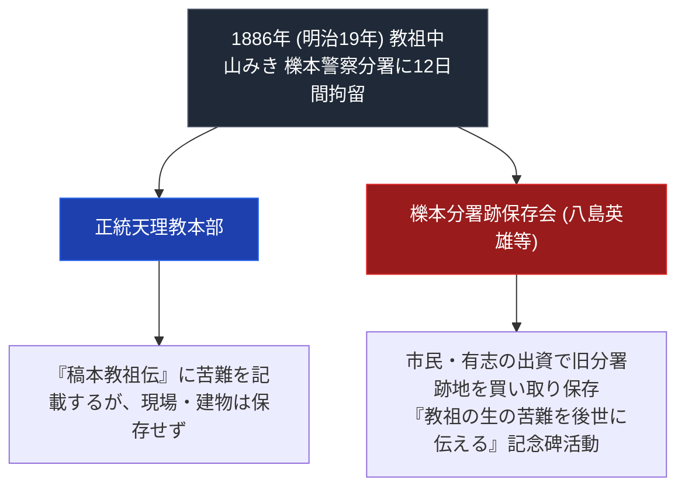

# 櫟本分署跡保存会 専門分析ノート

> [!summary] 要旨
> 本稿は、1886年（明治19年）、89歳の老齢であった教祖・[[中山みき]]が最後（12回目）の警察拘留（12日間）を受けた歴史的遺構「旧櫟本警察分署」を、天理教教会の公式管理に代わって民間有志（[[八島英雄]]等）が買い取り保存・顕彰している「櫟本分署跡保存会」に関する専門構造分析ノートである。

---

## 1. 命題の構造（教祖最後の受難地 vs 本部歴史不保存への批判）

---

## 2. 所在地と交通アクセス

- **所在地**: 〒632-0004 奈良県天理市櫟本町（旧櫟本警察分署跡地）
- **電車アクセス**: JR桜井線（万葉まほろば線）「櫟本駅」下車、徒歩5分
- **自動車アクセス**: 西名阪自動車道「天理IC」より国道169号線を北へ約3分

---

## 3. 関連教団・関連人物・関連概念
- [[八島英雄]]
- [[中山みき]]
- [[明治の教難と教祖牢くぐり]]
- [[稿本天理教教祖伝]]
- [[_分派・異端研究ポータル]]

---

## 4. 参考文献・史料

- 櫟本分署跡保存会 note「八島英雄先生の歩み」 https://note.com/ichinomoto185/n/n3de026a5cb5e

---

## 5. 検証・品質ゲートと留保事項

> [!warning] 留保事項
> - 設立年（1979年2月25日）・代表者はnoteで確認済み。
> - 本ノートの evidence_type は `"primary_source_based"`、confidence は `3`。

---

*※本稿は[[_分派・異端研究ポータル]]の史実遺構保全分析ノートである。*
