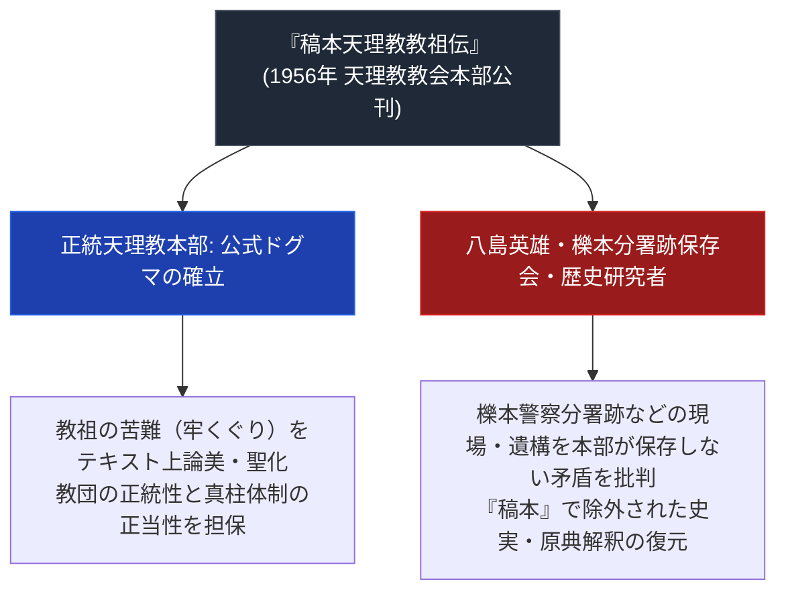

# 稿本天理教教祖伝

> [!summary] 要旨
> 本稿は、1956年（昭和31年）に二代真柱・[[中山正善]]のもとで編纂・公刊された天理教教会本部の唯一公認の公式伝記『稿本天理教教祖伝』に関する専門構造分析ノートである。教祖・[[中山みき]]の神聖化・ドグマ化の達成と、[[八島英雄]]（[[櫟本分署跡保存会]]）ら異端・批判的研究者による「本部の歴史隠蔽・都合の良い史実選別」批判の検証構造を解剖する。

---

## 1. 命題の構造（公式ドグマ伝記 vs 史実・遺構の現場検証）

---

## 2. 書誌と編纂史

| 項目 | 内容 |
| :--- | :--- |
| **書名** | 『稿本天理教教祖伝』 |
| **編纂者** | 天理教教祖伝編修委員会（責任者: 二代真柱・[[中山正善]]） |
| **公刊年** | 1956年（昭和31年）10月26日 |
| **位置づけ** | 全天理教信者の規範となる唯一公式の教祖伝（バイブル） |

---

## 3. 位置づけ

- 戦後、原典や口伝を整理して教祖中山みきの生涯を体系化した天理教本部公式の伝記。
- [[八島英雄]]が主宰した[[櫟本分署跡保存会]]は、教祖が最後に拘留された櫟本分署跡を本部とは別に保存する活動を行っている（[[八島英雄]]ノート参照）。稿本教祖伝の記述内容と保存会側の主張との具体的な対立点は未検証。

## 3-1. 「稿本」表記が外されない経緯（2026-07-26追加）

> [!info] 出典: yousun.sakura.ne.jp掲載PDF資料（要約は[[src_topatu_shimazono_ronsou]]参照）
> 幡鎌一弘の研究を引用する当該資料によれば、稿本教祖伝は初代真柱・中山真之亮による「稿本教祖様御伝」「教祖様御伝」を根本に、1928年（昭和3年）の「おふでさき註釈」の枠内で作成されたとされる（島薗進氏が推測する『御教祖伝史実校訂本』等を直接の土台にしたものではないとする）。
>
> 「稿本」の文字が現在も外されず正式な「教祖伝」として裁定されていない理由について、[[八島英雄]]氏の証言として次の経緯が紹介されている：正式な教祖伝への裁定手続きの際、中山慶一氏が「教祖成人説」の立場から、教祖の意志を欠くロボット的描写（神憑りのまま行動させられる場面等）に強く反対し、桝井孝四郎氏もおつとめが拝み祈祷でない点を指摘したため、真柱が教義化を断念し便宜的に「稿本」の二字を残した、という経緯である。この「教祖＝神のロボット」的な稿本教祖伝が事実上の権威として扱われたことへの内部的な葛藤（天理大学宗教学科の存在意義をめぐる諸井慶徳氏の懸念等）も同資料に記録されている。
>
> この経緯は、公式の「突発説」（教祖＝神の意志を伝える存在という理解）と、島薗進氏・八島英雄氏らの「教祖成人説」（教祖の内面的な成人過程を重視する理解）の対立が、稿本教祖伝の成立・現在の呼称に直接影響した学説史的背景であることを示す。詳細は[[src_topatu_shimazono_ronsou]]を参照。

---

## 4. 関連教団・関連人物・関連概念
- [[中山みき]]
- [[中山正善]]
- [[八島英雄]]
- [[櫟本分署跡保存会]]
- [[正統天理教]]
- [[_分派・異端研究ポータル]]

---

## 5. 参考文献・史料
- 国立国会図書館サーチ「稿本天理教教祖伝」 https://ndlsearch.ndl.go.jp/en/books/R100000039-I2980743
- 「なぜ『天理教』は突発説にこだわるのか？」yousun.sakura.ne.jp掲載PDF（島薗進論争資料、要約は[[src_topatu_shimazono_ronsou]]参照、2026-07-26確認）

---

## 6. 留保（中立的併記・未確定要素）
> [!warning] 注意
> - 公刊日（1956年10月26日）は国立国会図書館サーチで確認済み。
> - 本ノートの evidence_type は `"primary_source_based"`、confidence は `3`。

---

*※本稿は[[_分派・異端研究ポータル]]の公式ドグマ伝記分析ノートである。*
