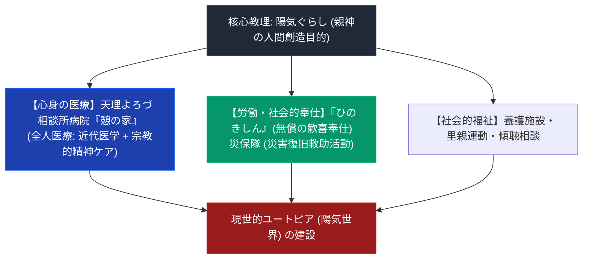

# 陽気ぐらしと天理教の社会福祉・医療 専門構造分析ノート

> [!summary] 要旨
> 本稿は、天理教の至高目的論「陽気ぐらし（陽気世界建設）」が具体的な社会的実践（天理よろづ相談所病院「憩の家」、養護施設、災保活動、および労働奉仕「ひのきしん」）として展開されたメカニズムと、分派（ほんみち・ほんぶしん等）におけるユートピア社会観との比較を解剖した専門ノートである。

---

## 1. 命題の構造（「陽気ぐらし」理念から社会的救済への展開）

| 実践領域 | 具体的な施設・活動 | 宗教学的・社会的成果 |
| :--- | :--- | :--- |
| **医療（全人医療）** | 天理よろづ相談所病院「憩の家」（奈良県天理市） | 高度近代医学と信仰的精神ケア（身上相談）の融合 |
| **無償奉仕（ひのきしん）** | 4月18日「全教ひのきしんデー」、公園・公共施設清掃 | 日常の健康・生かされている感謝を労働で表現 |
| **災害救助（災保）** | 天理教災害救援ひのきしん隊（全国都道府県隊） | 震災・水害現場への迅速なボランティア・重機投入 |
| **児童福祉・里親** | 天理養徳院（養護施設）、里親推進運動 | 戦前から続く孤児・恵まれない子供への社会的養護 |

---

## 2. 天理よろづ相談所病院「憩の家」と「全人医療」

- **設立**: 1966年（昭和41年）、二代真柱・[[中山正善]]のもとで開院。
- **全人医療の特色**: 身体の病を近代西洋医学（高度医療機器・専門医）で治療すると同時に、患者・家族の心の障りを宗教的カウンセラー（身上相談員）が聴く「医学と信仰の統合システム」。

---

## 3. 史料・一次資料 (ConvMD)

- [[src_ofudesaki_select]]：『おふでさき』核心歌抜粋史料MD（「にんげんこしらへ たのしみで」）
- [[src_osashizu_select]]：『おさしづ』核心刻限のおさしづ史料MD

---

## 4. 関連教団・関連人物・関連概念
- [[天理教のおたすけ・おさづけと近代病気救済史]]
- [[中山正善]]
- [[ほんみち]]
- [[ほんぶしん]]
- [[_分派・異端研究ポータル]]

---

*※本稿は[[_分派・異端研究ポータル]]の医療福祉・実践宗教学分析ノートである。*
