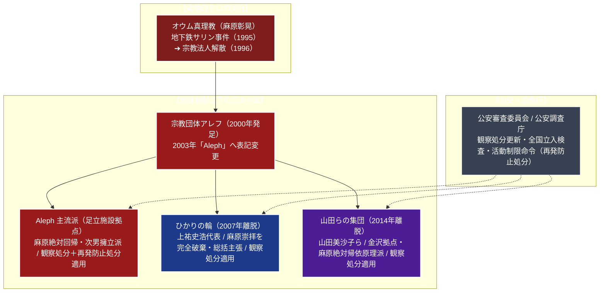

# Aleph 専門構造分析ノート

> [!summary] 要旨
> Aleph（アレフ、旧称：宗教団体オウム真理教）は、1995年の地下鉄サリン事件や坂本堤弁護士一家殺害事件など未曾有の無差別大量テロ・凶悪事件を引き起こした[[オウム真理教]]の主流派後継組織である。1996年に宗教法人の解散命令が確定・破産した後、1999年に制定された「団体規制法（無差別大量殺人行為を行った団体の規制に関する法律）」を受け、2000年2月に「アレフ」へと改称、2003年に表記を「Aleph」に変更した。
> 2018年に教祖・麻原彰晃（松本智津夫）ら死刑囚13名の死刑が執行された後も、麻原に対する絶対的帰依を維持・先鋭化させている。公安審査委員会により観察処分が継続更新（3年ごと）されているほか、資産報告義務違反等に対しては「再発防止処分（施設使用禁止等の活動制限命令）」が発令されるなど、公安調査庁・警察当局による最重点監視対象団体となっている。

---

## 1. 概要と基本情報 (公安調査庁・警察庁公的データ)

| 項目 | 内容 |
| :--- | :--- |
| **団体正式名称** | Aleph（アレフ、旧称：宗教団体オウム真理教） |
| **法的地位** | 任意団体（1996年宗教法人格解散命令確定、破産手続終結） |
| **開祖（尊称）** | 麻原彰晃（松本智津夫、1955-2018、2018年7月死刑執行） |
| **発足・改称** | 2000年2月「アレフ」発足 / 2003年「Aleph」へ変更 |
| **主要拠点** | 東京都足立区入谷施設（実質的総本部）、埼玉県三郷市、札幌市白石区、愛知県、大阪府等 |
| **信徒勢力** | 出家信者約130人、在家信者約1,000人、保有資産数億円（公安調査庁推計） |
| **信仰対象・教義** | シヴァ神、麻原彰晃（尊師・最終解脱者）、根本説法、ヴァジラヤーナ救済論の温存 |
| **法的適用処分** | 団体規制法に基づく「観察処分」（更新継続中）および「再発防止処分」（施設使用制限等） |
| **主要派生組織** | [[ひかりの輪]]（上祐史浩派・2007年離脱）、[[山田らの集団]]（山田美沙子派・2014年離脱） |

---

## 2. オウム真理教後継組織の分裂系統樹

オウム真理教の解散後、教団は麻原崇拝の維持や資産管理をめぐり内紛を繰り返し、現在3つのグループに分裂して公安調査庁の監視下にある。



---

## 3. オウム後継三派の比較分析

公安調査庁が「無差別大量殺人行為を行った団体の規制に関する法律」に基づき一体として監視対象としている3グループの教義・立場対比。

| 比較考察軸 | Aleph（アレフ・主流派） | ひかりの輪（上祐派） | 山田らの集団（金沢派） |
| :--- | :--- | :--- | :--- |
| **実質的代表者** | 集団指導体制（麻原親族・幹部） | 上祐史浩（元外報部長） | 山田美沙子（元幹部） |
| **麻原彰晃の評価** | 唯一絶対の尊師・救済者（神格化） | 麻原崇拝を完全破棄・総括と主張 | 麻原の絶対的教えを忠実に実践 |
| **教義体系** | 麻原の説法テープ・著書を完全踏襲 | 東洋思想・心理学を統合した新思想 | 麻原の初期オウム教理を厳格遵守 |
| **活動手法** | 正体を隠した覆面勧誘（ヨガ・占い） | オープンなセミナー・聖地巡礼 | 閉鎖的な共同生活・集団祈祷 |
| **法的処分** | 観察処分＋再発防止処分（活動制限） | 観察処分適用中（訴訟係争歴あり） | 観察処分適用中（Aleph一部と認定） |

---

## 4. 歴史変遷クロノロジー

```
・1995年3月: 地下鉄サリン事件発生。強制捜査により教祖・麻原彰晃および幹部が大量逮捕
・1995年10月: 東京地方裁判所、宗教法人オウム真理教に対する解散命令を下す
・1996年3月: 最高裁判所で解散命令が確定（法人格剥奪）。東京地裁が破産宣告
・1999年12月: 国会で「団体規制法」（無差別大量殺人行為を行った団体の規制に関する法律）成立
・2000年1月: 公安審査委員会、オウム真理教後継団体に対する「観察処分」を決定（以降3年ごと更新）
・2000年2月: 組織名称を「宗教団体アレフ」へ改称。破産管財人への賠償金支払いを表明
・2003年: 団体表記を「Aleph」へ変更
・2007年3月: 上祐史浩がアレフを脱退し、新団体「ひかりの輪」を結成して分派
・2014年: 麻原正統信仰を掲げる山田美沙子らが離脱（「山田らの集団」として金沢で活動）
・2018年7月: 教祖・麻原彰晃ら死刑囚13名の死刑が執行される
・2020年代: 麻原死刑執行後、遺骨・遺品の神格化と、次男ら麻原一族の精神的擁立の動きが活発化
・2023年3月: 公安審査委員会、資産報告義務違反を理由にAlephに対し初の「再発防止処分」を決定
・2024年: 観察処分（第8回）の更新決定。全国施設の使用禁止等の再発防止処分が継続
```

---

## 5. 教理・儀礼の特色と「麻原回帰」の実態

### 1. 麻原彰晃への絶対帰依の先鋭化
Alephは、教団施設内で麻原の写真、遺髪、説法テープ、ビデオを隠匿保持し、信徒に対して麻原の説法を繰り返し視聴させるマインドコントロールを徹底している。
麻原が説いた「ヴァジラヤーナ（金剛乗）」の教義、すなわち「悪業を積む衆生を救済するために命を絶つことも慈悲である」とする殺人正当化論（ポアの論理）を根本的に破棄・総括しておらず、公安調査庁は「無差別大量殺人行為に及んだ危険な本質をそのまま保持している」と厳重に警告している。

### 2. ヨーガ・瞑想を隠れ蓑にした修行体系
信徒は段階的な修行階梯（在家修行から出家修行へ）を経て、オウム時代と同様のマントラ伝授、激しい呼吸法、クンダリニー覚醒を目的とする瞑想修行に従事させられる。出家信者は私有財産を教団に布施（全財産寄附）させられ、教団施設内での集団生活を強いられる。

---

## 5-1. 事件・法的規制と「覆面勧誘」手口

> [!danger] 団体規制法による法的処分と巧妙化する偽装勧誘の実態
> - **無差別大量殺人行為を行った団体の規制に関する法律（団体規制法）**:
>   オウム事件の再発を防ぐために制定された特別法。公安審査委員会の決定により、公安調査庁が全国の教団施設へ事前通告なしに立ち入り検査を行う権限を持ち、教団には役員・信徒名簿・資産状況を3ヶ月ごとに報告する義務が課されている。
> - **再発防止処分（活動制限命令）の発動**:
>   Alephが巨額の信徒献金・収益事業資産を意図的に隠蔽し、報告命令を拒否・虚偽報告を継続したため、公安審査委員会は2023年より「再発防止処分」を発令。中核施設である足立施設をはじめとする教団施設の使用禁止、寄附・金銭受取の禁止など、極めて厳格な活動制限が課されている。
> - **若者・学生を標的とする「覆面勧誘（偽装勧誘）」の手口**:
>   教団名を出すと勧誘できないため、信徒は「オウム」「アレフ」の名を一切隠し、SNS、マッチングアプリ、大学キャンパス、書店等で接近する。「ヨガサークル」「リラクゼーション瞑想」「自己啓発」「タロット占い」などを装って人間関係を構築し、外部と遮断された個別指導の中で徐々に麻原の教本や説法テープへと誘導する極めて巧妙なマインドコントロール手法が社会問題化している。

---

## 6. 本部境内・全国拠点構造

Alephは宗教法人格を持たない任意団体であるため、拠点施設は幹部個人やダミー会社名義のビル・マンション等に分散して所在する。

- **東京都足立区入谷施設（実質的総本部）**:
  - 所在地：〒120-0004 東京都足立区入谷2丁目23-14
  - アクセス：日暮里・舎人ライナー「見沼代親水公園駅」より徒歩約15分
  - 施設実態：鉄骨造の大型拠点。居住スペース、瞑想道場、祭壇が設置され、全国の活動指令塔となってきたが、現在は再発防止処分により使用が厳しく制限されている。
- **地方中核拠点**:
  - 埼玉県三郷市施設、札幌市白石区施設、愛知県名古屋市、大阪府大阪市、京都府等、全国十数ヶ所に道場・居住拠点を配置。住民による反対運動や監視協議会が各地で結成されている。

---

## 7. 資金獲得活動・関連ダミー組織

教団は活動資金を獲得するため、複数のダミー会社や信徒個人事業所を介した実業活動を行ってきた歴史がある。

- **IT・パソコン関連事業**: かつての「マハポーシャ」のような露骨なパソコンショップは姿を消したものの、信徒が設立したIT受託開発会社やWeb制作事業等を通じて資金を獲得。
- **ヨーガ教室・セミナー事業**: 一般人を装ったインストラクターによるヨガ・瞑想教室、整体院、リラクゼーションサロンの運営。
- **高額な修行料・教材販売**: 瞑想セミナー受講料、麻原の説法音源、マントラ伝授料として信徒から数百万円単位の献金を吸い上げる構造を維持。

---

## 8. 史料・参考文献

1. 公安調査庁『内外情勢の回顧と展望』（各年版・オウム真理教後継団体動向）
2. 公安審査委員会「無差別大量殺人行為を行った団体の規制に関する法律に基づく観察処分の更新決定書」および「再発防止処分決定書」
3. 警察庁『警察白書』『焦点』（極左・極右・オウム情勢）
4. 滝本太郎・江川紹子ほか『オウム真理教追跡レポート』
5. 東京地方裁判所・東京高等裁判所 地下鉄サリン事件等関連確定判決集

---

## 9. 関連ノート (Vault内)

- [[_分派・異端研究ポータル]]
- [[オウム真理教]]（母体・テロの全貌と宗教法人解散史）
- [[ひかりの輪]]（上祐史浩派・観察処分対象分派）
- [[山田らの集団]]（金沢拠点・麻原絶対原理主義分派）
- [[世界平和統一家庭連合]]（解散命令請求・カルト被害の比較対象）

---

## 10. 検証・品質ゲートと留保事項

> [!warning] 留保事項
> - **公的記録に基づく記述**: 本稿は公安調査庁、警察庁、法務省、および裁判所の確定判決・公表資料に基づき、治安維持および公共の安全に関する客観的事実のみを記録している。
> - **信徒の人権と更生**: 犯罪に関与していない末端信徒の脱会支援や社会復帰の観点に留意し、不当な私刑を助長しない学術・調査記録を徹底している。
> - 本ノートの evidence_type は `"official_intelligence_report"`、confidence は `5`。

---

*※本稿は[[_分派・異端研究ポータル]]の個別教団分析ノートである。*
