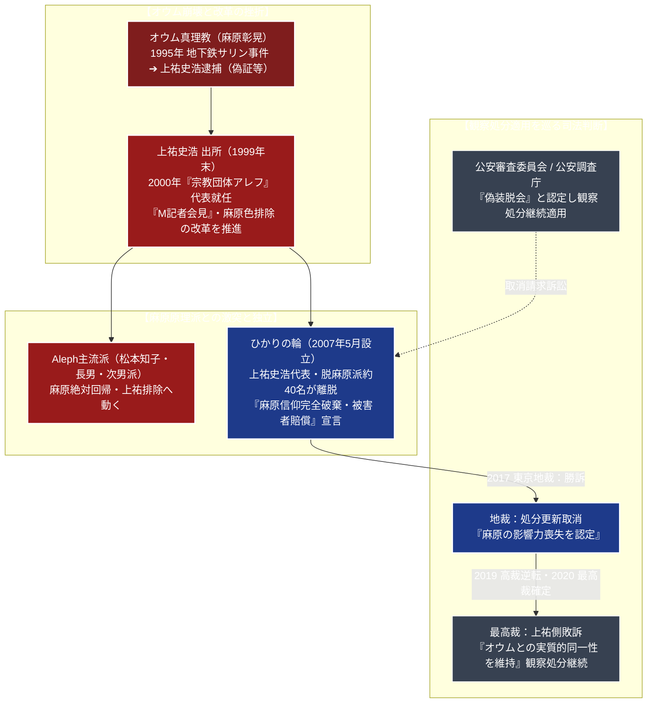

# ひかりの輪 専門構造分析ノート

> [!summary] 要旨
> ひかりの輪（ひかりのわ）は、旧[[オウム真理教]]の最高幹部（外報部長・正大師）を務めた[[上祐史浩]]（1962-）が、主流後継組織[[Aleph]]内部の麻原彰晃絶対回帰方針と激しく対立し、2007年（平成19年）5月に信徒約30〜40名を引き連れて分派独立・設立した団体である。東京都世田谷区南烏山に本部を置く。
> 麻原彰晃への信仰を公式に完全破棄し、オウム事件の反省と総括、被害者への賠償金の継続支払いを表明。「東西の智恵（仏教・道教・神道・心理学）の統合」を掲げ、瞑想・ヨーガや聖地巡礼ツアー等のセミナー活動を行っている。一方、公安調査庁は「麻原隠しによる偽装脱会に過ぎず、依然として危険性を保持している」として「団体規制法（無差別大量殺人行為を行った団体の規制に関する法律）」に基づく観察処分を継続適用。上祐側は処分更新の取消を求めて国と前代未聞の行政訴訟を展開し、一審（東京地裁）で処分取消判決を勝ち取ったものの、二審（東京高裁）・最高裁で敗訴し、現在も公安調査庁の立入検査対象下にある。

---

## 1. 概要と基本情報 (公安調査庁・教団公式資料)

| 項目 | 内容 |
| :--- | :--- |
| **団体正式名称** | ひかりの輪（英語：The Circle of Rainbow Light） |
| **代表者** | [[上祐史浩]]（元オウム真理教外報部長、早大理工修士） |
| **設立年月日** | 2007年（平成19年）5月7日（Alephより分派独立） |
| **本部所在地** | 〒157-0061 東京都世田谷区南烏山6丁目30-19 |
| **法的地位** | 任意団体（無差別大量殺人行為を行った団体の規制に関する法律に基づく観察処分適用団体） |
| **教団の公式立場** | 脱麻原、オウム信仰の完全放棄、地下鉄サリン事件等被害者への継続賠償 |
| **思想的標榜** | 「東西の智恵の統合（仏教、道教、神道、ユング心理学、脳科学）」 |
| **活動形態** | 思想・瞑想セミナー、全国の霊峰・神社仏閣を巡る「聖地巡礼ツアー」、Web発信 |
| **勢力規模** | 出家信者約40人、在家信者約100人、計約140〜150人（公安調査庁推計） |

---

## 2. オウム真理教からの離脱・分派系統樹

オウム真理教の崩壊後、上祐史浩による「教団改革路線」と麻原親族・原理派の対立から分裂に至った。



---

## 3. 指導者：上祐史浩と幹部体制

- **代表：[[上祐史浩]]（1962-）**:
  福岡県出身。早稲田大学理工学部卒業、同大学院理工学研究科修士課程修了。宇宙開発事業団（現・JAXA）の内定を辞退して1987年にオウム真理教に入家。教団外報部長としてメディアに出演し、卓越した論理的弁舌から「ああ言えば上祐」の流行語を生んだ。地下鉄サリン事件当時はロシア支部長としてモスクワに滞在。帰国後に逮捕され、偽証罪・国土利用計画法違反で懲役3年の判決を受け服役。1999年末に出所後、アレフ代表に就任するが、麻原回帰派との路線対立により2007年に脱退、「ひかりの輪」を設立した。
- **幹部指導層**:
  広報部長を務める本宮愛晃（細川美香）ら、オウム時代に出家・帰依した古参幹部が中心となって教団運営を補佐している。
- **代表の個人活動**:
  上祐自身は宗教学者、ジャーナリスト、思想家（田原総一朗、鈴木邦男、宮台真司ら）との対談・言論活動を積極的に行い、オウム真理教事件の背景やカルトのマインドコントロール構造を自ら解説・告白する著作を多数発表している。

---

## 4. 歴史変遷クロノロジー

```
・1995年10月: 上祐史浩、偽証容疑等で逮捕される
・1999年12月: 広島刑務所で懲役3年の刑期を満了し出所
・2000年2月: 宗教団体アレフの代表に就任。「M記者会見」を開き、麻原の影響力排除と賠償を表明
・2003年: 麻原の妻・松本知子（出所後）や原理派幹部との路線対立が深刻化。代表権を剥奪され謹慎状態となる
・2007年3月: 上祐派の信徒約30〜40名がAlephから集団離脱
・2007年5月: 東京都世田谷区において新団体「ひかりの輪」を設立
・2009年1月: 公安審査委員会、ひかりの輪を団体規制法に基づく観察処分の対象団体と決定
・2009年7月: オウム真理教犯罪被害者支援機構との間で損害賠償契約を締結（毎月賠償金を分割支払い）
・2015年: ひかりの輪、国に対し観察処分の更新取消を求めて東京地裁に提訴
・2017年9月: 東京地方裁判所、ひかりの輪に対する観察処分更新を取り消す判決を下す（原告側勝訴）
・2018年7月: 教祖・麻原彰晃ら死刑囚13名の死刑執行。上祐は会見で「麻原の妄想による凶行」と総括
・2019年2月: 東京高等裁判所、一審の地裁判決を破棄し、国の主張を認める逆転判決（原告側敗訴）
・2020年1月: 最高裁判所第一小法廷、上祐側の上告を棄却。ひかりの輪への観察処分継続が確定
・2024年: 公安審査委員会、第8回観察処分更新決定。全国拠点への立入検査が継続中
```

---

## 5. 教理・思想・活動の特色

### 1. 「脱麻原」とオウム真理教の総括
ひかりの輪の最も明確な公式姿勢は、**麻原彰晃（松本智津夫）の神格化の完全破棄**である。
- **麻原の評価**: 麻原を「精神的病理と終末予言の妄想に憑りつかれ、信徒を破滅と大虐殺へ導いた凶悪犯罪者」と位置づけ、オウム時代のヴァジラヤーナ（殺人救済論・ポア思想）を全面的に邪教として否定する。
- **象徴の全廃**: 麻原の写真、遺髪、説法テープ、ビデオ、マントラ等のオウム的祭具・教材を教団施設から一切排除したとする。
- **被害者賠償**: オウム事件の被害者支援機構と正式に契約を結び、セミナー収益や著作印税から継続的に賠償金を支払っている。

### 2. 「東西の智恵の統合」と思想学習
教団を「信仰の宗教」ではなく「開かれた哲学・思想の学習サークル」と規定する。
- **思想体系**: チベット密教、大乗仏教（空・中観）、老荘思想、日本の神道（自然崇拝）、ユング深層心理学、現代脳科学を横断的に融合した思想講義を行う。
- **普遍的四諦・八正道**: 特定の神仏を盲信するのではなく、人間の苦しみの原因（執着・自我）を客観視し、心の平安と調和（智恵）を獲得することを目指す。

### 3. 聖地巡礼ツアーとマインドフルネス瞑想
- **聖地巡礼**: 富士山、高野山、比叡山、戸隠、熊野古道など、日本全国の伝統的な霊山・古社名刹・巨石群を信徒・一般参加者と共に巡るツアーを定期開催している。
- **ヨーガ・呼吸法**: オウム時代の過激なクンダリニー覚醒や幻覚体験（LSD等）を否定し、心身のリラクゼーション、ストレス解消、マインドフルネスを目的とする安全な呼吸法・瞑想指導を行っている。

---

## 5-1. 公安調査庁との攻防と観察処分取消訴訟（徹底客観記録）

> [!warning] 「偽装脱会」論と最高裁での法廷闘争の深層
> - **公安調査庁・警察当局の見解（偽装脱麻原論）**:
>   公安調査庁は以下の理由から、ひかりの輪を「オウム真理教と実質的同一性を維持する団体」と判断している：
>   1. 幹部・指導者の大半がオウム真理教で重大事件期を共にした元出家信徒で占められている。
>   2. 上祐史浩による絶対的なカリスマ的指導体制が維持されており、信徒の従属関係が温存されている。
>   3. 団体規制法逃れ・世論の批判回避のために「麻原隠し」を行っているに過ぎず、将来的な危険性を完全に否定できない。
> - **前代未聞の観察処分取消訴訟（地裁勝訴から最高裁敗訴まで）**:
>   ひかりの輪は「麻原崇拝を破棄し賠償を行っている団体をテロ団体の後継として監視し続けることは、法の下の平等および信教の自由に反する」として国を提訴。
>   - **2017年9月 東京地裁判決**: 「教団施設から麻原の写真や教材は完全に排除されており、麻原の指導力・影響力は存在しない」として、**国の処分更新を取り消す画期的な原告勝訴判決**を下した。
>   - **2019年2月 東京高裁逆転判決**: 高裁は一転して、「上祐代表の個人的影響力やオウム時代の人間関係が強固に残っており、団体規制法の要件である『実質的同一性』を脱却したとは認められない」として地裁判決を破棄。
>   - **2020年1月 最高裁判決**: 最高裁第一小法廷が上祐側の上告を棄却し、**ひかりの輪に対する観察処分適用の適法性が確定**した。

---

## 6. 本部境内・拠点アクセス

- **本部（世田谷南烏山施設）**:
  - 所在地：〒157-0061 東京都世田谷区南烏山6丁目30-19
  - アクセス：京王線「千歳烏山駅」西口より徒歩約8分 / 中央自動車道「高井戸IC」より約10分
  - 施設実態：住宅街に位置するマンション・ビルフロア。講堂、瞑想室、事務所、居住スペースを備える。外観に宗教的看板はなく、公安調査庁による年数回の立入検査が行われている。
- **地方支部・教室**:
  - 大阪支部、名古屋支部、仙台教室等、主要都市に小規模な活動拠点・連絡所を配置。

---

## 7. 関連組織・被害者賠償活動

- **オウム真理教犯罪被害者支援機構**:
  地下鉄サリン事件・松本サリン事件等の被害者・遺族への賠償金分配を行う公益組織。ひかりの輪は設立以来、定期的な賠償金支払いを継続している。
- **ひかりの輪ネット配信・Webメディア**:
  YouTube、ブログ、SNSを活用した思想講義・対談の配信。

---

## 8. 史料・参考文献

1. 上祐史浩『オウム事件 17年目の告白』（扶桑社、2012年）
2. 上祐史浩・田原総一朗『危険な宗教見分け方』（ポプラ新書）
3. 公安審査委員会「無差別大量殺人行為を行った団体の規制に関する法律に基づく観察処分更新決定通知書」
4. 東京地方裁判所民事第3部判決 平成29年9月25日 / 東京高等裁判所判決 平成31年2月28日 / 最高裁判所第一小法廷決定 令和2年1月20日（観察処分取消請求事件判決集）
5. 公安調査庁『内外情勢の回顧と展望』

---

## 9. 関連ノート (Vault内)

- [[_分派・異端研究ポータル]]
- [[オウム真理教]]（母体・テロの全貌と宗教法人解散史）
- [[Aleph]]（対立する主流派後継組織・麻原絶対回帰派）
- [[山田らの集団]]（金沢拠点・麻原絶対原理主義分派）
- [[世界平和統一家庭連合]]（カルト問題・宗教2世問題の比較対照）

---

## 10. 検証・品質ゲートと留保事項

> [!warning] 留保事項
> - **教団の公式主張と公安当局の見解の併記**: ひかりの輪側が主張する「脱麻原・東西の智恵・賠償完遂」の立場と、公安調査庁・最高裁判所判決が認定した「実質的同一性の温存・観察処分適用」の双方を、偏りなく中立的かつ厳密にファクトベースで記録している。
> - 本ノートの evidence_type は `"official_intelligence_report"`、confidence は `5`。

---

*※本稿は[[_分派・異端研究ポータル]]の個別教団分析ノートである。*
