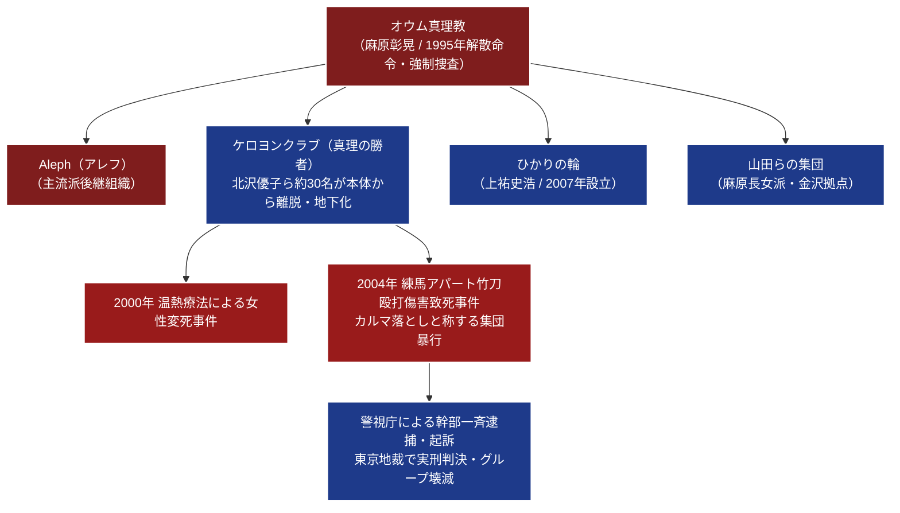

# ケロヨンクラブ（真理の勝者） 専門構造分析ノート

> [!summary] 要旨
> ケロヨンクラブ（警察呼称、別称：「真理の勝者」）は、1995年のオウム真理教強制捜査後に教団本体から離脱・孤立した元女性信徒・北沢優子を中心に結成された過激な非公然修行分派グループである。麻原彰晃への絶対帰依と終末予言を維持し、東京都練馬区などのアパートで約30名の信徒が集団生活を営んでいた。2000年の温熱療法変死事件に続き、2004年に「カルマ落とし」と称して女性信徒を竹刀で全身殴打し死亡させた傷害致死事件を起こし、警視庁によりリーダーらが逮捕・実刑判決を受けた。

---

## 1. 概要と基本情報

| 項目 | 内容 |
| :--- | :--- |
| **通称・グループ名** | ケロヨンクラブ（別称：「真理の勝者」、北沢グループ） |
| **母体教団** | [[オウム真理教]]（地下鉄サリン事件後の分裂・残存派） |
| **リーダー** | 北沢優子（元オウム真理教出家信徒） |
| **活動時期** | 1990年代後半 〜 2004年（摘発・解散） |
| **活動形態** | 任意団体・地下集団生活（東京都練馬区、静岡県などのアパート） |
| **信徒規模** | 約30名（成人信徒およびその子供ら） |
| **信仰対象** | 麻原彰晃（松本智津夫）、シヴァ神、オウム真理教の初期教理 |
| **公安上の位置づけ** | 団体規制法およびオウム財産特別措置法上の「特別関係者（分派）」 |
| **主要刑事事件** | 2000年温熱療法変死事件、2004年練馬区女性信徒竹刀殴打傷害致死事件 |

---

## 2. 教団系統樹（Mermaid 11）

---

## 3. 指導層と組織構造

### リーダー：北沢優子と側近幹部
* オウム真理教の出家信徒であった北沢優子が主導。教団壊滅期に「教団幹部（上祐ら）は麻原の教えを裏切った」として反発し、自らに従う信徒を引き連れて独自に独立。
* グループ内では北沢が絶対的な霊的指導者として君臨し、信徒の私生活、財産、子供の教育、修行内容を完全に支配した。

### 構成員と集団生活
* 成人信徒約20〜30名、およびその子供数名で構成されていた。
* 東京都練馬区旭町のアパートの複数部屋を賃借し、外部との接触を極度に遮断した「密室共同生活」を継続していた。
* 「ケロヨンクラブ」という名称は、拠点室内に人気キャラクター「ケロヨン」の人形やグッズが多数置かれていたことから、捜査当局およびメディアによって付けられた通称である（自称は「真理の勝者」など）。

---

## 4. 歴史変遷クロノロジー

| 年代 | 事項 | 詳細・背景 |
| :---: | :--- | :--- |
| **1995年** | オウム真理教事件と逃走 | 地下鉄サリン事件後、教団本体が警察の強制捜査を受ける中で一部信徒が離脱を画策。 |
| **1990年代末** | 独立集団生活の開始 | 北沢優子を中心とするグループが結成され、東京都内や静岡県のアパートを転々とする。 |
| **2000年** | 温熱療法変死事件 | グループ内で修行中だった女性信徒が、過酷な高温風呂による「温熱療法」で浴槽内で変死（事故処理）。 |
| **2004年9月** | **練馬傷害致死事件発生** | 練馬区旭町のアパートで、元女性信徒（当時28歳）が「修行」名目の竹刀殴打により死亡。 |
| **2004年10月** | 警察の家宅捜索と逮捕 | 警視庁公安部と練馬署がアパートを捜索。遺体発見と暴行の事実が判明し、北沢優子ら幹部を逮捕。 |
| **2005年** | 東京地裁有罪判決 | 傷害致死罪等に問われた北沢優子に懲役刑、実行役信徒らにも有罪判決が下される。 |
| **事件後** | グループの消滅 | 主導者の服役と信徒の離散、子供の児童相談所保護により、グループは完全に壊滅。 |

---

## 5. 教理・信仰・実践の特色

### 麻原絶対帰依と終末思想の温存
* **麻原彰晃の神格化**: オウム真理教の主流派（現Aleph）以上に、初期オウムの過激なハタ・ヨーガ、密教的修行、ポア思想、最終解脱理論を純粋に保持しようとした。室内には麻原のポスターや写真が掲げられていた。
* **激しい被害妄想と閉鎖性**: 「国家権力やフリーメーソンによる攻撃」「毒ガス攻撃」への恐怖を信徒に植え付け、窓を塞いだアパート室内で防毒マスクや特定の衣類を着用させていた。

### 過酷な修行と「カルマ落とし」
* **竹刀による肉体打擲**: 信徒に魔境（修行の迷妄）が入った、あるいは前世の悪業（カルマ）が噴出したと判断されると、それを浄化するためと称してリーダーの指示で他の信徒が竹刀や棒で身体を激しく殴打した。
* **温熱修行**: 高温の湯に長時間浸からせる過酷な身体修行。2000年にはこれにより脱水・熱中症で信徒が変死した。
* **児童虐待的隔離**: 信徒の同伴児童に対しても義務教育を受けさせず、室内でオウム的教義を教え込み、従わない場合には体罰を加えるなどのネグレクト・虐待を行っていた。

---

## 5-1. 事件・裁判・社会的議論

### 2004年 練馬女性信徒竹刀殴打傷害致死事件
* **事件の経緯**:
  - 死亡した被害女性（当時28歳）は、グループから脱会を希望したり、指導に異議を唱えたことから「魔境に陥った」「悪霊が憑依した」とみなされた。
  - 2004年9月、北沢優子の指示のもと、複数の信徒が被害者の手足を拘束し、竹刀で背中・臀部・太腿などを数百回にわたって連続殴打した。
  - 女性は広範囲の皮下出血、多発外傷による外傷性ショックにより死亡した。
* **司法判断（東京地裁）**:
  - 警視庁はリーダーの北沢優子および実行犯の信徒らを傷害致死容疑・監禁容疑で逮捕。
  - 裁判において被告側は「悪霊を祓うための宗教的修行の一環であり、殺意や違法性の意識はなかった」と主張したが、裁判所は「宗教的儀式を口実とした一方的かつ凄惨な集団リンチであり、正当な宗教活動を著しく逸脱した凶悪な犯罪である」と断じ、北沢らに懲役7年などの実刑判決を言い渡した。

### オウム分派問題と公安調査庁の監視
* 本事件は、オウム真理教が教団本体（Aleph）だけでなく、末端の孤立した小規模分派（地下組織）においても、なお麻原の過激な暴力教理が温存され、信徒の生命を脅かす重大事件を引き起こす危険性を証明した事例として、治安当局に強い衝撃を与えた。
* これを受け、公安調査庁は団体規制法に基づく観察処分において、本体だけでなく「麻原の影響下にある別派・脱退者グループ」に対する調査・動向把握を大幅に強化した。

---

## 6. 拠点施設・アクセス

* **活動拠点**: 東京都練馬区旭町のアパートの一室（事件現場）。教団本部や礼拝所といった公的施設は存在せず、一般住宅用アパートを複数契約して密室アジト化していた。
* **現状**: 摘発および有罪確定に伴い、拠点は完全に退去・解散している。

---

## 7. 組織形態・関連組織

* **組織形態**: 法人格を持たない非合法的な地下宗教集団（任意団体）。
* **関連組織**:
  - [[01_宗派・異端研究/12_その他/Aleph|Aleph]]（オウム真理教主流派後継組織）
  - [[01_宗派・異端研究/12_その他/山田らの集団|山田らの集団]]（金沢・野々市を拠点とする麻原原理主義分派）
  - [[01_宗派・異端研究/12_その他/ひかりの輪|ひかりの輪]]（脱麻原を掲げた分派）

---

## 8. 史料・参考文献

1. **公的治安資料**:
   - 公安調査庁『内外情勢の回顧と展望』（平成17年版、法務省）
   - 警察庁『警察白書』（平成17年版「警備情勢の推移」）
2. **裁判記録・報道資料**:
   - 東京地方裁判所判決録（平成17年 傷害致死被告事件）
   - 朝日新聞・読売新聞・毎日新聞縮刷版（2004年10月〜2005年 練馬オウム分派変死事件報道）
3. **学術・ジャーナリズム研究**:
   - 滝本太郎・福島章『オウム真理教抗争史』（三一書房）
   - 有田芳生『追いつめるオウム真理教』（教育史料出版会）

---

## 9. 関連ノート（内部リンク）

- [[01_宗派・異端研究/_分派・異端研究ポータル|_分派・異端研究ポータル]]
- [[01_宗派・異端研究/12_その他/Aleph|Aleph]]
- [[01_宗派・異端研究/12_その他/ひかりの輪|ひかりの輪]]
- [[01_宗派・異端研究/12_その他/山田らの集団|山田らの集団]]
- [[01_宗派・異端研究/12_その他/ライフスペース|ライフスペース]]（過激な治病修行・変死事件の比較対象）

---

## 10. 検証・品質ゲートと留保事項

> [!note] 検証ステータスと留保事項
> - **確定刑事記録に基づく検証**: 本稿の記述は、警視庁の公式発表資料、東京地裁における傷害致死被告事件の確定判決記録、および公安調査庁の公表資料に基づいて構成されている。
> - **団体の消滅**: 当該グループは2004年の幹部逮捕および服役により組織として完全に消滅しており、現存する活動実体はない。
> - 本ノートの `confidence` は **5**、`evidence_type` は **official_intelligence_report / court_records** である。

---

*※本稿は[[_分派・異端研究ポータル]]の個別教団分析ノートである。*
