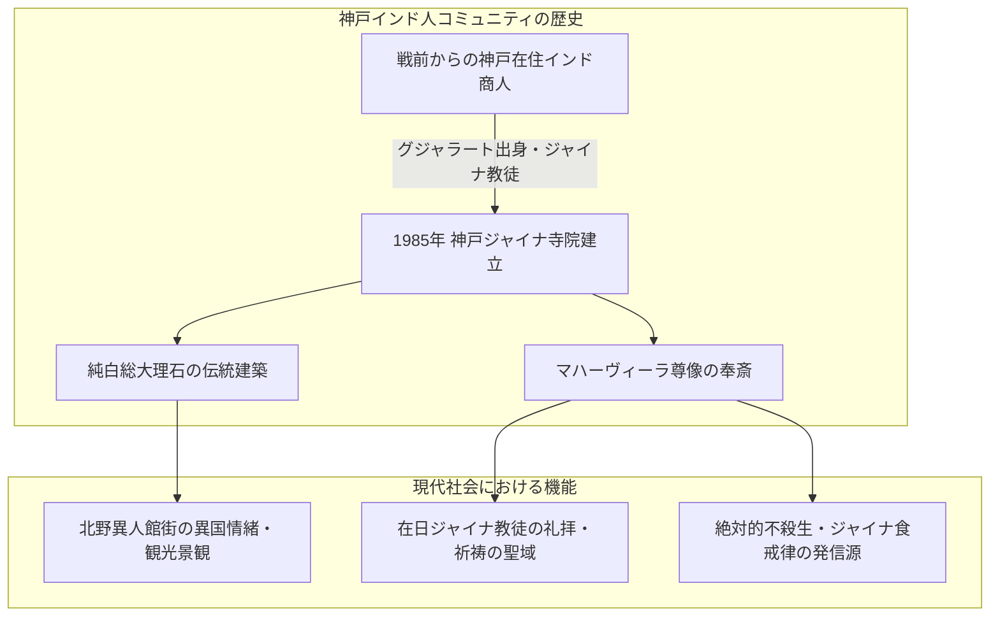

# バグワン・マハビールスワミ・ジェイン寺院（神戸ジャイナ寺院） 専門構造分析ノート

> [!warning] 執筆前の確認事項
> - **バグワン・マハビールスワミ・ジェイン寺院（Bhagwan Mahavir Swami Jain Temple）**は、兵庫県神戸市中央区北野町（北野異人館街）に所在する、**日本国内唯一のジャイナ教寺院**である。
> - 戦前より神戸に定住し、真珠・生糸・綿花・宝石貿易に従事してきたインド・グジャラート州出身のジャイナ教徒コミュニティが、1985年に総大理石で建立した。
> - ジャイナ教の最終救済者（第24代ティールタンカラ）である**「マハーヴィーラ（大雄尊者）」**を主神として奉斎し、世界で最も厳格な「アヒムサー（絶対的不殺生）」の祈りが日々捧げられている。

> [!summary] 要旨
> **神戸ジャイナ寺院**は、日本におけるジャイナ教信仰とオリエンタルベジタリアン文化の最高峰の象徴的モニュメントである。インドから輸送された純白の大理石に、一切の釘を使わず繊細な動植物・幾何学レリーフが彫り込まれた壮麗な建築美を誇る。神戸の多文化共生都市としての歴史を体現する極めて貴重な宗教遺産であり、在日インド人コミュニティの精神的支柱として機能している。

---

## 1. 諸見解・機能の対比（一般観光客 vs ジャイナ教理）

### 比較考察マトリクス表

| 比較軸 | 一般観光客・北野異人館散策者（etic） | ジャイナ教徒・宗教学的視点（emic） |
| :--- | :--- | :--- |
| **建築の認識** | 異人館街にあるエキゾチックで美しい白亜のインド宮殿 | 輪廻の苦海を渡る**「ティールタ（渡瀬・救済の聖地）」** |
| **主神の捉え方** | 瞑想するインドの神様像 | 欲望と業（カルマ）を完全に滅尽した**勝利者（ジーナ / マハーヴィーラ）** |
| **不殺生（アヒムサー）** | 動物を大切にするベジタリアン思想 | 微生物・虫・植物の根すら傷つけない**魂の解脱への絶対要件** |
| **参拝・入場規律** | 珍しい寺院の見学スポット | 清浄な衣服・革製品（動物の皮）の持ち込み厳禁の**至高の清浄域** |

---

## 2. 概要と基本情報

| 項目 | 内容 |
| :--- | :--- |
| **寺院名** | バグワン・マハビールスワミ・ジェイン寺院（Bhagwan Mahavir Swami Jain Temple） |
| **設立年** | 1985年（昭和60年）6月1日開廟 |
| **所在地** | 兵庫県神戸市中央区北野町3-1-8 |
| **主神（本尊）** | **バガワーン・マハーヴィーラ（Bhagwan Mahavir / 尊称：マハビールスワミ）** |
| **建築構造** | インド・ラジャスタン産白大理石総彫刻、インド伝統寺院建築様式（シカラ屋根） |
| **所属宗派** | 白衣派（シュヴェーターンバラ派） |
| **管理主体** | 神戸ジャイナ協会（Jain Association of Kobe） |

---

## 3. 史的経緯と神戸インド人社会

### (1) 神戸港開港とインド商人の定住
1868年の神戸開港に伴い、イギリス領インド帝国から綿花・生糸・真珠・紅茶などを扱うインド商人（パール・商人、テキスタイル商人）が来日。大正・昭和初期にかけて神戸・北野町周辺に強固なインド人街が形成された。

### (2) 1985年の寺院建立
長年、自宅や集会場で礼拝を行っていた在日ジャイナ教徒たちが、信仰の恒久的な拠点を求めて私財を拠出。インド本国から著名な大理石彫刻職人を日本へ招聘し、1985年に完全な正統様式を持つ日本初のジャイナ寺院が完成した。

---

## 4. ジャイナ教の食戒律と日本における食文化への影響

### 4-1. アヒムサー（非暴力・不殺生）の極致
ジャイナ教徒は、あらゆる生命に対する暴力を禁じる。
1. **動物性食材の完全厳禁**: 肉・魚・卵はもちろん、動物性添加物や革製品も忌避。
2. **根菜類（地下茎野菜）の完全禁忌**: タマネギ、ニンニク、ジャガイモ、生姜、人参、大根などは、掘り起こす際に土中の微細な生物を殺傷し、また1つの根に無数の生命（アナンタカーヤ）が宿るとされるため一切口にしない。
3. **発酵食品・キノコ類の制限**: 微生物の繁殖や腐敗を避けるため、キノコや蜂蜜、過度な発酵物を控える。

### 4-2. 日本の飲食業界への波及
神戸ジャイナ寺院の存在と、近年のIT・宝石産業の発展により、東京（御徒町・西葛西）や関西のインド料理店において**「ジャイナ対応（No Onion, No Garlic, No Potato）」**の専用メニューが普及する決定的な契機となった。

---

## 5. 関連教団・関連人物・関連概念

- **マハーヴィーラ**: 紀元前6世紀のジャイナ教開祖（釈迦と同時代）
- **アヒムサー（Ahimsa）**: 不殺生の最高徳目
- **[[ヴェジハーブサーガ（VEGE HERB SAGA）]]**: 御徒町のジャイナ対応南インド料理店
- **[[Veg Kitchen（ベジキッチン・仲御徒町）]]**: 仲御徒町の100%ピュアベジ・ジャイナ対応店
- **[[ナタラジ（NATARAJ・自然派インド料理）]]**: 日本における完全菜食インド料理のパイオニア
- **[[ゴヴィンダス（Govinda's）船堀店]]**: ヒンドゥー教（ISKCON）の五葷抜き菜食寺院レストラン
- **[[神戸関帝廟]]**: 神戸における外来華僑道教廟（比較対象）

---

## 6. 史料・参考文献

- 神戸市観光局 公式アーカイブ (`https://www.feel-kobe.jp/`)
- 渡辺研二『ジャイナ教聖典選』（平凡社東洋文庫）
- 河野亮仙『インドの宗教と食文化』（東方出版）

---

## 7. 関連ノート (Vault内)

- [[ヴェジハーブサーガ（VEGE HERB SAGA）]]
- [[Veg Kitchen（ベジキッチン・仲御徒町）]]
- [[ナタラジ（NATARAJ・自然派インド料理）]]
- [[ゴヴィンダス（Govinda's）船堀店]]
- [[神戸関帝廟]]
- [[各教団の食の教義・タブー比較]]

---

## 8. 検証・品質ゲートと留保事項

> [!warning] 留保事項
> - **見学・参拝の注意**: 観光施設ではなく厳格な宗教施設であるため、信徒以外の内部立ち入りは事前許可や礼儀（靴脱ぎ、革製品持ち込み禁止、静粛）が求められる。
> - **evidence_type**: `primary_source_based`
> - **confidence**: `5`

---

*※本稿は[[_分派・異端研究ポータル]]の外来宗教およびジャイナ教寺院に関する専門構造分析ノートである。*
