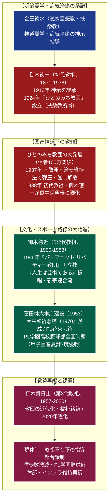

# パーフェクト リバティー教団（PL教団） 専門構造分析ノート

> [!summary] 要旨
> パーフェクト リバティー教団（通称：PL教団、英語：Church of Perfect Liberty）は、1924年（大正13年）に御木徳一（1871-1938）が創始した「ひとのみち教団」を前身とし、戦後の1946年（昭和21年）に長男の第2代教祖・御木徳近（1900-1983）によって佐賀県鳥栖市で再立教された新宗教教団である。大阪府富田林市に白亜の巨大彫刻建築「大平和祈念塔（PLタワー）」を擁する大本庁を置く。
> 宇宙の根本神「大元霊（みおやおおかみ）」を信仰対象とし、「**人生は芸術である**」という真理を中核に据え、人間の自己表現と社会貢献の調和を説く。戦後、立正佼成会や世界救世教らと共に「新日本宗教団体連合会（新宗連）」を結成し、徳近が初代理事長に就任。高校野球で全国を席巻した名門「PL学園」や、世界最大級の打ち上げ数を誇った「教祖祭PL花火芸術」により高度経済成長期に絶大な知名度を誇ったが、近年は信徒数の急減や第3代教祖逝去後の体制再編が大きな課題となっている。

---

## 1. 概要と基本情報 (公的データベース・学術資料)

| 項目 | 内容 |
| :--- | :--- |
| **教団正式名称** | 宗教法人 パーフェクト リバティー教団（通称：PL教団） |
| **歴代教祖（おしえおや）** | 初代：御木徳一 / 第2代：御木徳近 / 第3代：御木貴日止（1957-2020） |
| **創立年・再立教** | 1924年（ひとのみち教団） / 1946年（PL教団再立教） / 1952年（宗教法人認証） |
| **大本庁所在地** | 〒584-8555 大阪府富田林市新堂2172-1（大平和祈念塔・聖地境内） |
| **法人番号** | 3120105004781（国税庁法人番号公表サイト確認済み） |
| **信仰対象** | 大元霊（みおやおおかみ、宇宙の生命根源・大自然の理）、教神、各家の祖霊 |
| **核心教理・信条** | 「人生は芸術である」、PL処世訓21か条、みしらせ受受（神示生活指導） |
| **加盟連合組織** | 新日本宗教団体連合会（新宗連・結成原加盟団体、初代理事長教団） |
| **主要関連事業** | 学校法人PL学園、医療法人宝生会PL病院、株式会社光丘（ゴルフ場・緑化事業） |

---

## 2. 徳水霊感教・ひとのみちからPL教団への組織・教理系統樹

幕末・明治の御嶽教・扶桑教系霊学の流れを汲み、戦前の激しい宗教弾圧を乗り越えて、戦後文化主義的新宗教として大発展した。



---

## 3. 歴代教祖（おしえおや）と御木家

PL教団では、神と信徒を媒介し神意を取り次ぐ最高指導者を「おしえおや（教祖）」と呼ぶ。

- **初代教祖：御木徳一（1871-1938）**:
  愛媛県出身。黄檗宗の禅僧などを経て、金田徳水から神示を継受。1924年に「ひとのみち教団」を創設。病気や生活苦に悩む大衆に対し、神からの警告（みしらせ）を読み解く生活指導を行い、短期間で爆発的な信徒を獲得した。1937年の弾圧で検挙され、翌1938年に仮出所中に逝去。
- **第2代教祖：御木徳近（1900-1983）**:
  徳一の長男。父と共に投獄され、獄中で「人生は芸術である」という啓示を感得。終戦後の1946年にPL教団として再立教を果たした教団中興の祖。抜群の指導力と国際感覚を持ち、新日本宗教団体連合会（新宗連）の初代理事長を務め、世界宗教者会議の推進、富田林大本庁の造営、PL学園の開校、花火大会の創始など、教団黄金期を築き上げた。
- **第3代教祖：御木貴日止（1957-2020）**:
  徳近の養子。1983年に26歳で第3代教祖に就任。冷戦終結後の国際対話や文化・教育事業の充実に努めたが、2020年12月に63歳で逝去した。
- **現在の体制**:
  貴日止教祖の没後、新たな「おしえおや」は指名されておらず、教団常務理事会・総務庁による集団合議体制のもとで宗教活動が継続されている。

---

## 4. 歴史変遷クロノロジー

```
・1916年: 御木徳一、金田徳水から「神示受受」の秘法を継承
・1924年: 御木徳一、大阪府において扶桑教所属の「ひとのみち教団」を立教
・1930年代: 急速に教勢を拡大し、公称信者数100万人を超える一大勢力となる
・1937年: 内務省・特高警察により、教団幹部が一斉検挙。不敬罪・治安維持法違反により強制解散
・1938年: 初代教祖・御木徳一、保釈中に逝去
・1945年: 終戦。御木徳近が免訴となり出獄
・1946年: 佐賀県鳥栖市にて「パーフェクト リバティー教団（PL教団）」を設立し、再立教宣言
・1951年: 立正佼成会、世界救世教らと共に「新日本宗教団体連合会（新宗連）」を結成、徳近が初代理事長就任
・1952年: 宗教法人法に基づく宗教法人登記を完了
・1953年: 大阪府富田林市に大本庁（広大な聖地）の建設を開始・移転
・1955年: 学校法人PL学園を設立（中学校・高等学校開校）
・1963年: 教祖祭PL花火芸術が大規模化し、全国的な夏の風物詩となる
・1970年: 大阪万博の年に、高さ180mの白亜の巨塔「大平和祈念塔」を竣工
・1978-87年: PL学園硬式野球部が甲子園で春夏連覇を含む黄金時代を築く（桑田・清原のKKコンビ等）
・1983年: 第2代教祖・御木徳近、82歳で逝去。御木貴日止が第3代教祖に就任
・2016年: PL学園硬式野球部が部員不足および部内暴力不祥事により休部（事実上の廃部）
・2020年: 第3代教祖・御木貴日止、逝去
・2020年代: 教勢の縮小に伴い、PL花火芸術の休止・非公開化、境内施設の統廃合が進行
```

---

## 5. 教理・信仰・生活実践の特色

### 1. 「人生は芸術である」とPL処世訓21か条
PL教団の教義は、難解な来世思想や禁欲主義を排し、現世における個人の生き生きとした「自己表現」を最高善とする。
- **真理の定義**: 「人生は芸術である（Life is Art）」。人間は神（大元霊）の分霊（わけみたま）であり、一人ひとりの個性と才能を世のため人のために遺憾なく表現することこそが、神への真の奉仕であると説く。
- **PL処世訓21か条**: 信徒の日々の行動指針として1947年に制定された綱領。
  - 第1条: 人生は芸術である
  - 第2条: 人の一生は自己表現の連続である
  - 第3条: 自己は神の表現である
  - 第11条: 神にすがれ
  - 第12条: 呼び名によって気質が変わる
  - 第16条: 腹を立てるな
  - 第21条: 真の自由境に生きよ

### 2. 「みしらせ」と「おしえおや」の神示受受
PL教団の最も特徴的な信仰実践法。
- **みしらせ（神の警告）**: 信徒の身に生じる病気、ケガ、失業、事業失敗、夫婦喧嘩などのあらゆる苦難・災難は、偶然ではなく「自己中心的な間違った心遣い（思い癖）」に対する神（大元霊）からの愛の警告（みしらせ）であると解釈する。
- **神示受受（じゅじゅ）**: 信徒は苦難に直面した際、教会長を通じて「おしえおや（教祖）」に事情を報告し、神示（みしらせの意味と正すべき心の持ち方）を乞い受ける。その指導に従って生活態度や考え方を反省・改善することで、苦難が解消し幸福が得られると説く。

### 3. 一の日詣（いちのひまいり）と定例祭事
信徒は毎月「1」の付く日に大本庁または全国の教会に参拝する規律を持つ：
- **毎月1日（平和の日）**: 世界平和を祈念する式典。
- **毎月11日（先祖の日）**: 祖霊に感謝を捧げる慰霊式典。
- **毎月21日（感謝の日）**: 日常の神の恵みに感謝する式典。

---

## 5-1. PL学園の盛衰、PL花火、現代の教勢急減（徹底客観記録）

> [!important] 昭和の栄光と平成・令和における急激な縮小の軌跡
> - **学校法人PL学園と高校野球の伝説・休部（事実上の廃部）**:
>   1955年に創設されたPL学園は、全寮制のもとで「信仰による精神修養」と「文武両道」を徹底。硬式野球部は甲子園で春3回・夏4回の優勝（春夏通算7回制覇）を果たし、桑田真澄・清原和博（KKコンビ）、立浪和義、宮本慎也、松井稼頭央、福留孝介、前田健太など、日本プロ野球を代表する大スターを多数輩出し「高校野球の代名詞」となった。
>   しかし、上級生による下級生への凄惨な部内暴力不祥事が繰り返し発覚し高野連から度重なる対外試合禁止処分を受けたこと、および教団全体の信徒数減少に伴い全寮制を維持できなくなったことから、2016年夏をもって硬式野球部は休部（事実上の廃部）となった。現在、学園の生徒数も激減し存続の危機に瀕している。
> - **教祖祭PL花火芸術（世界屈指の巨大花火大会）**:
>   毎年8月1日に初代・第2代教祖の遺徳を偲び世界平和を祈念して富田林の大本庁で開催された花火大会。約2万発の花火が打ち上げられ、フィナーレの「巨砲打上（スターマインの一斉点火）」では富田林の夜空全体が真昼のように光り輝き、大地を揺るがす轟音とともに数十万人の観客を魅了した。
>   しかし、2020年以降、新型コロナウイルス禍や巨額の警備費用の負担増、教団の財政規模縮小により中止・非公開化が続いている。
> - **信徒数激減と巨大インフラの維持危機**:
>   最盛期（1970〜80年代）には公称信徒数200万人以上を記録し、富田林市内に広大な境内地、巨大タワー、学校、病院、ゴルフ場を擁する「宗教都市」を形成した。しかし、文化庁『宗教年鑑』や学術推計において、近年の実働信徒数は数万人規模へと激減している。莫大な固定資産維持費、指導者不在、後継世代の脱会が重なり、教団施設の売却や統廃合が大きな経営課題となっている。

---

## 6. 本部境内・拠点アクセス

- **大本庁（富田林聖地）**:
  - 所在地：〒584-8555 大阪府富田林市新堂2172-1
  - アクセス：近鉄長野線「富田林駅」北口より近鉄バス約10分「PL病院正面所」等下車 / 阪神高速松原線「三宅出入口」より車で約30分
- **超高層モニュメント「大平和祈念塔（PLタワー）」**:
  - 1970年竣工。高さ180m。鉄骨鉄筋コンクリート造。
  - 有機的な粘土彫刻のような特異な外観を持つ白亜の塔。特定の一教派や国籍を問わず、人類史上のあらゆる戦争犠牲者・無縁の霊を「大怨親平等」に合祀・慰霊する目的で建立された（かつては展望台が一般公開されていたが、現在は防犯・安全上の理由により非公開）。
- **関連施設群**:
  - 医療法人宝生会 PL病院（地域中核総合病院）
  - 聖丘カントリー倶楽部（教団関連企業「株式会社光丘」が運営するゴルフ場）

---

## 7. 関連組織・文化事業

- **学校法人PL学園**: 中学校、高等学校（現在規模縮小）。
- **株式会社光丘**: ゴルフ場経営、造園・緑化事業、境内地管理を行う実務会社。
- **人形劇団カッパ座**: 子どもたちに豊かな情操と愛を届ける目的で創設された等身大人形劇団。全国の市民会館等で巡回公演を実施。
- **芸術生活社**: 教団出版局。機関誌『芸生新聞』『PL』の発行。

---

## 8. 史料・参考文献

1. パーフェクト リバティー教団編『PL教典・PL処世訓21か条』（芸術生活社）
2. 御木徳近『人生是芸術』（芸術生活社）
3. 井上順孝ほか編『新宗教事典』（弘文堂）
4. 宗教情報リサーチセンター教団データベース「パーフェクト リバティー教団 (o171)」
5. 朝日新聞社・高校野球連盟記録集『PL学園野球部の軌跡』

---

## 9. 関連ノート (Vault内)

- [[_分派・異端研究ポータル]]
- [[立正佼成会]]（新宗連創設の盟友教団）
- [[解脱会]]（新宗連創設の盟友教団）
- [[世界救世教]]（新宗連創設の盟友教団・芸術生活路線の共通性）
- 大本（大本教）（戦前不敬罪弾圧を受けた新宗教の並行例）

---

## 10. 検証・品質ゲートと留保事項

> [!warning] 留保事項
> - **野球部の現状**: PL学園硬式野球部は2016年夏を最後に公式戦出場がなく「休部」扱いであるが、事実上の廃部状態にある。
> - **信徒数データ**: 公称信者数と実動信者数に極めて大きな乖離が存在するため、学術・客観的見解に基づき最盛期からの激減傾向を明記している。
> - 本ノートの evidence_type は `"academic_database"`、confidence は `5`。

---

*※本稿は[[_分派・異端研究ポータル]]の個別教団分析ノートである。*
